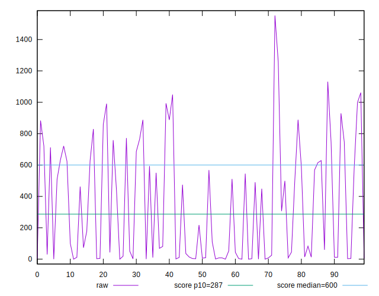
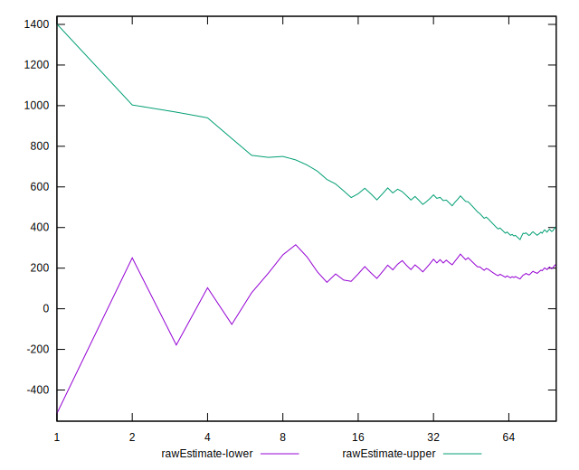
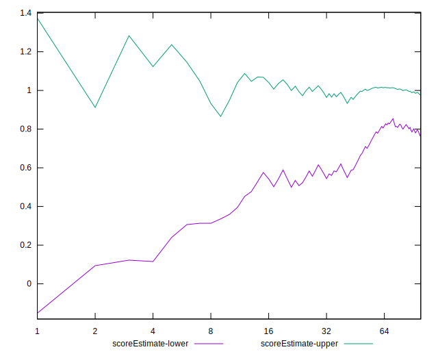

# //total-blocking-time/samples/card

[→ Parent](../..)


## Raw


```yaml
p90min: 0
p90max: 1061.5
p90range: 1061.5
p90mean: 331.41906382978726
median: 92
p90stdev: 353.71394941021714
mad: 92
stdevBySn: 115.08590000000001
lfitCenter: 303.6692906271636
lfitStdev: 374.06419886278405
mfitCenter: 303.6692906271636
mfitStdev: 468.81994917007046
mfitConfidence: 46.88199491700705
p90skewness: 0.5248874851134014
p90eccentricity: 0.9999999999999997
p90discretization: 1.1604938271604939
outlandishness: 1.121312875943637

```


## Score


```yaml
p90min: 0.16
p90max: 1
p90range: 0.84
p90mean: 0.7413829787234041
median: 1
p90stdev: 0.30437099794679373
mad: 0
stdevBySn: 0
lfitCenter: 0.7761416450033648
lfitStdev: 0.32114262817503486
mfitCenter: 0.7761416450033648
mfitStdev: 0.4024925963914314
mfitConfidence: 0.040249259639143144
p90skewness: -0.566709468556219
p90eccentricity: 1.0000000000000004
p90discretization: 2.9375
outlandishness: 0.9689971422012592

```


## Raw Estimate


## Score Estimate


## P Score


```yaml
p90min: 0.16073495359332957
p90max: 1
p90range: 0.8392650464066704
p90mean: 0.7413455075830409
median: 0.9993635915323489
p90stdev: 0.3043979503326746
mad: 0.0006364084676511172
stdevBySn: 0.0009634365764731473
lfitCenter: 0.7760632093527929
lfitStdev: 0.32119877562236193
mfitCenter: 0.7760632093527929
mfitStdev: 0.40256296678101144
mfitConfidence: 0.04025629667810114
p90skewness: -0.5674349226362543
p90eccentricity: 0.9999999999999997
p90discretization: 1.3428571428571427
outlandishness: 0.9688357006060376

```


## Score Difference


```yaml
p90min: 0
p90max: 5.551115123125783e-17
p90range: 5.551115123125783e-17
p90mean: 2.9527208101732887e-18
median: 0
p90stdev: 1.2457542745436637e-17
mad: 0
stdevBySn: 0
lfitCenter: 2.7964343772340387e-18
lfitStdev: 6.722612550205121e-18
mfitCenter: 2.7964343772340387e-18
mfitStdev: 8.425545357344829e-18
mfitConfidence: 8.425545357344829e-19
p90skewness: 3.9819818903758235
p90eccentricity: 0.9999999999999992
p90discretization: 47
outlandishness: 3.5344000000000007

```


## P Score Difference


```yaml
p90min: -0.003886402769460895
p90max: 0.004482687641497285
p90range: 0.00836909041095818
p90mean: -0.00010596827196267329
median: -3.54605234065275e-13
p90stdev: 0.001614579665414931
mad: 0.00027216575525740305
stdevBySn: 0.00033732697137937693
lfitCenter: -0.00008572642377658934
lfitStdev: 0.0009591372525664263
mfitCenter: -0.00008572642377658934
mfitStdev: 0.0012021002794770541
mfitConfidence: 0.00012021002794770542
p90skewness: 0.23651126373561276
p90eccentricity: 0.9999999999999997
p90discretization: 1.4029850746268657
outlandishness: 0.8496886160657834

```

