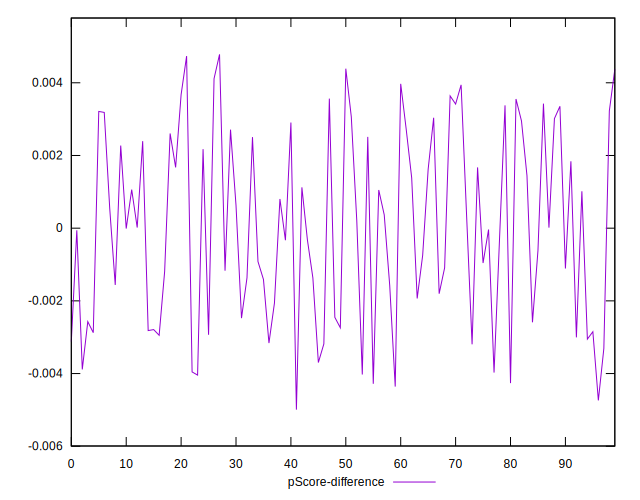

# //total-blocking-time/samples/music

[→ Parent](../..)


## Raw


```yaml
p90min: 441.03900000000067
p90max: 1505
p90range: 1063.9609999999993
p90mean: 918.5629202127661
median: 913.3722500000003
p90stdev: 203.09133528965654
mad: 132.37774999999965
stdevBySn: 205.38167102500034
lfitCenter: 915.489987158262
lfitStdev: 162.8087817568069
mfitCenter: 915.489987158262
mfitStdev: 204.05054806024432
mfitConfidence: 20.40505480602443
p90skewness: 0.3717665454252944
p90eccentricity: 1.0000000000000004
p90discretization: 1.010752688172043
outlandishness: 1.0027004595039846

```


## Score


```yaml
p90min: 0.06
p90max: 0.7
p90range: 0.6399999999999999
p90mean: 0.2575531914893616
median: 0.23
p90stdev: 0.12553448428672317
mad: 0.07999999999999999
stdevBySn: 0.11329700000000001
lfitCenter: 0.25508280240120695
lfitStdev: 0.10121226193816837
mfitCenter: 0.25508280240120695
mfitStdev: 0.12685075888442857
mfitConfidence: 0.012685075888442856
p90skewness: 1.2272927813725418
p90eccentricity: 1
p90discretization: 2.473684210526316
outlandishness: 1.097362257310355

```


## Raw Estimate


## Score Estimate


## P Score


```yaml
p90min: 0.05500677086292116
p90max: 0.7036387603589753
p90range: 0.6486319894960542
p90mean: 0.25761750060407396
median: 0.23261857146111156
p90stdev: 0.12583711397897532
mad: 0.07430663746778124
stdevBySn: 0.11480883150779704
lfitCenter: 0.2551706588100218
lfitStdev: 0.10095971656940356
mfitCenter: 0.2551706588100218
mfitStdev: 0.12653424020312357
mfitConfidence: 0.012653424020312356
p90skewness: 1.2304502729839535
p90eccentricity: 1.0000000000000002
p90discretization: 1.010752688172043
outlandishness: 1.0967629416557823

```


## Score Difference


```yaml
p90min: 0
p90max: 0
p90range: 0
p90mean: 0
median: 0
p90stdev: 0
mad: 0
stdevBySn: 0
lfitCenter: 1.319376004352692e-18
lfitStdev: 3.259771146566013e-18
mfitCenter: 1.319376004352692e-18
mfitStdev: 4.085517266515362e-18
mfitConfidence: 4.0855172665153624e-19
p90skewness: .nan
p90eccentricity: .nan
p90discretization: 94
outlandishness: .inf

```


## P Score Difference


```yaml
p90min: -0.00428157981872198
p90max: 0.004372527192076342
p90range: 0.008654107010798322
p90mean: -0.000004762107381034751
median: -0.00002451470965152136
p90stdev: 0.0025761783270850545
mad: 0.002672606103564748
stdevBySn: 0.0032236275598835533
lfitCenter: -0.000012436395420866463
lfitStdev: 0.0023470023148360673
mfitCenter: -0.000012436395420866463
mfitStdev: 0.0029415311844561416
mfitConfidence: 0.00029415311844561417
p90skewness: 0.004685218907202028
p90eccentricity: 0.9999999999999999
p90discretization: 1.010752688172043
outlandishness: 1.7702220042954264

```

