# //unminified-javascript/samples/agenda

[→ Parent](../..)


## Raw


```yaml
p90min: 0
p90max: 150
p90range: 150
p90mean: 32.87234042553192
median: 0
p90stdev: 60.17036699850832
mad: 0
stdevBySn: 0
lfitCenter: 22.99181950995022
lfitStdev: 47.56557449849564
mfitCenter: 22.99181950995022
mfitStdev: 59.614607028484976
mfitConfidence: 5.961460702848497
p90skewness: 1.35115415906988
p90eccentricity: 0.9999999999999991
p90discretization: 15.666666666666666
outlandishness: 1.1662601983640724

```

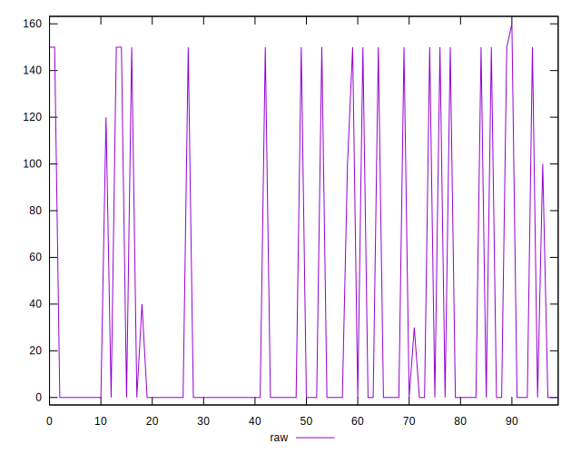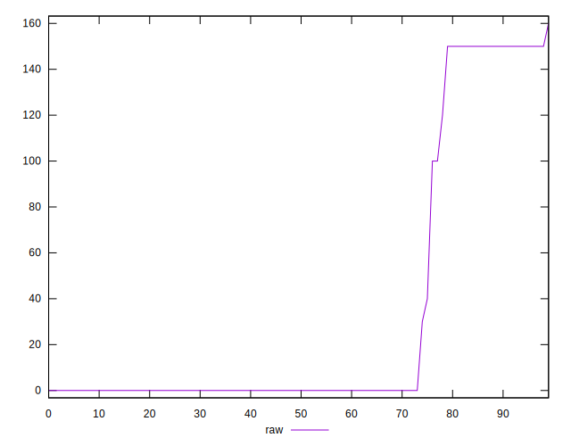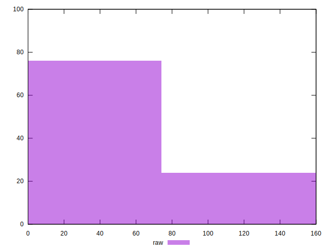
## Score


```yaml
p90min: 0.88
p90max: 1
p90range: 0.12
p90mean: 0.9737234042553191
median: 1
p90stdev: 0.04820135167507926
mad: 0
stdevBySn: 0
lfitCenter: 0.9816196165763745
lfitStdev: 0.0380254158079579
mfitCenter: 0.9816196165763745
mfitStdev: 0.04765779125736924
mfitConfidence: 0.004765779125736924
p90skewness: -1.3528414756944598
p90eccentricity: 0.9999999999999988
p90discretization: 15.666666666666666
outlandishness: 0.9956433439186453

```

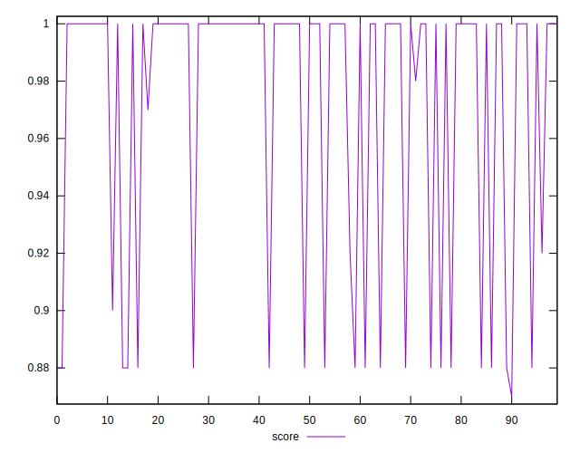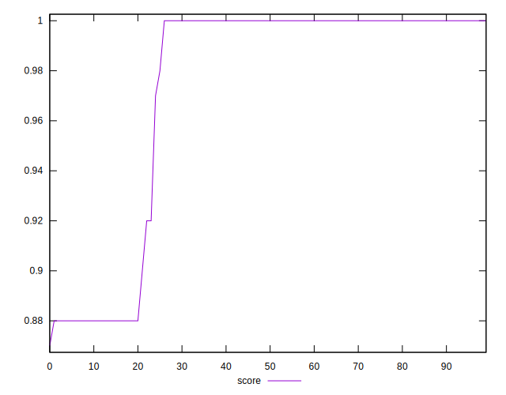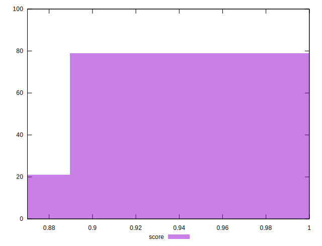
## Raw Estimate

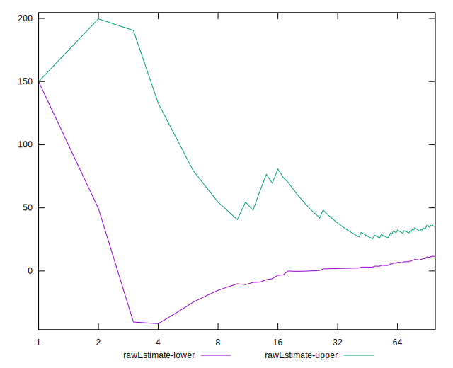
## Score Estimate

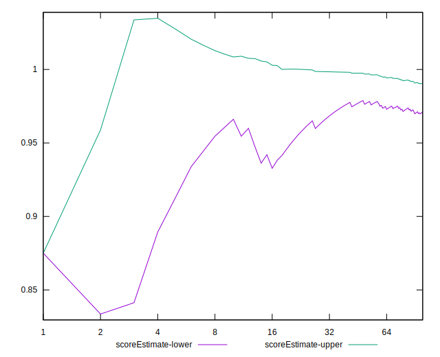
## P Score


```yaml
p90min: 0.875
p90max: 1
p90range: 0.125
p90mean: 0.9726063829787234
median: 1
p90stdev: 0.050141972498756855
mad: 0
stdevBySn: 0
lfitCenter: 0.980840150408375
lfitStdev: 0.03963797874874616
mfitCenter: 0.980840150408375
mfitStdev: 0.04967883919040388
mfitConfidence: 0.004967883919040388
p90skewness: -1.3511541590698914
p90eccentricity: 1.0000000000000013
p90discretization: 15.666666666666666
outlandishness: 0.9955022887005466

```

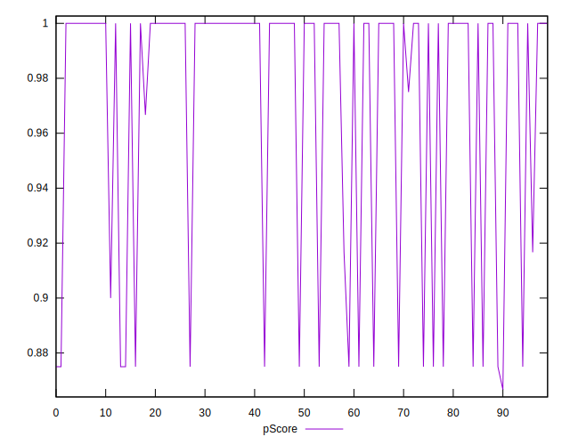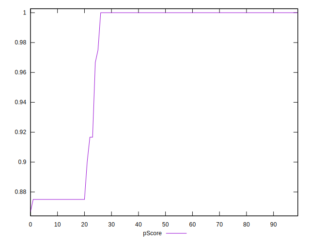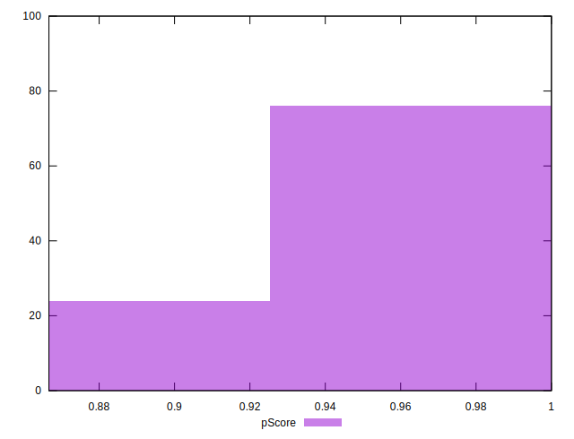
## Score Difference


```yaml
p90min: 0
p90max: 0
p90range: 0
p90mean: 0
median: 0
p90stdev: 0
mad: 0
stdevBySn: 0
lfitCenter: 0
lfitStdev: 0
mfitCenter: 0
mfitStdev: 0
mfitConfidence: 0
p90skewness: .nan
p90eccentricity: .nan
p90discretization: 94
outlandishness: .nan

```


## P Score Difference


```yaml
p90min: -0.0050000000000000044
p90max: 0
p90range: 0.0050000000000000044
p90mean: -0.0010992907801418458
median: 0
p90stdev: 0.0020128604179175014
mad: 0
stdevBySn: 0
lfitCenter: -0.0007681228854833412
lfitStdev: 0.0016071802869515985
mfitCenter: -0.0007681228854833412
mfitStdev: 0.002014301776878097
mfitConfidence: 0.0002014301776878097
p90skewness: -1.3269994274988712
p90eccentricity: 1.000000000000001
p90discretization: 23.5
outlandishness: 1.1587480749219556

```

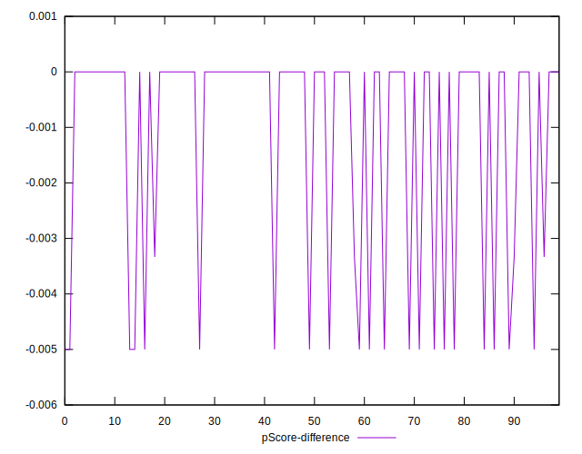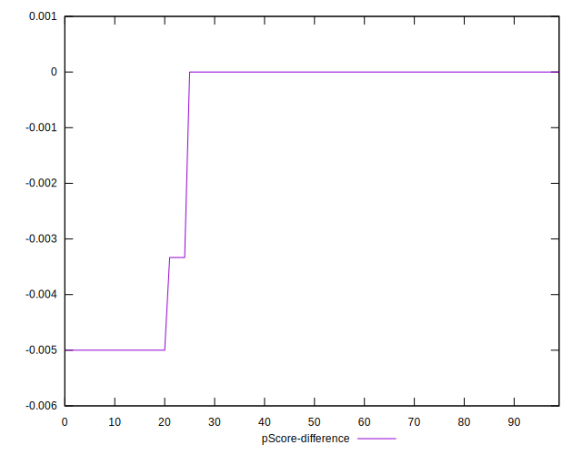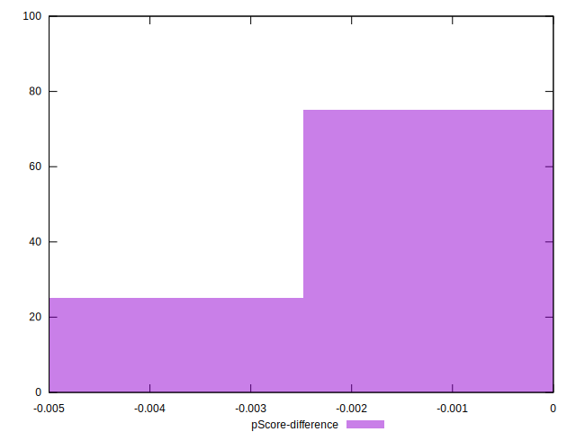