# //unminified-javascript/samples/astro

[→ Parent](../..)


## Raw


```yaml
p90min: 0
p90max: 300
p90range: 300
p90mean: 83.93617021276596
median: 150
p90stdev: 77.13235495612344
mad: 60
stdevBySn: 107.334
lfitCenter: 90.93430300523008
lfitStdev: 94.95154419005969
mfitCenter: 90.93430300523008
mfitStdev: 119.00411281308627
mfitConfidence: 11.900411281308626
p90skewness: 0.006477992191284666
p90eccentricity: 0.9999999999999982
p90discretization: 15.666666666666666
outlandishness: 1.1728148794980409

```

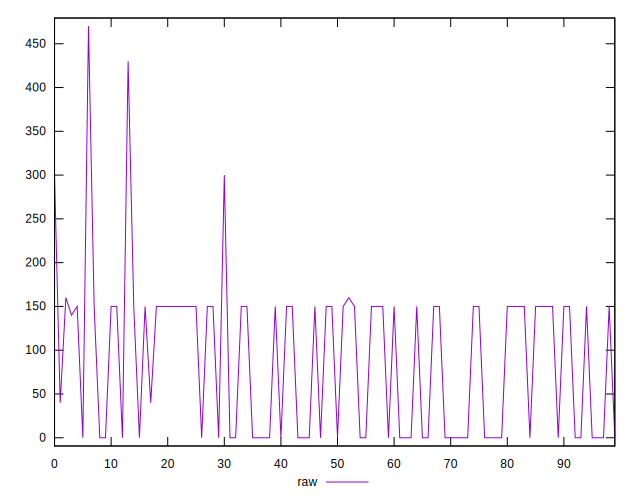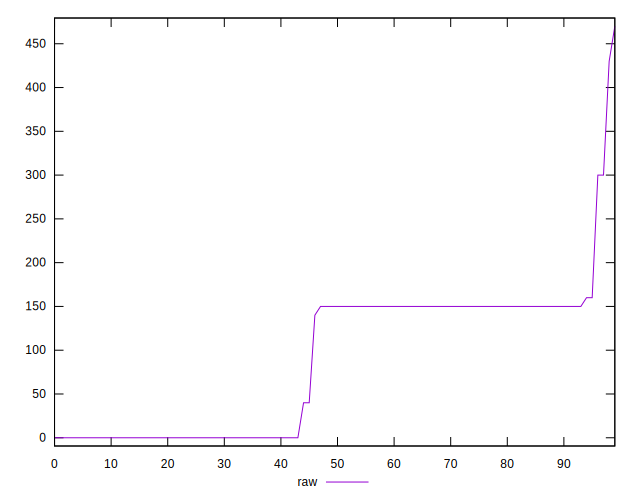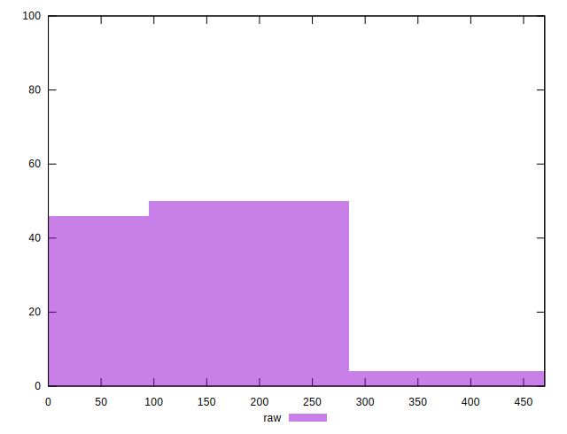
## Score


```yaml
p90min: 0.75
p90max: 1
p90range: 0.25
p90mean: 0.9326595744680848
median: 0.88
p90stdev: 0.06214560000369231
mad: 0.04999999999999999
stdevBySn: 0.08646349999999998
lfitCenter: 0.9273450863152205
lfitStdev: 0.07602282578437947
mfitCenter: 0.9273450863152205
mfitStdev: 0.09528048241011139
mfitConfidence: 0.009528048241011139
p90skewness: -0.04305321343231779
p90eccentricity: 1.0000000000000002
p90discretization: 18.8
outlandishness: 0.9891796518433595

```

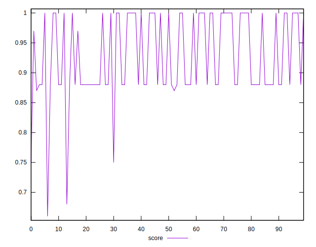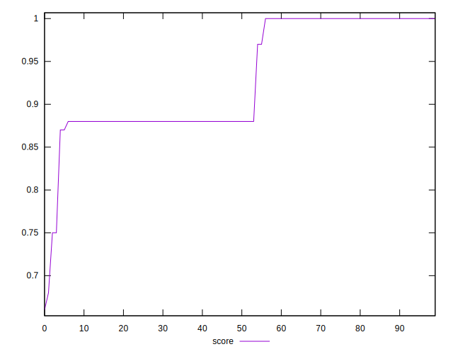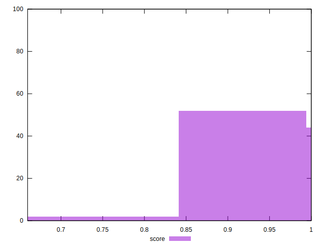
## Raw Estimate

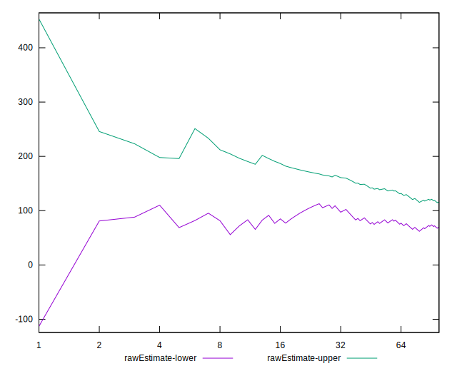
## Score Estimate

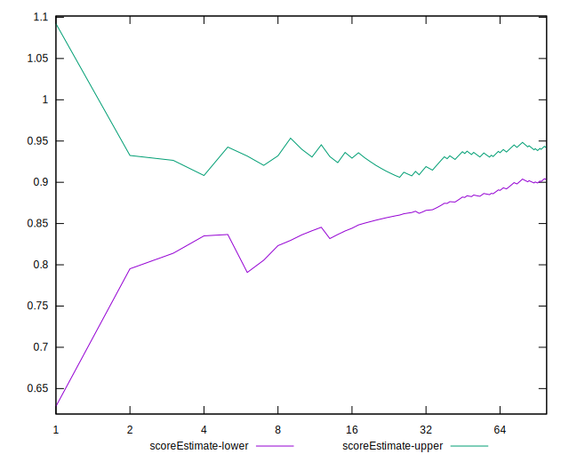
## P Score


```yaml
p90min: 0.75
p90max: 1
p90range: 0.25
p90mean: 0.9300531914893618
median: 0.875
p90stdev: 0.06427696246343614
mad: 0.04999999999999999
stdevBySn: 0.08944499999999998
lfitCenter: 0.9246136878263468
lfitStdev: 0.07870275048656915
mfitCenter: 0.9246136878263468
mfitStdev: 0.09863926992968651
mfitConfidence: 0.00986392699296865
p90skewness: -0.0064779921912903925
p90eccentricity: 1.0000000000000016
p90discretization: 15.666666666666666
outlandishness: 0.989341298615811

```

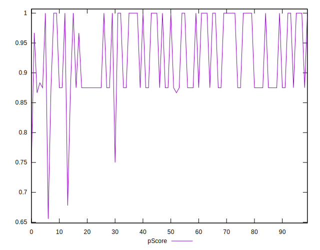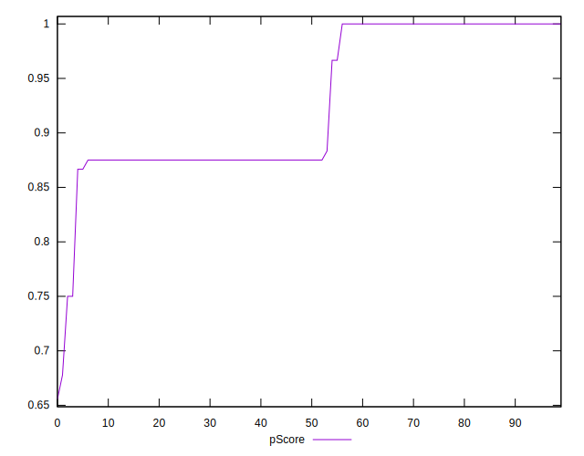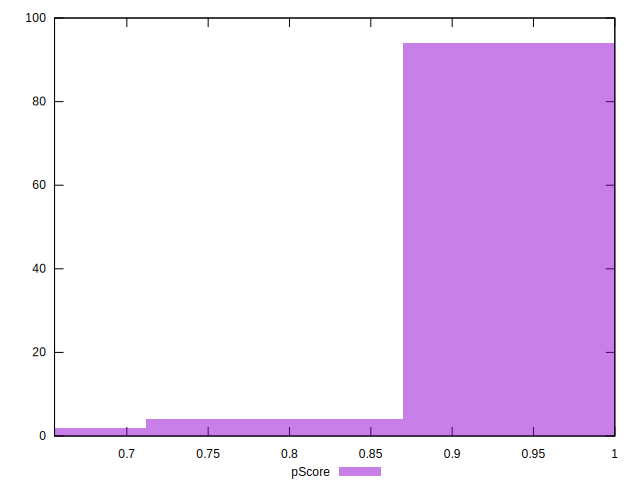
## Score Difference


```yaml
p90min: 0
p90max: 0
p90range: 0
p90mean: 0
median: 0
p90stdev: 0
mad: 0
stdevBySn: 0
lfitCenter: 0
lfitStdev: 0
mfitCenter: 0
mfitStdev: 0
mfitConfidence: 0
p90skewness: .nan
p90eccentricity: .nan
p90discretization: 94
outlandishness: .nan

```


## P Score Difference


```yaml
p90min: -0.0050000000000000044
p90max: 0
p90range: 0.0050000000000000044
p90mean: -0.0025531914893617033
median: -0.0033333333333332993
p90stdev: 0.002432864184153196
mad: 0.0016666666666667052
stdevBySn: 0.0019876666666667126
lfitCenter: -0.002572080112840671
lfitStdev: 0.0029386772983650143
mfitCenter: -0.002572080112840671
mfitStdev: 0.0036830858067550703
mfitConfidence: 0.00036830858067550705
p90skewness: 0.05847601109255906
p90eccentricity: 1.0000000000000022
p90discretization: 18.8
outlandishness: 0.9715935378086423

```

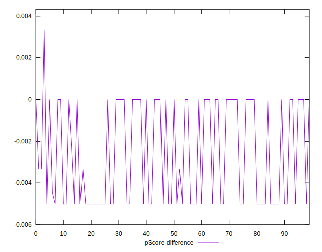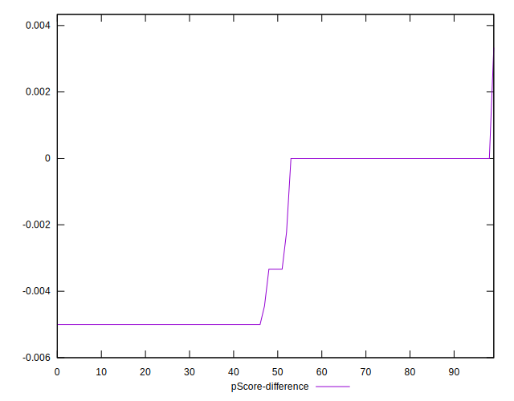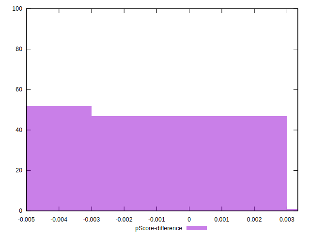