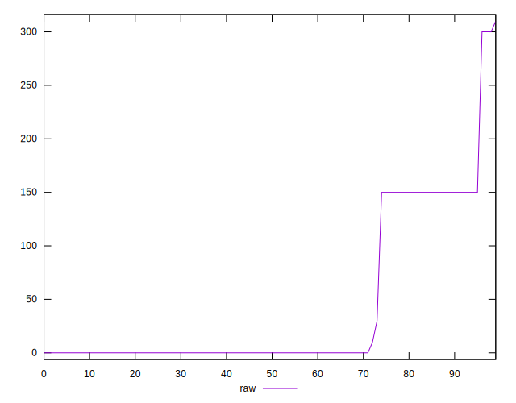
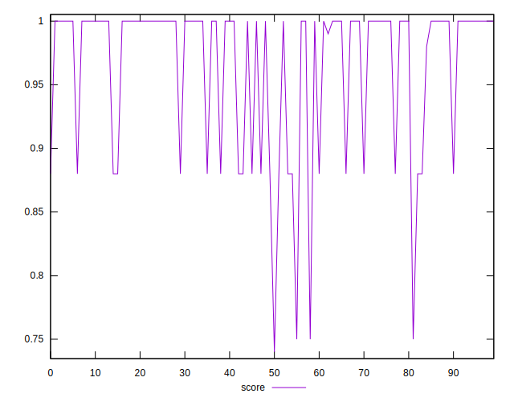

# //unminified-javascript/samples/card

[→ Parent](../..)


## Raw


```yaml
p90min: 0
p90max: 300
p90range: 300
p90mean: 38.723404255319146
median: 0
p90stdev: 68.80799747173738
mad: 0
stdevBySn: 0
lfitCenter: 29.542388595257986
lfitStdev: 60.15177260225705
mfitCenter: 29.542388595257986
mfitStdev: 75.38906706285562
mfitConfidence: 7.5389067062855615
p90skewness: 1.4407127836826645
p90eccentricity: 1.000000000000001
p90discretization: 18.8
outlandishness: 1.3806250000000002

```


## Score


```yaml
p90min: 0.75
p90max: 1
p90range: 0.25
p90mean: 0.9689361702127662
median: 1
p90stdev: 0.05545686621929378
mad: 0
stdevBySn: 0
lfitCenter: 0.9761818037469188
lfitStdev: 0.048540842589567715
mfitCenter: 0.9761818037469188
mfitStdev: 0.06083692431592825
mfitConfidence: 0.006083692431592825
p90skewness: -1.4902015202249035
p90eccentricity: 0.9999999999999974
p90discretization: 18.8
outlandishness: 0.9881949066961839

```


## Raw Estimate


## Score Estimate


## P Score


```yaml
p90min: 0.75
p90max: 1
p90range: 0.25
p90mean: 0.9677304964539007
median: 1
p90stdev: 0.057339997893114544
mad: 0
stdevBySn: 0
lfitCenter: 0.975394269507709
lfitStdev: 0.05010004775468741
mfitCenter: 0.975394269507709
mfitStdev: 0.06279109819431448
mfitConfidence: 0.006279109819431449
p90skewness: -1.4407127836826605
p90eccentricity: 0.9999999999999988
p90discretization: 18.8
outlandishness: 0.9884201848900552

```


## Score Difference


```yaml
p90min: 0
p90max: 0
p90range: 0
p90mean: 0
median: 0
p90stdev: 0
mad: 0
stdevBySn: 0
lfitCenter: 0
lfitStdev: 0
mfitCenter: 0
mfitStdev: 0
mfitConfidence: 0
p90skewness: .nan
p90eccentricity: .nan
p90discretization: 94
outlandishness: .nan

```


## P Score Difference


```yaml
p90min: -0.0050000000000000044
p90max: 0
p90range: 0.0050000000000000044
p90mean: -0.0010638297872340434
median: 0
p90stdev: 0.0020463174533692954
mad: 0
stdevBySn: 0
lfitCenter: -0.0007078088762719678
lfitStdev: 0.0015846911085546016
mfitCenter: -0.0007078088762719678
mfitStdev: 0.001986115771628168
mfitConfidence: 0.00019861157716281682
p90skewness: -1.403663161257097
p90eccentricity: 0.9999999999999996
p90discretization: 47
outlandishness: 1.047665975308641

```

