# //unminified-javascript/samples/music

[→ Parent](../..)


## Raw


```yaml
p90min: 0
p90max: 300
p90range: 300
p90mean: 24.148936170212767
median: 0
p90stdev: 63.487468598779586
mad: 0
stdevBySn: 0
lfitCenter: 18.33551166945058
lfitStdev: 41.73290151767615
mfitCenter: 18.33551166945058
mfitStdev: 52.30443551592996
mfitConfidence: 5.230443551592996
p90skewness: 2.652105398435278
p90eccentricity: 1.0000000000000013
p90discretization: 23.5
outlandishness: 1.9014830561431422

```

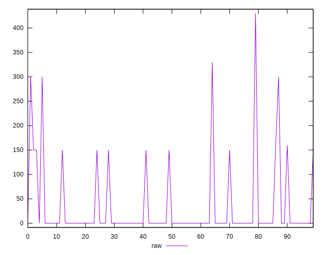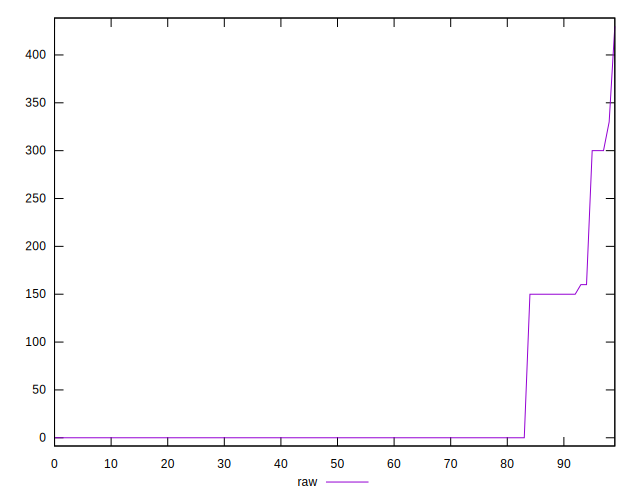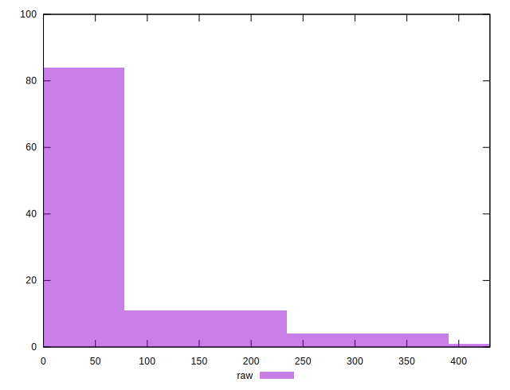
## Score


```yaml
p90min: 0.75
p90max: 1
p90range: 0.25
p90mean: 0.9804255319148936
median: 1
p90stdev: 0.051816264874729526
mad: 0
stdevBySn: 0
lfitCenter: 0.9852418640728042
lfitStdev: 0.03359054518561984
mfitCenter: 0.9852418640728042
mfitStdev: 0.04209950520363477
mfitConfidence: 0.004209950520363477
p90skewness: -2.727591683588566
p90eccentricity: 1.000000000000001
p90discretization: 23.5
outlandishness: 0.985314730495877

```

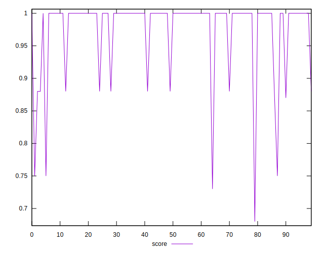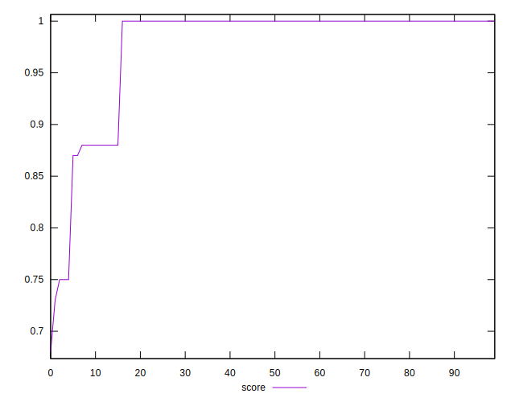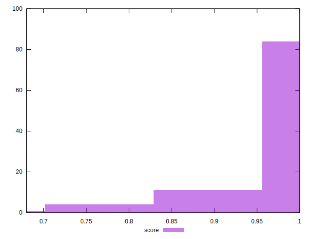
## Raw Estimate

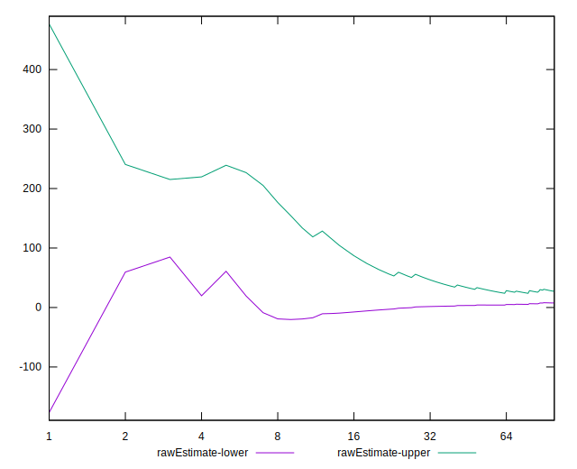
## Score Estimate

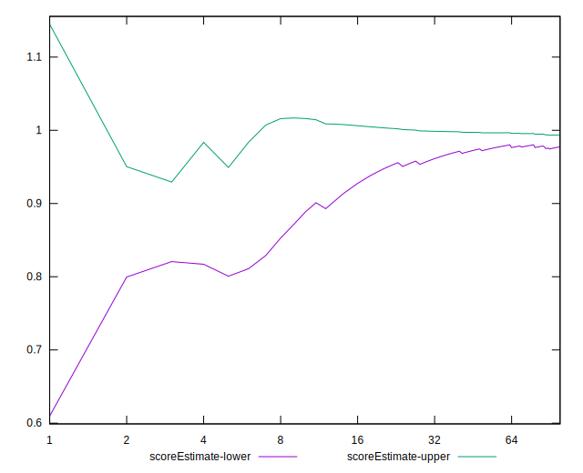
## P Score


```yaml
p90min: 0.75
p90max: 1
p90range: 0.25
p90mean: 0.9798758865248226
median: 1
p90stdev: 0.05290622383231637
mad: 0
stdevBySn: 0
lfitCenter: 0.9849282660269028
lfitStdev: 0.034304316178307696
mfitCenter: 0.9849282660269028
mfitStdev: 0.04299408448047634
mfitConfidence: 0.004299408448047634
p90skewness: -2.6521053984352787
p90eccentricity: 1.0000000000000029
p90discretization: 23.5
outlandishness: 0.9853958526084273

```

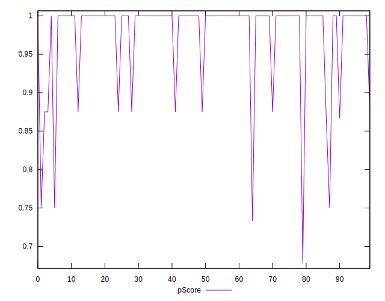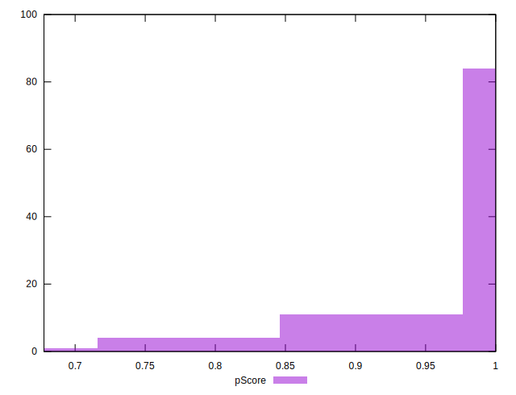
## Score Difference


```yaml
p90min: 0
p90max: 0
p90range: 0
p90mean: 0
median: 0
p90stdev: 0
mad: 0
stdevBySn: 0
lfitCenter: 0
lfitStdev: 0
mfitCenter: 0
mfitStdev: 0
mfitConfidence: 0
p90skewness: .nan
p90eccentricity: .nan
p90discretization: 94
outlandishness: .nan

```


## P Score Difference


```yaml
p90min: -0.0050000000000000044
p90max: 0
p90range: 0.0050000000000000044
p90mean: -0.0004137115839243496
median: 0
p90stdev: 0.001309018269494763
mad: 0
stdevBySn: 0
lfitCenter: -0.0002721333349222603
lfitStdev: 0.0006766627127984281
mfitCenter: -0.0002721333349222603
mfitStdev: 0.000848070944997893
mfitConfidence: 0.0000848070944997893
p90skewness: -2.9807573346716016
p90eccentricity: 0.9999999999999984
p90discretization: 23.5
outlandishness: 1.4932840000000032

```

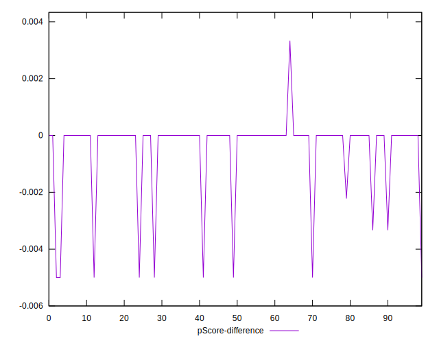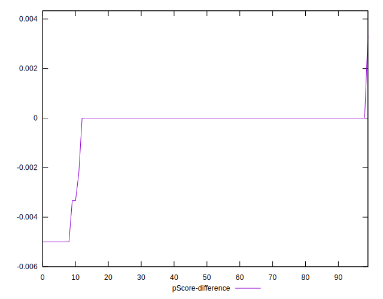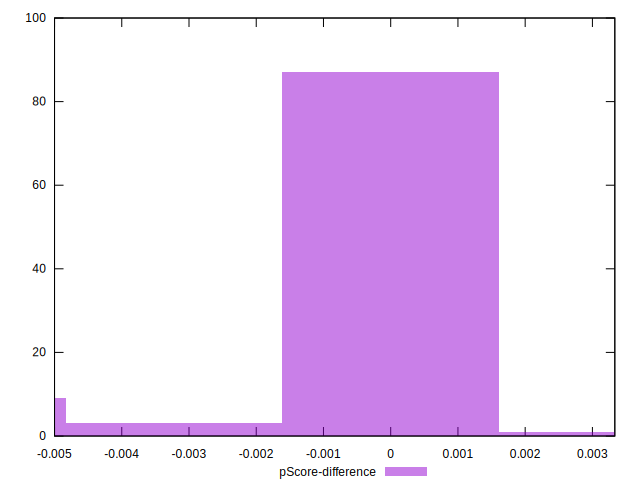