# //unused-css-rules/samples/agenda

[→ Parent](../..)


## Raw


```yaml
p90min: 0
p90max: 60
p90range: 60
p90mean: 2.127659574468085
median: 0
p90stdev: 9.438754473539934
mad: 0
stdevBySn: 0
lfitCenter: 2.6712921966803522
lfitStdev: 6.383124397936842
mfitCenter: 2.6712921966803522
mfitStdev: 8.000060056227735
mfitConfidence: 0.8000060056227735
p90skewness: 4.802868388227955
p90eccentricity: 0.999999999999998
p90discretization: 15.666666666666666
outlandishness: 6.4414440000000015

```

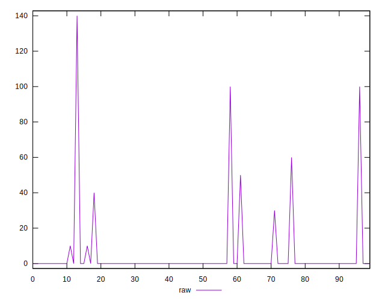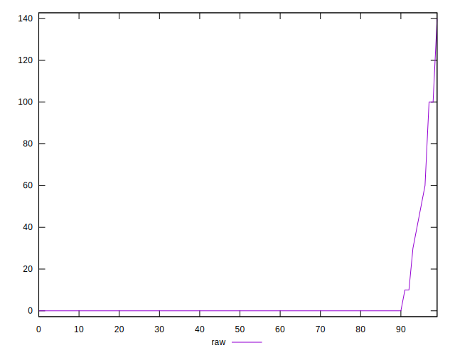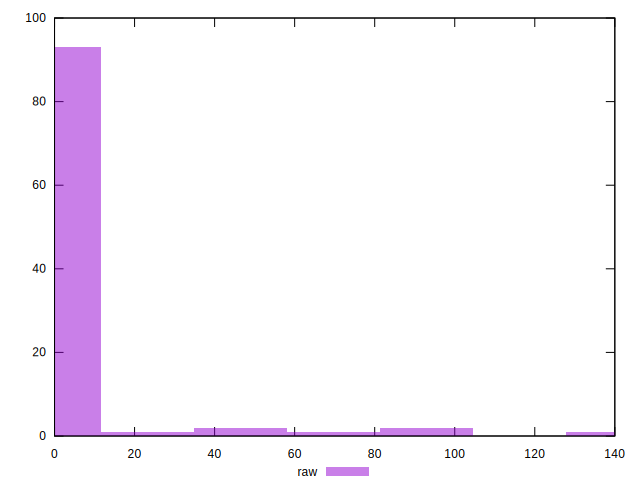
## Score


```yaml
p90min: 0.95
p90max: 1
p90range: 0.050000000000000044
p90mean: 0.9982978723404256
median: 1
p90stdev: 0.007528428090618787
mad: 0
stdevBySn: 0
lfitCenter: 0.9978253750438446
lfitStdev: 0.0051963246968071
mfitCenter: 0.9978253750438446
mfitStdev: 0.006512627211143302
mfitConfidence: 0.0006512627211143301
p90skewness: -4.944821767318825
p90eccentricity: 0.9999999999999983
p90discretization: 15.666666666666666
outlandishness: 0.9946023587699658

```

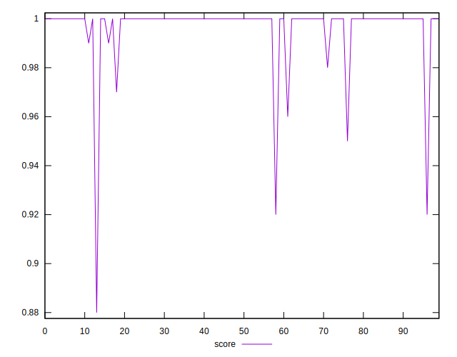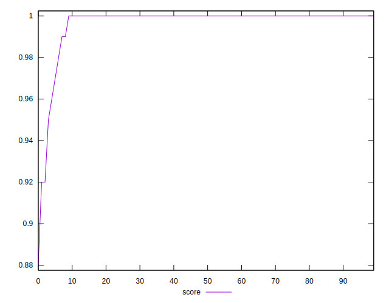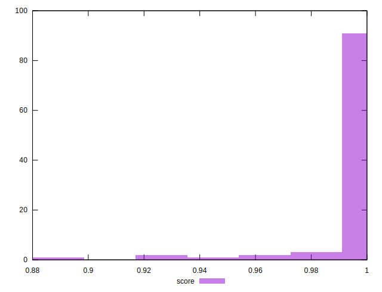
## Raw Estimate

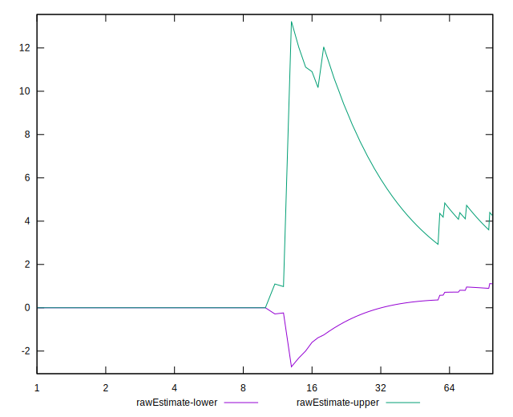
## Score Estimate

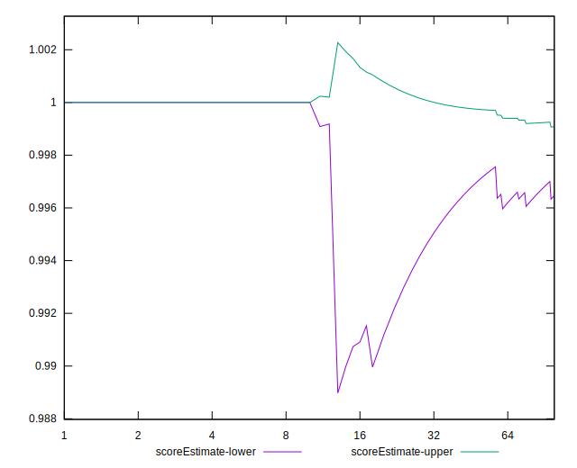
## P Score


```yaml
p90min: 0.95
p90max: 1
p90range: 0.050000000000000044
p90mean: 0.9982269503546098
median: 1
p90stdev: 0.007865628727949945
mad: 0
stdevBySn: 0
lfitCenter: 0.9977739231694331
lfitStdev: 0.005319270331613917
mfitCenter: 0.9977739231694331
mfitStdev: 0.006666716713522965
mfitConfidence: 0.0006666716713522965
p90skewness: -4.8028683882278855
p90eccentricity: 0.9999999999999999
p90discretization: 15.666666666666666
outlandishness: 0.9945438747763977

```

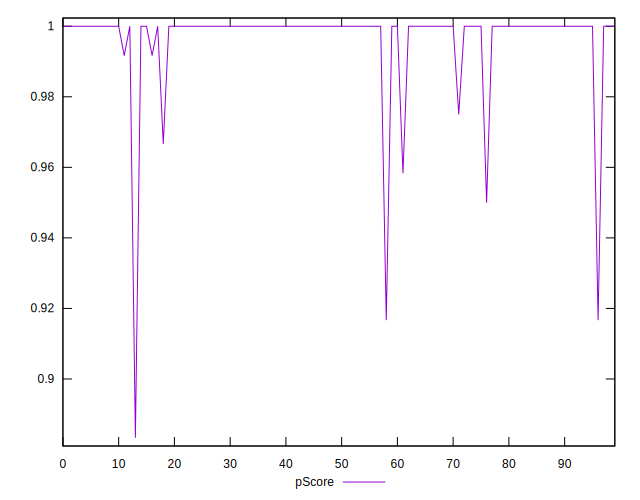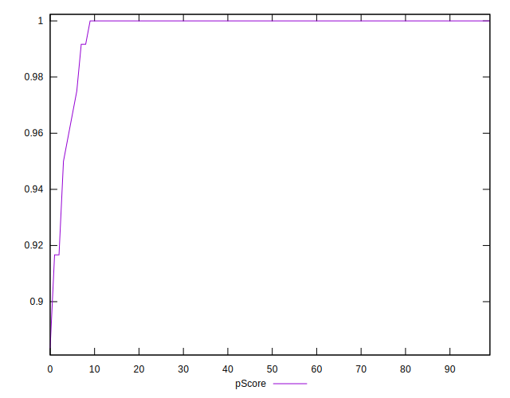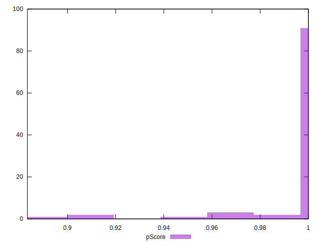
## Score Difference


```yaml
p90min: 0
p90max: 0
p90range: 0
p90mean: 0
median: 0
p90stdev: 0
mad: 0
stdevBySn: 0
lfitCenter: 5.166535369026208e-19
lfitStdev: 1.2890316797319448e-18
mfitCenter: 5.166535369026208e-19
mfitStdev: 1.6155616292812394e-18
mfitConfidence: 1.6155616292812395e-19
p90skewness: .nan
p90eccentricity: .nan
p90discretization: 94
outlandishness: .inf

```

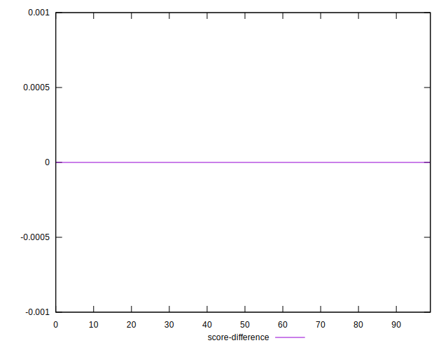
## P Score Difference


```yaml
p90min: -0.0033333333333332993
p90max: 0
p90range: 0.0033333333333332993
p90mean: -0.000053191489361700996
median: 0
p90stdev: 0.0003806899034323321
mad: 0
stdevBySn: 0
lfitCenter: -0.00004931323598586216
lfitStdev: 0.00019991130279397353
mfitCenter: -0.00004931323598586216
mfitStdev: 0.00025055166225296244
mfitConfidence: 0.000025055166225296243
p90skewness: -7.61237792214155
p90eccentricity: 1.0000000000000022
p90discretization: 31.333333333333332
outlandishness: 3.5344000000001565

```

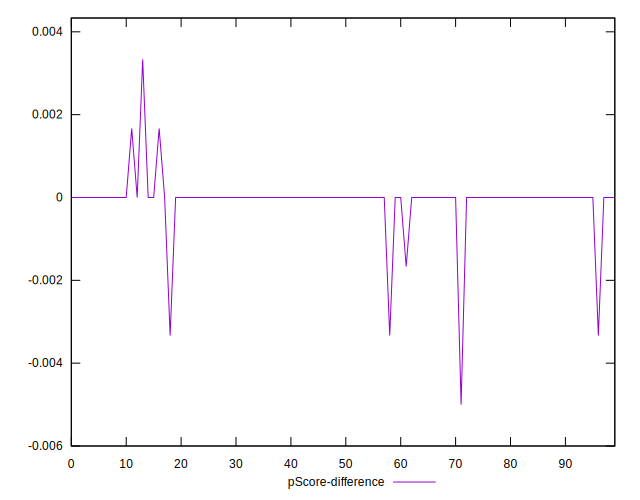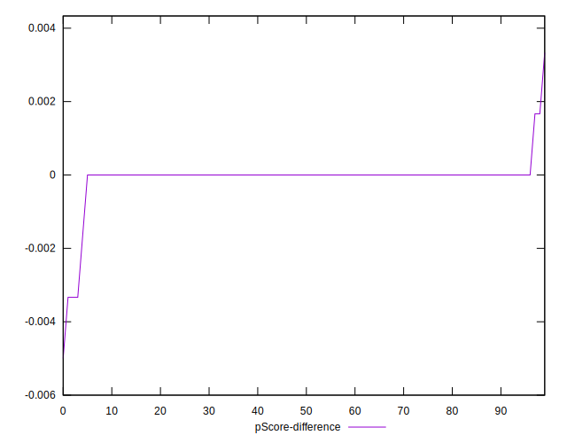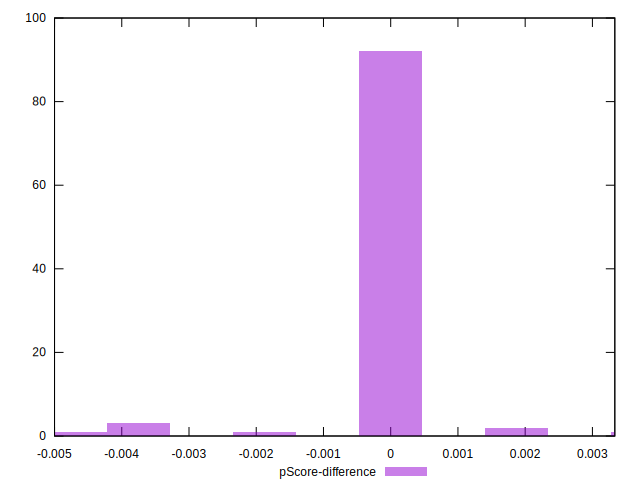