# //unused-css-rules/samples/astro

[→ Parent](../..)


## Raw


```yaml
p90min: 140
p90max: 770
p90range: 630
p90mean: 410.3191489361702
median: 450
p90stdev: 134.73734991866755
mad: 145
stdevBySn: 175.9085
lfitCenter: 415.00739807683635
lfitStdev: 115.15374897933162
mfitCenter: 415.00739807683635
mfitStdev: 144.32382170590145
mfitConfidence: 14.432382170590145
p90skewness: 0.23974080454993152
p90eccentricity: 1.000000000000001
p90discretization: 4.086956521739131
outlandishness: 1.0155643735948006

```

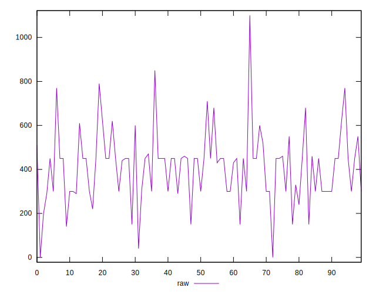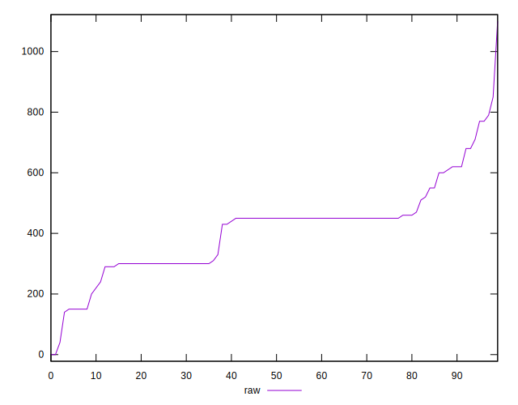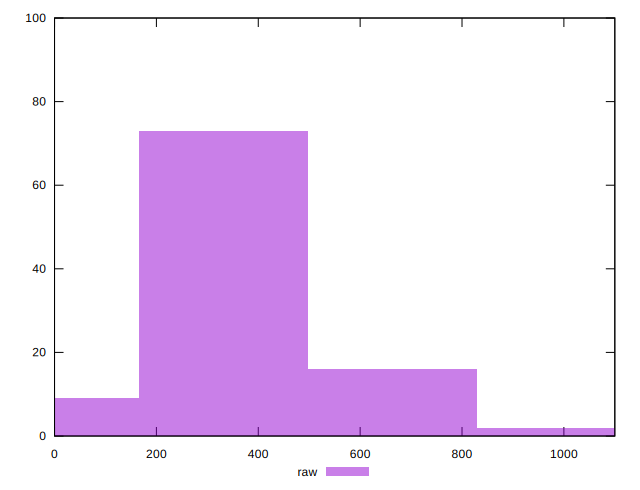
## Score


```yaml
p90min: 0.5
p90max: 0.88
p90range: 0.38
p90mean: 0.693829787234043
median: 0.67
p90stdev: 0.08139876081155567
mad: 0.07499999999999996
stdevBySn: 0.09540799999999997
lfitCenter: 0.6919355873867414
lfitStdev: 0.06702814938516433
mfitCenter: 0.6919355873867414
mfitStdev: 0.08400732730705344
mfitConfidence: 0.008400732730705344
p90skewness: 0.18918128368143064
p90eccentricity: 1.0000000000000024
p90discretization: 5.222222222222222
outlandishness: 1.007422492785252

```

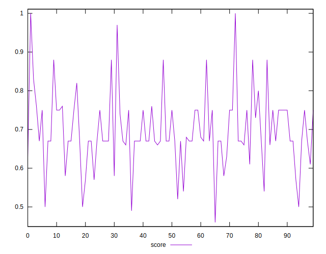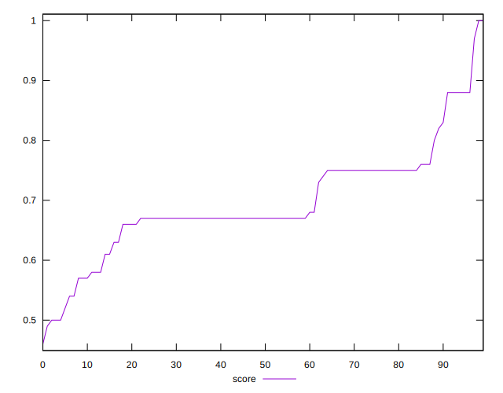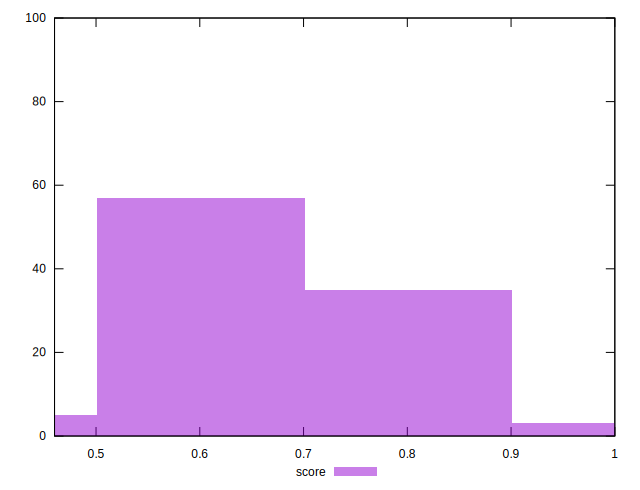
## Raw Estimate

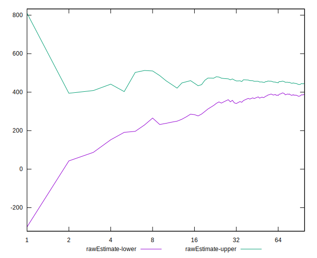
## Score Estimate

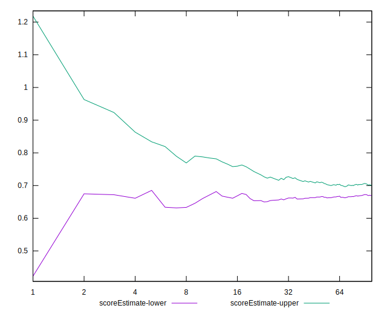
## P Score


```yaml
p90min: 0.4976470588235294
p90max: 0.8833333333333333
p90range: 0.3856862745098039
p90mean: 0.6923849256014462
median: 0.6666666666666666
p90stdev: 0.08120556735122872
mad: 0.08055555555555555
stdevBySn: 0.09772694444444441
lfitCenter: 0.6901685578273447
lfitStdev: 0.06823448631262509
mfitCenter: 0.6901685578273447
mfitStdev: 0.08551924643412713
mfitConfidence: 0.008551924643412713
p90skewness: 0.19657794034933346
p90eccentricity: 0.9999999999999989
p90discretization: 4.086956521739131
outlandishness: 1.0073710027521754

```

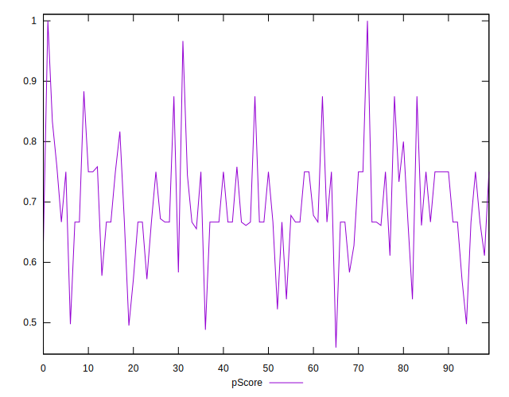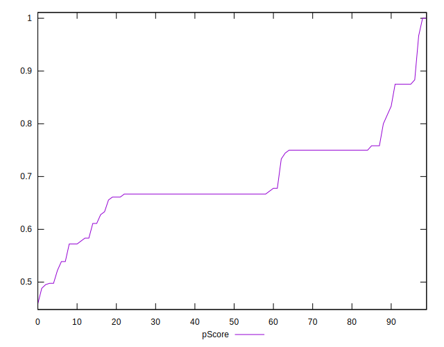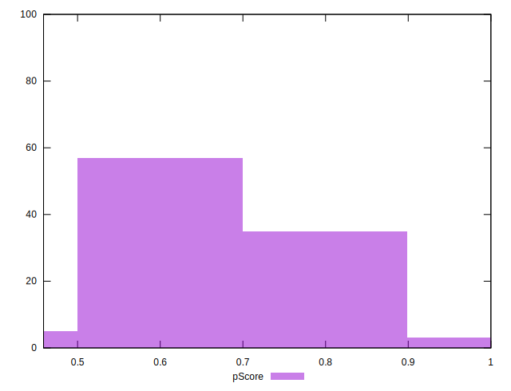
## Score Difference


```yaml
p90min: 0
p90max: 1.1102230246251565e-16
p90range: 1.1102230246251565e-16
p90mean: 2.362176648138631e-18
median: 0
p90stdev: 1.6021061506108986e-17
mad: 0
stdevBySn: 0
lfitCenter: 2.7255820612844e-18
lfitStdev: 6.664295900958648e-18
mfitCenter: 2.7255820612844e-18
mfitStdev: 8.352456276329808e-18
mfitConfidence: 8.352456276329809e-19
p90skewness: 6.634888026970375
p90eccentricity: 0.9999999999999984
p90discretization: 47
outlandishness: 5.522500000000001

```

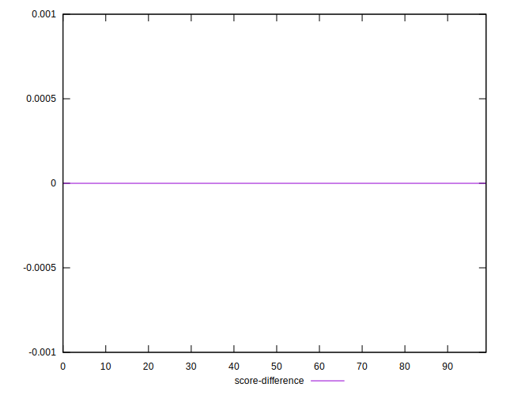
## P Score Difference


```yaml
p90min: -0.0050000000000000044
p90max: 0.0033333333333332993
p90range: 0.008333333333333304
p90mean: -0.0015203031567237173
median: -0.0022222222222222365
p90stdev: 0.0021373144850574065
mad: 0.0011111111111111738
stdevBySn: 0.0026112483660131027
lfitCenter: -0.001663408153826876
lfitStdev: 0.002101575471084681
mfitCenter: -0.001663408153826876
mfitStdev: 0.0026339342511962896
mfitConfidence: 0.00026339342511962896
p90skewness: 0.5649529013870076
p90eccentricity: 1.0000000000000002
p90discretization: 5.875
outlandishness: 0.9323441446428531

```

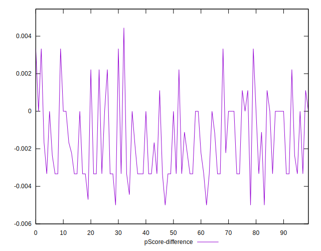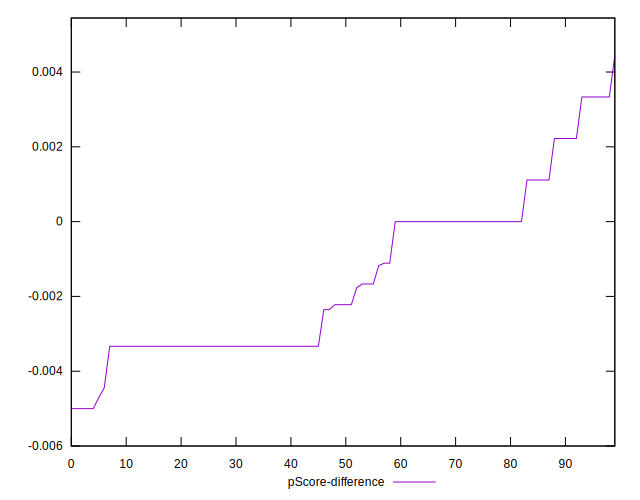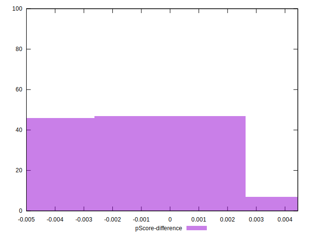