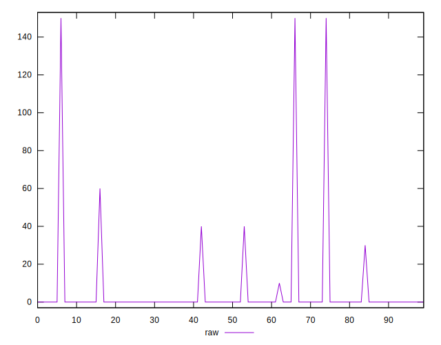

# //unused-css-rules/samples/card

[→ Parent](../..)


## Raw


```yaml
p90min: 0
p90max: 60
p90range: 60
p90mean: 1.9148936170212767
median: 0
p90stdev: 8.9057232070027
mad: 0
stdevBySn: 0
lfitCenter: 3.0925139395364045
lfitStdev: 7.434386156479363
mfitCenter: 3.0925139395364045
mfitStdev: 9.317621281554016
mfitConfidence: 0.9317621281554016
p90skewness: 4.947834932456413
p90eccentricity: 0.9999999999999992
p90discretization: 18.8
outlandishness: 10.824099999999998

```


## Score


```yaml
p90min: 0.95
p90max: 1
p90range: 0.050000000000000044
p90mean: 0.9985106382978723
median: 1
p90stdev: 0.006988964981130581
mad: 0
stdevBySn: 0
lfitCenter: 0.9975475200956023
lfitStdev: 0.005895747927665509
mfitCenter: 0.9975475200956023
mfitStdev: 0.007389224235227098
mfitConfidence: 0.0007389224235227098
p90skewness: -5.209583853245687
p90eccentricity: 0.9999999999999991
p90discretization: 18.8
outlandishness: 0.9929806119609343

```


## Raw Estimate


## Score Estimate


## P Score


```yaml
p90min: 0.95
p90max: 1
p90range: 0.050000000000000044
p90mean: 0.9984042553191489
median: 1
p90stdev: 0.007421436005835591
mad: 0
stdevBySn: 0
lfitCenter: 0.9974229050503864
lfitStdev: 0.006195321797066003
mfitCenter: 0.9974229050503864
mfitStdev: 0.007764684401294847
mfitConfidence: 0.0007764684401294847
p90skewness: -4.94783493245643
p90eccentricity: 1.0000000000000022
p90discretization: 18.8
outlandishness: 0.9926932045065622

```


## Score Difference


```yaml
p90min: 0
p90max: 0
p90range: 0
p90mean: 0
median: 0
p90stdev: 0
mad: 0
stdevBySn: 0
lfitCenter: 5.166535369026208e-19
lfitStdev: 1.2890316797319448e-18
mfitCenter: 5.166535369026208e-19
mfitStdev: 1.6155616292812394e-18
mfitConfidence: 1.6155616292812395e-19
p90skewness: .nan
p90eccentricity: .nan
p90discretization: 94
outlandishness: .inf

```


## P Score Difference


```yaml
p90min: -0.0050000000000000044
p90max: 0
p90range: 0.0050000000000000044
p90mean: -0.0001241134751773043
median: 0
p90stdev: 0.0006978251295799412
mad: 0
stdevBySn: 0
lfitCenter: -0.00012409083605973768
lfitStdev: 0.00032120099704436824
mfitCenter: -0.00012409083605973768
mfitStdev: 0.0004025657509206197
mfitConfidence: 0.00004025657509206197
p90skewness: -5.693082233281838
p90eccentricity: 1.0000000000000027
p90discretization: 31.333333333333332
outlandishness: 4.057346938775526

```

