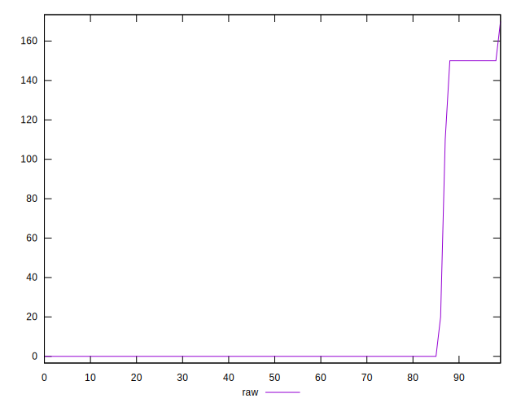
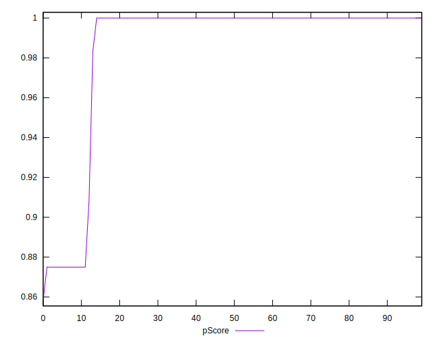
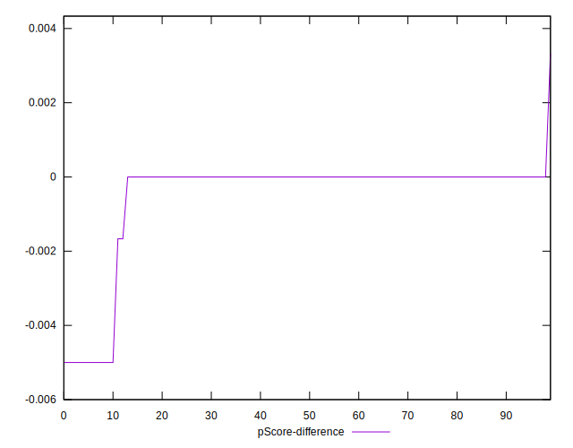

# //unused-css-rules/samples/music

[→ Parent](../..)


## Raw


```yaml
p90min: 0
p90max: 150
p90range: 150
p90mean: 15.74468085106383
median: 0
p90stdev: 45.15904192353219
mad: 0
stdevBySn: 0
lfitCenter: 10.689829574598306
lfitStdev: 24.702165302821626
mfitCenter: 10.689829574598306
mfitStdev: 30.959573027483607
mfitConfidence: 3.095957302748361
p90skewness: 2.575110019176502
p90eccentricity: 1
p90discretization: 23.5
outlandishness: 1.533915723155588

```


## Score


```yaml
p90min: 0.88
p90max: 1
p90range: 0.12
p90mean: 0.9873404255319148
median: 1
p90stdev: 0.03617850343031372
mad: 0
stdevBySn: 0
lfitCenter: 0.9913900566861862
lfitStdev: 0.019895943289044052
mfitCenter: 0.9913900566861862
mfitStdev: 0.024935867024477892
mfitConfidence: 0.002493586702447789
p90skewness: -2.566836313417985
p90eccentricity: 0.9999999999999972
p90discretization: 23.5
outlandishness: 0.9938506636703838

```


## Raw Estimate


## Score Estimate


## P Score


```yaml
p90min: 0.875
p90max: 1
p90range: 0.125
p90mean: 0.9868794326241135
median: 1
p90stdev: 0.037632534936276774
mad: 0
stdevBySn: 0
lfitCenter: 0.9910918086878349
lfitStdev: 0.020585137752351226
mfitCenter: 0.9910918086878349
mfitStdev: 0.025799644189569513
mfitConfidence: 0.0025799644189569513
p90skewness: -2.575110019176516
p90eccentricity: 1.0000000000000036
p90discretization: 23.5
outlandishness: 0.9936679785894004

```


## Score Difference


```yaml
p90min: 0
p90max: 0
p90range: 0
p90mean: 0
median: 0
p90stdev: 0
mad: 0
stdevBySn: 0
lfitCenter: 0
lfitStdev: 0
mfitCenter: 0
mfitStdev: 0
mfitConfidence: 0
p90skewness: .nan
p90eccentricity: .nan
p90discretization: 94
outlandishness: .nan

```


## P Score Difference


```yaml
p90min: -0.0050000000000000044
p90max: 0
p90range: 0.0050000000000000044
p90mean: -0.0004609929078014185
median: 0
p90stdev: 0.0014050789188765223
mad: 0
stdevBySn: 0
lfitCenter: -0.0002994629072884633
lfitStdev: 0.00073586845068052
mfitCenter: -0.0002994629072884633
mfitStdev: 0.0009222743333703813
mfitConfidence: 0.00009222743333703812
p90skewness: -2.8509625289105602
p90eccentricity: 1.0000000000000013
p90discretization: 23.5
outlandishness: 1.4234325443787006

```

