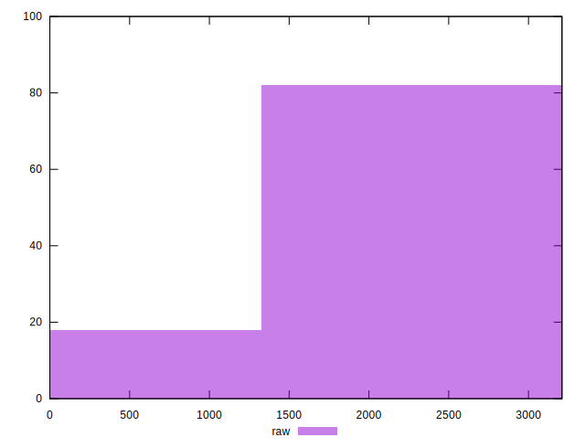

# //unused-javascript/samples/agenda

[→ Parent](../..)


## Raw


```yaml
p90min: 0
p90max: 3170
p90range: 3170
p90mean: 2163.5106382978724
median: 2700
p90stdev: 1079.37206671169
mad: 450
stdevBySn: 578.4110000000001
lfitCenter: 2281.5548606469224
lfitStdev: 927.4973137553782
mfitCenter: 2281.5548606469224
mfitStdev: 1162.4454968214677
mfitConfidence: 116.24454968214677
p90skewness: -0.9901261394514832
p90eccentricity: 0.9999999999999997
p90discretization: 2.5405405405405403
outlandishness: 0.9687159029535103

```


## Score


```yaml
p90min: 0.22
p90max: 1
p90range: 0.78
p90mean: 0.39531914893617026
median: 0.27
p90stdev: 0.26202445122082313
mad: 0.05000000000000002
stdevBySn: 0.06559300000000003
lfitCenter: 0.36061227017667297
lfitStdev: 0.18084558730710604
mfitCenter: 0.36061227017667297
mfitStdev: 0.22665633147119182
mfitConfidence: 0.022665633147119182
p90skewness: 1.7078888746170173
p90eccentricity: 1.0000000000000009
p90discretization: 5.222222222222222
outlandishness: 1.0651839715610265

```


## Raw Estimate


## Score Estimate


## P Score


```yaml
p90min: 0.2152941176470588
p90max: 1
p90range: 0.7847058823529411
p90mean: 0.3950312891113891
median: 0.27058823529411763
p90stdev: 0.2623650162088317
mad: 0.052941176470588214
stdevBySn: 0.06804835294117645
lfitCenter: 0.36066933929167133
lfitStdev: 0.18104349807633746
mfitCenter: 0.36066933929167133
mfitStdev: 0.22690437583644615
mfitConfidence: 0.022690437583644616
p90skewness: 1.7016633487685568
p90eccentricity: 0.9999999999999992
p90discretization: 2.5405405405405403
outlandishness: 1.0652609975002494

```


## Score Difference


```yaml
p90min: 0
p90max: 5.551115123125783e-17
p90range: 5.551115123125783e-17
p90mean: 4.133809134242604e-18
median: 0
p90stdev: 1.457340475159285e-17
mad: 0
stdevBySn: 0
lfitCenter: 2.9226926675442233e-18
lfitStdev: 6.94038067323661e-18
mfitCenter: 2.9226926675442233e-18
mfitStdev: 8.69847722487149e-18
mfitConfidence: 8.69847722487149e-19
p90skewness: 3.241763593892426
p90eccentricity: 0.9999999999999976
p90discretization: 47
outlandishness: 1.8032653061224493

```


## P Score Difference


```yaml
p90min: -0.004705882352941199
p90max: 0.0041176470588235314
p90range: 0.00882352941176473
p90mean: -0.0002941176470588271
median: 0
p90stdev: 0.002652615499964147
mad: 0.0023529411764705854
stdevBySn: 0.0028061176470588205
lfitCenter: -0.00024297192387910105
lfitStdev: 0.0021747234601216477
mfitCenter: -0.00024297192387910105
mfitStdev: 0.002725611660064769
mfitConfidence: 0.0002725611660064769
p90skewness: -0.15174354203527413
p90eccentricity: 0.9999999999999999
p90discretization: 3.6153846153846154
outlandishness: 0.9216000000000028

```

