# //unused-javascript/samples/astro

[→ Parent](../..)


## Raw


```yaml
p90min: 2960
p90max: 4280
p90range: 1320
p90mean: 3808.404255319149
median: 3830
p90stdev: 347.4475413993391
mad: 270
stdevBySn: 441.26200000000006
lfitCenter: 3824.61318347061
lfitStdev: 316.4930334433096
mfitCenter: 3824.61318347061
mfitStdev: 396.66519357550874
mfitConfidence: 39.666519357550875
p90skewness: -0.5506661590708292
p90eccentricity: 0.9999999999999994
p90discretization: 1.8076923076923077
outlandishness: 0.9947007457157179

```

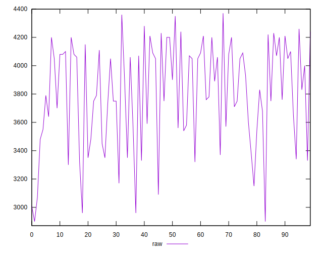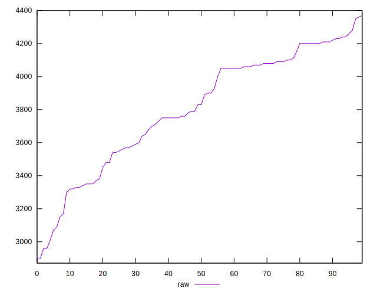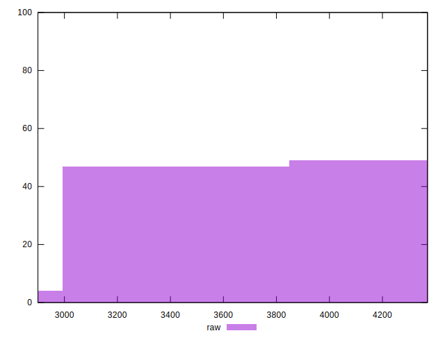
## Score


```yaml
p90min: 0.08
p90max: 0.24
p90range: 0.15999999999999998
p90mean: 0.14021276595744678
median: 0.14
p90stdev: 0.041462075042351214
mad: 0.030000000000000013
stdevBySn: 0.05963000000000002
lfitCenter: 0.13855922762648298
lfitStdev: 0.03786241939372984
mfitCenter: 0.13855922762648298
mfitStdev: 0.047453505546879916
mfitConfidence: 0.0047453505546879915
p90skewness: 0.4944486500215294
p90eccentricity: 1.000000000000001
p90discretization: 5.875
outlandishness: 1.0184454362498017

```

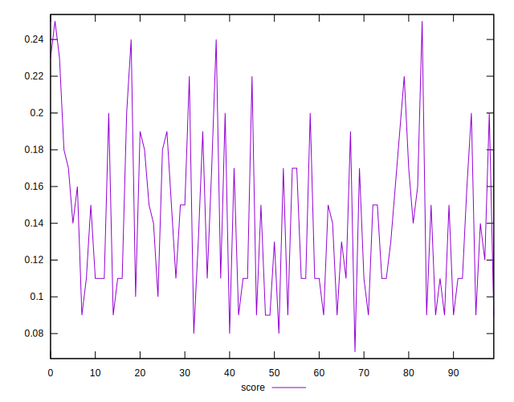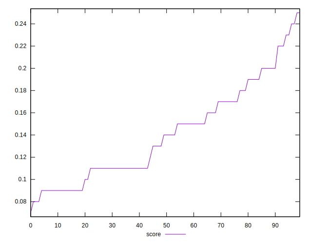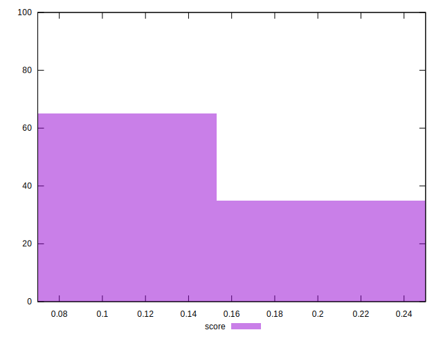
## Raw Estimate

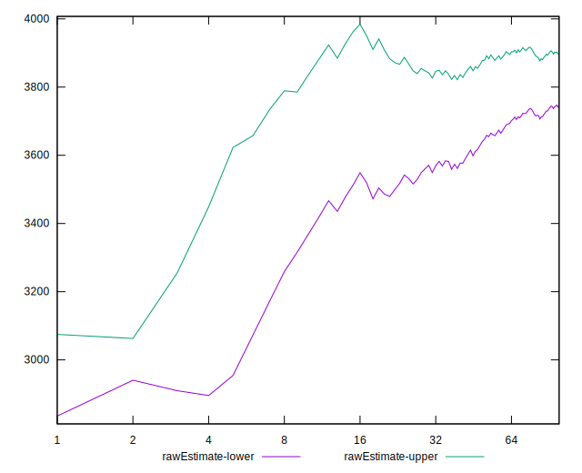
## Score Estimate

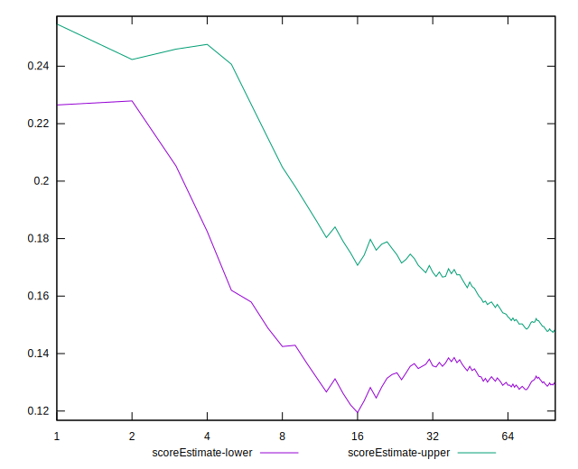
## P Score


```yaml
p90min: 0.08470588235294119
p90max: 0.24
p90range: 0.1552941176470588
p90mean: 0.1401877346683354
median: 0.1376470588235294
p90stdev: 0.040876181341098716
mad: 0.03176470588235292
stdevBySn: 0.051913176470588226
lfitCenter: 0.13828080194463407
lfitStdev: 0.03723447452274228
mfitCenter: 0.13828080194463407
mfitStdev: 0.04666649336182452
mfitConfidence: 0.004666649336182452
p90skewness: 0.5506661590708389
p90eccentricity: 0.9999999999999994
p90discretization: 1.8076923076923077
outlandishness: 1.0170311036881872

```

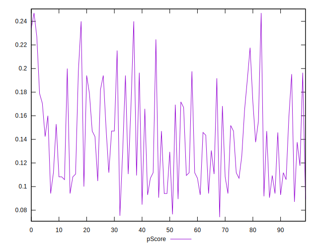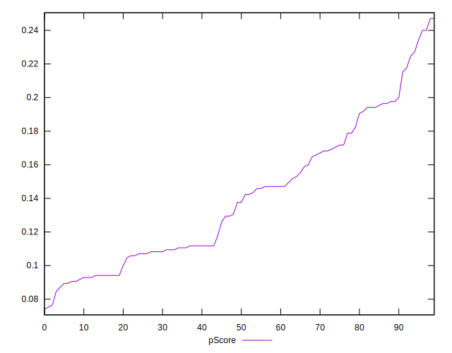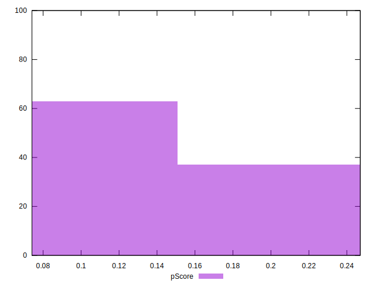
## Score Difference


```yaml
p90min: 0
p90max: 0
p90range: 0
p90mean: 0
median: 0
p90stdev: 0
mad: 0
stdevBySn: 0
lfitCenter: 0
lfitStdev: 0
mfitCenter: 0
mfitStdev: 0
mfitConfidence: 0
p90skewness: .nan
p90eccentricity: .nan
p90discretization: 94
outlandishness: .nan

```


## P Score Difference


```yaml
p90min: -0.004705882352941171
p90max: 0.004705882352941143
p90range: 0.009411764705882314
p90mean: -0.00013141426783480403
median: -0.0005882352941176394
p90stdev: 0.0026683944159144697
mad: 0.0023529411764705854
stdevBySn: 0.0028061176470588534
lfitCenter: -0.00018898356632957846
lfitStdev: 0.002389759216247365
mfitCenter: -0.00018898356632957846
mfitStdev: 0.0029951190135166484
mfitConfidence: 0.00029951190135166483
p90skewness: 0.18444786046249764
p90eccentricity: 1.0000000000000007
p90discretization: 2.764705882352941
outlandishness: 0.8836000000000197

```

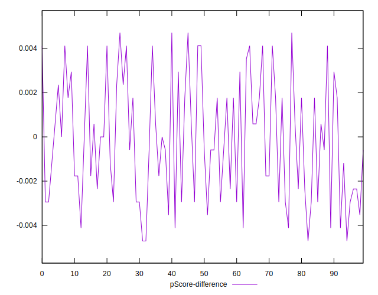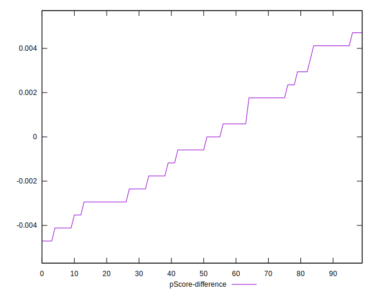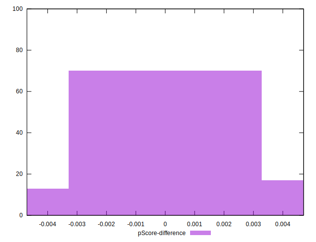