# //unused-javascript/samples/card

[→ Parent](../..)


## Raw


```yaml
p90min: 0
p90max: 3180
p90range: 3180
p90mean: 2110.6382978723404
median: 2335
p90stdev: 1104.8556356169568
mad: 815
stdevBySn: 995.8210000000001
lfitCenter: 2211.1216512288934
lfitStdev: 952.1832256888724
mfitCenter: 2211.1216512288934
mfitStdev: 1193.3846992713738
mfitConfidence: 119.33846992713738
p90skewness: -0.8504007737935132
p90eccentricity: 1.0000000000000002
p90discretization: 3.1333333333333333
outlandishness: 0.9709917038282063

```

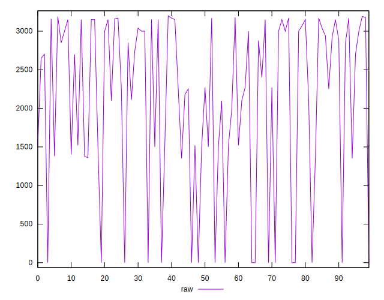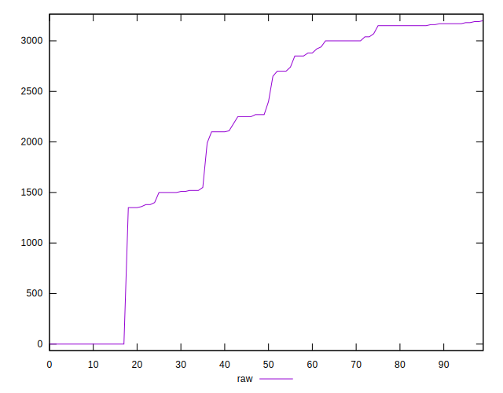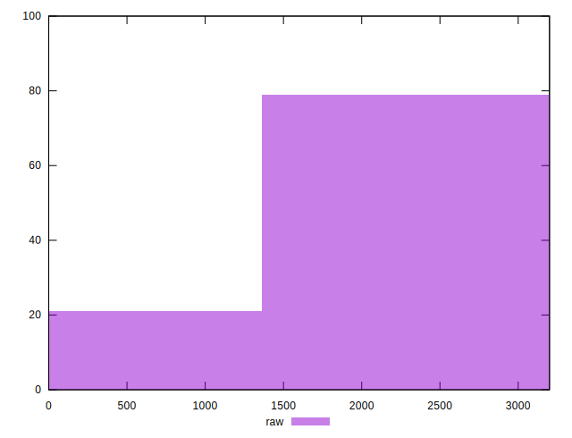
## Score


```yaml
p90min: 0.21
p90max: 1
p90range: 0.79
p90mean: 0.40638297872340423
median: 0.315
p90stdev: 0.26825619329698813
mad: 0.09499999999999999
stdevBySn: 0.11329700000000001
lfitCenter: 0.37243881074887475
lfitStdev: 0.18729306109122773
mfitCenter: 0.37243881074887475
mfitStdev: 0.23473704152293376
mfitConfidence: 0.023473704152293377
p90skewness: 1.591119913762154
p90eccentricity: 0.9999999999999999
p90discretization: 5.875
outlandishness: 1.0595091472547356

```

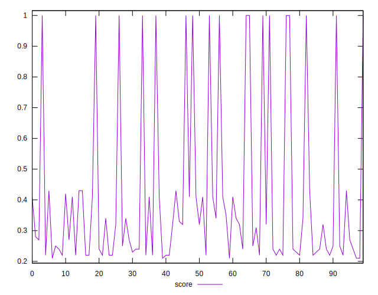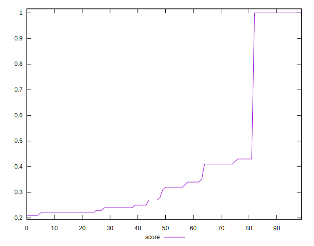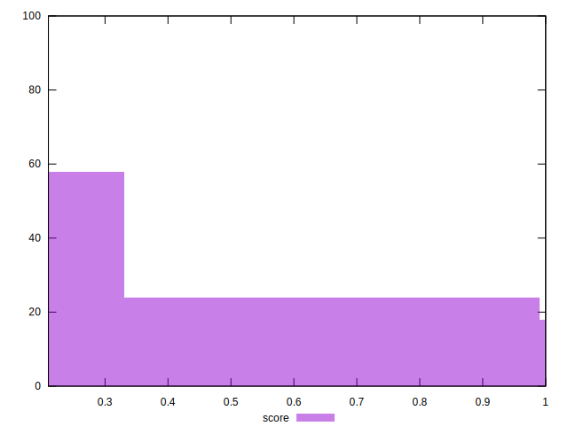
## Raw Estimate

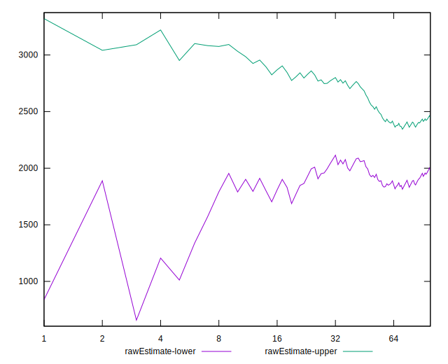
## Score Estimate

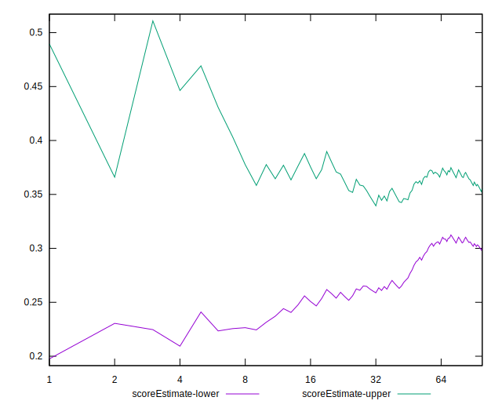
## P Score


```yaml
p90min: 0.21411764705882352
p90max: 1
p90range: 0.7858823529411765
p90mean: 0.4056320400500625
median: 0.3135294117647059
p90stdev: 0.26882255019583357
mad: 0.09588235294117647
stdevBySn: 0.11715541176470592
lfitCenter: 0.3720208556307542
lfitStdev: 0.18749165957141808
mfitCenter: 0.3720208556307542
mfitStdev: 0.23498594780605617
mfitConfidence: 0.023498594780605616
p90skewness: 1.5848551352972968
p90eccentricity: 1.0000000000000009
p90discretization: 3.1333333333333333
outlandishness: 1.060237801607204

```

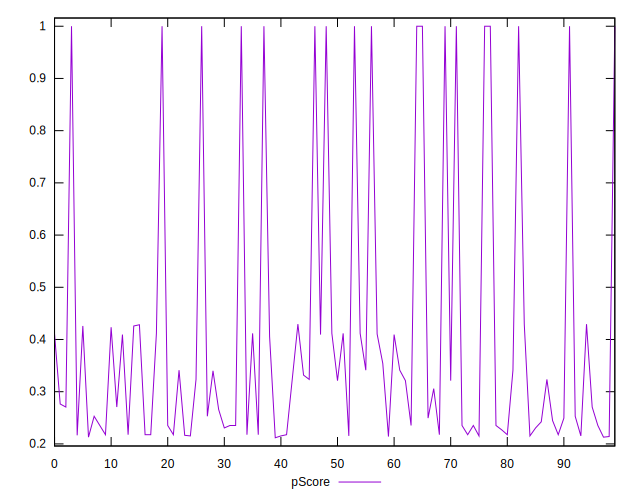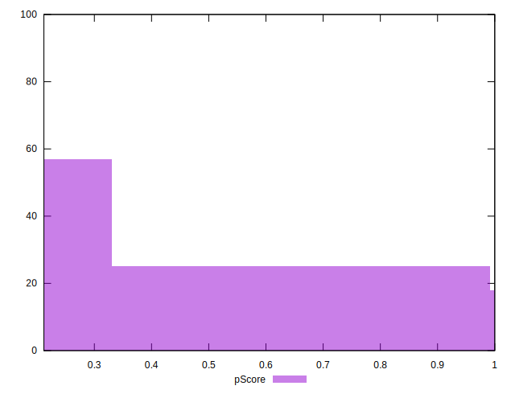
## Score Difference


```yaml
p90min: 0
p90max: 5.551115123125783e-17
p90range: 5.551115123125783e-17
p90mean: 5.3148974583119196e-18
median: 0
p90stdev: 1.63336444676199e-17
mad: 0
stdevBySn: 0
lfitCenter: 3.609715395414764e-18
lfitStdev: 8.459837768859159e-18
mfitCenter: 3.609715395414764e-18
mfitStdev: 1.0602834285775826e-17
mfitConfidence: 1.0602834285775825e-18
p90skewness: 2.7477857990363064
p90eccentricity: 1.0000000000000018
p90discretization: 47
outlandishness: 1.570844444444444

```

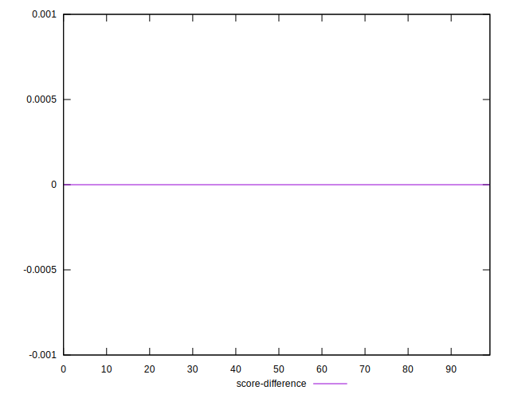
## P Score Difference


```yaml
p90min: -0.004705882352941199
p90max: 0.0041176470588235314
p90range: 0.00882352941176473
p90mean: -0.0006570713391739687
median: 0
p90stdev: 0.002505763632157931
mad: 0.0023529411764705854
stdevBySn: 0.0028061176470588205
lfitCenter: -0.0005553078817529497
lfitStdev: 0.00208637195730329
mfitCenter: -0.0005553078817529497
mfitStdev: 0.0026148794724180275
mfitConfidence: 0.00026148794724180276
p90skewness: -0.16846086380381883
p90eccentricity: 0.9999999999999997
p90discretization: 3.76
outlandishness: 0.9175815328798195

```

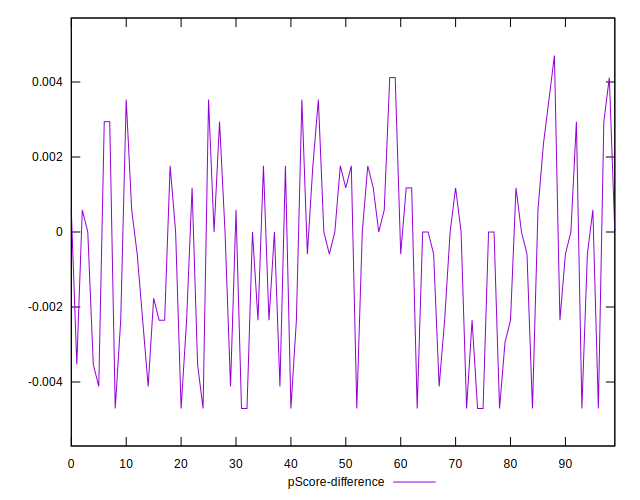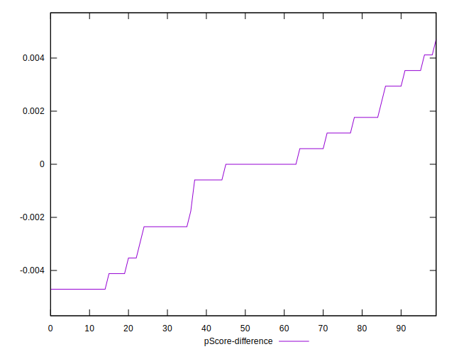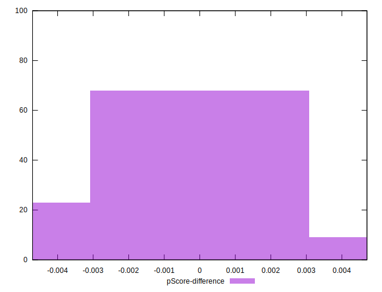