# //unused-javascript/samples/music

[→ Parent](../..)


## Raw


```yaml
p90min: 1960
p90max: 4530
p90range: 2570
p90mean: 3920.744680851064
median: 4350
p90stdev: 679.1863708154735
mad: 150
stdevBySn: 190.81600000000003
lfitCenter: 4000.801947296353
lfitStdev: 630.9974691769368
mfitCenter: 4000.801947296353
mfitStdev: 790.8380495255313
mfitConfidence: 79.08380495255314
p90skewness: -1.03128266640374
p90eccentricity: 0.9999999999999999
p90discretization: 2.186046511627907
outlandishness: 0.9725208145360452

```

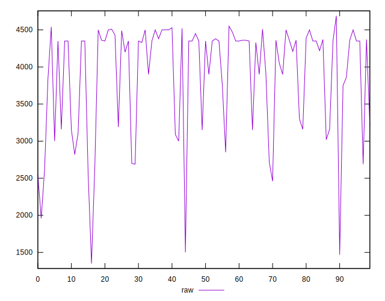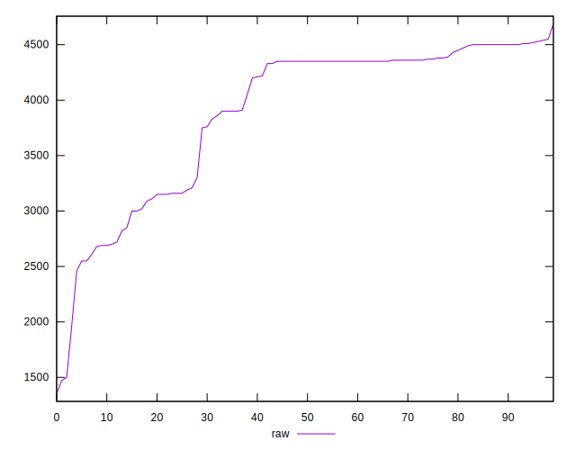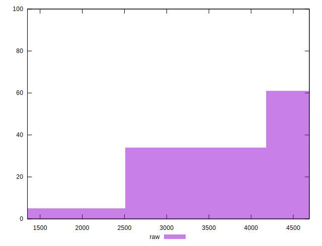
## Score


```yaml
p90min: 0.06
p90max: 0.36
p90range: 0.3
p90mean: 0.128404255319149
median: 0.08
p90stdev: 0.07937660290208469
mad: 0.020000000000000004
stdevBySn: 0.023852000000000005
lfitCenter: 0.11922226615057112
lfitStdev: 0.07353098303662776
mfitCenter: 0.11922226615057112
mfitStdev: 0.09215742066324452
mfitConfidence: 0.009215742066324452
p90skewness: 1.0354600443168227
p90eccentricity: 1.0000000000000004
p90discretization: 4.7
outlandishness: 1.1004653141128558

```

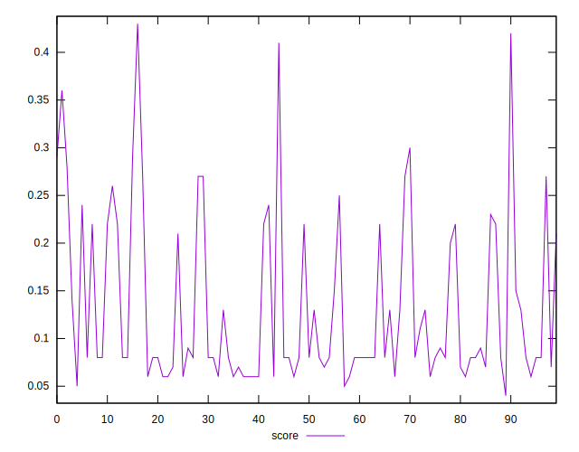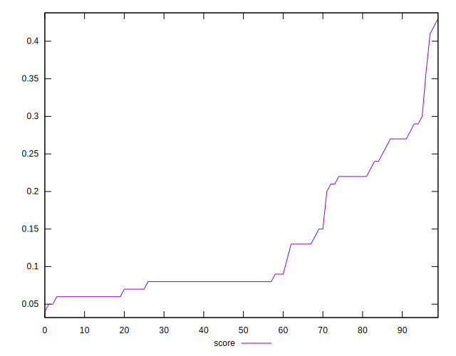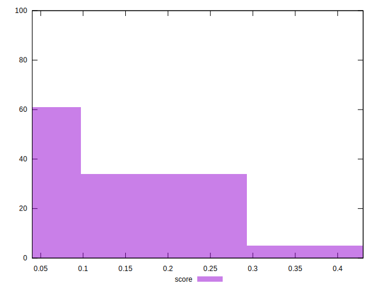
## Raw Estimate

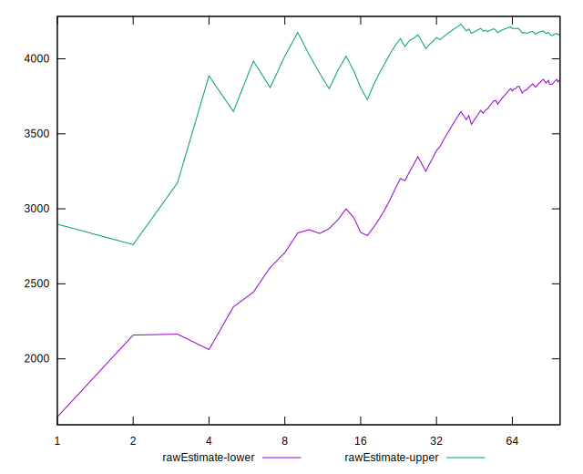
## Score Estimate

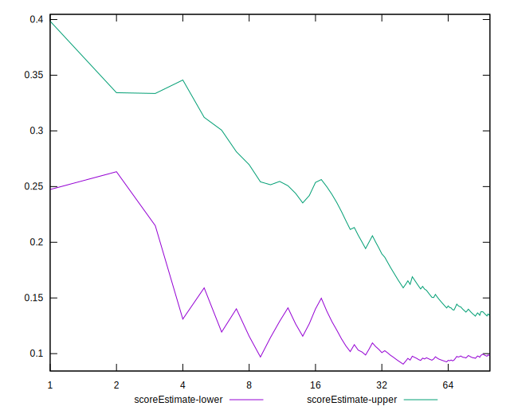
## P Score


```yaml
p90min: 0.05529411764705883
p90max: 0.35764705882352943
p90range: 0.3023529411764706
p90mean: 0.1269712140175219
median: 0.07647058823529412
p90stdev: 0.07990427891946747
mad: 0.017647058823529405
stdevBySn: 0.02244894117647063
lfitCenter: 0.11755271208278187
lfitStdev: 0.07423499637375718
mfitCenter: 0.11755271208278187
mfitStdev: 0.09303977053241534
mfitConfidence: 0.009303977053241534
p90skewness: 1.0312826664037424
p90eccentricity: 0.9999999999999997
p90discretization: 2.186046511627907
outlandishness: 1.1030486143137417

```

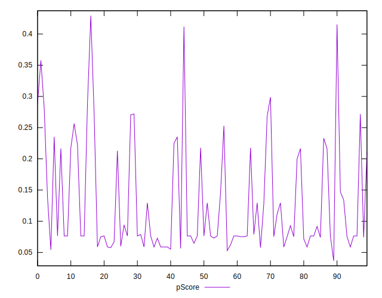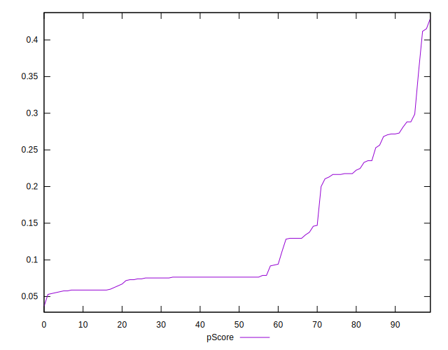
## Score Difference


```yaml
p90min: 0
p90max: 0
p90range: 0
p90mean: 0
median: 0
p90stdev: 0
mad: 0
stdevBySn: 0
lfitCenter: 2.583267684513104e-19
lfitStdev: 6.445158398659724e-19
mfitCenter: 2.583267684513104e-19
mfitStdev: 8.077808146406197e-19
mfitConfidence: 8.077808146406197e-20
p90skewness: .nan
p90eccentricity: .nan
p90discretization: 94
outlandishness: .inf

```

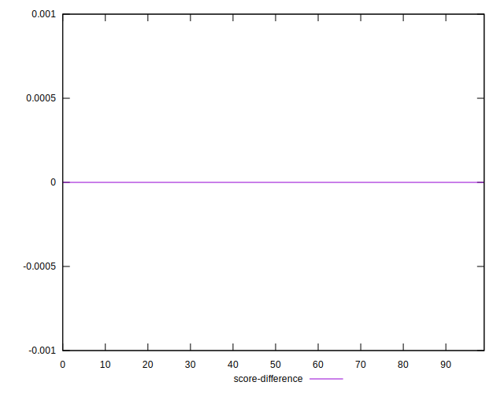
## P Score Difference


```yaml
p90min: -0.0047058823529412125
p90max: 0.004117647058823504
p90range: 0.008823529411764716
p90mean: -0.001426783479349193
median: -0.0020588235294117796
p90stdev: 0.0025704952422328613
mad: 0.0014705882352940985
stdevBySn: 0.002806117647058837
lfitCenter: -0.0016140796309884109
lfitStdev: 0.0022201684525804256
mfitCenter: -0.0016140796309884109
mfitStdev: 0.002782568511640864
mfitConfidence: 0.00027825685116408637
p90skewness: 0.695673513015169
p90eccentricity: 1.0000000000000002
p90discretization: 2.764705882352941
outlandishness: 0.8913678747306881

```

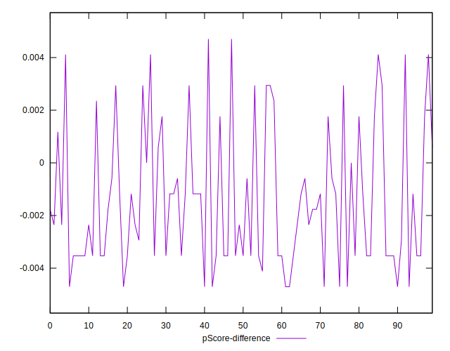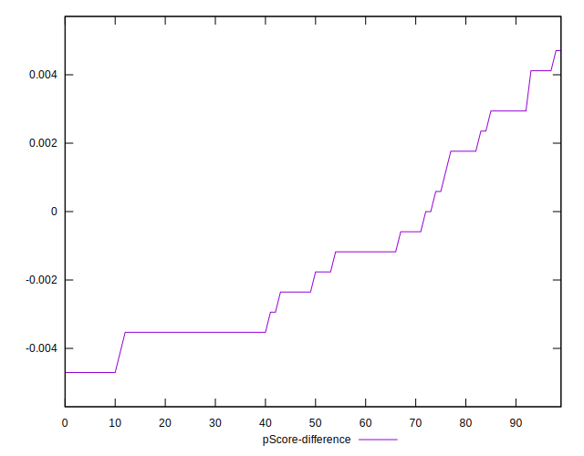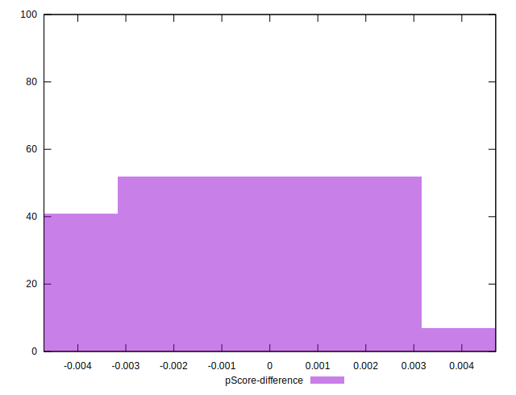