# //uses-http2/samples/agenda

[→ Parent](../..)


## Raw


```yaml
p90min: 800
p90max: 2160
p90range: 1360
p90mean: 1298.936170212766
median: 1230
p90stdev: 339.8981952876491
mad: 240
stdevBySn: 393.55800000000005
lfitCenter: 1286.3280134723973
lfitStdev: 296.3181881354478
mfitCenter: 1286.3280134723973
mfitStdev: 371.379774707569
mfitConfidence: 37.1379774707569
p90skewness: 0.6364397163401824
p90eccentricity: 0.9999999999999996
p90discretization: 1.540983606557377
outlandishness: 1.0253544475393415

```

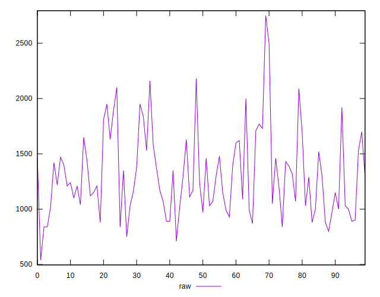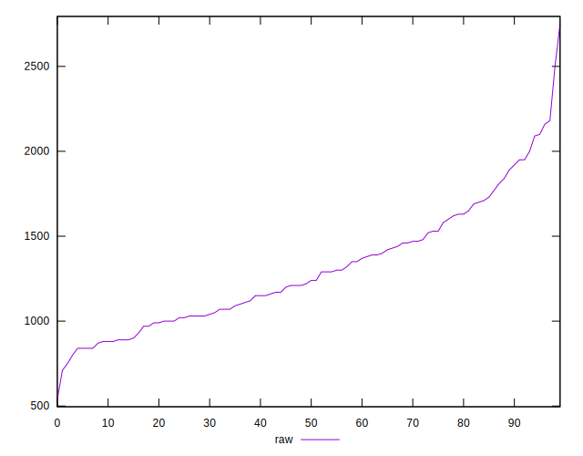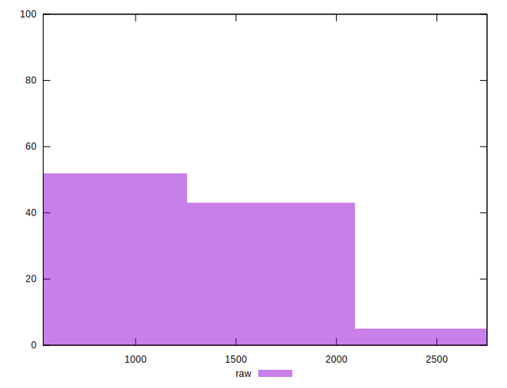
## Score


```yaml
p90min: 0.33
p90max: 0.49
p90range: 0.15999999999999998
p90mean: 0.4354255319148933
median: 0.44
p90stdev: 0.039777703944547195
mad: 0.02999999999999997
stdevBySn: 0.04770399999999998
lfitCenter: 0.4376062732436575
lfitStdev: 0.03524886533597891
mfitCenter: 0.4376062732436575
mfitStdev: 0.04417790129436633
mfitConfidence: 0.004417790129436633
p90skewness: -0.7063384093273182
p90eccentricity: 0.9999999999999997
p90discretization: 5.529411764705882
outlandishness: 0.9957533575734799

```

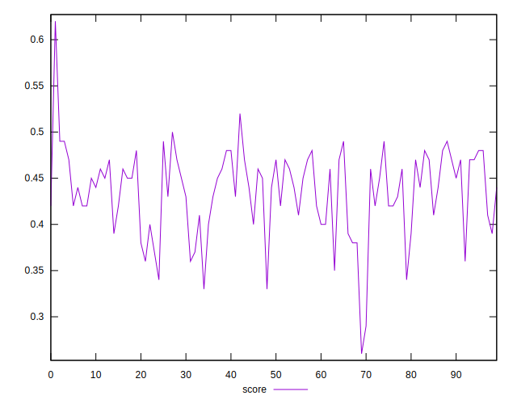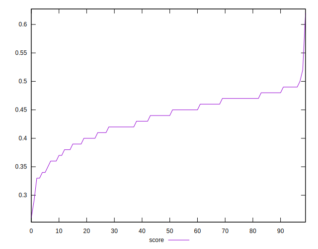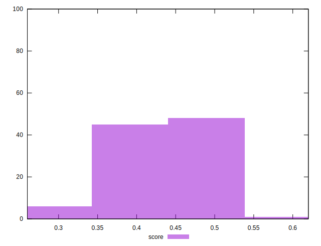
## Raw Estimate

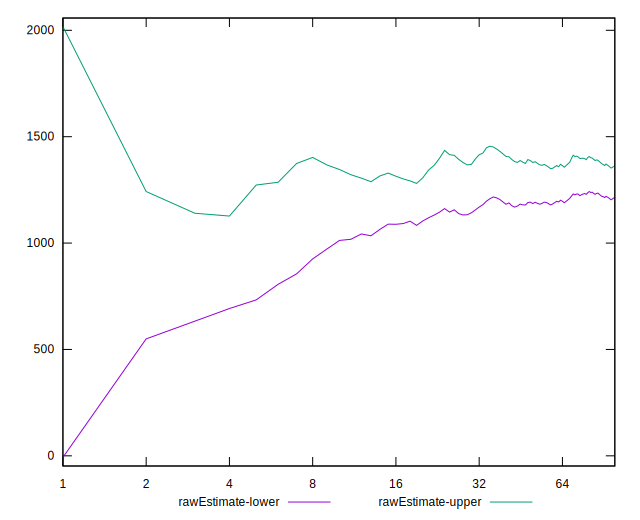
## Score Estimate

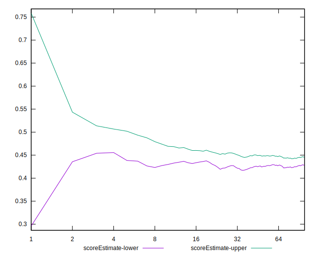
## P Score


```yaml
p90min: 0.3341176470588235
p90max: 0.49411764705882355
p90range: 0.16000000000000003
p90mean: 0.43541927409261577
median: 0.4435294117647059
p90stdev: 0.039988022975017544
mad: 0.028235294117647025
stdevBySn: 0.047002470588235284
lfitCenter: 0.437414219519505
lfitStdev: 0.03545674554688137
mfitCenter: 0.437414219519505
mfitStdev: 0.04443844050182068
mfitConfidence: 0.0044438440501820674
p90skewness: -0.6364397163401956
p90eccentricity: 1
p90discretization: 1.540983606557377
outlandishness: 0.996189450297513

```

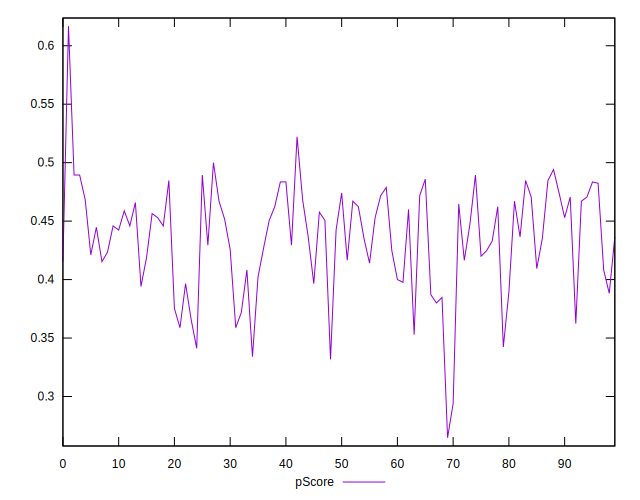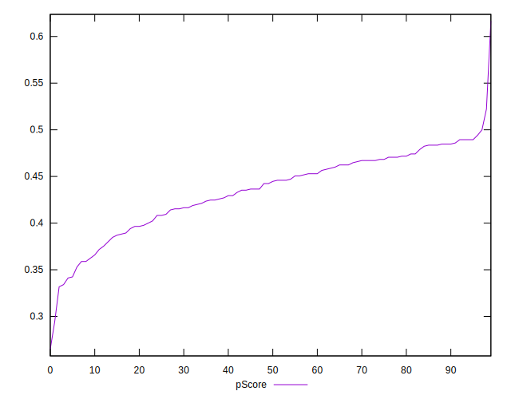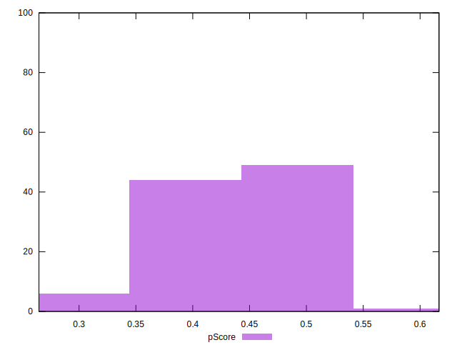
## Score Difference


```yaml
p90min: 0
p90max: 5.551115123125783e-17
p90range: 5.551115123125783e-17
p90mean: 9.448706592554524e-18
median: 0
p90stdev: 2.0862179280384276e-17
mad: 0
stdevBySn: 0
lfitCenter: 6.345981946454312e-18
lfitStdev: 1.4088542667134215e-17
mfitCenter: 6.345981946454312e-18
mfitStdev: 1.765736971665953e-17
mfitConfidence: 1.765736971665953e-18
p90skewness: 1.7550294029241162
p90eccentricity: 0.999999999999997
p90discretization: 47
outlandishness: 1.2460140625

```

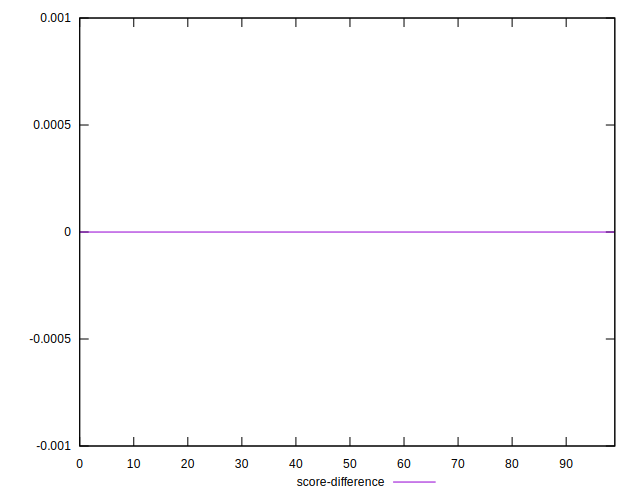
## P Score Difference


```yaml
p90min: -0.004705882352941171
p90max: 0.004705882352941171
p90range: 0.009411764705882342
p90mean: 0.00009456264775414009
median: 0
p90stdev: 0.0028976462729104224
mad: 0.002941176470588225
stdevBySn: 0.0035076470588235173
lfitCenter: 0.00008686654476125953
lfitStdev: 0.0026307505973657114
mfitCenter: 0.00008686654476125953
mfitStdev: 0.003297156918747383
mfitConfidence: 0.00032971569187473834
p90skewness: 0.011260898554096307
p90eccentricity: 1.0000000000000002
p90discretization: 3.4814814814814814
outlandishness: 0.8836000000000002

```

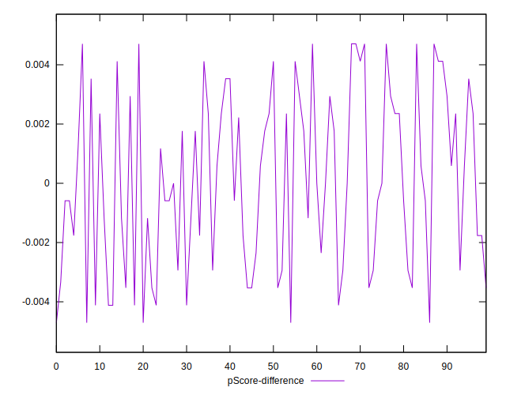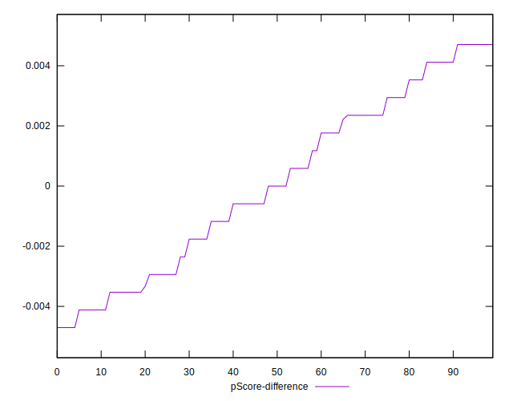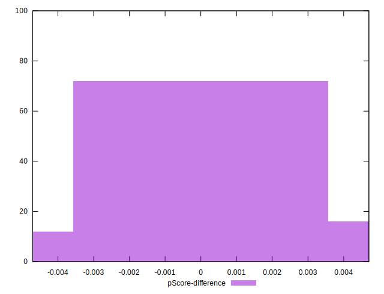