# //uses-http2/samples/astro

[→ Parent](../..)


## Raw


```yaml
p90min: 0
p90max: 1110
p90range: 1110
p90mean: 262.8723404255319
median: 0
p90stdev: 341.59706991003037
mad: 0
stdevBySn: 0
lfitCenter: 219.1958120088142
lfitStdev: 340.37648908437353
mfitCenter: 219.1958120088142
mfitStdev: 426.5986662085221
mfitConfidence: 42.65986662085221
p90skewness: 0.8808105396117341
p90eccentricity: 1
p90discretization: 2.9375
outlandishness: 1.1812197429313995

```

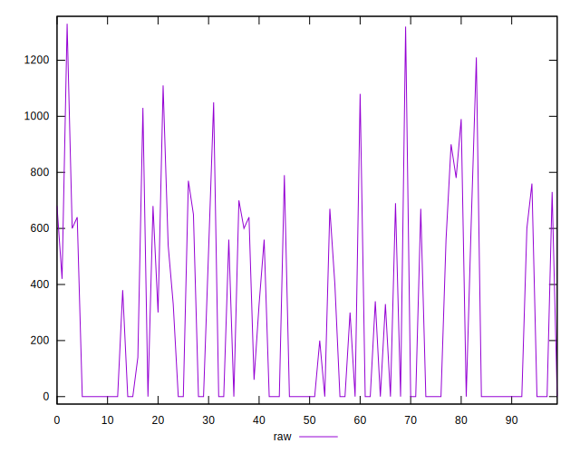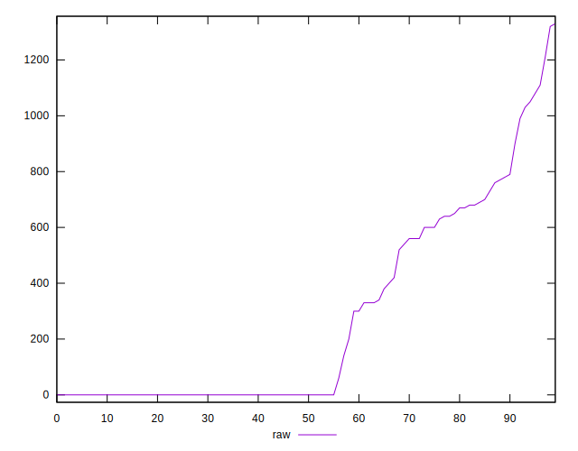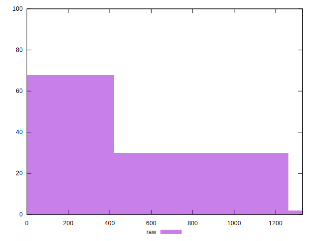
## Score


```yaml
p90min: 0.46
p90max: 1
p90range: 0.54
p90mean: 0.8272340425531914
median: 1
p90stdev: 0.21155656280682128
mad: 0
stdevBySn: 0
lfitCenter: 0.8545234669724169
lfitStdev: 0.22400950419938676
mfitCenter: 0.8545234669724169
mfitStdev: 0.28075427878863424
mfitConfidence: 0.028075427878863423
p90skewness: -0.5669887937935739
p90eccentricity: 0.9999999999999988
p90discretization: 4.2727272727272725
outlandishness: 0.9842650637672209

```

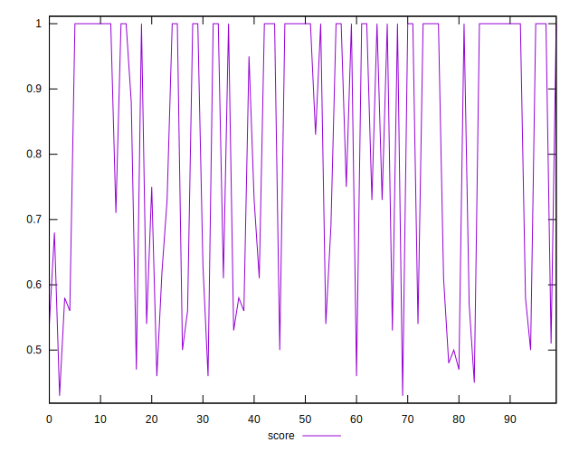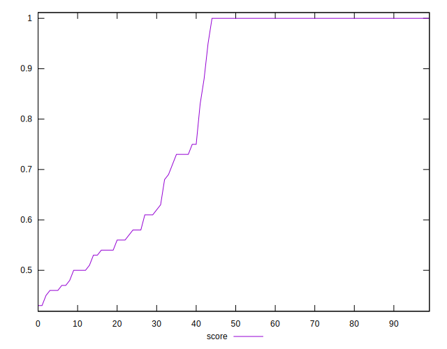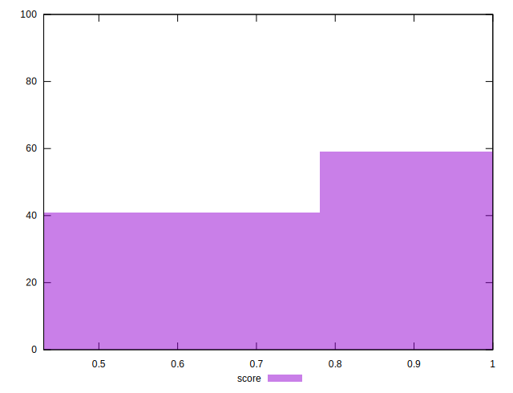
## Raw Estimate

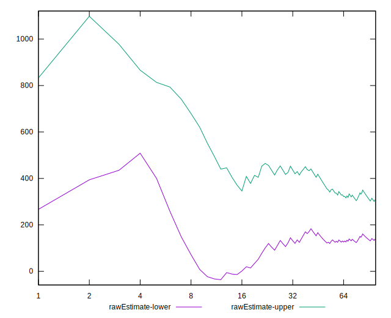
## Score Estimate

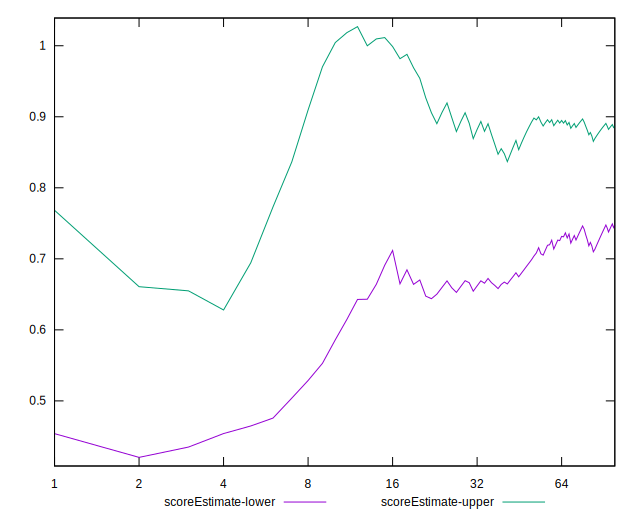
## P Score


```yaml
p90min: 0.4576470588235294
p90max: 1
p90range: 0.5423529411764706
p90mean: 0.8272889723265191
median: 1
p90stdev: 0.2116376558090006
mad: 0
stdevBySn: 0
lfitCenter: 0.8546391127802163
lfitStdev: 0.22395259107590076
mfitCenter: 0.8546391127802163
mfitStdev: 0.2806829487662987
mfitConfidence: 0.028068294876629866
p90skewness: -0.5685633127551185
p90eccentricity: 1.0000000000000007
p90discretization: 2.9375
outlandishness: 0.9842723081195001

```

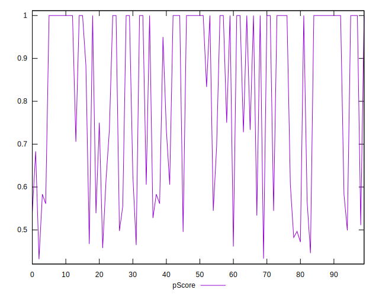
## Score Difference


```yaml
p90min: 0
p90max: 1.1102230246251565e-16
p90range: 1.1102230246251565e-16
p90mean: 2.362176648138631e-18
median: 0
p90stdev: 1.3824284401286113e-17
mad: 0
stdevBySn: 0
lfitCenter: 2.7334485600035267e-18
lfitStdev: 6.64710080436374e-18
mfitCenter: 2.7334485600035267e-18
mfitStdev: 8.33090541865322e-18
mfitConfidence: 8.330905418653221e-19
p90skewness: 6.3702653091800805
p90eccentricity: 0.9999999999999988
p90discretization: 31.333333333333332
outlandishness: 5.522500000000001

```

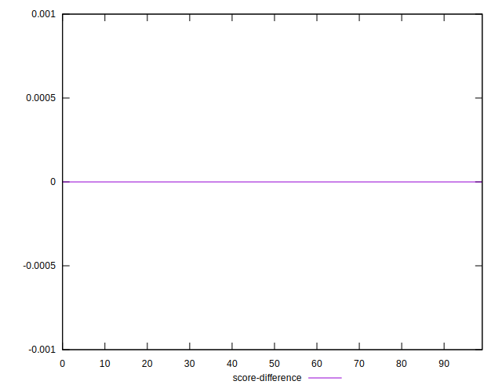
## P Score Difference


```yaml
p90min: -0.004444444444444362
p90max: 0.004444444444444473
p90range: 0.008888888888888835
p90mean: 0.0000611875956056178
median: 0
p90stdev: 0.0018021846782925689
mad: 0
stdevBySn: 0
lfitCenter: 0.00004772923861833695
lfitStdev: 0.0009403424444158298
mfitCenter: 0.00004772923861833695
mfitStdev: 0.001178544480690076
mfitConfidence: 0.0001178544480690076
p90skewness: -0.15033473661042263
p90eccentricity: 1.0000000000000009
p90discretization: 5.222222222222222
outlandishness: 0.8836000000000341

```

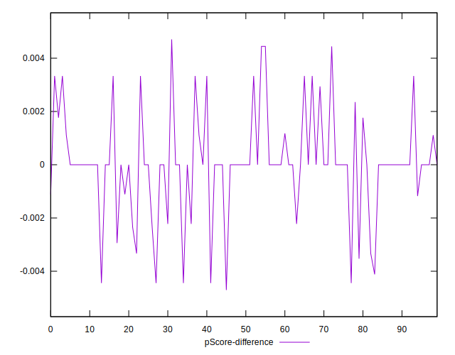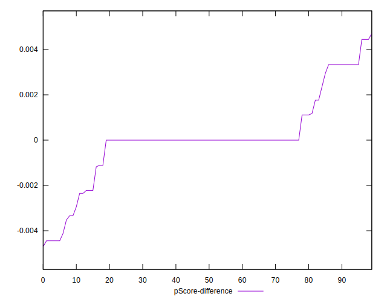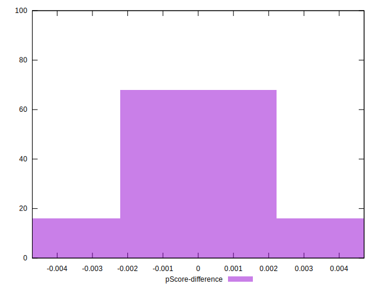