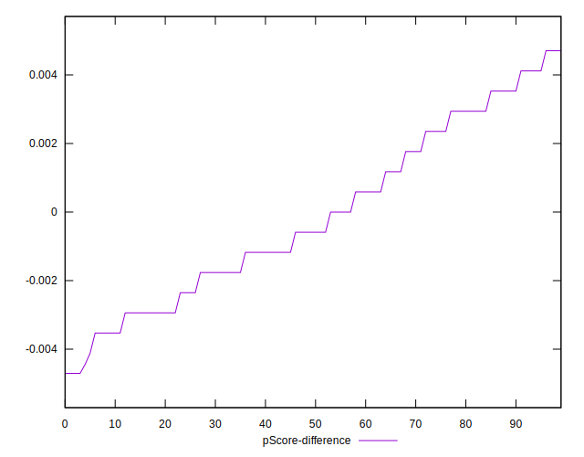

# //uses-http2/samples/card

[→ Parent](../..)


## Raw


```yaml
p90min: 920
p90max: 2310
p90range: 1390
p90mean: 1418.8297872340424
median: 1320
p90stdev: 347.73080925978553
mad: 270
stdevBySn: 363.74300000000005
lfitCenter: 1403.8923810227025
lfitStdev: 311.32995030816994
mfitCenter: 1403.8923810227025
mfitStdev: 390.1942284835916
mfitConfidence: 39.019422848359156
p90skewness: 0.671593765982307
p90eccentricity: 1
p90discretization: 1.4461538461538461
outlandishness: 1.0297783175293738

```


## Score


```yaml
p90min: 0.32
p90max: 0.48
p90range: 0.15999999999999998
p90mean: 0.42148936170212753
median: 0.43
p90stdev: 0.04099707947067073
mad: 0.03
stdevBySn: 0.04770399999999998
lfitCenter: 0.4232951572276493
lfitStdev: 0.036566212840715595
mfitCenter: 0.4232951572276493
mfitStdev: 0.04582895154747147
mfitConfidence: 0.004582895154747147
p90skewness: -0.674710824879176
p90eccentricity: 0.9999999999999992
p90discretization: 5.875
outlandishness: 0.9882226660595193

```


## Raw Estimate


## Score Estimate


## P Score


```yaml
p90min: 0.3164705882352941
p90max: 0.48
p90range: 0.16352941176470587
p90mean: 0.421314142678348
median: 0.4329411764705882
p90stdev: 0.04090950697173949
mad: 0.031764705882352945
stdevBySn: 0.043397388888888874
lfitCenter: 0.4230918631012915
lfitStdev: 0.03664822263343765
mfitCenter: 0.4230918631012915
mfitStdev: 0.045931735580191764
mfitConfidence: 0.004593173558019177
p90skewness: -0.6715937659823099
p90eccentricity: 0.9999999999999994
p90discretization: 1.4461538461538461
outlandishness: 0.9885295855307307

```


## Score Difference


```yaml
p90min: 0
p90max: 5.551115123125783e-17
p90range: 5.551115123125783e-17
p90mean: 9.448706592554524e-18
median: 0
p90stdev: 2.086217928038427e-17
mad: 0
stdevBySn: 0
lfitCenter: 6.345981946454312e-18
lfitStdev: 1.4088542667134215e-17
mfitCenter: 6.345981946454312e-18
mfitStdev: 1.765736971665953e-17
mfitConfidence: 1.765736971665953e-18
p90skewness: 1.7550294029241147
p90eccentricity: 0.9999999999999971
p90discretization: 47
outlandishness: 1.2460140625

```


## P Score Difference


```yaml
p90min: -0.004705882352941171
p90max: 0.004705882352941171
p90range: 0.009411764705882342
p90mean: -0.00011611736893339162
median: -0.0005882352941176394
p90stdev: 0.002510688013803533
mad: 0.0023529411764705854
stdevBySn: 0.0028061176470588534
lfitCenter: -0.00019671578090031775
lfitStdev: 0.002259542639113491
mfitCenter: -0.00019671578090031775
mfitStdev: 0.002831916736317709
mfitConfidence: 0.0002831916736317709
p90skewness: 0.19982424051790734
p90eccentricity: 1
p90discretization: 3.2413793103448274
outlandishness: 0.8835999999999999

```

