# //uses-http2/samples/music

[→ Parent](../..)


## Raw


```yaml
p90min: 190
p90max: 1580
p90range: 1390
p90mean: 750.3191489361702
median: 695
p90stdev: 316.5050237497821
mad: 230
stdevBySn: 333.92800000000005
lfitCenter: 738.5726778628692
lfitStdev: 258.25552541348856
mfitCenter: 738.5726778628692
mfitStdev: 323.6753013662635
mfitConfidence: 32.36753013662635
p90skewness: 0.6804428887193091
p90eccentricity: 1.0000000000000002
p90discretization: 1.5666666666666667
outlandishness: 1.0240820153998378

```

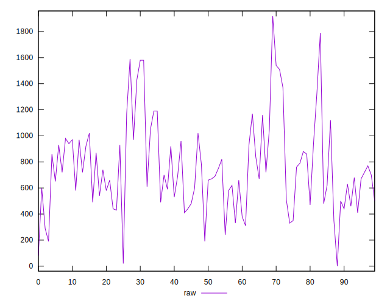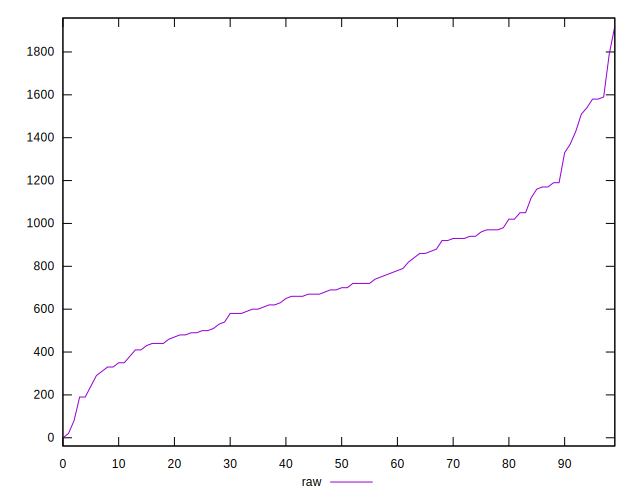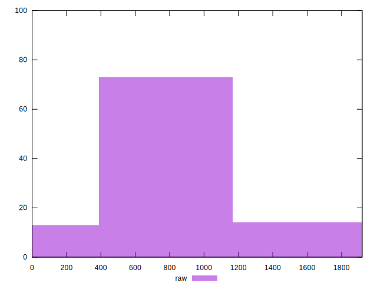
## Score


```yaml
p90min: 0.4
p90max: 0.84
p90range: 0.43999999999999995
p90mean: 0.555531914893617
median: 0.53
p90stdev: 0.10226807722714572
mad: 0.06000000000000005
stdevBySn: 0.10137100000000003
lfitCenter: 0.550936860231547
lfitStdev: 0.08987620638749935
mfitCenter: 0.550936860231547
mfitStdev: 0.1126431201870849
mfitConfidence: 0.01126431201870849
p90skewness: 0.782104118037751
p90eccentricity: 1.0000000000000002
p90discretization: 2.764705882352941
outlandishness: 1.0259726945672643

```

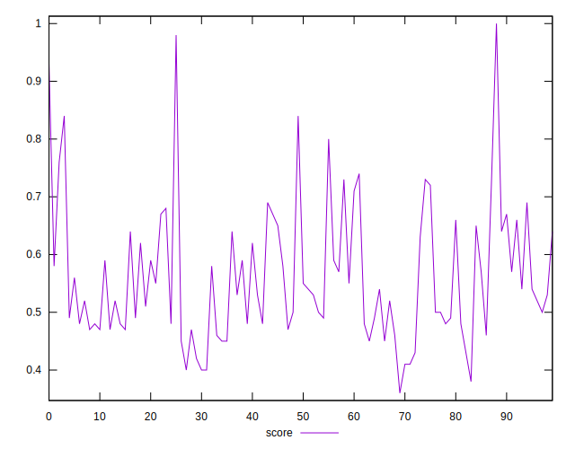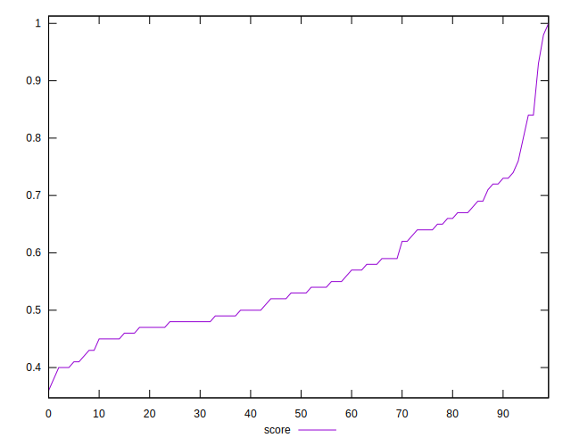
## Raw Estimate

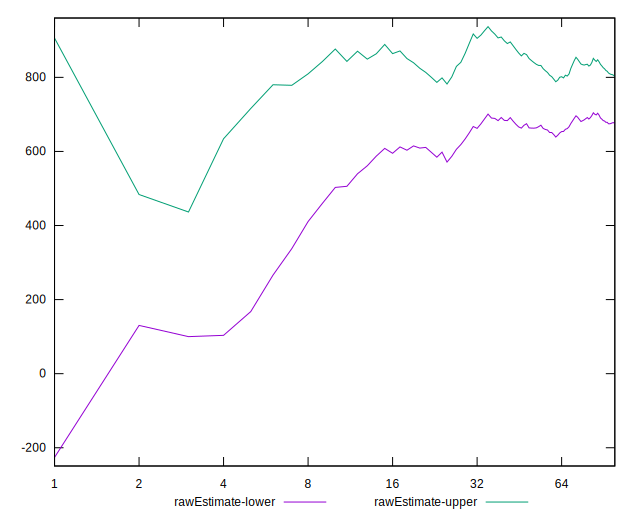
## Score Estimate

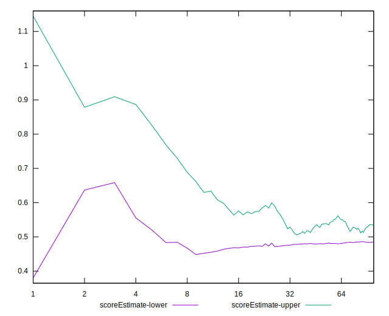
## P Score


```yaml
p90min: 0.4023529411764706
p90max: 0.8416666666666667
p90range: 0.4393137254901961
p90mean: 0.5557443331942707
median: 0.5305555555555556
p90stdev: 0.10275206300905038
mad: 0.06388888888888888
stdevBySn: 0.10312482352941175
lfitCenter: 0.551014500622713
lfitStdev: 0.09059239176787118
mfitCenter: 0.551014500622713
mfitStdev: 0.11354072545014679
mfitConfidence: 0.011354072545014679
p90skewness: 0.7842358753926879
p90eccentricity: 1.000000000000001
p90discretization: 1.5666666666666667
outlandishness: 1.0262021568272723

```

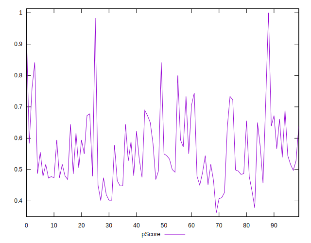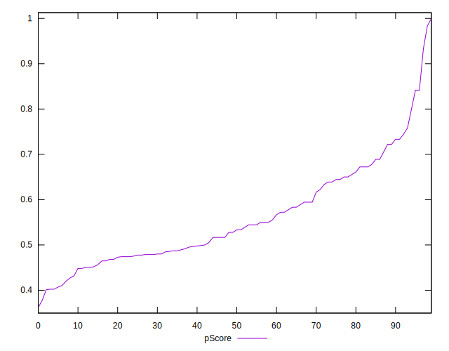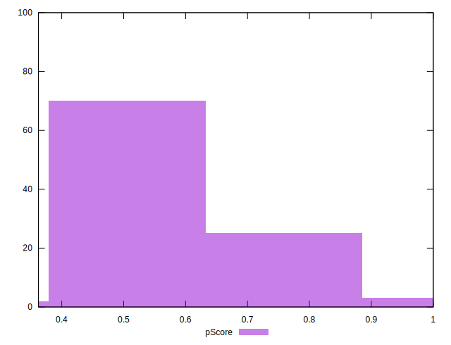
## Score Difference


```yaml
p90min: 0
p90max: 1.1102230246251565e-16
p90range: 1.1102230246251565e-16
p90mean: 7.086529944415892e-18
median: 0
p90stdev: 2.1778192623493224e-17
mad: 0
stdevBySn: 0
lfitCenter: 5.330777371245741e-18
lfitStdev: 1.2407129861437078e-17
mfitCenter: 5.330777371245741e-18
mfitStdev: 1.5550031274495495e-17
mfitConfidence: 1.5550031274495495e-18
p90skewness: 3.217589114057297
p90eccentricity: 0.9999999999999999
p90discretization: 31.333333333333332
outlandishness: 1.9881000000000004

```

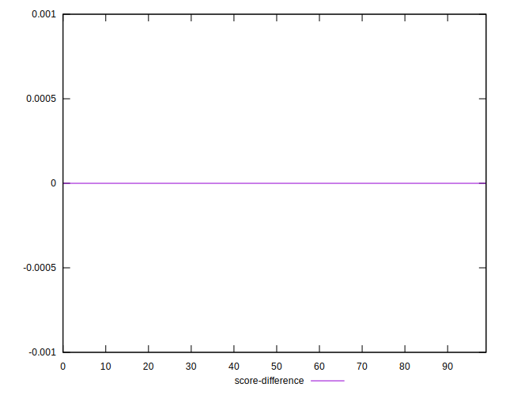
## P Score Difference


```yaml
p90min: -0.004444444444444473
p90max: 0.004444444444444473
p90range: 0.008888888888888946
p90mean: 0.00029307467667918447
median: 0
p90stdev: 0.0026831004656965624
mad: 0.0023529411764705577
stdevBySn: 0.0032348300653594593
lfitCenter: 0.0002675828708784748
lfitStdev: 0.0024397931080934613
mfitCenter: 0.0002675828708784748
mfitStdev: 0.0030578271975753753
mfitConfidence: 0.00030578271975753753
p90skewness: 0.019030500799035472
p90eccentricity: 1.0000000000000002
p90discretization: 3.032258064516129
outlandishness: 0.9004501569691904

```

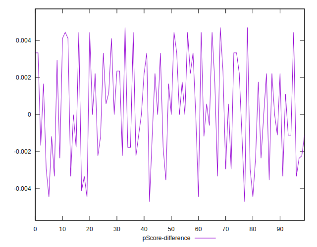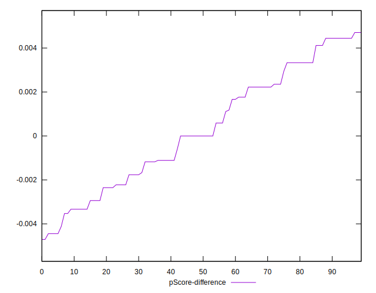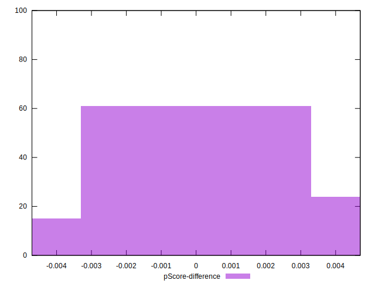