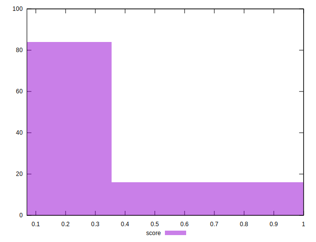

# //uses-long-cache-ttl/samples/agenda

[→ Parent](../..)


## Raw


```yaml
p90min: 0
p90max: 727464.8718055555
p90range: 727464.8718055555
p90mean: 580938.5581908838
median: 724652.303363889
p90stdev: 243689.77803384926
mad: 1679.4716159722302
stdevBySn: 3272.7814314896355
lfitCenter: 619561.6330744001
lfitStdev: 195801.55113149746
mfitCenter: 619561.6330744001
mfitStdev: 245400.85238834232
mfitConfidence: 24540.085238834232
p90skewness: -1.5420609051436527
p90eccentricity: 1.0000000000000004
p90discretization: 1.0561797752808988
outlandishness: 0.9556407185670227

```


## Score


```yaml
p90min: 0.07
p90max: 1
p90range: 0.9299999999999999
p90mean: 0.19946808510638314
median: 0.07
p90stdev: 0.28853395766550644
mad: 0
stdevBySn: 0
lfitCenter: 0.15916154655642956
lfitStdev: 0.17521922804883847
mfitCenter: 0.15916154655642956
mfitStdev: 0.21960473586409351
mfitConfidence: 0.021960473586409353
p90skewness: 2.133412497673086
p90eccentricity: 1.0000000000000013
p90discretization: 7.833333333333333
outlandishness: 1.2120424611840004

```


## Raw Estimate


## Score Estimate


## P Score


```yaml
p90min: 0.07421058996244889
p90max: 1
p90range: 0.9257894100375511
p90mean: 0.20216704821458392
median: 0.07467058490510628
p90stdev: 0.2868639135715807
mad: 0.0002756328556766663
stdevBySn: 0.0005367871720644113
lfitCenter: 0.16235179649050202
lfitStdev: 0.17406766809573612
mfitCenter: 0.16235179649050202
mfitStdev: 0.2181614694934517
mfitConfidence: 0.02181614694934517
p90skewness: 2.140877083687203
p90eccentricity: 1
p90discretization: 1.0561797752808988
outlandishness: 1.208687906641955

```


## Score Difference


```yaml
p90min: 0
p90max: 0
p90range: 0
p90mean: 0
median: 0
p90stdev: 0
mad: 0
stdevBySn: 0
lfitCenter: 5.166535369026208e-19
lfitStdev: 1.2890316797319448e-18
mfitCenter: 5.166535369026208e-19
mfitStdev: 1.6155616292812394e-18
mfitConfidence: 1.6155616292812395e-19
p90skewness: .nan
p90eccentricity: .nan
p90discretization: 94
outlandishness: .inf

```


## P Score Difference


```yaml
p90min: -0.004440179485538764
p90max: 0.004923028394585527
p90range: 0.009363207880124291
p90mean: 0.0028237931783471927
median: 0.004427543631388697
p90stdev: 0.002878552206839331
mad: 0.00021476001435741243
stdevBySn: 0.0003564456280175982
lfitCenter: 0.0032543727333024623
lfitStdev: 0.0024361687931831184
mfitCenter: 0.0032543727333024623
mfitStdev: 0.0030532847924555884
mfitConfidence: 0.0003053284792455588
p90skewness: -1.2954561144450722
p90eccentricity: 0.9999999999999996
p90discretization: 1.0930232558139534
outlandishness: 0.8894558656075748

```

