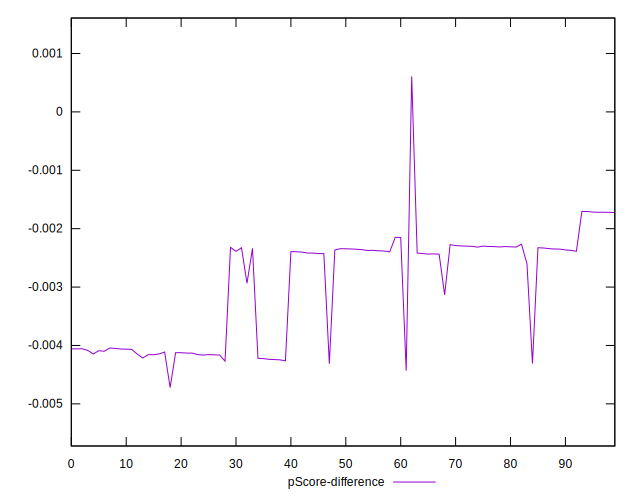

# //uses-long-cache-ttl/samples/astro

[→ Parent](../..)


## Raw


```yaml
p90min: 940514.8053527779
p90max: 970459.1997500001
p90range: 29944.394397222204
p90mean: 955214.9545598702
median: 948302.1170194446
p90stdev: 10466.330502381104
mad: 2562.504299999913
stdevBySn: 3857.1004915546037
lfitCenter: 954076.4208479957
lfitStdev: 11335.711934128878
mfitCenter: 954076.4208479957
mfitStdev: 14207.208037875653
mfitConfidence: 1420.7208037875653
p90skewness: 0.41314083717305183
p90eccentricity: 1.0000000000000002
p90discretization: 1
outlandishness: 0.9996419482320793

```


## Score


```yaml
p90min: 0.05
p90max: 0.05
p90range: 0
p90mean: 0.049999999999999906
median: 0.05
p90stdev: 9.71445146547012e-17
mad: 0
stdevBySn: 0
lfitCenter: 0.049999999999999906
lfitStdev: 0
mfitCenter: 0.049999999999999906
mfitStdev: 0
mfitConfidence: 0
p90skewness: 1
p90eccentricity: 1
p90discretization: 94
outlandishness: 1

```


## Raw Estimate


## Score Estimate


## P Score


```yaml
p90min: 0.045691110062163975
p90max: 0.048284184630876414
p90range: 0.002593074568712439
p90mean: 0.04699863003188907
median: 0.04759082307534085
p90stdev: 0.0009019388266773721
mad: 0.00022611295619168192
stdevBySn: 0.00034117492532063714
lfitCenter: 0.04709673764338764
lfitStdev: 0.000976733099663437
mfitCenter: 0.04709673764338764
mfitStdev: 0.0012241534034239704
mfitConfidence: 0.00012241534034239705
p90skewness: -0.40540063752639627
p90eccentricity: 1.0000000000000007
p90discretization: 1
outlandishness: 1.0007398038182553

```


## Score Difference


```yaml
p90min: 0
p90max: 0
p90range: 0
p90mean: 0
median: 0
p90stdev: 0
mad: 0
stdevBySn: 0
lfitCenter: 0
lfitStdev: 0
mfitCenter: 0
mfitStdev: 0
mfitConfidence: 0
p90skewness: .nan
p90eccentricity: .nan
p90discretization: 94
outlandishness: .nan

```


## P Score Difference


```yaml
p90min: -0.004308889937836027
p90max: -0.0017158153691235883
p90range: 0.002593074568712439
p90mean: -0.0030013699681109176
median: -0.002409176924659154
p90stdev: 0.0009019388266773724
mad: 0.00022611295619168192
stdevBySn: 0.00034117492532063714
lfitCenter: -0.0029032623566123666
lfitStdev: 0.0009767330996634381
mfitCenter: -0.0029032623566123666
mfitStdev: 0.0012241534034239717
mfitConfidence: 0.00012241534034239718
p90skewness: -0.40540063752628047
p90eccentricity: 0.9999999999999997
p90discretization: 1
outlandishness: 0.9884510485237413

```

