# //uses-long-cache-ttl/samples/card

[→ Parent](../..)


## Raw


```yaml
p90min: 0
p90max: 726599.5865277778
p90range: 726599.5865277778
p90mean: 572607.2308941048
median: 725646.9174826388
p90stdev: 249805.68319739174
mad: 1826.5850173611543
stdevBySn: 2199.7285354462038
lfitCenter: 612144.1478653165
lfitStdev: 202752.9272897608
mfitCenter: 612144.1478653165
mfitStdev: 254113.1104100583
mfitConfidence: 25411.31104100583
p90skewness: -1.478929709957059
p90eccentricity: 0.9999999999999999
p90discretization: 1.0681818181818181
outlandishness: 0.9567052793413394

```

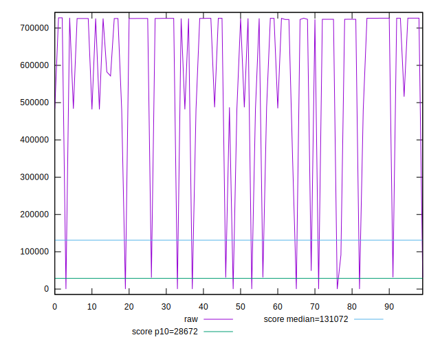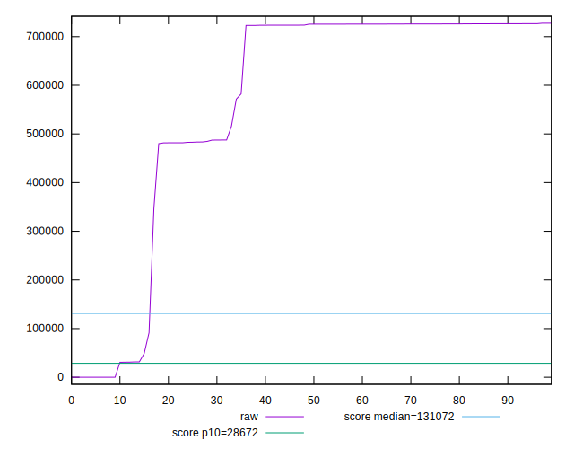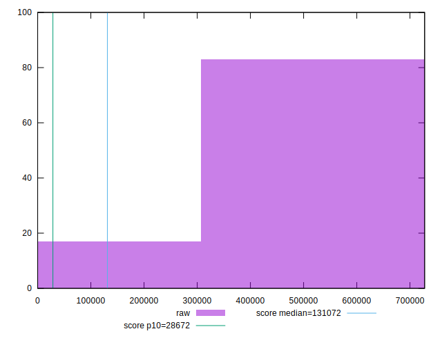
## Score


```yaml
p90min: 0.07
p90max: 1
p90range: 0.9299999999999999
p90mean: 0.2098936170212767
median: 0.07
p90stdev: 0.30050841557533464
mad: 0
stdevBySn: 0
lfitCenter: 0.16648530753574714
lfitStdev: 0.18860745091810546
mfitCenter: 0.16648530753574714
mfitStdev: 0.2363843848765609
mfitConfidence: 0.02363843848765609
p90skewness: 2.0033937581669794
p90eccentricity: 0.9999999999999988
p90discretization: 7.833333333333333
outlandishness: 1.1945060777670378

```

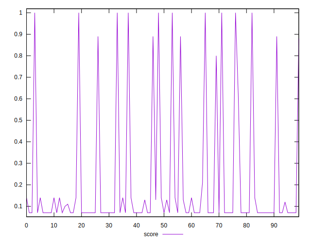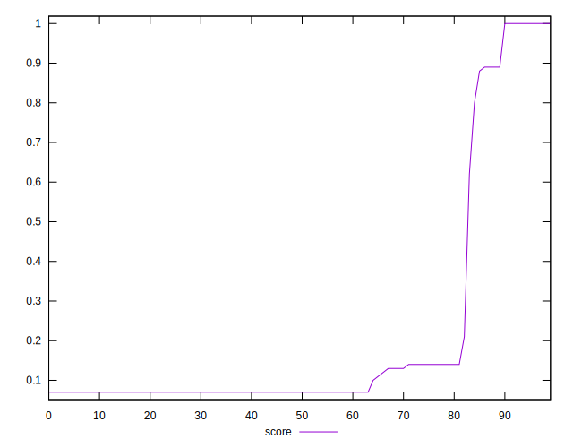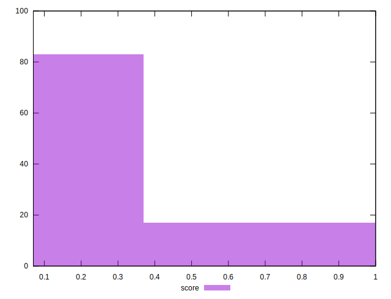
## Raw Estimate

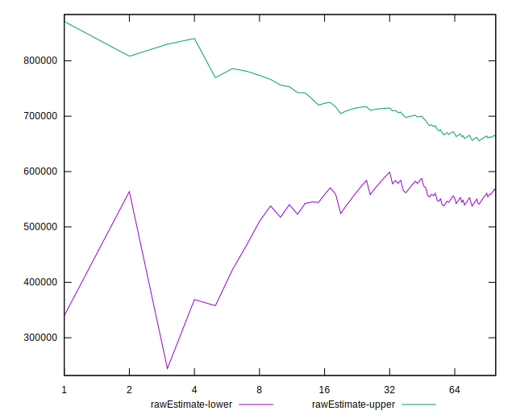
## Score Estimate

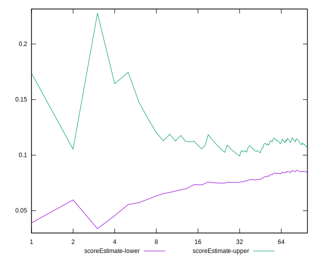
## P Score


```yaml
p90min: 0.07435161058344891
p90max: 1
p90range: 0.925648389416551
p90mean: 0.21246133284611585
median: 0.07450730402288913
p90stdev: 0.29902210307526095
mad: 0.00029811846702459954
stdevBySn: 0.00035900994995228744
lfitCenter: 0.16951000967176275
lfitStdev: 0.1875969550156661
mfitCenter: 0.16951000967176275
mfitStdev: 0.23511791607505989
mfitConfidence: 0.023511791607505987
p90skewness: 2.0099880144586413
p90eccentricity: 0.9999999999999997
p90discretization: 1.0681818181818181
outlandishness: 1.1917672624694122

```

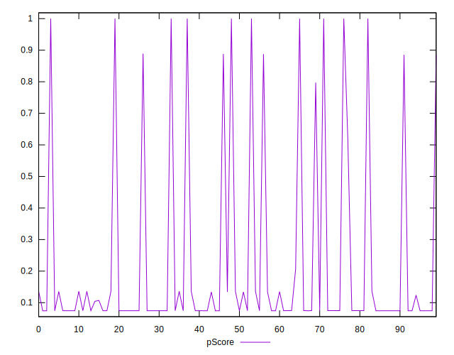
## Score Difference


```yaml
p90min: 0
p90max: 0
p90range: 0
p90mean: 0
median: 0
p90stdev: 0
mad: 0
stdevBySn: 0
lfitCenter: 0
lfitStdev: 0
mfitCenter: 0
mfitStdev: 0
mfitConfidence: 0
p90skewness: .nan
p90eccentricity: .nan
p90discretization: 94
outlandishness: .nan

```


## P Score Difference


```yaml
p90min: -0.004458313814314385
p90max: 0.00488273225002811
p90range: 0.009341046064342495
p90mean: 0.0026941909153283443
median: 0.004379032120386761
p90stdev: 0.0030139898133355074
mad: 0.0001640548487730764
stdevBySn: 0.00034862888357108996
lfitCenter: 0.003155805558623815
lfitStdev: 0.002535195877239085
mfitCenter: 0.003155805558623815
mfitStdev: 0.0031773968370049483
mfitConfidence: 0.0003177396837004948
p90skewness: -1.2960696144704709
p90eccentricity: 0.9999999999999996
p90discretization: 1.119047619047619
outlandishness: 0.8888040682312661

```

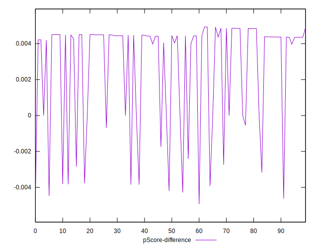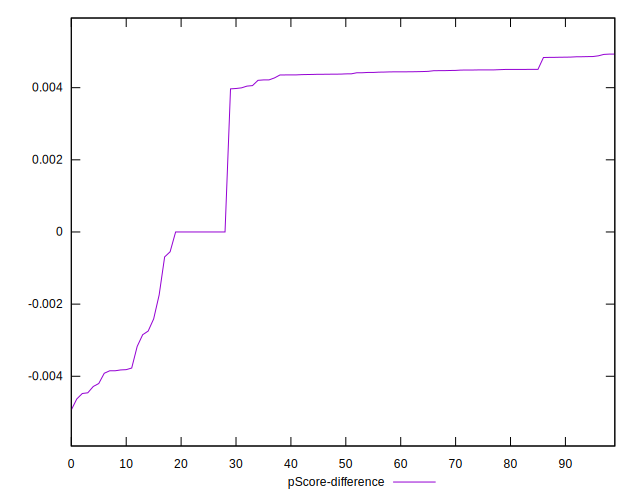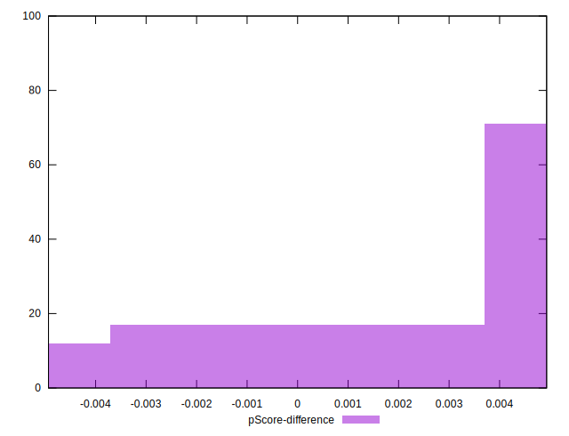