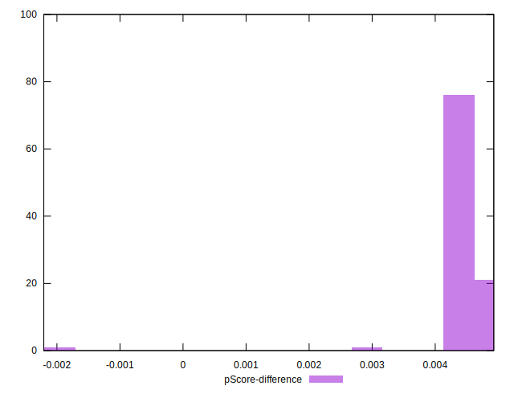

# //uses-long-cache-ttl/samples/music

[→ Parent](../..)


## Raw


```yaml
p90min: 723081.8405333334
p90max: 727563.1516666666
p90range: 4481.311133333249
p90mean: 725577.3718594565
median: 725921.205625
p90stdev: 1242.0366403940911
mad: 381.2874826389598
stdevBySn: 776.4475304444895
lfitCenter: 721186.893154233
lfitStdev: 11199.561153870874
mfitCenter: 721186.893154233
mfitStdev: 14036.568340000054
mfitConfidence: 1403.6568340000053
p90skewness: -0.8269711081904845
p90eccentricity: 1.0000000000000002
p90discretization: 1
outlandishness: 0.9740518594293313

```


## Score


```yaml
p90min: 0.07
p90max: 0.07
p90range: 0
p90mean: 0.07000000000000008
median: 0.07
p90stdev: 6.938893903907228e-17
mad: 0
stdevBySn: 0
lfitCenter: 0.07160853573812749
lfitStdev: 0.003974195657697121
mfitCenter: 0.07160853573812749
mfitStdev: 0.0049809156072616835
mfitConfidence: 0.0004980915607261684
p90skewness: -1
p90eccentricity: 1
p90discretization: 94
outlandishness: 1.0995020408163267

```


## Raw Estimate


## Score Estimate


## P Score


```yaml
p90min: 0.07419459624361646
p90max: 0.07492877176266938
p90range: 0.0007341755190529153
p90mean: 0.07451907381236787
median: 0.07446243155070553
p90stdev: 0.00020364403888983404
mad: 0.00006231361538905356
stdevBySn: 0.0001269476508498459
lfitCenter: 0.0760323562279119
lfitStdev: 0.0037967850542639783
mfitCenter: 0.0760323562279119
mfitStdev: 0.004758564389645513
mfitConfidence: 0.00047585643896455126
p90skewness: 0.8322044355688376
p90eccentricity: 0.9999999999999997
p90discretization: 1
outlandishness: 1.088861950584288

```


## Score Difference


```yaml
p90min: 0
p90max: 0
p90range: 0
p90mean: 0
median: 0
p90stdev: 0
mad: 0
stdevBySn: 0
lfitCenter: 0
lfitStdev: 0
mfitCenter: 0
mfitStdev: 0
mfitConfidence: 0
p90skewness: .nan
p90eccentricity: .nan
p90discretization: 94
outlandishness: .nan

```


## P Score Difference


```yaml
p90min: 0.00418587445819002
p90max: 0.004923414793567615
p90range: 0.0007375403353775956
p90mean: 0.004495575410515732
median: 0.0044511952534391774
p90stdev: 0.0001976877590605
mad: 0.00006121082691928903
stdevBySn: 0.0001269476508498459
lfitCenter: 0.004416927754664078
lfitStdev: 0.00022186301778274382
mfitCenter: 0.004416927754664078
mfitStdev: 0.00027806405701439295
mfitConfidence: 0.000027806405701439296
p90skewness: 0.8417464099503333
p90eccentricity: 0.9999999999999999
p90discretization: 1
outlandishness: 0.940409618336422

```

