# //uses-rel-preconnect/samples/agenda

[→ Parent](../..)


## Raw


```yaml
p90min: 0
p90max: 330.762
p90range: 330.762
p90mean: 94.83829787234043
median: 0
p90stdev: 142.06591807220505
mad: 0
stdevBySn: 0
lfitCenter: 73.07645900066466
lfitStdev: 139.73975781170816
mfitCenter: 73.07645900066466
mfitStdev: 175.13781418668907
mfitConfidence: 17.513781418668906
p90skewness: 0.8329777734118534
p90eccentricity: 1.0000000000000013
p90discretization: 3.357142857142857
outlandishness: 1.1021290754895672

```

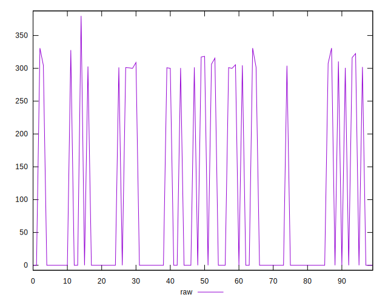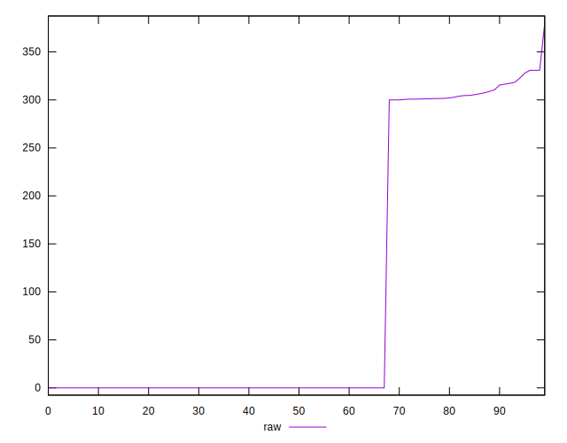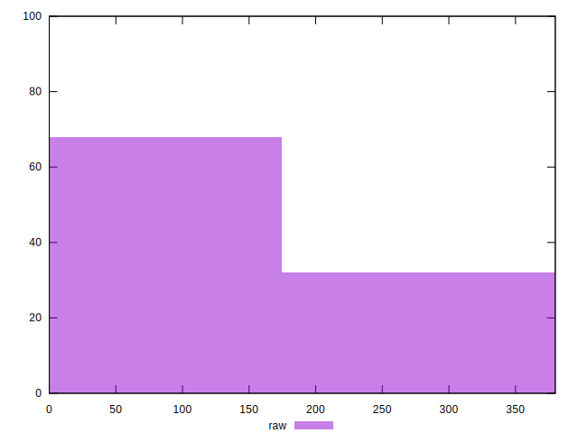
## Score


```yaml
p90min: 0.73
p90max: 1
p90range: 0.27
p90mean: 0.9218085106382978
median: 1
p90stdev: 0.11711026597038424
mad: 0
stdevBySn: 0
lfitCenter: 0.9397922961860684
lfitStdev: 0.11513160413644771
mfitCenter: 0.9397922961860684
mfitStdev: 0.1442960672612185
mfitConfidence: 0.01442960672612185
p90skewness: -0.8318985232819471
p90eccentricity: 1.0000000000000016
p90discretization: 23.5
outlandishness: 0.9921861261623507

```

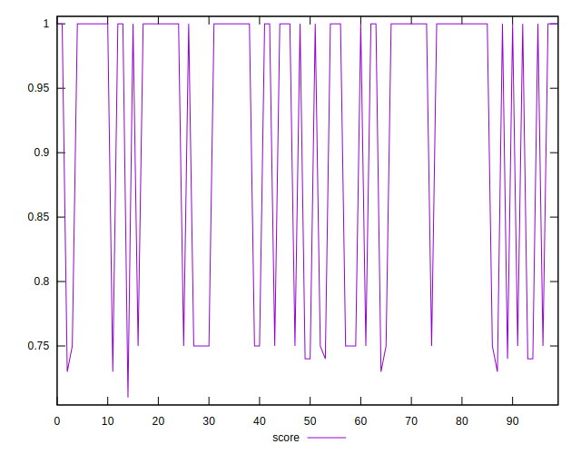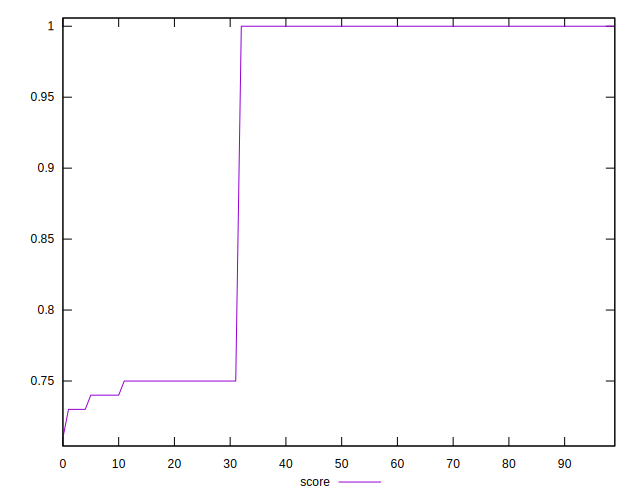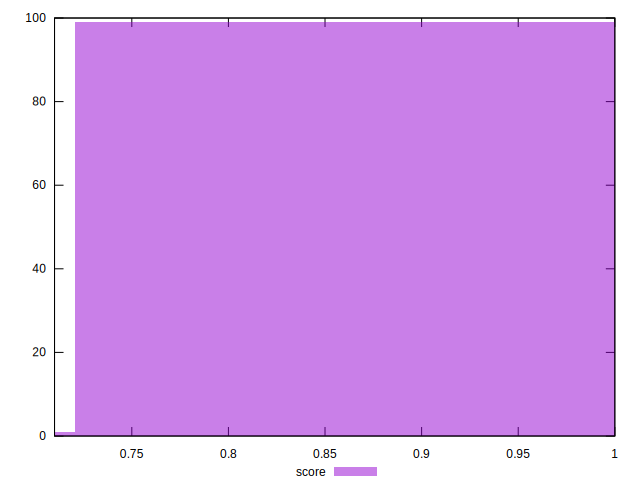
## Raw Estimate

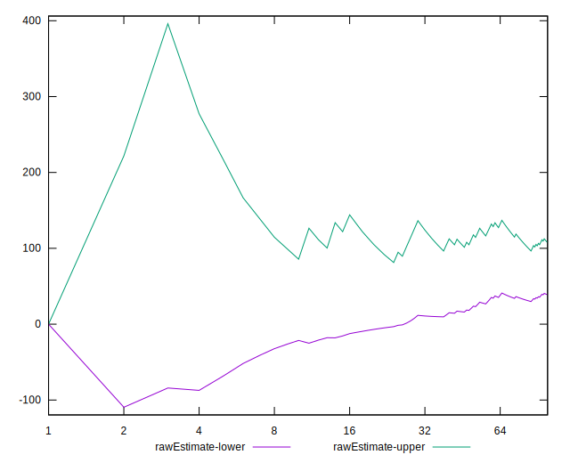
## Score Estimate

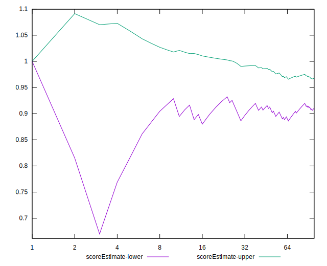
## P Score


```yaml
p90min: 0.73291
p90max: 1
p90range: 0.26709000000000005
p90mean: 0.9216028368794327
median: 1
p90stdev: 0.11740059275919594
mad: 0
stdevBySn: 0
lfitCenter: 0.9396414295950273
lfitStdev: 0.11542009732813033
mfitCenter: 0.9396414295950273
mfitStdev: 0.1446576398572374
mfitConfidence: 0.01446576398572374
p90skewness: -0.830881606669676
p90eccentricity: 1
p90discretization: 3.357142857142857
outlandishness: 0.992240532347238

```

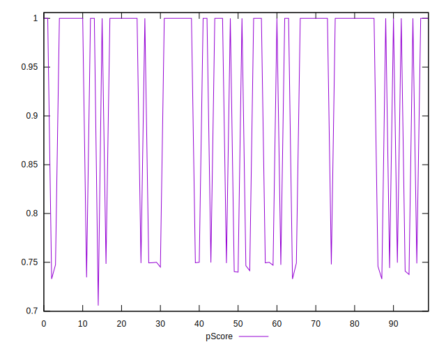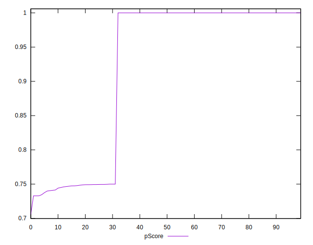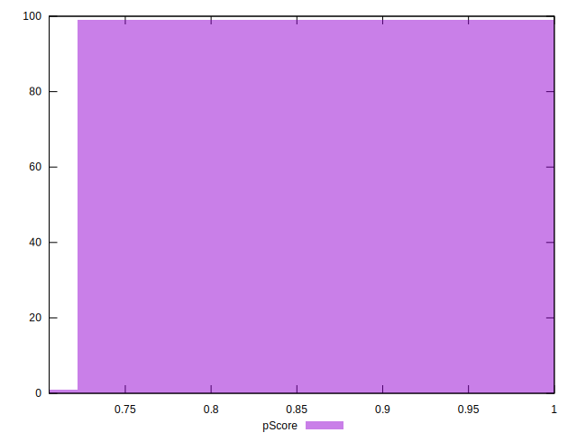
## Score Difference


```yaml
p90min: 0
p90max: 0
p90range: 0
p90mean: 0
median: 0
p90stdev: 0
mad: 0
stdevBySn: 0
lfitCenter: 0
lfitStdev: 0
mfitCenter: 0
mfitStdev: 0
mfitConfidence: 0
p90skewness: .nan
p90eccentricity: .nan
p90discretization: 94
outlandishness: .nan

```


## P Score Difference


```yaml
p90min: -0.003526666666666678
p90max: 0.0028677777777778024
p90range: 0.00639444444444448
p90mean: -0.00017186761229314457
median: 0
p90stdev: 0.0008616343596372767
mad: 0
stdevBySn: 0
lfitCenter: -0.00010698765068874819
lfitStdev: 0.0004820335420988638
mfitCenter: -0.00010698765068874819
mfitStdev: 0.0006041394535806832
mfitConfidence: 0.000060413945358068316
p90skewness: -0.8775682125078615
p90eccentricity: 1.0000000000000024
p90discretization: 3.9166666666666665
outlandishness: 1.0932212559026904

```

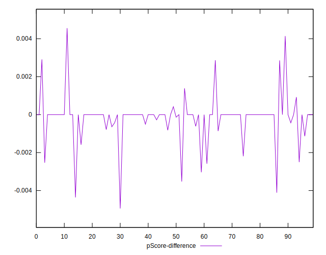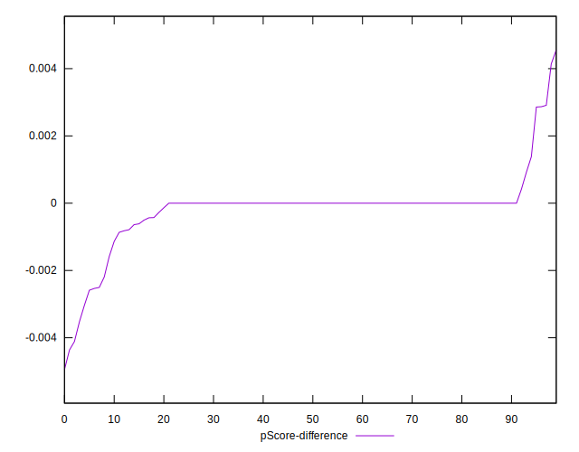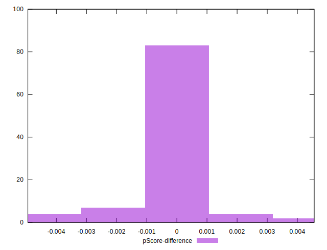