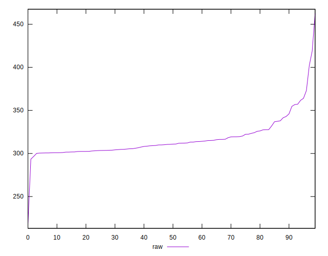

# //uses-rel-preconnect/samples/astro

[→ Parent](../..)


## Raw


```yaml
p90min: 300.13
p90max: 372.98199999999997
p90range: 72.85199999999998
p90mean: 315.402819140414
median: 310.711
p90stdev: 16.076758785976665
mad: 8.356000000000023
stdevBySn: 12.065534200000007
lfitCenter: 314.51166781193893
lfitStdev: 13.512371924565926
mfitCenter: 314.51166781193893
mfitStdev: 16.935246778764494
mfitConfidence: 1.6935246778764494
p90skewness: 1.6434078559213952
p90eccentricity: 1
p90discretization: 1
outlandishness: 1.012670020010966

```


## Score


```yaml
p90min: 0.71
p90max: 0.75
p90range: 0.040000000000000036
p90mean: 0.741595744680851
median: 0.74
p90stdev: 0.009487190859411306
mad: 0.010000000000000009
stdevBySn: 0.011926000000000011
lfitCenter: 0.7418143384834166
lfitStdev: 0.008795096024240537
mfitCenter: 0.7418143384834166
mfitStdev: 0.011023018197319844
mfitConfidence: 0.0011023018197319843
p90skewness: -1.2942320306523696
p90eccentricity: 1.0000000000000002
p90discretization: 18.8
outlandishness: 0.9975857366505221

```


## Raw Estimate


## Score Estimate


## P Score


```yaml
p90min: 0.7094544444444445
p90max: 0.7499277777777777
p90range: 0.04047333333333325
p90mean: 0.7414428782553253
median: 0.7440494444444444
p90stdev: 0.00893153265887593
mad: 0.00464222222222227
stdevBySn: 0.006900350491178068
lfitCenter: 0.742057322864985
lfitStdev: 0.007602253339236575
mfitCenter: 0.742057322864985
mfitStdev: 0.00952801159510666
mfitConfidence: 0.0009528011595106659
p90skewness: -1.6434078559214187
p90eccentricity: 1
p90discretization: 1
outlandishness: 0.9977056572283468

```


## Score Difference


```yaml
p90min: 0
p90max: 0
p90range: 0
p90mean: 0
median: 0
p90stdev: 0
mad: 0
stdevBySn: 0
lfitCenter: 1.0470608452365924e-18
lfitStdev: 2.5998395675404994e-18
mfitCenter: 1.0470608452365924e-18
mfitStdev: 3.2584156880294808e-18
mfitConfidence: 3.258415688029481e-19
p90skewness: .nan
p90eccentricity: .nan
p90discretization: 94
outlandishness: .inf

```


## P Score Difference


```yaml
p90min: -0.0045144444444443765
p90max: 0.004688888888888854
p90range: 0.00920333333333323
p90mean: -0.00012001773827464182
median: -0.0006422222222222107
p90stdev: 0.002566119834463273
mad: 0.0018938888888888616
stdevBySn: 0.0028052602222222623
lfitCenter: -0.0002537884839531937
lfitStdev: 0.0020987757171086327
mfitCenter: -0.0002537884839531937
mfitStdev: 0.002630425279953572
mfitConfidence: 0.0002630425279953572
p90skewness: 0.3793127573613248
p90eccentricity: 1.0000000000000002
p90discretization: 1
outlandishness: 0.8123453251123819

```

