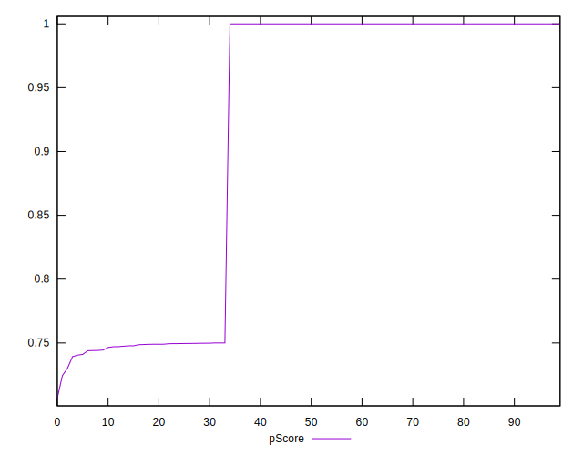

# //uses-rel-preconnect/samples/card

[→ Parent](../..)


## Raw


```yaml
p90min: 0
p90max: 319.27
p90range: 319.27
p90mean: 100.4550425531915
median: 0
p90stdev: 143.2394879837583
mad: 0
stdevBySn: 0
lfitCenter: 79.75387208324406
lfitStdev: 147.8441768209873
mfitCenter: 79.75387208324406
mfitStdev: 185.29519711596785
mfitConfidence: 18.529519711596784
p90skewness: 0.725616405039866
p90eccentricity: 1.000000000000002
p90discretization: 3.1333333333333333
outlandishness: 1.0931475387282443

```


## Score


```yaml
p90min: 0.74
p90max: 1
p90range: 0.26
p90mean: 0.9168085106382978
median: 1
p90stdev: 0.11861983586012892
mad: 0
stdevBySn: 0
lfitCenter: 0.9340746395132873
lfitStdev: 0.12220949777349582
mfitCenter: 0.9340746395132873
mfitStdev: 0.15316689142787251
mfitConfidence: 0.015316689142787252
p90skewness: -0.725426437936407
p90eccentricity: 0.9999999999999997
p90discretization: 31.333333333333332
outlandishness: 0.9925782221293238

```


## Raw Estimate


## Score Estimate


## P Score


```yaml
p90min: 0.7392944444444445
p90max: 1
p90range: 0.2607055555555555
p90mean: 0.9167093735224584
median: 1
p90stdev: 0.11874933114418336
mad: 0
stdevBySn: 0
lfitCenter: 0.9339874128478916
lfitStdev: 0.12237119468181432
mfitCenter: 0.9339874128478916
mfitStdev: 0.1533695484492322
mfitConfidence: 0.01533695484492322
p90skewness: -0.7247778124626141
p90eccentricity: 1.000000000000001
p90discretization: 3.1333333333333333
outlandishness: 0.9926124245617969

```


## Score Difference


```yaml
p90min: 0
p90max: 0
p90range: 0
p90mean: 0
median: 0
p90stdev: 0
mad: 0
stdevBySn: 0
lfitCenter: 0
lfitStdev: 0
mfitCenter: 0
mfitStdev: 0
mfitConfidence: 0
p90skewness: .nan
p90eccentricity: .nan
p90discretization: 94
outlandishness: .nan

```


## P Score Difference


```yaml
p90min: -0.002932222222222225
p90max: 0.004016666666666668
p90range: 0.006948888888888893
p90mean: -0.00011910165484633644
median: 0
p90stdev: 0.0008374741922968223
mad: 0
stdevBySn: 0
lfitCenter: -0.00005904049318743556
lfitStdev: 0.00040267897470217743
mfitCenter: -0.00005904049318743556
mfitStdev: 0.0005046832523017834
mfitConfidence: 0.000050468325230178345
p90skewness: 1.3589064911760893
p90eccentricity: 0.9999999999999997
p90discretization: 3.6153846153846154
outlandishness: 0.4860370251629303

```

