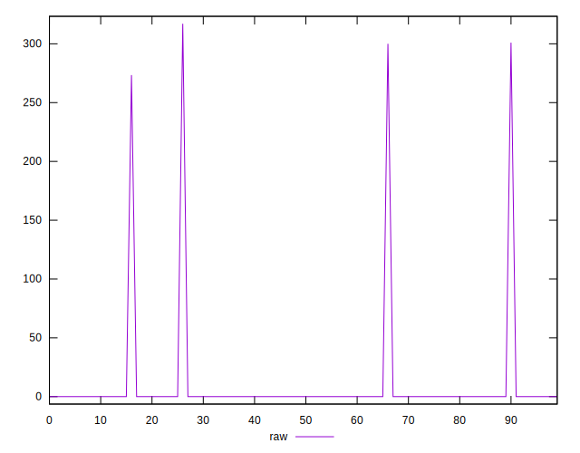
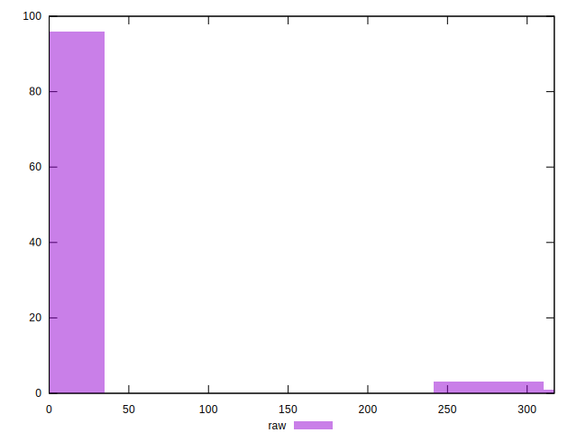

# //uses-rel-preconnect/samples/music

[→ Parent](../..)


## Raw


```yaml
p90min: 0
p90max: 273.4019994735718
p90range: 273.4019994735718
p90mean: 2.9085319092933166
median: 0
p90stdev: 28.048865960428778
mad: 0
stdevBySn: 0
lfitCenter: 5.762499828211764
lfitStdev: 14.16458735602242
mfitCenter: 5.762499828211764
mfitStdev: 17.75267760040678
mfitConfidence: 1.775267760040678
p90skewness: 9.539955591519899
p90eccentricity: 1.000000000000004
p90discretization: 47
outlandishness: 16.780239113721628

```


## Score


```yaml
p90min: 0.77
p90max: 1
p90range: 0.22999999999999998
p90mean: 0.9975531914893616
median: 1
p90stdev: 0.023596166755621064
mad: 0
stdevBySn: 0
lfitCenter: 0.9952105355186435
lfitStdev: 0.011772805215994993
mfitCenter: 0.9952105355186435
mfitStdev: 0.014755023227915318
mfitConfidence: 0.0014755023227915318
p90skewness: -9.539955591519877
p90eccentricity: 1.0000000000000029
p90discretization: 47
outlandishness: 0.9851128774001321

```


## Raw Estimate


## Score Estimate


## P Score


```yaml
p90min: 0.7721650004386902
p90max: 1
p90range: 0.22783499956130981
p90mean: 0.9975762234089223
median: 1
p90stdev: 0.023374054967023983
mad: 0
stdevBySn: 0
lfitCenter: 0.9952212708663775
lfitStdev: 0.011746417055420863
mfitCenter: 0.9952212708663775
mfitStdev: 0.01472195057317673
mfitConfidence: 0.0014721950573176729
p90skewness: -9.539955591519904
p90eccentricity: 1.0000000000000044
p90discretization: 47
outlandishness: 0.9851100277844033

```


## Score Difference


```yaml
p90min: 0
p90max: 0
p90range: 0
p90mean: 0
median: 0
p90stdev: 0
mad: 0
stdevBySn: 0
lfitCenter: 0
lfitStdev: 0
mfitCenter: 0
mfitStdev: 0
mfitConfidence: 0
p90skewness: .nan
p90eccentricity: .nan
p90discretization: 94
outlandishness: .nan

```


## P Score Difference


```yaml
p90min: 0
p90max: 0
p90range: 0
p90mean: 0
median: 0
p90stdev: 0
mad: 0
stdevBySn: 0
lfitCenter: 0.000010037568870520188
lfitStdev: 0.00003139067414768549
mfitCenter: 0.000010037568870520188
mfitStdev: 0.00003934237572874639
mfitConfidence: 0.000003934237572874639
p90skewness: .nan
p90eccentricity: .nan
p90discretization: 94
outlandishness: .inf

```

