# //uses-rel-preload/samples/agenda

[→ Parent](../..)


## Raw


```yaml
p90min: 1124
p90max: 1522
p90range: 398
p90mean: 1248.0531914893618
median: 1239.5
p90stdev: 86.58010274850716
mad: 69.5
stdevBySn: 98.38950000000001
lfitCenter: 1244.8066095549862
lfitStdev: 74.6565832309137
mfitCenter: 1244.8066095549862
mfitStdev: 93.5681513011277
mfitConfidence: 9.35681513011277
p90skewness: 0.7331609220630076
p90eccentricity: 0.9999999999999992
p90discretization: 1.119047619047619
outlandishness: 1.0052258315136964

```

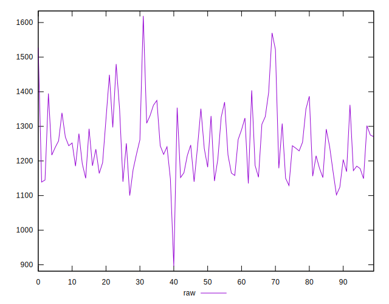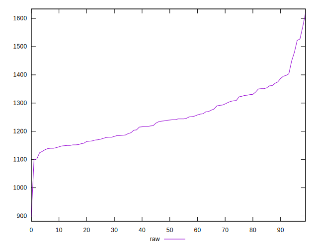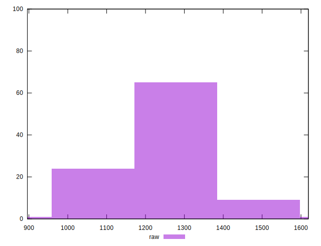
## Score


```yaml
p90min: 0.41
p90max: 0.46
p90range: 0.050000000000000044
p90mean: 0.44095744680851084
median: 0.44
p90stdev: 0.010217751442712
mad: 0.010000000000000009
stdevBySn: 0.011926000000000011
lfitCenter: 0.4414187928131425
lfitStdev: 0.00908722484485284
mfitCenter: 0.4414187928131425
mfitStdev: 0.011389147378478962
mfitConfidence: 0.0011389147378478963
p90skewness: -0.7905354997453056
p90eccentricity: 1.000000000000001
p90discretization: 15.666666666666666
outlandishness: 0.9983794266989306

```

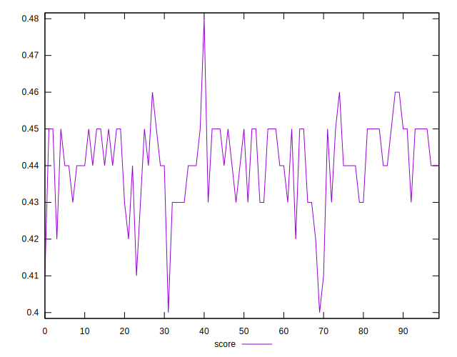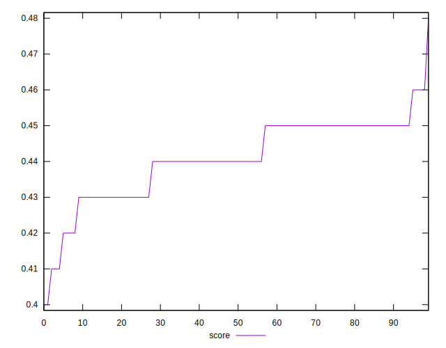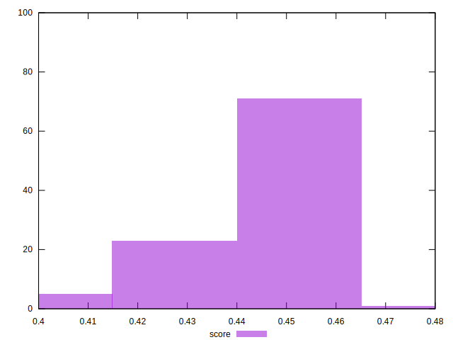
## Raw Estimate

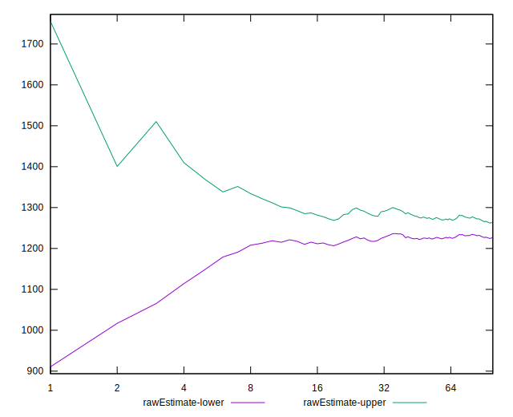
## Score Estimate

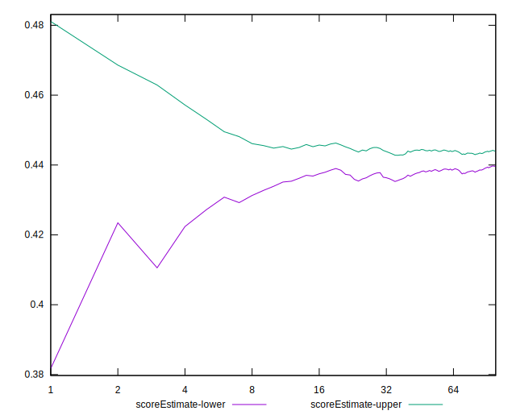
## P Score


```yaml
p90min: 0.4091764705882353
p90max: 0.456
p90range: 0.04682352941176471
p90mean: 0.44140550688360447
median: 0.4424117647058824
p90stdev: 0.010185894441000841
mad: 0.008176470588235285
stdevBySn: 0.011575235294117647
lfitCenter: 0.4417874576994134
lfitStdev: 0.008783127438931027
mfitCenter: 0.4417874576994134
mfitStdev: 0.011008017800132674
mfitConfidence: 0.0011008017800132673
p90skewness: -0.7331609220629678
p90eccentricity: 1.0000000000000002
p90discretization: 1.119047619047619
outlandishness: 0.9982646902153026

```

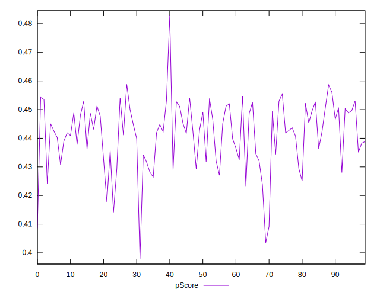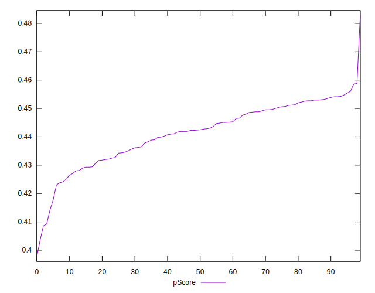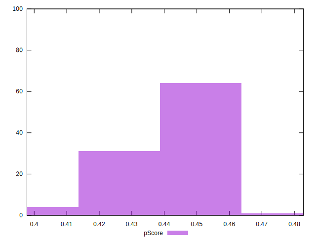
## Score Difference


```yaml
p90min: 0
p90max: 0
p90range: 0
p90mean: 0
median: 0
p90stdev: 0
mad: 0
stdevBySn: 0
lfitCenter: 7.958455817343958e-19
lfitStdev: 1.966288954703721e-18
mfitCenter: 7.958455817343958e-19
mfitStdev: 2.4643777474572523e-18
mfitConfidence: 2.464377747457252e-19
p90skewness: .nan
p90eccentricity: .nan
p90discretization: 94
outlandishness: .inf

```

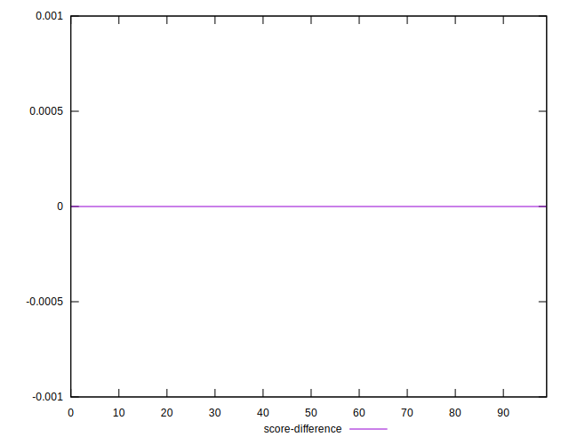
## P Score Difference


```yaml
p90min: -0.004941176470588227
p90max: 0.004588235294117671
p90range: 0.009529411764705897
p90mean: 0.0004555694618272782
median: 0.0007058823529411673
p90stdev: 0.0026058810275003622
mad: 0.0021176470588235297
stdevBySn: 0.003332264705882368
lfitCenter: 0.0005322115319361223
lfitStdev: 0.0023479597626218577
mfitCenter: 0.0005322115319361223
mfitStdev: 0.0029427311673030218
mfitConfidence: 0.0002942731167303022
p90skewness: -0.3323990062699814
p90eccentricity: 0.9999999999999999
p90discretization: 1.4461538461538461
outlandishness: 0.8594919967395255

```

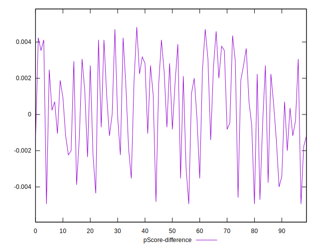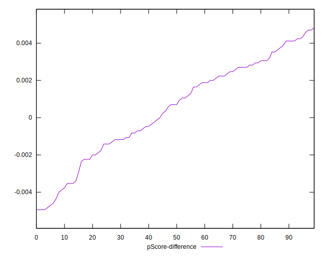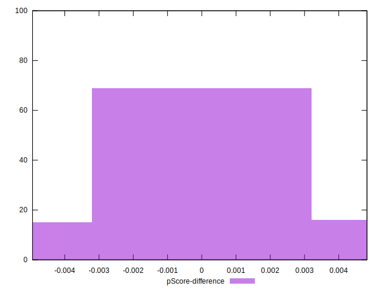