# //uses-rel-preload/samples/card

[→ Parent](../..)


## Raw


```yaml
p90min: 1113
p90max: 1540
p90range: 427
p90mean: 1253.5851063829787
median: 1230.5
p90stdev: 100.49657658766166
mad: 65.5
stdevBySn: 100.77470000000001
lfitCenter: 1249.7874185205724
lfitStdev: 81.39438614445916
mfitCenter: 1249.7874185205724
mfitStdev: 102.01273495561709
mfitConfidence: 10.20127349556171
p90skewness: 0.9169567120659057
p90eccentricity: 0.9999999999999994
p90discretization: 1.175
outlandishness: 1.0113353524165603

```

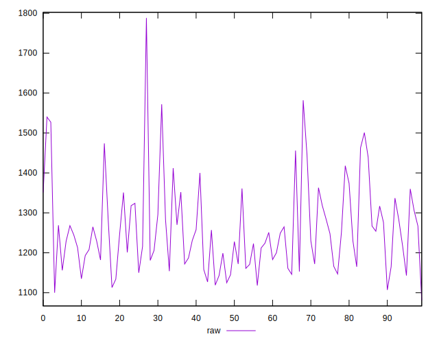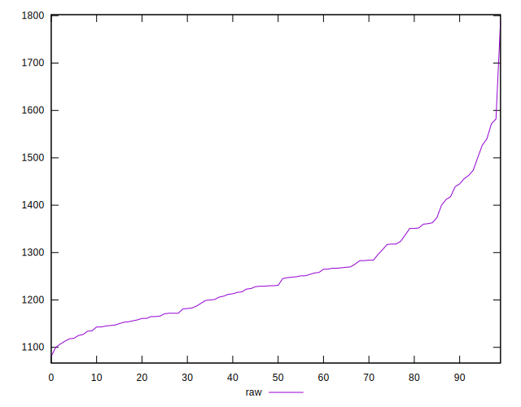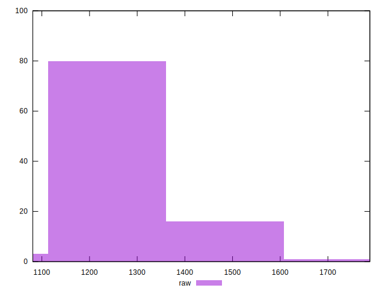
## Score


```yaml
p90min: 0.41
p90max: 0.46
p90range: 0.050000000000000044
p90mean: 0.44063829787234043
median: 0.44
p90stdev: 0.01183292473317816
mad: 0.010000000000000009
stdevBySn: 0.011926000000000011
lfitCenter: 0.4410252644752403
lfitStdev: 0.009642707508450012
mfitCenter: 0.4410252644752403
mfitStdev: 0.012085341654499508
mfitConfidence: 0.0012085341654499509
p90skewness: -0.8169162458785433
p90eccentricity: 1.0000000000000009
p90discretization: 15.666666666666666
outlandishness: 0.9961986942069335

```

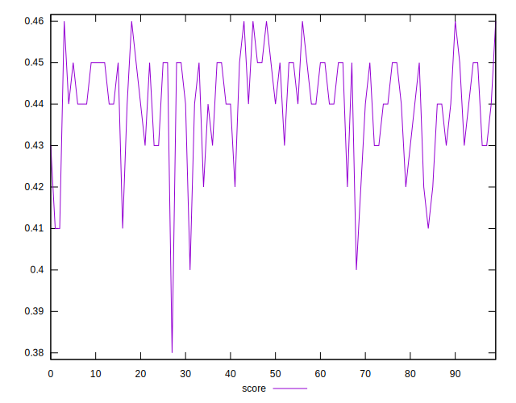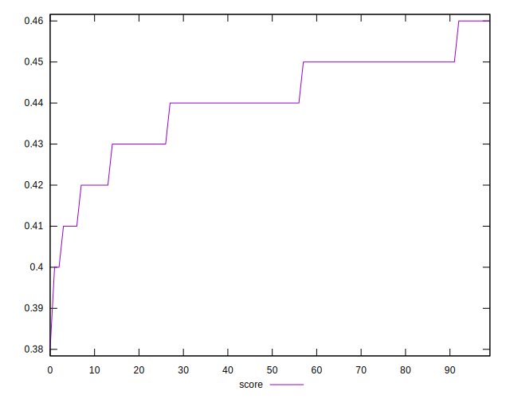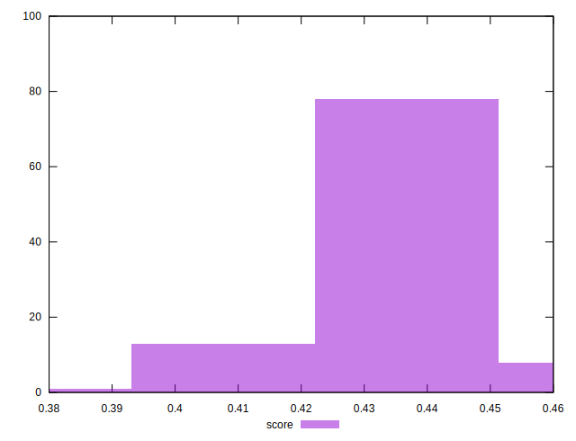
## Raw Estimate

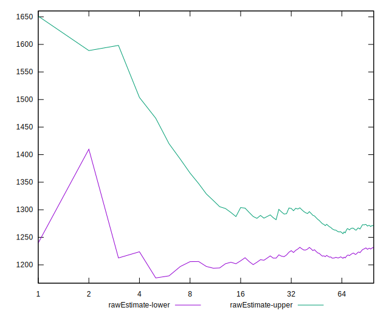
## Score Estimate

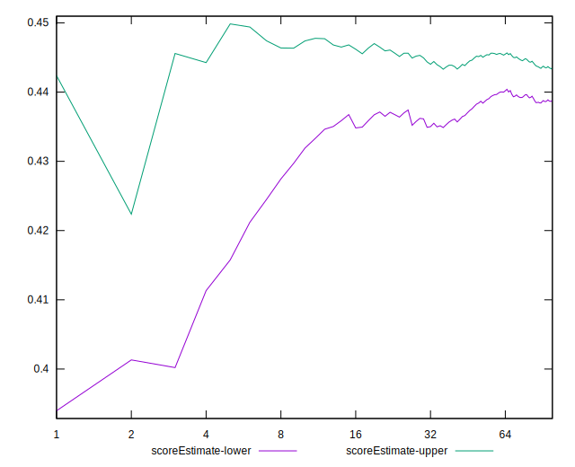
## P Score


```yaml
p90min: 0.40705882352941175
p90max: 0.45729411764705885
p90range: 0.0502352941176471
p90mean: 0.4407546933667084
median: 0.4434705882352941
p90stdev: 0.011823126657371955
mad: 0.0077058823529411735
stdevBySn: 0.011855847058823525
lfitCenter: 0.4412014801740503
lfitStdev: 0.009575810134642255
mfitCenter: 0.4412014801740503
mfitStdev: 0.0120014982300726
mfitConfidence: 0.00120014982300726
p90skewness: -0.9169567120659132
p90eccentricity: 1.0000000000000007
p90discretization: 1.175
outlandishness: 0.996221350463802

```

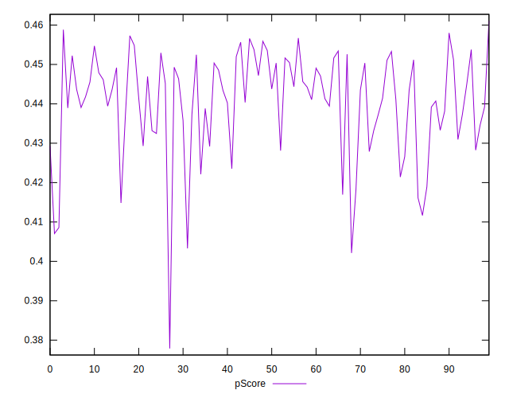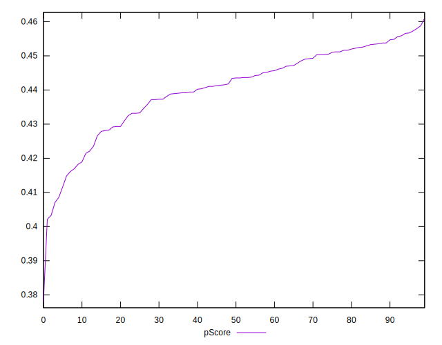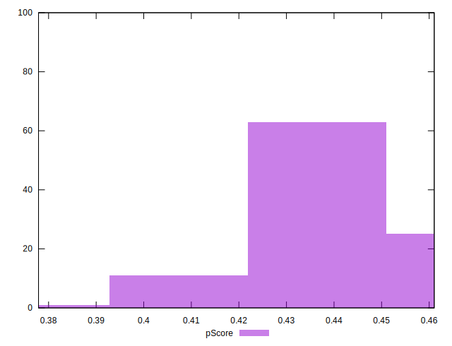
## Score Difference


```yaml
p90min: 0
p90max: 5.551115123125783e-17
p90range: 5.551115123125783e-17
p90mean: 5.905441620346577e-19
median: 0
p90stdev: 5.695001657605475e-18
mad: 0
stdevBySn: 0
lfitCenter: 1.0755152514005351e-18
lfitStdev: 2.6436841970240598e-18
mfitCenter: 1.0755152514005351e-18
mfitStdev: 3.313366782061881e-18
mfitConfidence: 3.313366782061881e-19
p90skewness: 9.539955591519904
p90eccentricity: 1.0000000000000002
p90discretization: 47
outlandishness: 14.137600000000003

```

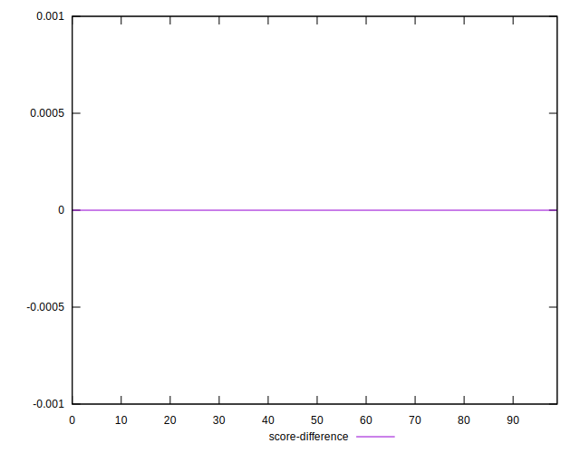
## P Score Difference


```yaml
p90min: -0.004352941176470615
p90max: 0.004588235294117671
p90range: 0.008941176470588286
p90mean: 0.00012765957446807933
median: 0.0003529411764705559
p90stdev: 0.0025353952904999828
mad: 0.0022941176470588076
stdevBySn: 0.003016576470588246
lfitCenter: 0.0001296244028111201
lfitStdev: 0.002330998592552945
mfitCenter: 0.0001296244028111201
mfitStdev: 0.0029214734930488504
mfitConfidence: 0.000292147349304885
p90skewness: -0.03002022034364826
p90eccentricity: 0.9999999999999999
p90discretization: 1.46875
outlandishness: 0.9010104190695848

```

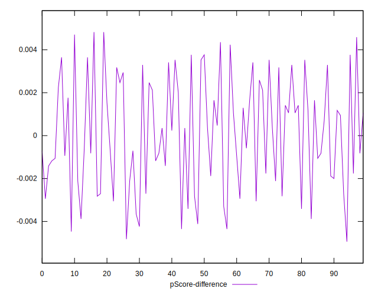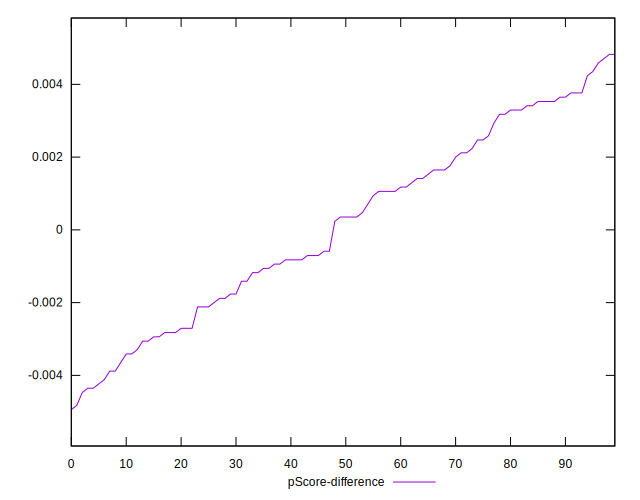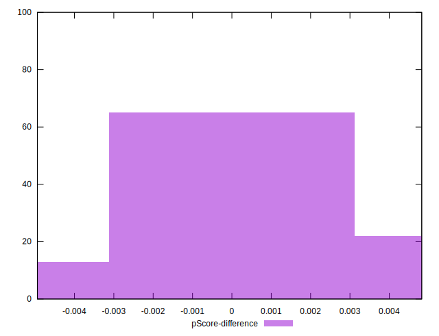