# //uses-rel-preload/samples/music

[→ Parent](../..)


## Raw


```yaml
p90min: 1254
p90max: 1767
p90range: 513
p90mean: 1442.095744680851
median: 1415.5
p90stdev: 125.95693870297173
mad: 86
stdevBySn: 121.64520000000002
lfitCenter: 1439.2262539374517
lfitStdev: 104.1485519990016
mfitCenter: 1439.2262539374517
mfitStdev: 130.5308527326329
mfitConfidence: 13.053085273263289
p90skewness: 0.760297612541058
p90eccentricity: 1
p90discretization: 1.0804597701149425
outlandishness: 1.0135177903020653

```

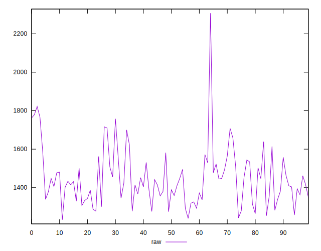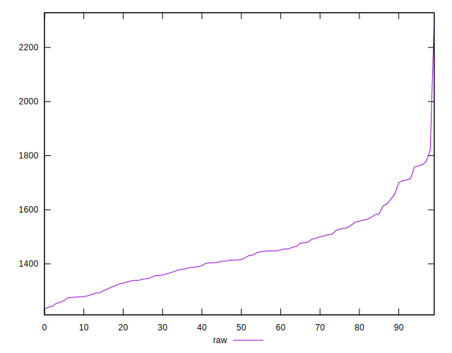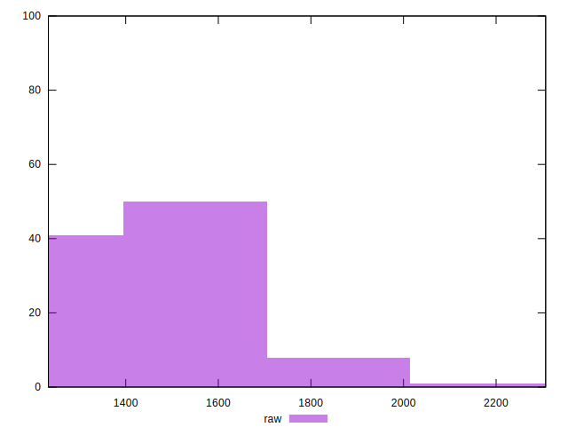
## Score


```yaml
p90min: 0.38
p90max: 0.44
p90range: 0.06
p90mean: 0.4187234042553193
median: 0.42
p90stdev: 0.015175150639176002
mad: 0.010000000000000009
stdevBySn: 0.011926000000000011
lfitCenter: 0.4188707469734379
lfitStdev: 0.012166347892294422
mfitCenter: 0.4188707469734379
mfitStdev: 0.01524825582825468
mfitConfidence: 0.001524825582825468
p90skewness: -0.6237618570835453
p90eccentricity: 1.0000000000000007
p90discretization: 13.428571428571429
outlandishness: 0.9941650406762259

```

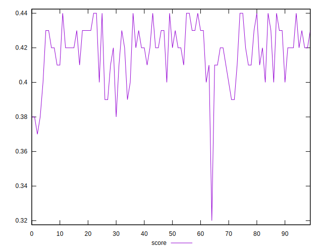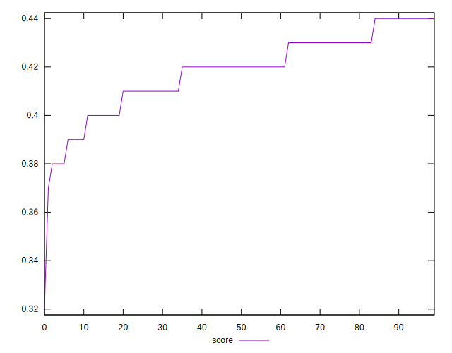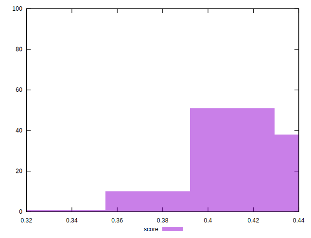
## Raw Estimate

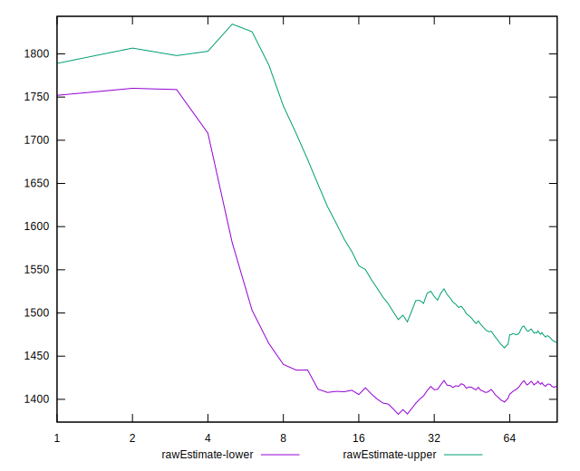
## Score Estimate

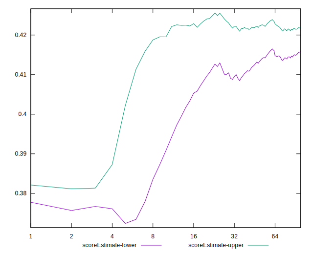
## P Score


```yaml
p90min: 0.38035294117647056
p90max: 0.44070588235294117
p90range: 0.06035294117647061
p90mean: 0.41857697121401743
median: 0.42170588235294115
p90stdev: 0.014818463376820204
mad: 0.010117647058823537
stdevBySn: 0.01431120000000003
lfitCenter: 0.4189145583602999
lfitStdev: 0.012252770823411944
mfitCenter: 0.4189145583602999
mfitStdev: 0.015356570909721506
mfitConfidence: 0.0015356570909721506
p90skewness: -0.7602976125410428
p90eccentricity: 0.9999999999999997
p90discretization: 1.0804597701149425
outlandishness: 0.9945467932478833

```

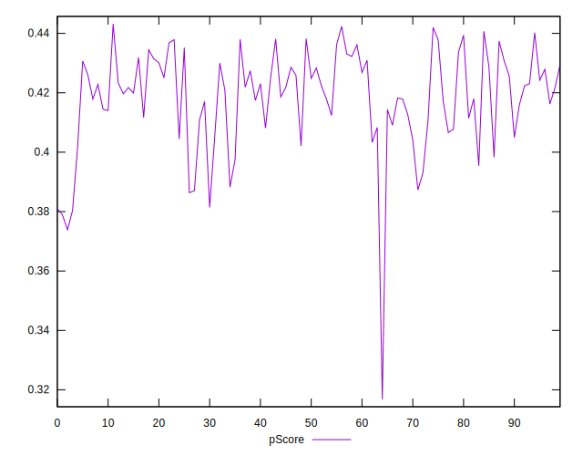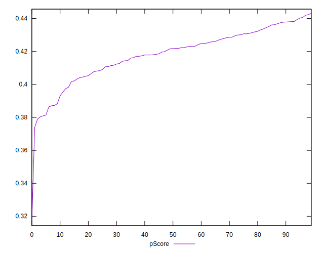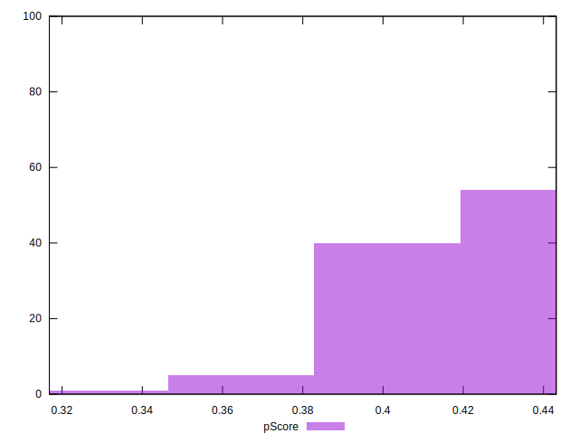
## Score Difference


```yaml
p90min: 0
p90max: 5.551115123125783e-17
p90range: 5.551115123125783e-17
p90mean: 7.086529944415892e-18
median: 0
p90stdev: 1.8524646522840993e-17
mad: 0
stdevBySn: 0
lfitCenter: 4.7157251520130346e-18
lfitStdev: 1.0816401335736953e-17
mfitCenter: 4.7157251520130346e-18
mfitStdev: 1.3556348722598358e-17
mfitConfidence: 1.3556348722598358e-18
p90skewness: 2.2315184957216805
p90eccentricity: 0.9999999999999982
p90discretization: 47
outlandishness: 1.3806250000000002

```

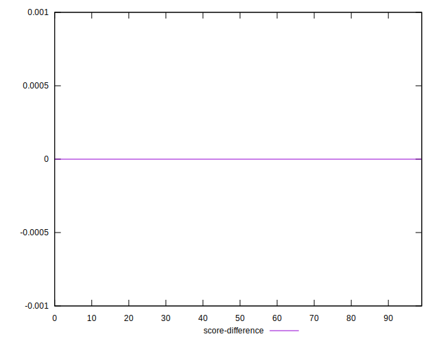
## P Score Difference


```yaml
p90min: -0.004588235294117671
p90max: 0.004470588235294171
p90range: 0.009058823529411841
p90mean: -0.00007259073842302548
median: -0.000058823529411750064
p90stdev: 0.0025918796951749346
mad: 0.0022352941176470575
stdevBySn: 0.0031568823529411856
lfitCenter: -0.00010749206069190569
lfitStdev: 0.0024502045798896867
mfitCenter: -0.00010749206069190569
mfitStdev: 0.0030708760423809765
mfitConfidence: 0.00030708760423809765
p90skewness: 0.10564774810745708
p90eccentricity: 0.9999999999999994
p90discretization: 1.5161290322580645
outlandishness: 0.8237127229488543

```

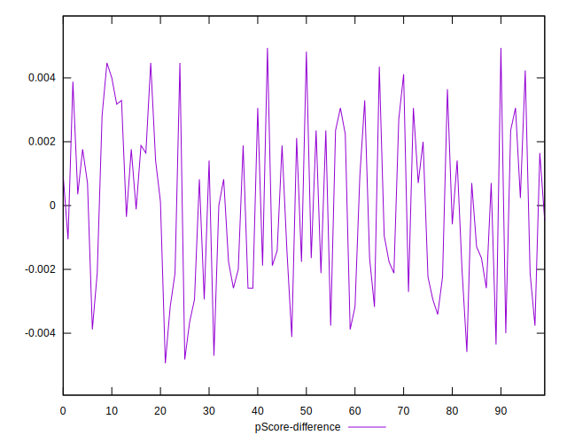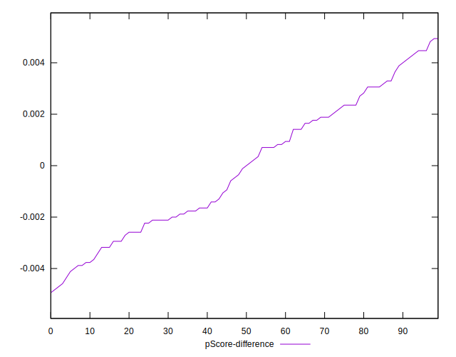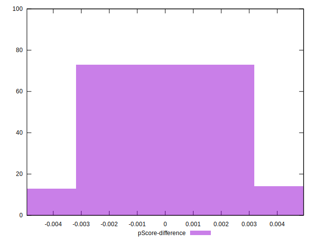