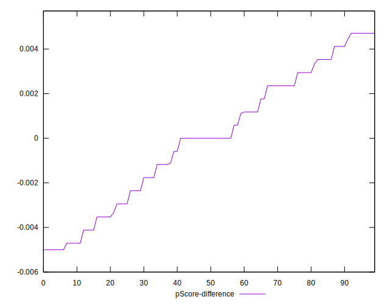

# //uses-text-compression/samples/agenda

[→ Parent](../..)


## Raw


```yaml
p90min: 150
p90max: 5090
p90range: 4940
p90mean: 3500.851063829787
median: 4380
p90stdev: 1651.6211633361079
mad: 540
stdevBySn: 736.4305
lfitCenter: 3714.9277050431074
lfitStdev: 1460.8102102219523
mfitCenter: 3714.9277050431074
mfitStdev: 1830.854090248284
mfitConfidence: 183.08540902482838
p90skewness: -0.9966343050982026
p90eccentricity: 0.9999999999999997
p90discretization: 1.3623188405797102
outlandishness: 0.9732444843120547

```


## Score


```yaml
p90min: 0
p90max: 0.88
p90range: 0.88
p90mean: 0.20872340425531907
median: 0.07
p90stdev: 0.2621159157358211
mad: 0.060000000000000005
stdevBySn: 0.08348200000000001
lfitCenter: 0.1739133091520849
lfitStdev: 0.2128067507426269
mfitCenter: 0.1739133091520849
mfitStdev: 0.2667137094902888
mfitConfidence: 0.026671370949028876
p90skewness: 1.3987824499494632
p90eccentricity: 0.9999999999999994
p90discretization: 3.357142857142857
outlandishness: 1.137386374136109

```


## Raw Estimate


## Score Estimate


## P Score


```yaml
p90min: 0
p90max: 0.875
p90range: 0.875
p90mean: 0.20883952162425257
median: 0.07294117647058823
p90stdev: 0.2615928831080831
mad: 0.06352941176470589
stdevBySn: 0.08628811764705883
lfitCenter: 0.17401952559389355
lfitStdev: 0.21258831007473822
mfitCenter: 0.17401952559389355
mfitStdev: 0.26643993471278377
mfitConfidence: 0.026643993471278375
p90skewness: 1.3918933522415338
p90eccentricity: 0.9999999999999991
p90discretization: 1.4242424242424243
outlandishness: 1.1357049790939

```


## Score Difference


```yaml
p90min: 0
p90max: 0
p90range: 0
p90mean: 0
median: 0
p90stdev: 0
mad: 0
stdevBySn: 0
lfitCenter: 2.583267684513104e-19
lfitStdev: 6.445158398659724e-19
mfitCenter: 2.583267684513104e-19
mfitStdev: 8.077808146406197e-19
mfitConfidence: 8.077808146406197e-20
p90skewness: .nan
p90eccentricity: .nan
p90discretization: 94
outlandishness: .inf

```


## P Score Difference


```yaml
p90min: -0.0050000000000000044
p90max: 0.004705882352941171
p90range: 0.009705882352941175
p90mean: -0.000034070365734957135
median: 0
p90stdev: 0.002932483463942225
mad: 0.002647058823529419
stdevBySn: 0.0035076470588235173
lfitCenter: 0.0000012360397075885776
lfitStdev: 0.0024160671958546294
mfitCenter: 0.0000012360397075885776
mfitStdev: 0.003028091176315819
mfitConfidence: 0.0003028091176315819
p90skewness: -0.10477642112817247
p90eccentricity: 1
p90discretization: 1.7735849056603774
outlandishness: 1.4375520616408095

```

