# //uses-text-compression/samples/card

[→ Parent](../..)


## Raw


```yaml
p90min: 300
p90max: 5310
p90range: 5010
p90mean: 3631.4893617021276
median: 4585
p90stdev: 1677.3338503802718
mad: 540
stdevBySn: 745.3750000000001
lfitCenter: 3842.4473313073136
lfitStdev: 1518.3246205916319
mfitCenter: 3842.4473313073136
mfitStdev: 1902.9377139365022
mfitConfidence: 190.29377139365022
p90skewness: -0.9448671827356572
p90eccentricity: 0.9999999999999997
p90discretization: 1.3428571428571427
outlandishness: 0.9734733435947

```

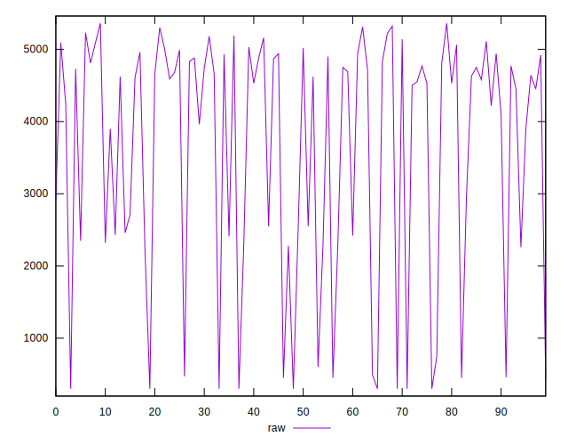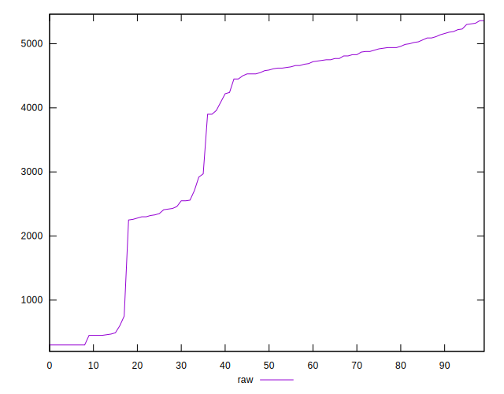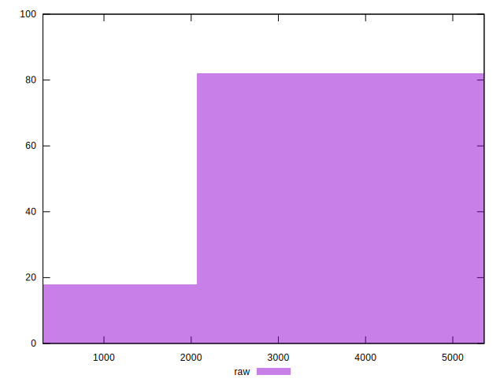
## Score


```yaml
p90min: 0
p90max: 0.75
p90range: 0.75
p90mean: 0.1863829787234042
median: 0.05
p90stdev: 0.2420956864803746
mad: 0.05
stdevBySn: 0.05963000000000001
lfitCenter: 0.15355143026445608
lfitStdev: 0.20479438970671995
mfitCenter: 0.15355143026445608
mfitStdev: 0.2566717041206061
mfitConfidence: 0.025667170412060607
p90skewness: 1.2734455271454723
p90eccentricity: 0.9999999999999997
p90discretization: 4.086956521739131
outlandishness: 1.1251251747513606

```

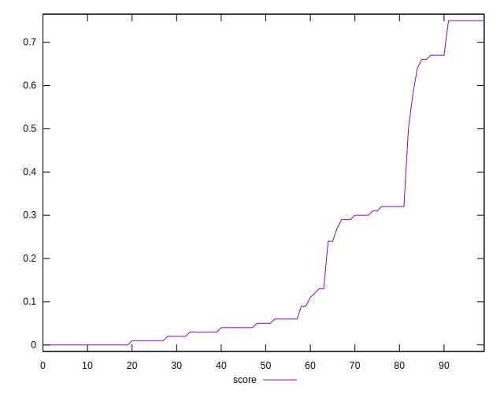
## Raw Estimate

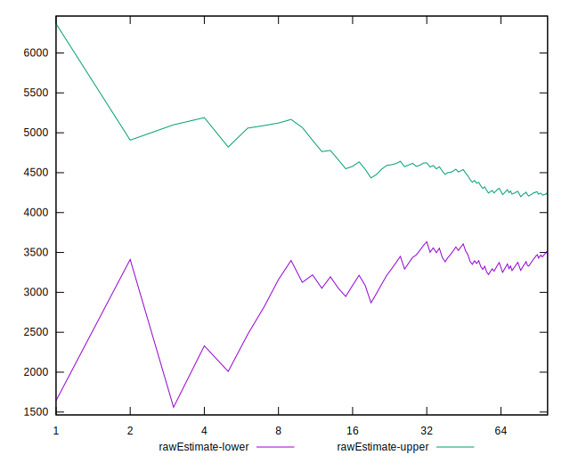
## Score Estimate

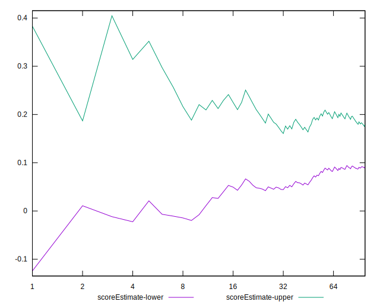
## P Score


```yaml
p90min: 0
p90max: 0.75
p90range: 0.75
p90mean: 0.1864010568766514
median: 0.04882352941176468
p90stdev: 0.24190541505382263
mad: 0.04882352941176468
stdevBySn: 0.058577705882352914
lfitCenter: 0.15360359130390622
lfitStdev: 0.20481519560781325
mfitCenter: 0.15360359130390622
mfitStdev: 0.2566977804506121
mfitConfidence: 0.02566977804506121
p90skewness: 1.2713156839996658
p90eccentricity: 0.9999999999999999
p90discretization: 1.6491228070175439
outlandishness: 1.1251003371311006

```

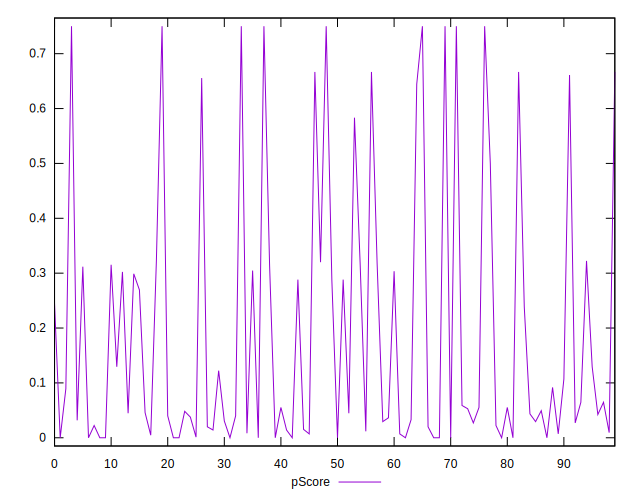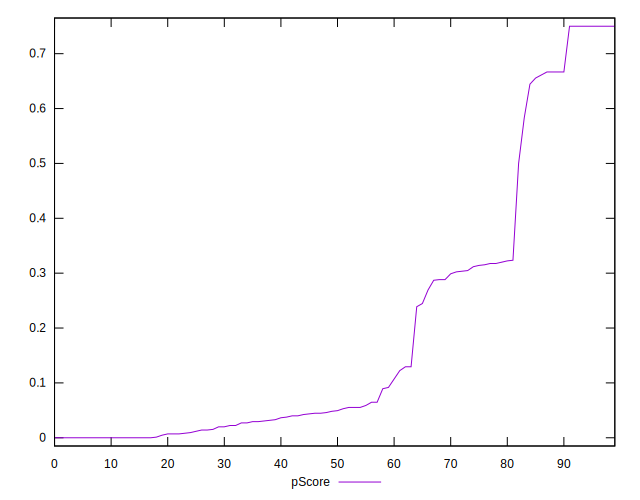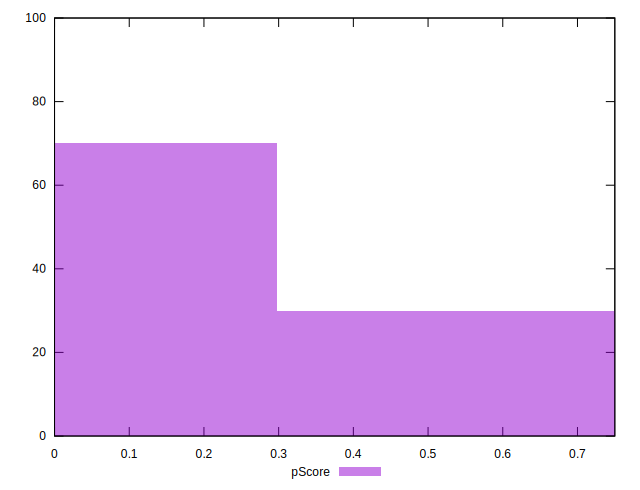
## Score Difference


```yaml
p90min: 0
p90max: 0
p90range: 0
p90mean: 0
median: 0
p90stdev: 0
mad: 0
stdevBySn: 0
lfitCenter: 0
lfitStdev: 0
mfitCenter: 0
mfitStdev: 0
mfitConfidence: 0
p90skewness: .nan
p90eccentricity: .nan
p90discretization: 94
outlandishness: .nan

```


## P Score Difference


```yaml
p90min: -0.004705882352941171
p90max: 0.004705882352941171
p90range: 0.009411764705882342
p90mean: 0.000018078153247104553
median: 0
p90stdev: 0.002324774711422908
mad: 0.0017647058823529417
stdevBySn: 0.00210458823529413
lfitCenter: -0.000012266674283923822
lfitStdev: 0.0015391412534902396
mfitCenter: -0.000012266674283923822
mfitStdev: 0.0019290274942658867
mfitConfidence: 0.00019290274942658866
p90skewness: 0.17431731854888877
p90eccentricity: 1.000000000000001
p90discretization: 2.186046511627907
outlandishness: 0.8835999999999621

```

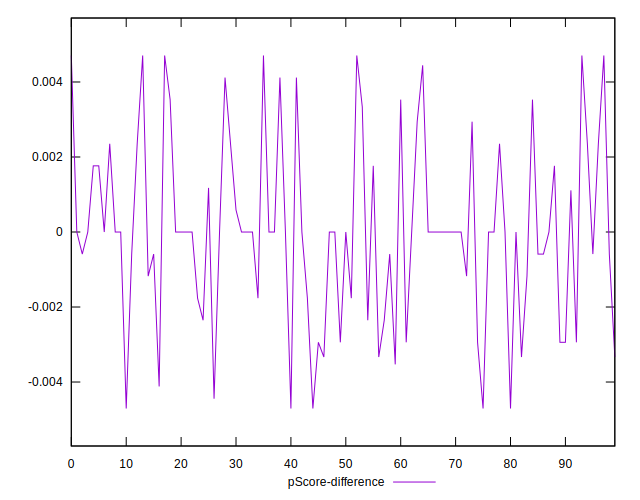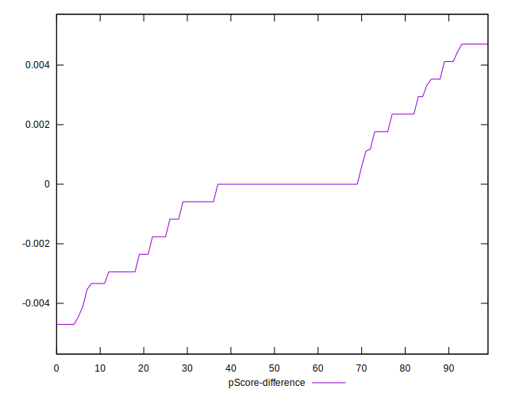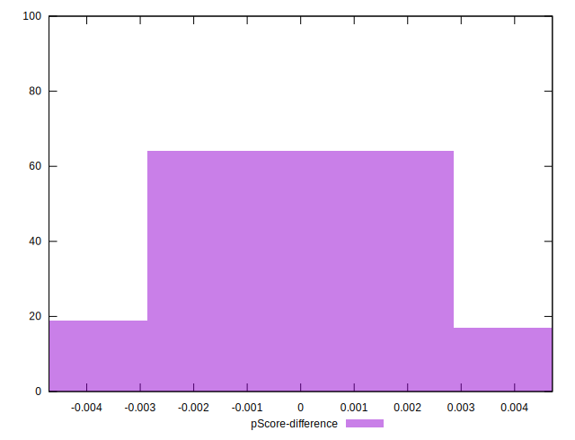