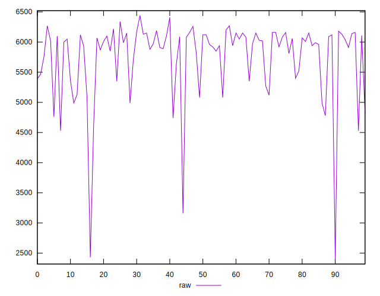

# //uses-text-compression/samples/music

[→ Parent](../..)


## Raw


```yaml
p90min: 4530
p90max: 6270
p90range: 1740
p90mean: 5800.63829787234
median: 5995
p90stdev: 461.95654329706724
mad: 155
stdevBySn: 247.46450000000002
lfitCenter: 5830.497416139727
lfitStdev: 412.4843107202135
mfitCenter: 5830.497416139727
mfitStdev: 516.9724185666828
mfitConfidence: 51.69724185666828
p90skewness: -1.3306330172397585
p90eccentricity: 0.9999999999999994
p90discretization: 1.6491228070175439
outlandishness: 0.9738865653517632

```


## Score


```yaml
p90min: 0
p90max: 0.06
p90range: 0.06
p90mean: 0.0029787234042553193
median: 0
p90stdev: 0.011282615815798168
mad: 0
stdevBySn: 0
lfitCenter: 0.005457901771330516
lfitStdev: 0.01296062237087506
mfitCenter: 0.005457901771330516
mfitStdev: 0.01624373126217038
mfitConfidence: 0.001624373126217038
p90skewness: 3.9744945827376523
p90eccentricity: 1.0000000000000018
p90discretization: 18.8
outlandishness: 13.886269897959183

```


## Raw Estimate


## Score Estimate


## P Score


```yaml
p90min: 0
p90max: 0.05529411764705883
p90range: 0.05529411764705883
p90mean: 0.0028410513141426774
median: 0
p90stdev: 0.010502236730899471
mad: 0
stdevBySn: 0
lfitCenter: 0.0053683668008149546
lfitStdev: 0.01269247770987285
mfitCenter: 0.0053683668008149546
mfitStdev: 0.015907661767352473
mfitConfidence: 0.0015907661767352473
p90skewness: 3.8923788819443996
p90eccentricity: 1.0000000000000002
p90discretization: 11.75
outlandishness: 14.767260812358103

```


## Score Difference


```yaml
p90min: 0
p90max: 0
p90range: 0
p90mean: 0
median: 0
p90stdev: 0
mad: 0
stdevBySn: 0
lfitCenter: 0
lfitStdev: 0
mfitCenter: 0
mfitStdev: 0
mfitConfidence: 0
p90skewness: .nan
p90eccentricity: .nan
p90discretization: 94
outlandishness: .nan

```


## P Score Difference


```yaml
p90min: -0.0041176470588235176
p90max: 0.0011764705882352788
p90range: 0.005294117647058796
p90mean: -0.00011264080100125173
median: 0
p90stdev: 0.0007394829159810962
mad: 0
stdevBySn: 0
lfitCenter: -0.00009193670044416787
lfitStdev: 0.00033035779597972997
mfitCenter: -0.00009193670044416787
mfitStdev: 0.00041404209649041206
mfitConfidence: 0.00004140420964904121
p90skewness: -4.423046145165448
p90eccentricity: 0.9999999999999994
p90discretization: 13.428571428571429
outlandishness: 2.620801234567896

```

