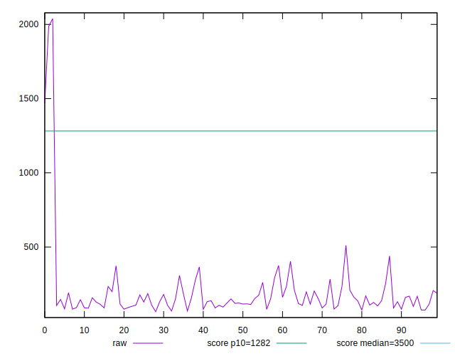

# //bootup-time/samples/agenda

[→ Parent](../..)


## Raw


```yaml
p90min: 75.52399999999997
p90max: 511.364
p90range: 435.84000000000003
p90mean: 160.74331914893622
median: 132.382
p90stdev: 85.49224095715861
mad: 41.248000000000026
stdevBySn: 59.05278160000006
lfitCenter: 173.5589198488662
lfitStdev: 97.47969911722592
mfitCenter: 173.5589198488662
mfitStdev: 122.17268512781588
mfitConfidence: 12.217268512781589
p90skewness: 1.8533517605269199
p90eccentricity: 0.9999999999999997
p90discretization: 1
outlandishness: 1.6753684123400399

```


## Score


```yaml
p90min: 0.99
p90max: 1
p90range: 0.010000000000000009
p90mean: 0.9998936170212765
median: 1
p90stdev: 0.0010259202937226574
mad: 0
stdevBySn: 0
lfitCenter: 0.9970018954245551
lfitStdev: 0.007369529792170035
mfitCenter: 0.9970018954245551
mfitStdev: 0.009236335883188458
mfitConfidence: 0.0009236335883188458
p90skewness: -9.539955591519721
p90eccentricity: 0.9999999999999954
p90discretization: 47
outlandishness: 0.9876498170813865

```


## Raw Estimate


## Score Estimate


## P Score


```yaml
p90min: 0.9929425751601706
p90max: 0.9999995074381374
p90range: 0.0070569322779667765
p90mean: 0.9997071867148507
median: 0.9999853315295271
p90stdev: 0.0009435191241997838
mad: 0.00001404819775951971
stdevBySn: 0.000017228802777687714
lfitCenter: 0.9969161518643153
lfitStdev: 0.00727225820842871
mfitCenter: 0.9969161518643153
mfitStdev: 0.009114424032003715
mfitConfidence: 0.0009114424032003715
p90skewness: -5.061753294997698
p90eccentricity: 0.9999999999999999
p90discretization: 1
outlandishness: 0.9877886104673033

```


## Score Difference


```yaml
p90min: 0
p90max: 0
p90range: 0
p90mean: 0
median: 0
p90stdev: 0
mad: 0
stdevBySn: 0
lfitCenter: 0
lfitStdev: 0
mfitCenter: 0
mfitStdev: 0
mfitConfidence: 0
p90skewness: .nan
p90eccentricity: .nan
p90discretization: 94
outlandishness: .nan

```


## P Score Difference


```yaml
p90min: -0.002194305929647644
p90max: -1.7349490244455978e-7
p90range: 0.0021941324347451996
p90mean: -0.00014302345042811778
median: -0.000013016537547483331
p90stdev: 0.000395466511940155
mad: 0.000012516640905790855
stdevBySn: 0.000017228802777687714
lfitCenter: -0.0000754646603692676
lfitStdev: 0.00027623074767310765
mfitCenter: -0.0000754646603692676
mfitStdev: 0.00034620390156830163
mfitConfidence: 0.00003462039015683016
p90skewness: -4.1306727046228335
p90eccentricity: 1
p90discretization: 1
outlandishness: 0.6518048522864239

```

