# //bootup-time/samples/astro

[→ Parent](../..)


## Raw


```yaml
p90min: 1971.216
p90max: 3753.455999999999
p90range: 1782.2399999999993
p90mean: 2894.7877872340423
median: 2963.6499999999996
p90stdev: 437.2975606824811
mad: 378.154
stdevBySn: 510.31115479999914
lfitCenter: 2903.284515263106
lfitStdev: 373.9302005768381
mfitCenter: 2903.284515263106
mfitStdev: 468.65200722374937
mfitConfidence: 46.86520072237494
p90skewness: -0.19871597128960886
p90eccentricity: 0.9999999999999991
p90discretization: 1
outlandishness: 0.9976609786390873

```

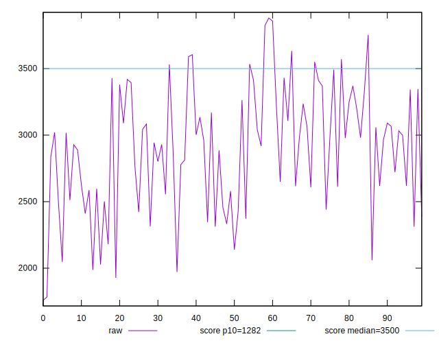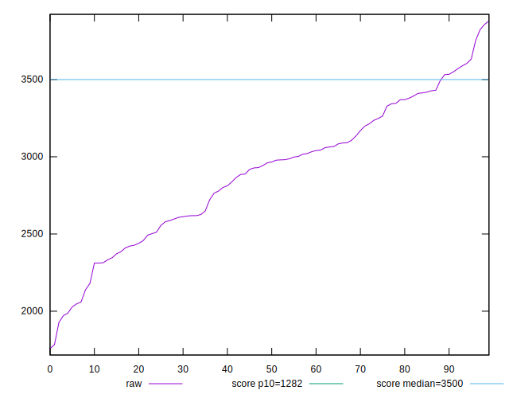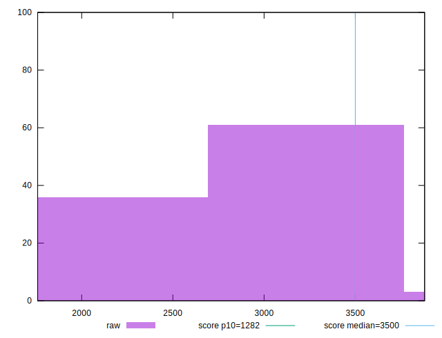
## Score


```yaml
p90min: 0.46
p90max: 0.77
p90range: 0.31
p90mean: 0.5995744680851064
median: 0.58
p90stdev: 0.07537021949297477
mad: 0.06000000000000005
stdevBySn: 0.08348199999999995
lfitCenter: 0.5973880029005023
lfitStdev: 0.06499428454177063
mfitCenter: 0.5973880029005023
mfitStdev: 0.08145825574287417
mfitConfidence: 0.008145825574287417
p90skewness: 0.35987523085220086
p90eccentricity: 0.9999999999999992
p90discretization: 3.2413793103448274
outlandishness: 1.0054296356032217

```

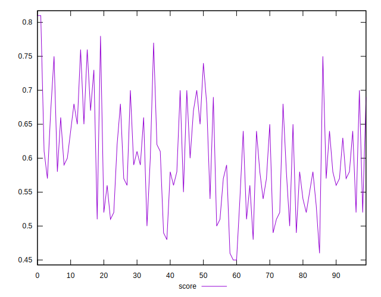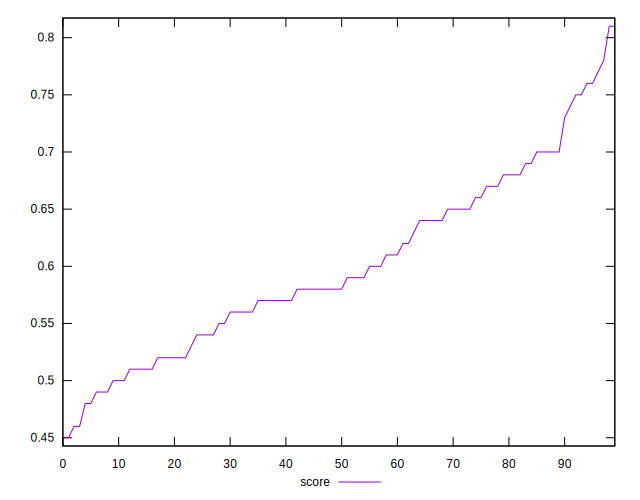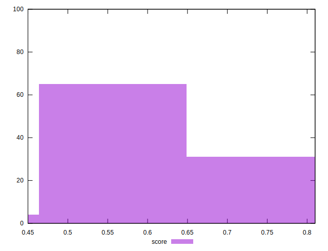
## Raw Estimate

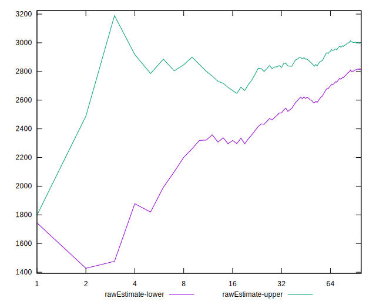
## Score Estimate

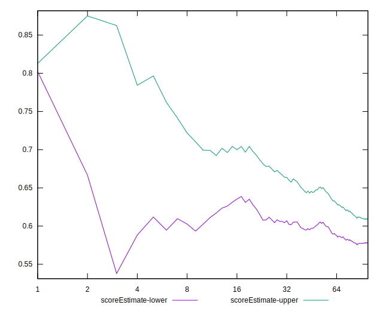
## P Score


```yaml
p90min: 0.46445699441283866
p90max: 0.7680909343006574
p90range: 0.3036339398878188
p90mean: 0.5994439027190243
median: 0.5840454865105505
p90stdev: 0.0751513083806594
mad: 0.06326790179999331
stdevBySn: 0.08496667245088434
lfitCenter: 0.5972109872865742
lfitStdev: 0.06448799827924329
mfitCenter: 0.5972109872865742
mfitStdev: 0.08082372001188153
mfitConfidence: 0.008082372001188153
p90skewness: 0.36807753058136267
p90eccentricity: 0.9999999999999997
p90discretization: 1
outlandishness: 1.0049712960817403

```

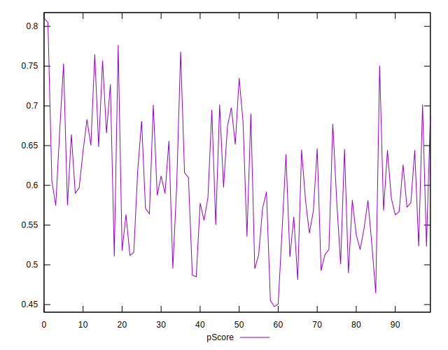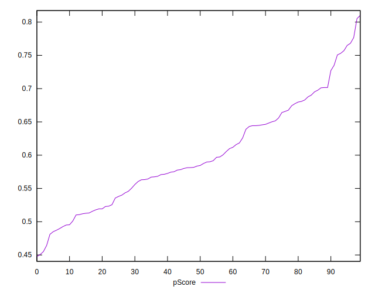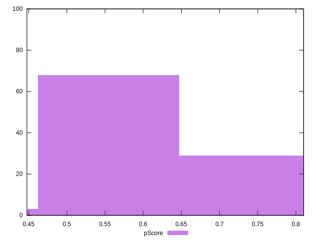
## Score Difference


```yaml
p90min: 0
p90max: 1.1102230246251565e-16
p90range: 1.1102230246251565e-16
p90mean: 1.299197156476247e-17
median: 0
p90stdev: 3.568763471439187e-17
mad: 0
stdevBySn: 0
lfitCenter: 8.673082431196366e-18
lfitStdev: 2.004184579420307e-17
mfitCenter: 8.673082431196366e-18
mfitStdev: 2.511872869704744e-17
mfitConfidence: 2.511872869704744e-18
p90skewness: 2.382852212357377
p90eccentricity: 0.999999999999997
p90discretization: 47
outlandishness: 1.4312859504132236

```

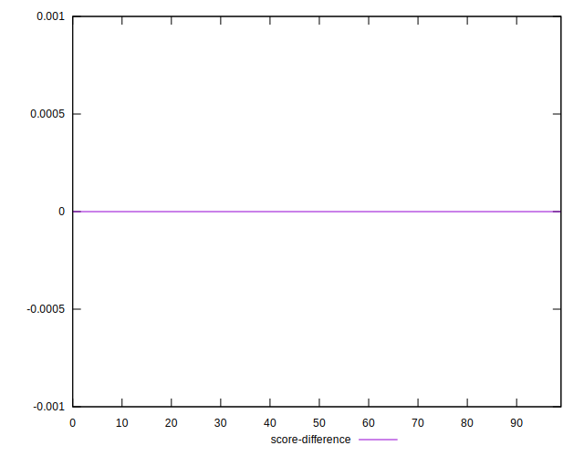
## P Score Difference


```yaml
p90min: -0.004873197860795542
p90max: 0.004507321540877074
p90range: 0.009380519401672616
p90mean: -0.0002849905448655443
median: 0.00006944315665202705
p90stdev: 0.002802027756904767
mad: 0.0026280678561694804
stdevBySn: 0.0033421736499536733
lfitCenter: -0.0002628114391439222
lfitStdev: 0.0024837171149726797
mfitCenter: -0.0002628114391439222
mfitStdev: 0.003112877776420037
mfitConfidence: 0.00031128777764200373
p90skewness: 0.014492530598425146
p90eccentricity: 1.0000000000000002
p90discretization: 1
outlandishness: 0.8839089749040858

```

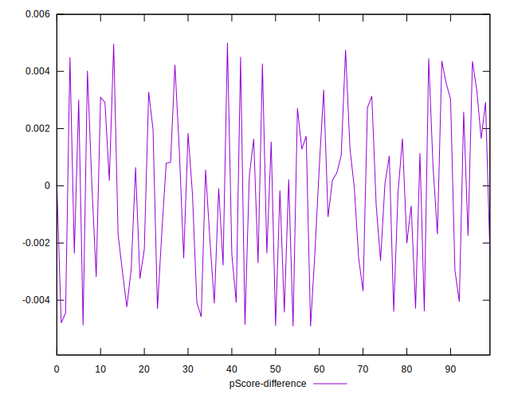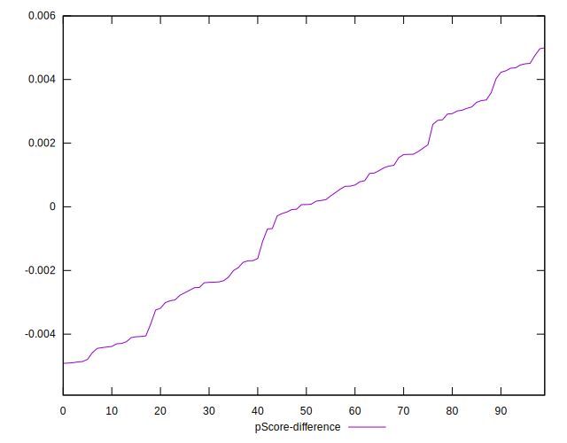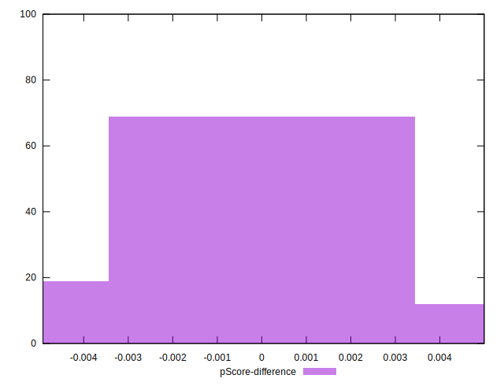