# //bootup-time/samples/card

[→ Parent](../..)


## Raw


```yaml
p90min: 73.56
p90max: 547.184
p90range: 473.62399999999997
p90mean: 165.3228817204301
median: 135.83200000000005
p90stdev: 83.60001813935207
mad: 34.85599999999998
stdevBySn: 56.87747920000007
lfitCenter: 179.69138706903297
lfitStdev: 101.96009021808545
mfitCenter: 179.69138706903297
mfitStdev: 127.7880226408761
mfitConfidence: 12.843179509128085
p90skewness: 1.7907425659893306
p90eccentricity: 0.9999999999999997
p90discretization: 1
outlandishness: 1.693949115340835

```

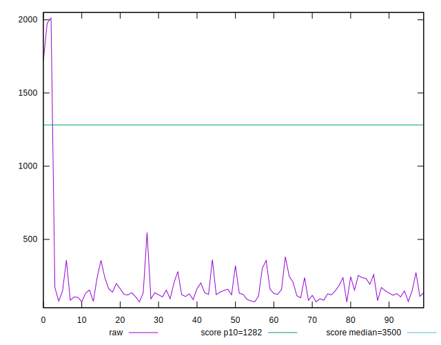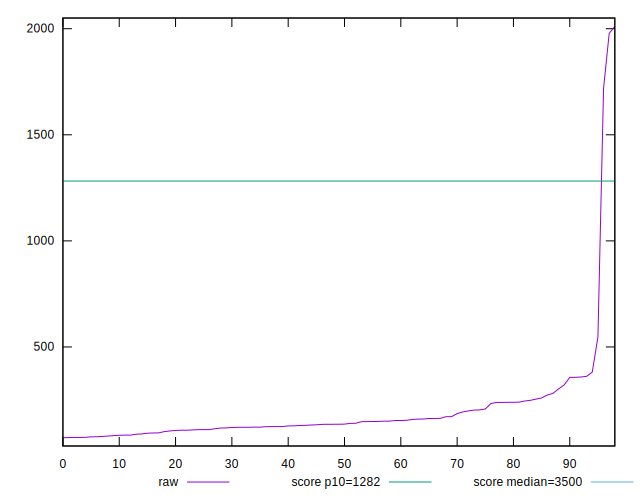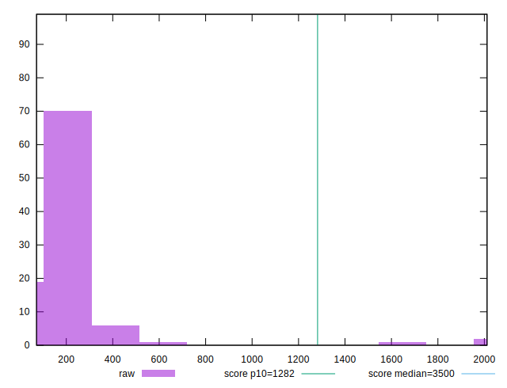
## Score


```yaml
p90min: 0.99
p90max: 1
p90range: 0.010000000000000009
p90mean: 0.9998924731182796
median: 1
p90stdev: 0.0010313616179167154
mad: 0
stdevBySn: 0
lfitCenter: 0.9968184470335156
lfitStdev: 0.007818839243743825
mfitCenter: 0.9968184470335156
mfitStdev: 0.009799461771442005
mfitConfidence: 0.0009848829649486241
p90skewness: -9.48740583959684
p90eccentricity: 0.9999999999999963
p90discretization: 46.5
outlandishness: 0.9869233412790434

```

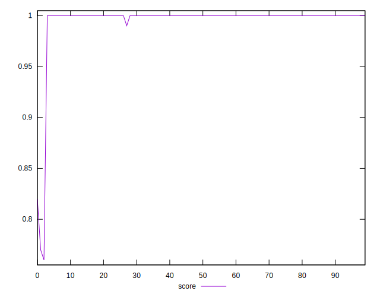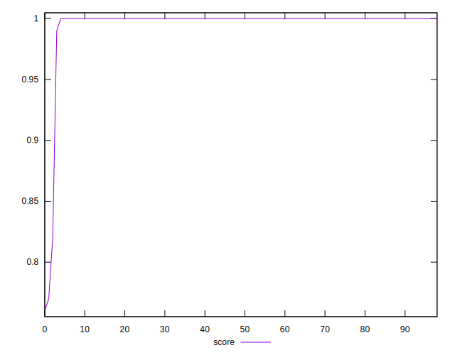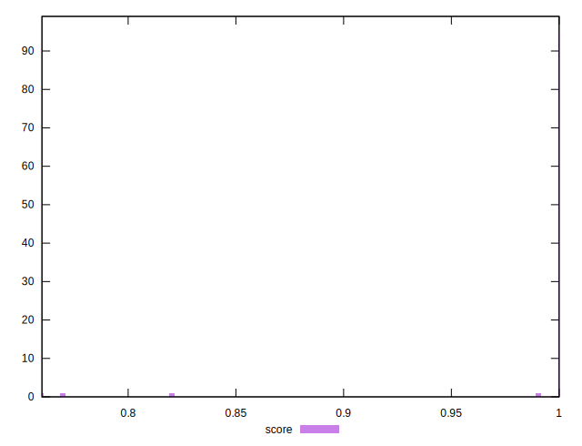
## Raw Estimate

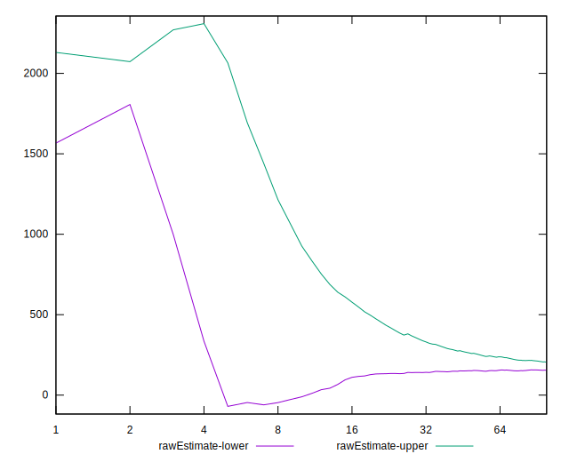
## Score Estimate

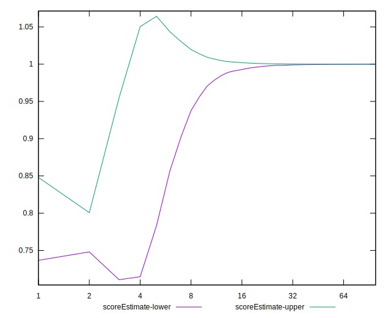
## P Score


```yaml
p90min: 0.9910562237126525
p90max: 0.9999995850488301
p90range: 0.00894336133617768
p90mean: 0.9997096567810841
median: 0.9999830652695277
p90stdev: 0.001011083565570981
mad: 0.000015976866341249618
stdevBySn: 0.00001972693998719344
lfitCenter: 0.9966780925912655
lfitStdev: 0.007862250300898798
mfitCenter: 0.9966780925912655
mfitStdev: 0.009853869463144892
mfitConfidence: 0.0009903511437088608
p90skewness: -6.975312238426185
p90eccentricity: 0.9999999999999999
p90discretization: 1
outlandishness: 0.9868383355148619

```

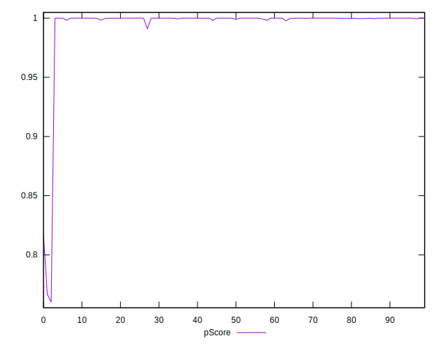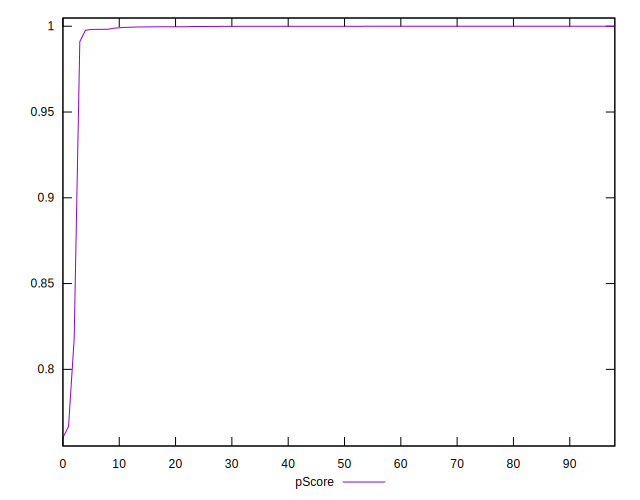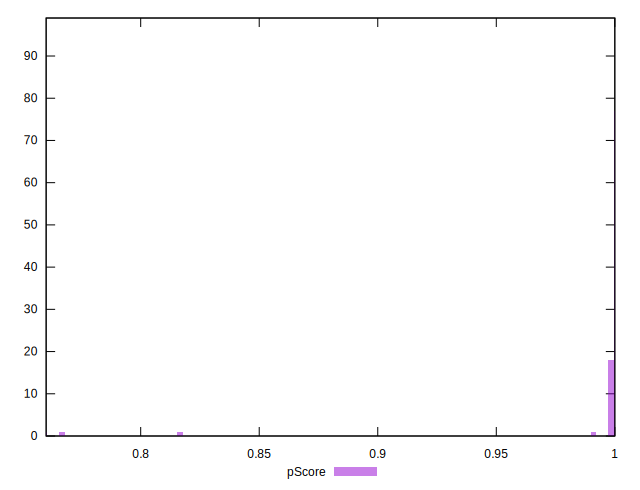
## Score Difference


```yaml
p90min: 0
p90max: 0
p90range: 0
p90mean: 0
median: 0
p90stdev: 0
mad: 0
stdevBySn: 0
lfitCenter: 5.21847134031707e-19
lfitStdev: 1.3019283231074932e-18
mfitCenter: 5.21847134031707e-19
mfitStdev: 1.631725174763995e-18
mfitConfidence: 1.6399455047482617e-19
p90skewness: .nan
p90eccentricity: .nan
p90discretization: 93
outlandishness: .inf

```

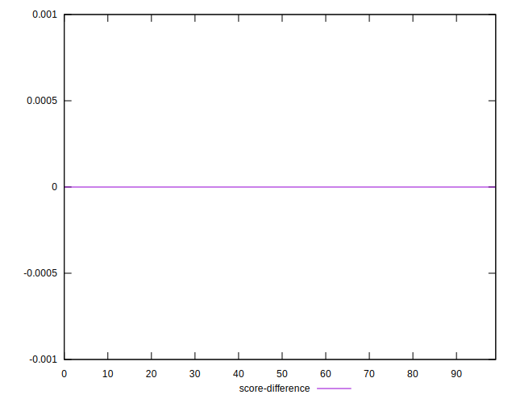
## P Score Difference


```yaml
p90min: -0.0018867823497228375
p90max: -3.9361024151141066e-7
p90range: 0.0018863887394813261
p90mean: -0.00016894001366625126
median: -0.000016719187013292114
p90stdev: 0.0003983362481339053
mad: 0.00001588479764946804
stdevBySn: 0.00001972693998719344
lfitCenter: -0.00013391694324719957
lfitStdev: 0.00025471424854493687
mfitCenter: -0.00013391694324719957
mfitStdev: 0.00031923696899829326
mfitConfidence: 0.00003208452258720175
p90skewness: -3.2858534031595616
p90eccentricity: 1.0000000000000009
p90discretization: 1
outlandishness: 1.7641623926111707

```

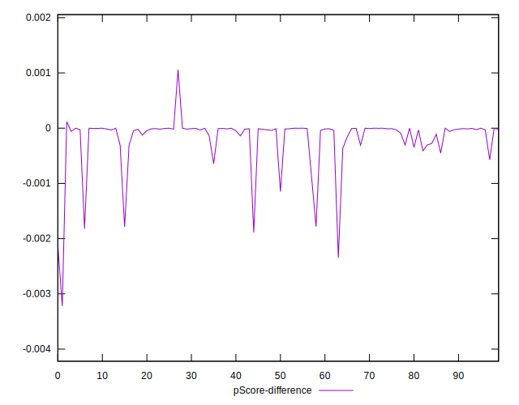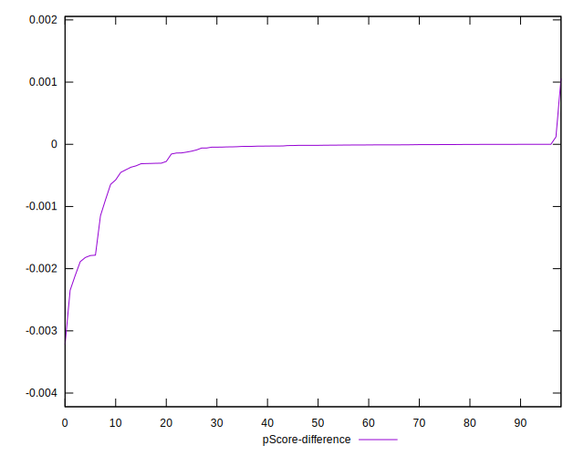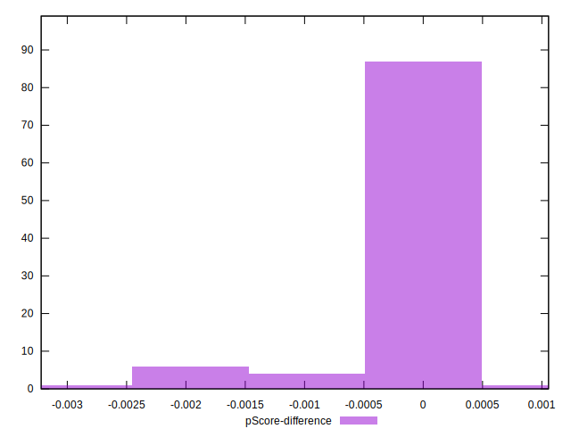