# //bootup-time/samples/music

[→ Parent](../..)


## Raw


```yaml
p90min: 1280.6719999999998
p90max: 2980.8479999999995
p90range: 1700.1759999999997
p90mean: 2149.9925106382966
median: 2186.3920000000007
p90stdev: 405.94233894293745
mad: 307.9219999999991
stdevBySn: 444.05626179999985
lfitCenter: 2154.5973066036786
lfitStdev: 352.7550454754924
mfitCenter: 2154.5973066036786
mfitStdev: 442.1128859486796
mfitConfidence: 44.21128859486796
p90skewness: -0.11344758095128087
p90eccentricity: 0.9999999999999992
p90discretization: 1
outlandishness: 0.9922709741875909

```

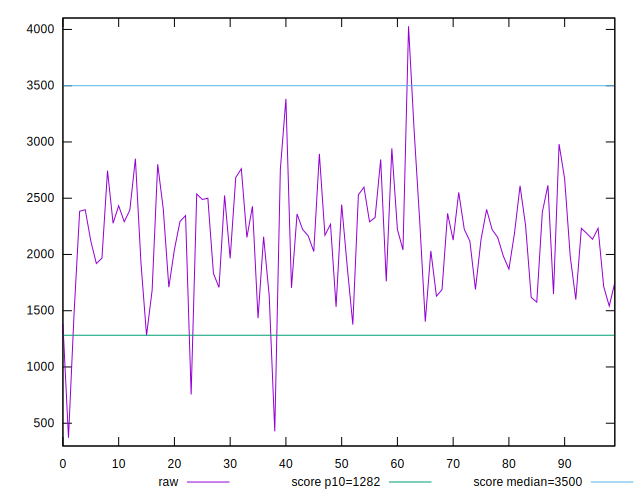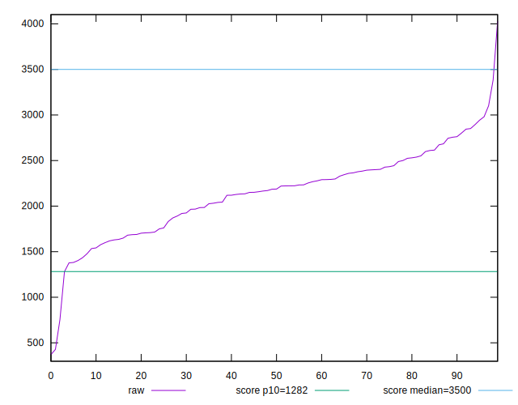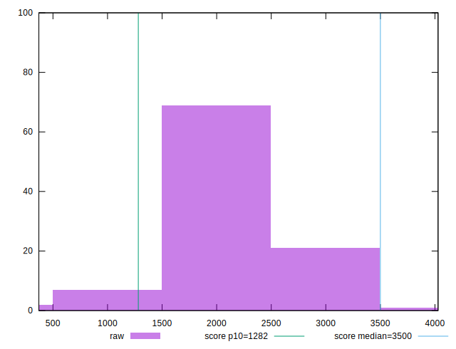
## Score


```yaml
p90min: 0.58
p90max: 0.9
p90range: 0.32000000000000006
p90mean: 0.73468085106383
median: 0.73
p90stdev: 0.07749676901514237
mad: 0.05999999999999994
stdevBySn: 0.08348199999999995
lfitCenter: 0.7332062107385865
lfitStdev: 0.06639220375133954
mfitCenter: 0.7332062107385865
mfitStdev: 0.08321028765281477
mfitConfidence: 0.008321028765281476
p90skewness: 0.1363831415684665
p90eccentricity: 0.9999999999999994
p90discretization: 3.032258064516129
outlandishness: 1.00195867609131

```

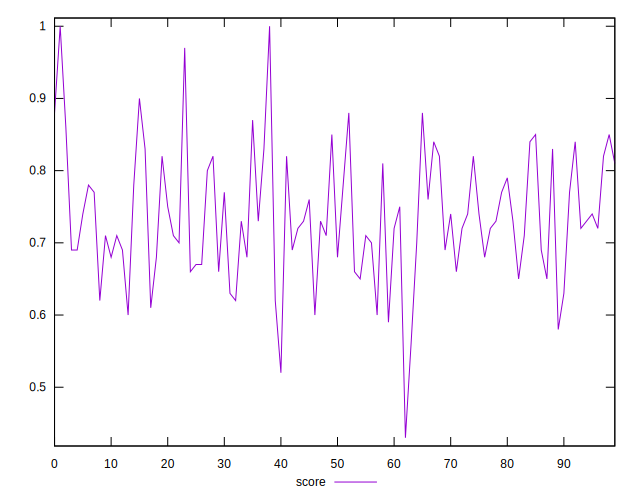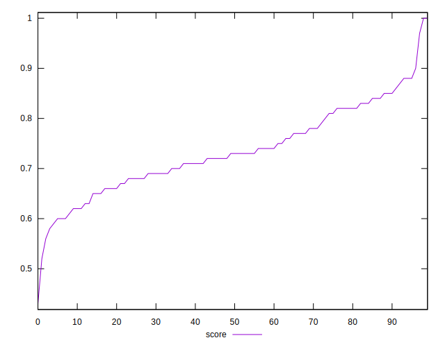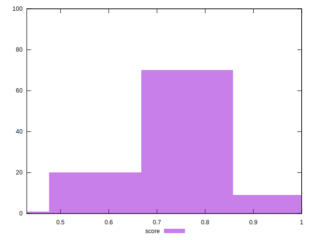
## Raw Estimate

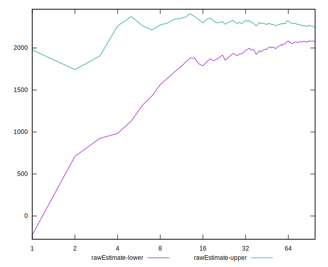
## Score Estimate

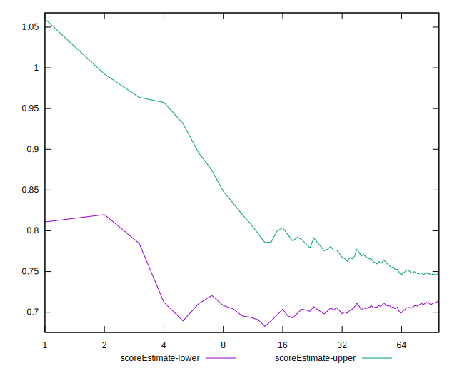
## P Score


```yaml
p90min: 0.5811632143018062
p90max: 0.9002318281594959
p90range: 0.3190686138576897
p90mean: 0.7341523190340857
median: 0.7258724078773456
p90stdev: 0.07779128921308791
mad: 0.058833605927295196
stdevBySn: 0.08564720523607795
lfitCenter: 0.7324319291986098
lfitStdev: 0.06653320134075887
mfitCenter: 0.7324319291986098
mfitStdev: 0.08338700192513923
mfitConfidence: 0.008338700192513922
p90skewness: 0.16904271283046066
p90eccentricity: 0.9999999999999996
p90discretization: 1
outlandishness: 1.001948434960995

```

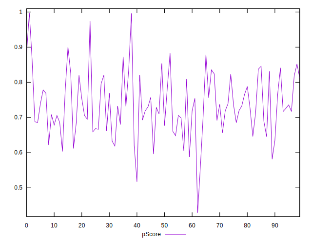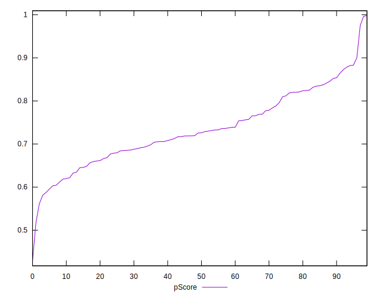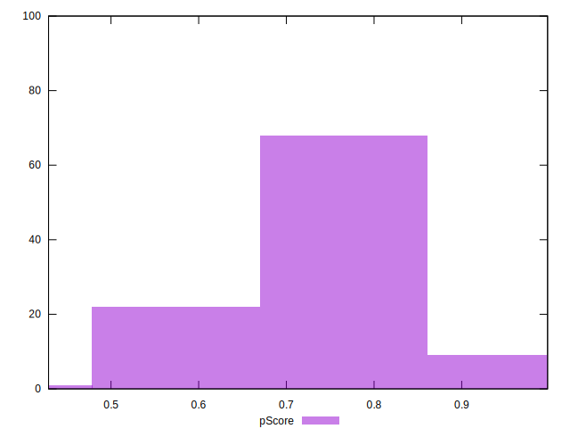
## Score Difference


```yaml
p90min: 0
p90max: 1.1102230246251565e-16
p90range: 1.1102230246251565e-16
p90mean: 1.7716324861039733e-17
median: 0
p90stdev: 4.065758244982898e-17
mad: 0
stdevBySn: 0
lfitCenter: 1.1841287445510115e-17
lfitStdev: 2.6515949121427835e-17
mfitCenter: 1.1841287445510115e-17
mfitStdev: 3.323281393166429e-17
mfitConfidence: 3.3232813931664293e-18
p90skewness: 1.8591772600772083
p90eccentricity: 1.0000000000000013
p90discretization: 47
outlandishness: 1.2723839999999997

```

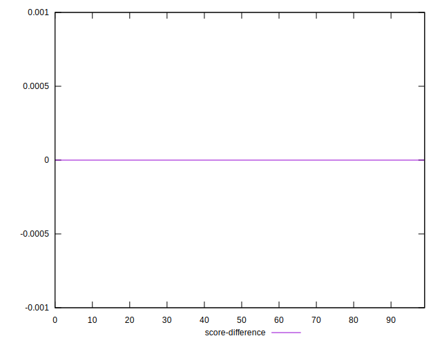
## P Score Difference


```yaml
p90min: -0.0047245379516469566
p90max: 0.004438040804155441
p90range: 0.009162578755802397
p90mean: -0.0005656586324475277
median: -0.001060396893461435
p90stdev: 0.0027799028070907327
mad: 0.0026067013177072385
stdevBySn: 0.003337592139988453
lfitCenter: -0.0006402890667610242
lfitStdev: 0.002399403781418909
mfitCenter: -0.0006402890667610242
mfitStdev: 0.003007206683406568
mfitConfidence: 0.0003007206683406568
p90skewness: 0.24389639253931975
p90eccentricity: 1.0000000000000004
p90discretization: 1
outlandishness: 0.8872126774944344

```

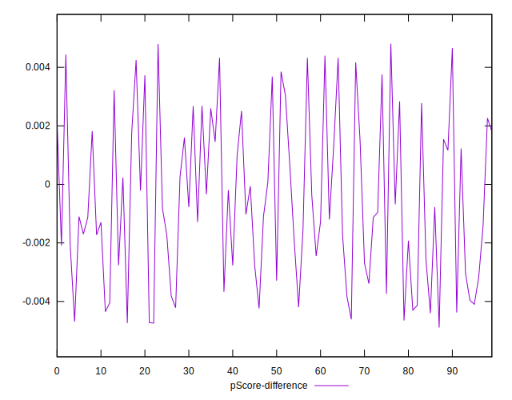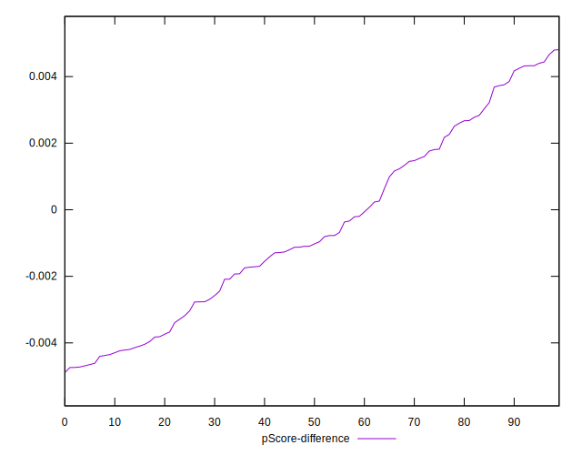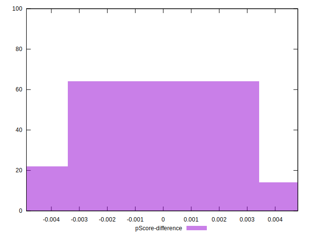