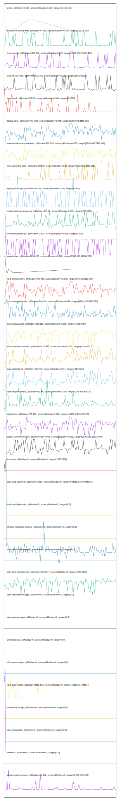

# //correlation/astro

[→ Parent](../..)

[0. score, p90stdev=0.029, score:p90stdev=0.029, range=[0.16:0.44]](../../meta/score/samples/astro)  
[1. cumulative-layout-shift, p90stdev=0.703, score:p90stdev=0.37, range=[0.113:1.929]](../../cumulative-layout-shift/samples/astro/)  
[2. first-cpu-idle, p90stdev=2470.361, score:p90stdev=0.129, range=[6916.639:15051.487]](../../first-cpu-idle/samples/astro/)  
[3. unused-css-rules, p90stdev=632.351, score:p90stdev=0.129, range=[160:2420]](../../unused-css-rules/samples/astro/)  
[4. uses-http2, p90stdev=139.85, score:p90stdev=0.106, range=[0:1030]](../../uses-http2/samples/astro/)  
[5. bootup-time, p90stdev=437.298, score:p90stdev=0.075, range=[1758.676:3880.016]](../../bootup-time/samples/astro/)  
[6. mainthread-work-breakdown, p90stdev=653.529, score:p90stdev=0.073, range=[3645.648:7647.496]](../../mainthread-work-breakdown/samples/astro/)  
[7. first-contentful-paint, p90stdev=259.02, score:p90stdev=0.06, range=[2420.626:3332.186]](../../first-contentful-paint/samples/astro/)  
[8. legacy-javascript, p90stdev=74.164, score:p90stdev=0.059, range=[0:300]](../../legacy-javascript/samples/astro/)  
[9. render-blocking-resources, p90stdev=377.82, score:p90stdev=0.059, range=[528:1824]](../../render-blocking-resources/samples/astro/)  
[10. unminified-javascript, p90stdev=72.917, score:p90stdev=0.058, range=[0:300]](../../unminified-javascript/samples/astro/)  
[11. speed-index, p90stdev=1234.107, score:p90stdev=0.046, range=[8530.188:12388.378]](../../speed-index/samples/astro/)  
[12. total-blocking-time, p90stdev=368.349, score:p90stdev=0.046, range=[875.32:2530.439]](../../total-blocking-time/samples/astro/)  
[13. first-meaningful-paint, p90stdev=349.491, score:p90stdev=0.039, range=[4993.167:6820.678]](../../first-meaningful-paint/samples/astro/)  
[14. unused-javascript, p90stdev=322.551, score:p90stdev=0.038, range=[2700:4410]](../../unused-javascript/samples/astro/)  
[15. estimated-input-latency, p90stdev=110.857, score:p90stdev=0.031, range=[43.6:647.2]](../../estimated-input-latency/samples/astro/)  
[16. max-potential-fid, p90stdev=161.533, score:p90stdev=0.011, range=[447:1293]](../../max-potential-fid/samples/astro/)  
[17. uses-rel-preconnect, p90stdev=13.44, score:p90stdev=0.008, range=[279.985:408.35]](../../uses-rel-preconnect/samples/astro/)  
[18. interactive, p90stdev=279.901, score:p90stdev=0.006, range=[14381.438:16170.15]](../../interactive/samples/astro/)  
[19. largest-contentful-paint, p90stdev=1844.683, score:p90stdev=0.002, range=[2630.245:16503.934]](../../largest-contentful-paint/samples/astro/)  
[20. dom-size, p90stdev=0, score:p90stdev=0, range=[1288:1288]](../../dom-size/samples/astro/)  
[21. uses-long-cache-ttl, p90stdev=0.863, score:p90stdev=0, range=[946985.178:947889.07]](../../uses-long-cache-ttl/samples/astro/)  
[22. uses-passive-event-listeners, p90stdev=NaN, score:p90stdev=0, range=[NaN:NaN]](../../uses-passive-event-listeners/samples/astro/)  
[23. no-document-write, p90stdev=NaN, score:p90stdev=0, range=[NaN:NaN]](../../no-document-write/samples/astro/)  
[24. duplicated-javascript, p90stdev=0, score:p90stdev=0, range=[0:0]](../../duplicated-javascript/samples/astro/)  
[25. efficient-animated-content, p90stdev=0, score:p90stdev=0, range=[0:0]](../../efficient-animated-content/samples/astro/)  
[26. uses-responsive-images, p90stdev=0, score:p90stdev=0, range=[0:0]](../../uses-responsive-images/samples/astro/)  
[27. uses-text-compression, p90stdev=500.267, score:p90stdev=0, range=[6710:8820]](../../uses-text-compression/samples/astro/)  
[28. uses-optimized-images, p90stdev=0, score:p90stdev=0, range=[0:0]](../../uses-optimized-images/samples/astro/)  
[29. uses-webp-images, p90stdev=0, score:p90stdev=0, range=[0:0]](../../uses-webp-images/samples/astro/)  
[30. unminified-css, p90stdev=0, score:p90stdev=0, range=[0:0]](../../unminified-css/samples/astro/)  
[31. offscreen-images, p90stdev=0, score:p90stdev=0, range=[0:0]](../../offscreen-images/samples/astro/)  
[32. total-byte-weight, p90stdev=3863.833, score:p90stdev=0, range=[1731072:1748177]](../../total-byte-weight/samples/astro/)  
[33. preload-lcp-image, p90stdev=0, score:p90stdev=0, range=[0:0]](../../preload-lcp-image/samples/astro/)  
[34. unsized-images, p90stdev=NaN, score:p90stdev=0, range=[NaN:NaN]](../../unsized-images/samples/astro/)  
[35. third-party-summary, p90stdev=NaN, score:p90stdev=0, range=[NaN:NaN]](../../third-party-summary/samples/astro/)  
[36. font-display, p90stdev=NaN, score:p90stdev=0, range=[NaN:NaN]](../../font-display/samples/astro/)  
[37. uses-rel-preload, p90stdev=0, score:p90stdev=0, range=[0:0]](../../uses-rel-preload/samples/astro/)  
[38. redirects, p90stdev=0, score:p90stdev=0, range=[0:0]](../../redirects/samples/astro/)  
[39. server-response-time, p90stdev=10.469, score:p90stdev=0, range=[2.608:593.103]](../../server-response-time/samples/astro/)  
[40. timing-budget, p90stdev=NaN, score:p90stdev=NaN, range=[NaN:NaN]](../../timing-budget/samples/astro/)  
[41. metrics, p90stdev=NaN, score:p90stdev=NaN, range=[NaN:NaN]](../../metrics/samples/astro/)  
[42. screenshot-thumbnails, p90stdev=NaN, score:p90stdev=NaN, range=[NaN:NaN]](../../screenshot-thumbnails/samples/astro/)  
