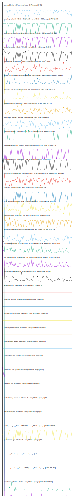

# //correlation/card

[→ Parent](../..)

[0. score, p90stdev=0.073, score:p90stdev=0.073, range=[0.45:1]](../../meta/score/samples/card)  
[1. uses-long-cache-ttl, p90stdev=301143.417, score:p90stdev=0.388, range=[0:723419.156]](../../uses-long-cache-ttl/samples/card/)  
[2. uses-text-compression, p90stdev=1831.401, score:p90stdev=0.295, range=[300:4980]](../../uses-text-compression/samples/card/)  
[3. unused-javascript, p90stdev=927.563, score:p90stdev=0.281, range=[0:3000]](../../unused-javascript/samples/card/)  
[4. max-potential-fid, p90stdev=110.141, score:p90stdev=0.261, range=[44:1444]](../../max-potential-fid/samples/card/)  
[5. largest-contentful-paint, p90stdev=1012.123, score:p90stdev=0.223, range=[1456.692:7790.186]](../../largest-contentful-paint/samples/card/)  
[6. estimated-input-latency, p90stdev=23.451, score:p90stdev=0.123, range=[12.8:768]](../../estimated-input-latency/samples/card/)  
[7. total-blocking-time, p90stdev=146.673, score:p90stdev=0.121, range=[0:1437]](../../total-blocking-time/samples/card/)  
[8. third-party-summary, p90stdev=NaN, score:p90stdev=0.118, range=[NaN:NaN]](../../third-party-summary/samples/card/)  
[9. uses-http2, p90stdev=317.861, score:p90stdev=0.098, range=[120:1530]](../../uses-http2/samples/card/)  
[10. uses-rel-preconnect, p90stdev=107.671, score:p90stdev=0.089, range=[0:325.866]](../../uses-rel-preconnect/samples/card/)  
[11. cumulative-layout-shift, p90stdev=0.053, score:p90stdev=0.078, range=[0.005:0.145]](../../cumulative-layout-shift/samples/card/)  
[12. unminified-javascript, p90stdev=71.574, score:p90stdev=0.057, range=[0:230]](../../unminified-javascript/samples/card/)  
[13. mainthread-work-breakdown, p90stdev=319.525, score:p90stdev=0.039, range=[973.82:3873.468]](../../mainthread-work-breakdown/samples/card/)  
[14. dom-size, p90stdev=85.363, score:p90stdev=0.028, range=[582:794]](../../dom-size/samples/card/)  
[15. first-cpu-idle, p90stdev=333.014, score:p90stdev=0.016, range=[1246.788:3418.777]](../../first-cpu-idle/samples/card/)  
[16. uses-rel-preload, p90stdev=71.303, score:p90stdev=0.01, range=[909:1422]](../../uses-rel-preload/samples/card/)  
[17. interactive, p90stdev=255.809, score:p90stdev=0.008, range=[1249.346:15475.104]](../../interactive/samples/card/)  
[18. first-meaningful-paint, p90stdev=80.202, score:p90stdev=0.004, range=[1212.792:1865.475]](../../first-meaningful-paint/samples/card/)  
[19. first-contentful-paint, p90stdev=80.279, score:p90stdev=0.004, range=[1212.792:1865.475]](../../first-contentful-paint/samples/card/)  
[20. bootup-time, p90stdev=83.6, score:p90stdev=0.001, range=[71.996:2011.62]](../../bootup-time/samples/card/)  
[21. uses-passive-event-listeners, p90stdev=NaN, score:p90stdev=0, range=[NaN:NaN]](../../uses-passive-event-listeners/samples/card/)  
[22. no-document-write, p90stdev=NaN, score:p90stdev=0, range=[NaN:NaN]](../../no-document-write/samples/card/)  
[23. legacy-javascript, p90stdev=0, score:p90stdev=0, range=[0:0]](../../legacy-javascript/samples/card/)  
[24. duplicated-javascript, p90stdev=0, score:p90stdev=0, range=[0:0]](../../duplicated-javascript/samples/card/)  
[25. efficient-animated-content, p90stdev=0, score:p90stdev=0, range=[0:0]](../../efficient-animated-content/samples/card/)  
[26. uses-responsive-images, p90stdev=0, score:p90stdev=0, range=[0:0]](../../uses-responsive-images/samples/card/)  
[27. uses-optimized-images, p90stdev=0, score:p90stdev=0, range=[0:0]](../../uses-optimized-images/samples/card/)  
[28. uses-webp-images, p90stdev=0, score:p90stdev=0, range=[0:0]](../../uses-webp-images/samples/card/)  
[29. unused-css-rules, p90stdev=0, score:p90stdev=0, range=[0:110]](../../unused-css-rules/samples/card/)  
[30. unminified-css, p90stdev=0, score:p90stdev=0, range=[0:0]](../../unminified-css/samples/card/)  
[31. render-blocking-resources, p90stdev=0, score:p90stdev=0, range=[0:0]](../../render-blocking-resources/samples/card/)  
[32. offscreen-images, p90stdev=0, score:p90stdev=0, range=[0:0]](../../offscreen-images/samples/card/)  
[33. total-byte-weight, p90stdev=510916.31, score:p90stdev=0, range=[542918:1786028]](../../total-byte-weight/samples/card/)  
[34. preload-lcp-image, p90stdev=0, score:p90stdev=0, range=[0:0]](../../preload-lcp-image/samples/card/)  
[35. unsized-images, p90stdev=NaN, score:p90stdev=0, range=[NaN:NaN]](../../unsized-images/samples/card/)  
[36. font-display, p90stdev=NaN, score:p90stdev=0, range=[NaN:NaN]](../../font-display/samples/card/)  
[37. redirects, p90stdev=0, score:p90stdev=0, range=[0:0]](../../redirects/samples/card/)  
[38. server-response-time, p90stdev=13.838, score:p90stdev=0, range=[2.508:4991.923]](../../server-response-time/samples/card/)  
[39. speed-index, p90stdev=80.355, score:p90stdev=0, range=[1212.792:14907.602]](../../speed-index/samples/card/)  
