# //cumulative-layout-shift/samples/agenda

[→ Parent](../..)


## Raw


```yaml
p90min: 0.006063152419196235
p90max: 0.1434961832894219
p90range: 0.13743303087022568
p90mean: 0.09530448975574328
median: 0.1400182305441962
p90stdev: 0.0638177305625768
mad: 0.003477952745225693
stdevBySn: 0.004147806443956162
lfitCenter: 0.10425735100116115
lfitStdev: 0.06669714783443488
mfitCenter: 0.10425735100116115
mfitStdev: 0.08359247838363344
mfitConfidence: 0.008359247838363344
p90skewness: -0.6725022461387216
p90eccentricity: 0.9999999999999999
p90discretization: 23.5
outlandishness: 0.9780949498923256

```

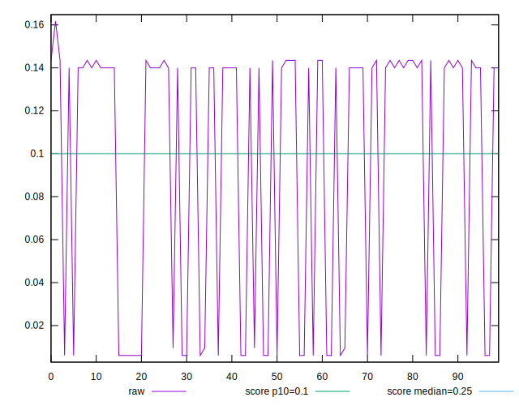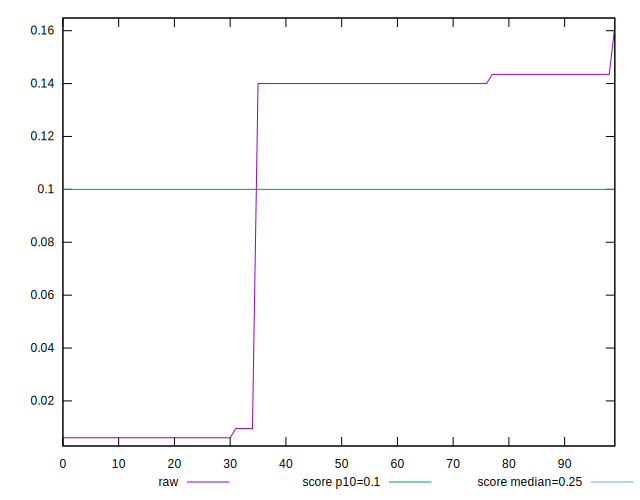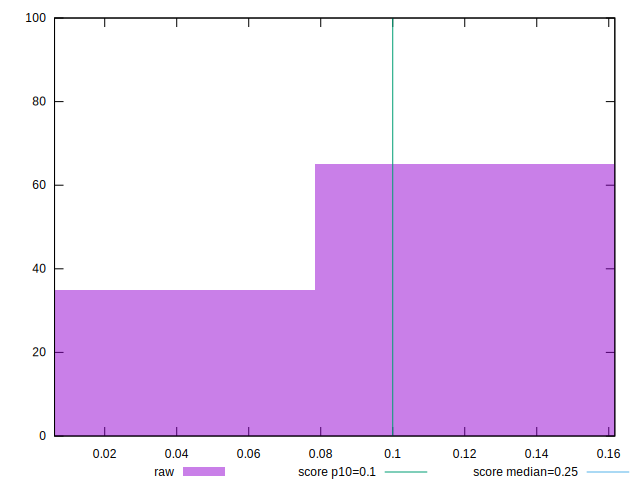
## Score


```yaml
p90min: 0.78
p90max: 1
p90range: 0.21999999999999997
p90mean: 0.8593617021276602
median: 0.79
p90stdev: 0.10110883656310811
mad: 0.010000000000000009
stdevBySn: 0.011926000000000011
lfitCenter: 0.8455466596455679
lfitStdev: 0.10555054670525577
mfitCenter: 0.8455466596455679
mfitStdev: 0.13228799252019086
mfitConfidence: 0.013228799252019086
p90skewness: 0.6690100184164605
p90eccentricity: 1.0000000000000009
p90discretization: 31.333333333333332
outlandishness: 1.0031170575683819

```

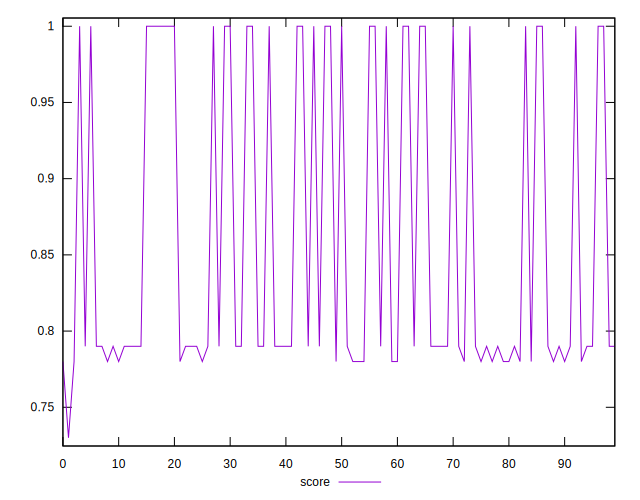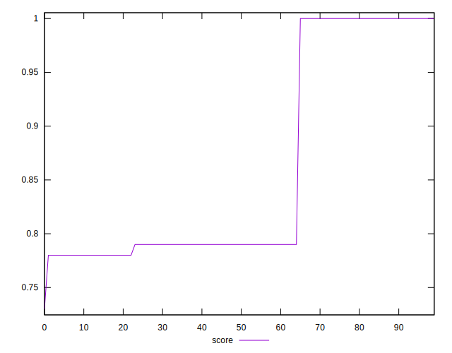
## Raw Estimate

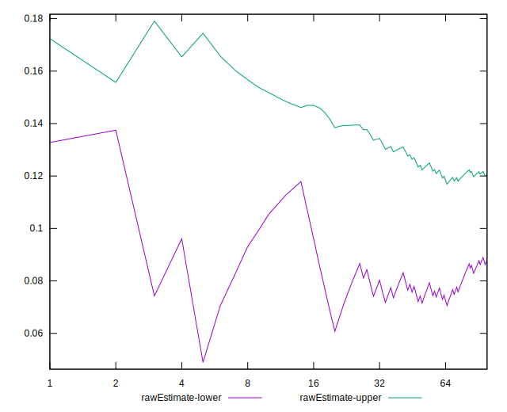
## Score Estimate

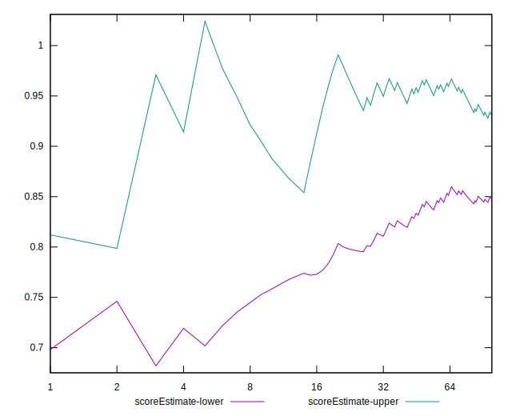
## P Score


```yaml
p90min: 0.7812592330863557
p90max: 0.9999999011422622
p90range: 0.21874066805590653
p90mean: 0.86018844011948
median: 0.7912509844914699
p90stdev: 0.10051490998966905
mad: 0.009991751405114213
stdevBySn: 0.011916162725739211
lfitCenter: 0.8464467667558938
lfitStdev: 0.10493508547035468
mfitCenter: 0.8464467667558938
mfitStdev: 0.1315166262527435
mfitConfidence: 0.01315166262527435
p90skewness: 0.6689638633234407
p90eccentricity: 1.000000000000001
p90discretization: 23.5
outlandishness: 1.0030319718491054

```

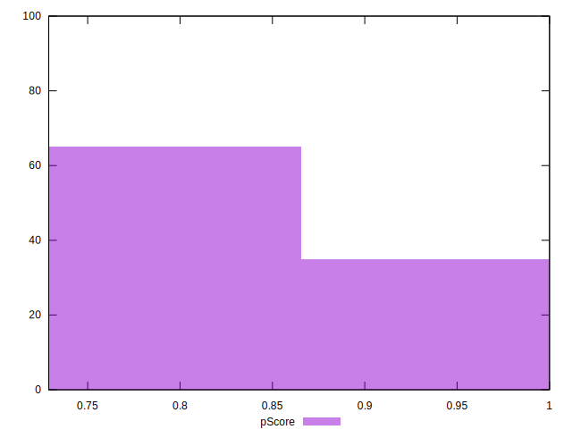
## Score Difference


```yaml
p90min: 0
p90max: 0
p90range: 0
p90mean: 0
median: 0
p90stdev: 0
mad: 0
stdevBySn: 0
lfitCenter: 0
lfitStdev: 0
mfitCenter: 0
mfitStdev: 0
mfitConfidence: 0
p90skewness: .nan
p90eccentricity: .nan
p90discretization: 94
outlandishness: .nan

```


## P Score Difference


```yaml
p90min: -0.000002467780253478935
p90max: 0.001259233086355671
p90range: 0.00126170086660915
p90mean: 0.0008133912460863253
median: 0.0012509844914698753
p90stdev: 0.0005984484917002057
mad: 0.000008248594885795768
stdevBySn: 0.000009837274260800034
lfitCenter: 0.0008902994966913813
lfitStdev: 0.0006491680847716438
mfitCenter: 0.0008902994966913813
mfitStdev: 0.0008136115389570188
mfitConfidence: 0.00008136115389570188
p90skewness: -0.6239918369985807
p90eccentricity: 1.0000000000000009
p90discretization: 23.5
outlandishness: 0.9468654993539611

```

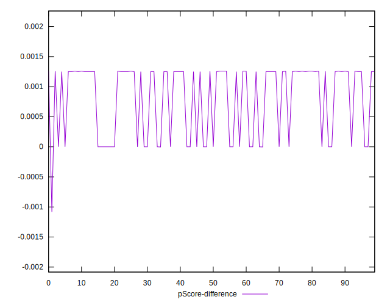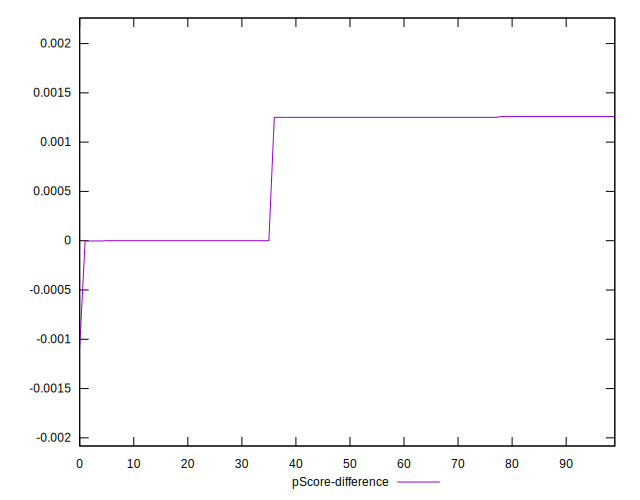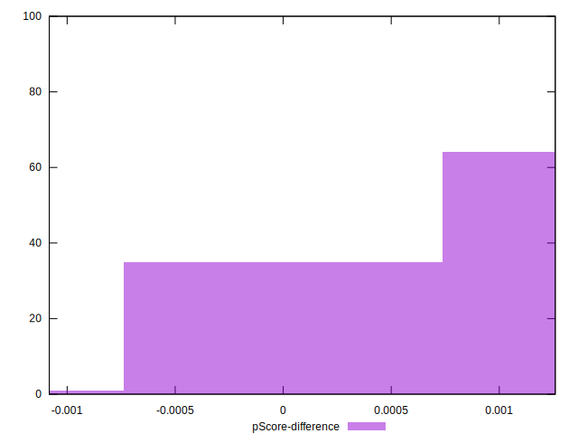