# //cumulative-layout-shift/samples/astro

[→ Parent](../..)


## Raw


```yaml
p90min: 0.11342529296875001
p90max: 1.92724853515625
p90range: 1.8138232421875
p90mean: 0.5275798610930746
median: 0.1186328125
p90stdev: 0.7030622193855756
mad: 0.003825683593750004
stdevBySn: 0.006232324951171876
lfitCenter: 0.41198110387400333
lfitStdev: 0.5986464887916675
mfitCenter: 0.41198110387400333
mfitStdev: 0.7502921084118578
mfitConfidence: 0.07502921084118577
p90skewness: 1.1689252063762863
p90eccentricity: 1.0000000000000002
p90discretization: 1.4242424242424243
outlandishness: 1.115297965926712

```

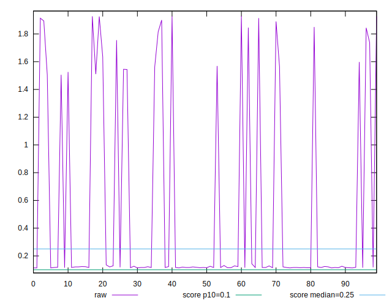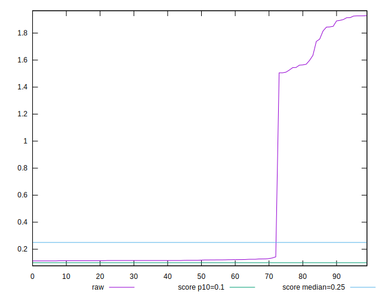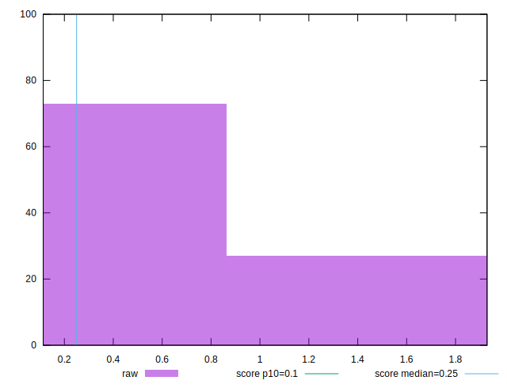
## Score


```yaml
p90min: 0
p90max: 0.87
p90range: 0.87
p90mean: 0.6351063829787233
median: 0.85
p90stdev: 0.36994463266258265
mad: 0.010000000000000009
stdevBySn: 0.023852000000000022
lfitCenter: 0.6944750355731227
lfitStdev: 0.3189444831776206
mfitCenter: 0.6944750355731227
mfitStdev: 0.3997376301875306
mfitConfidence: 0.039973763018753064
p90skewness: -1.1178717890841292
p90eccentricity: 1.0000000000000022
p90discretization: 9.4
outlandishness: 0.9625483357490973

```

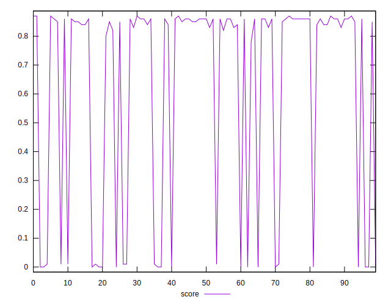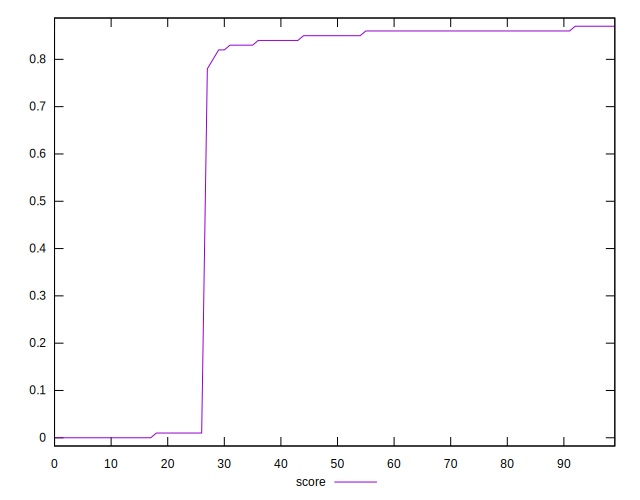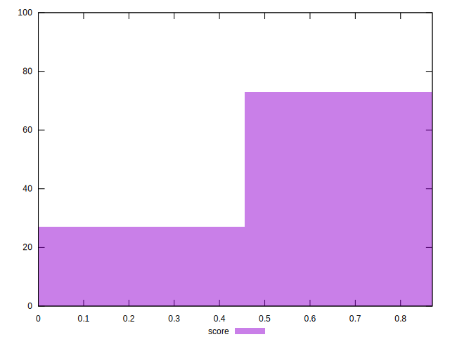
## Raw Estimate

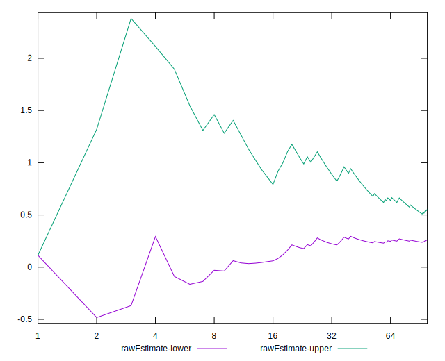
## Score Estimate

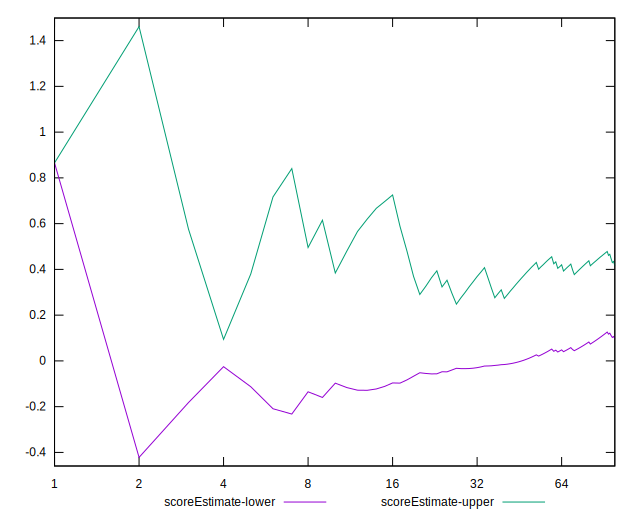
## P Score


```yaml
p90min: 0.002141465002720888
p90max: 0.8654981956894828
p90range: 0.863356730686762
p90mean: 0.6346579408816585
median: 0.851425484345681
p90stdev: 0.36960795059586654
mad: 0.010370491308294927
stdevBySn: 0.016841425823756948
lfitCenter: 0.6938878350135808
lfitStdev: 0.318793696902402
mfitCenter: 0.6938878350135808
mfitStdev: 0.39954864761689585
mfitConfidence: 0.039954864761689586
p90skewness: -1.1181722498311961
p90eccentricity: 0.9999999999999999
p90discretization: 1.4242424242424243
outlandishness: 0.9623891168168276

```

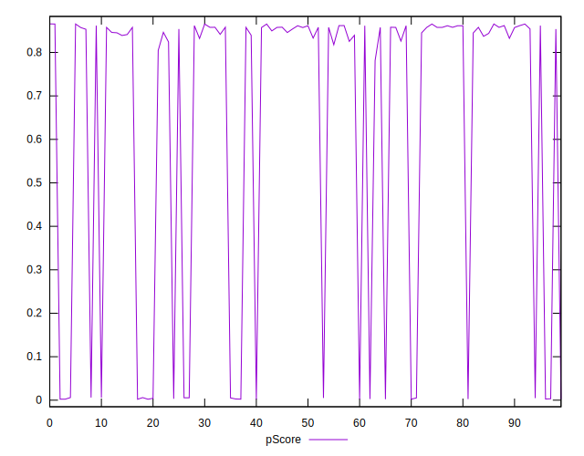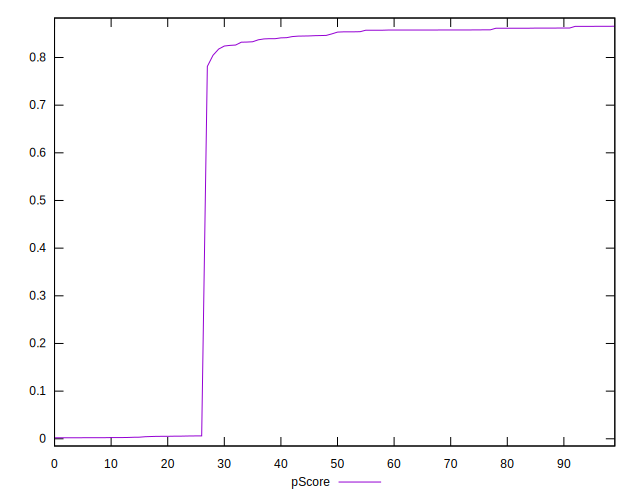
## Score Difference


```yaml
p90min: 0
p90max: 1.1102230246251565e-16
p90range: 1.1102230246251565e-16
p90mean: 4.724353296277262e-18
median: 0
p90stdev: 2.240957533134066e-17
mad: 0
stdevBySn: 0
lfitCenter: 3.922422896608463e-18
lfitStdev: 9.484689165475498e-18
mfitCenter: 3.922422896608463e-18
mfitStdev: 1.1887295031095097e-17
mfitConfidence: 1.1887295031095097e-18
p90skewness: 4.532597979574664
p90eccentricity: 1.0000000000000007
p90discretization: 47
outlandishness: 2.706025000000001

```

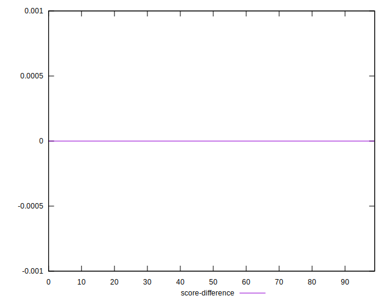
## P Score Difference


```yaml
p90min: -0.004814205411940711
p90max: 0.004310885345215676
p90range: 0.009125090757156387
p90mean: -0.0005176985537541763
median: -0.0007521618051945511
p90stdev: 0.0029197219639842515
mad: 0.0028934834005639454
stdevBySn: 0.0037719546875949897
lfitCenter: -0.0005061684744294071
lfitStdev: 0.0030080885479828847
mfitCenter: -0.0005061684744294071
mfitStdev: 0.0037700799072774194
mfitConfidence: 0.00037700799072774193
p90skewness: -0.0013110498145283895
p90eccentricity: 1.0000000000000007
p90discretization: 1.46875
outlandishness: 0.9012208704988923

```

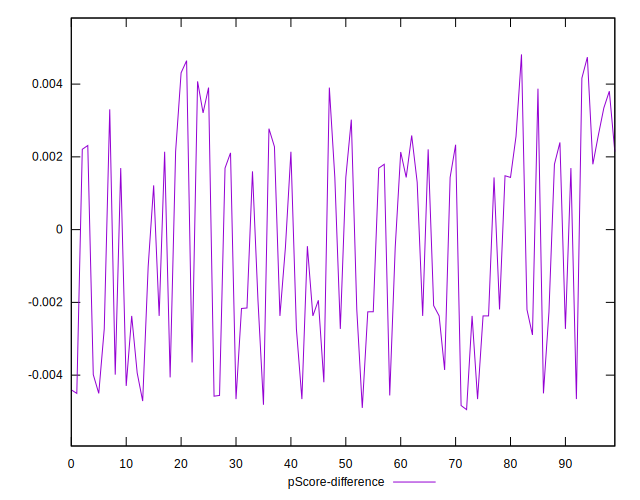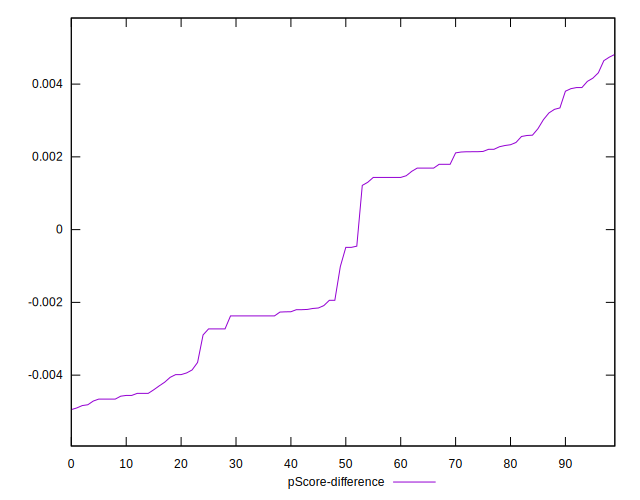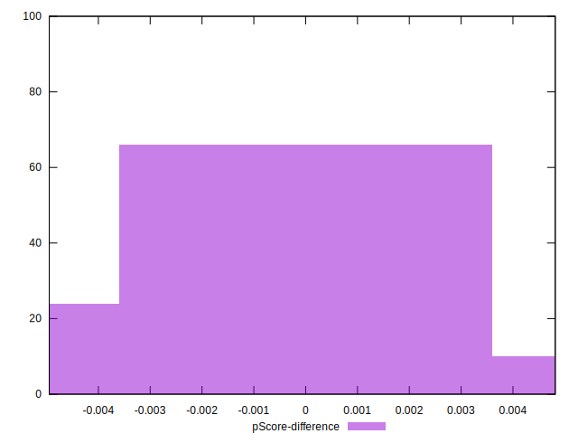