# //cumulative-layout-shift/samples/card

[→ Parent](../..)


## Raw


```yaml
p90min: 0.011352840529547797
p90max: 0.12706176386939155
p90range: 0.11570892333984376
p90mean: 0.09222466867029872
median: 0.12706176386939155
p90stdev: 0.05307861693623911
mad: 0
stdevBySn: 0
lfitCenter: 0.10060552614303804
lfitStdev: 0.05153853986011803
mfitCenter: 0.10060552614303804
mfitStdev: 0.06459398068828155
mfitConfidence: 0.006491939322984623
p90skewness: -0.8672933772362135
p90eccentricity: 1.0000000000000007
p90discretization: 46.5
outlandishness: 0.9739044799224925

```

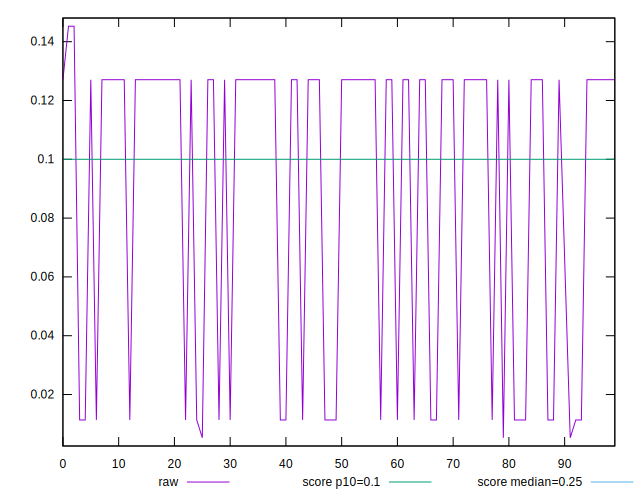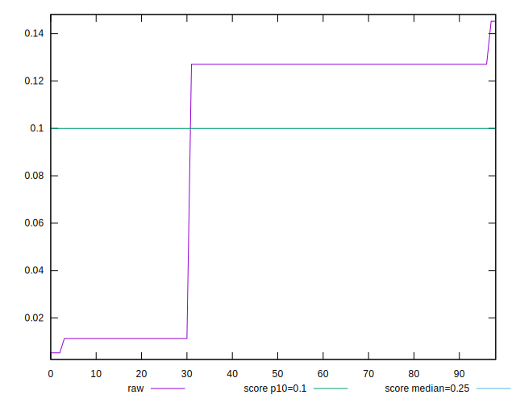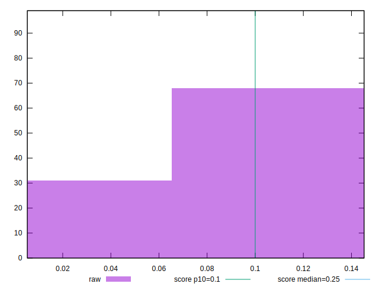
## Score


```yaml
p90min: 0.83
p90max: 1
p90range: 0.17000000000000004
p90mean: 0.8811827956989239
median: 0.83
p90stdev: 0.07798331035073681
mad: 0
stdevBySn: 0
lfitCenter: 0.8685188084002662
lfitStdev: 0.07559889344945846
mfitCenter: 0.8685188084002662
mfitStdev: 0.09474916202095508
mfitConfidence: 0.009522649079518181
p90skewness: 0.8672933772362492
p90eccentricity: 1.0000000000000007
p90discretization: 46.5
outlandishness: 1.002360553502148

```

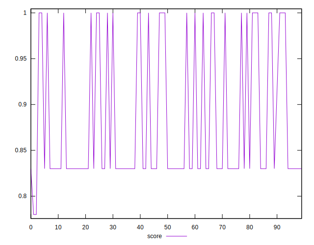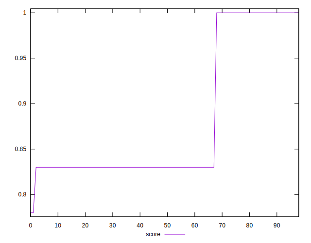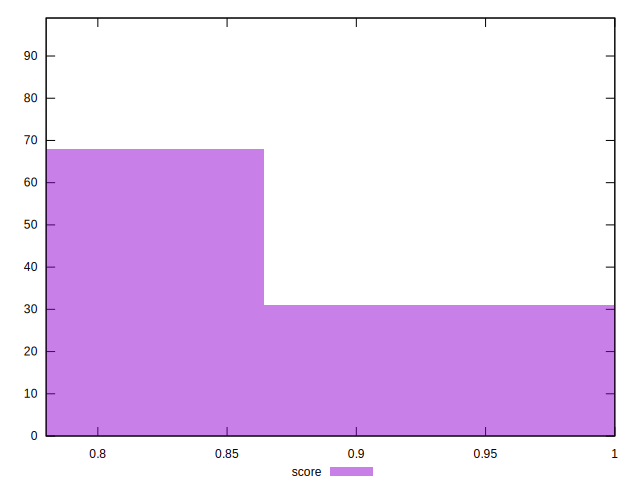
## Raw Estimate

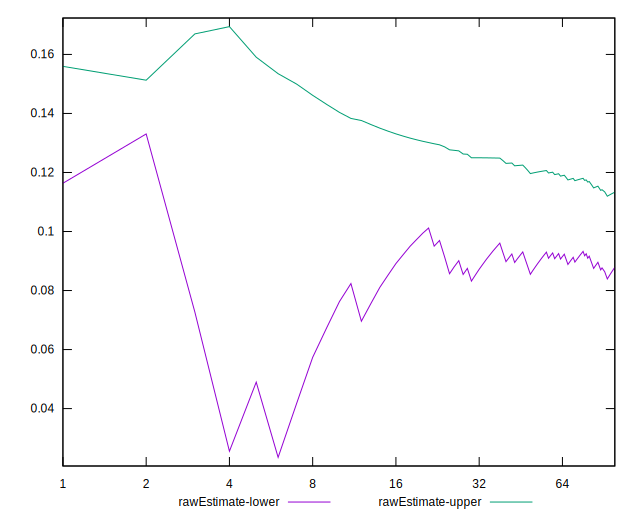
## Score Estimate

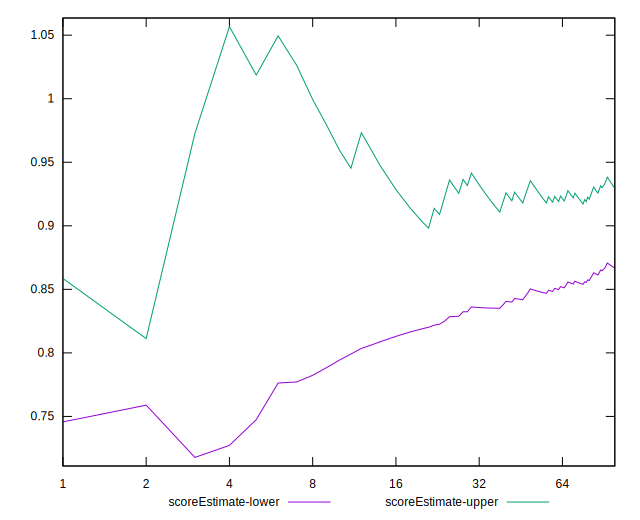
## P Score


```yaml
p90min: 0.8280724101476665
p90max: 0.9999923522960321
p90range: 0.1719199421483656
p90mean: 0.879833252945025
median: 0.8280724101476665
p90stdev: 0.0788640364943336
mad: 0
stdevBySn: 0
lfitCenter: 0.8670140009393256
lfitStdev: 0.07646000493045384
mfitCenter: 0.8670140009393256
mfitStdev: 0.09582840521497726
mfitConfidence: 0.009631117101703524
p90skewness: 0.8672933772361651
p90eccentricity: 0.9999999999999989
p90discretization: 46.5
outlandishness: 1.0023318153770533

```

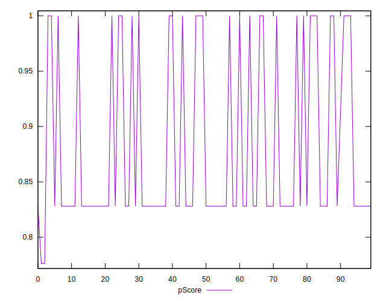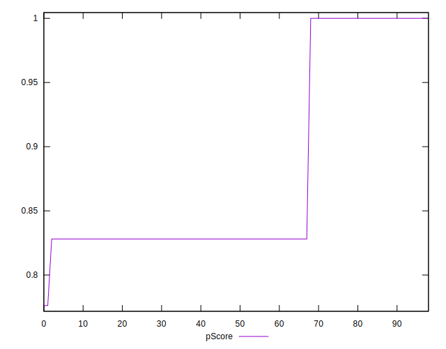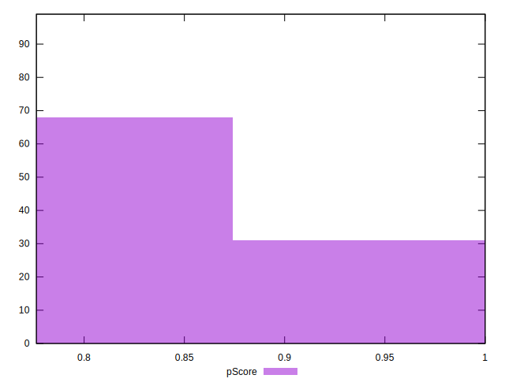
## Score Difference


```yaml
p90min: 0
p90max: 1.1102230246251565e-16
p90range: 1.1102230246251565e-16
p90mean: 7.520865650686544e-17
median: 1.1102230246251565e-16
p90stdev: 5.1898903619797074e-17
mad: 0
stdevBySn: 0
lfitCenter: 8.298932231593312e-17
lfitStdev: 5.2525620607893767e-17
mfitCenter: 8.298932231593312e-17
mfitStdev: 6.583110294538569e-17
mfitConfidence: 6.616274788033471e-18
p90skewness: -0.7590721152765895
p90eccentricity: 1.0000000000000007
p90discretization: 46.5
outlandishness: 0.9685059208868734

```

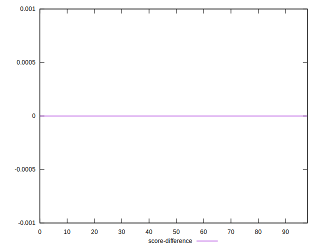
## P Score Difference


```yaml
p90min: -0.0019275898523334334
p90max: -0.000007647703967883501
p90range: 0.0019199421483655499
p90mean: -0.0013495427539007947
median: -0.0019275898523334334
p90stdev: 0.0008807261435967705
mad: 0
stdevBySn: 0
lfitCenter: -0.0015048074609405812
lfitStdev: 0.0008611114809953773
mfitCenter: -0.0015048074609405812
mfitStdev: 0.0010792431940221745
mfitConfidence: 0.00010846802218534203
p90skewness: 0.8672933772362175
p90eccentricity: 1.0000000000000002
p90discretization: 46.5
outlandishness: 1.0211840361605362

```

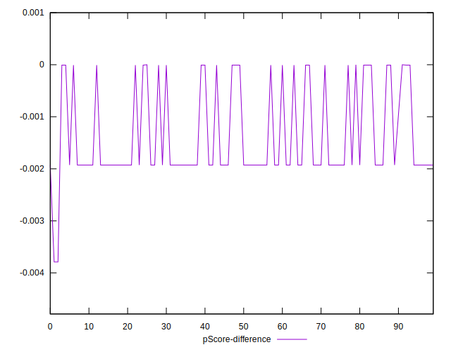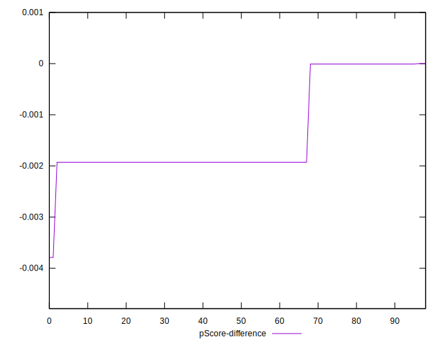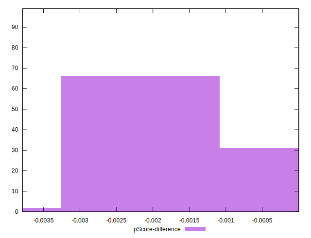