# //cumulative-layout-shift/samples/music

[→ Parent](../..)


## Raw


```yaml
p90min: 0.023974609375
p90max: 0.09531401199764676
p90range: 0.07133940262264676
p90mean: 0.06564873222820018
median: 0.08130538569556343
p90stdev: 0.027383265296921432
mad: 0.011165608723958317
stdevBySn: 0.014859264143880195
lfitCenter: 0.06873185644419323
lfitStdev: 0.02733077801188342
mfitCenter: 0.06873185644419323
mfitStdev: 0.03425405050059299
mfitConfidence: 0.003425405050059299
p90skewness: -0.6258953866939974
p90eccentricity: 1
p90discretization: 1.7735849056603774
outlandishness: 0.987068742865383

```

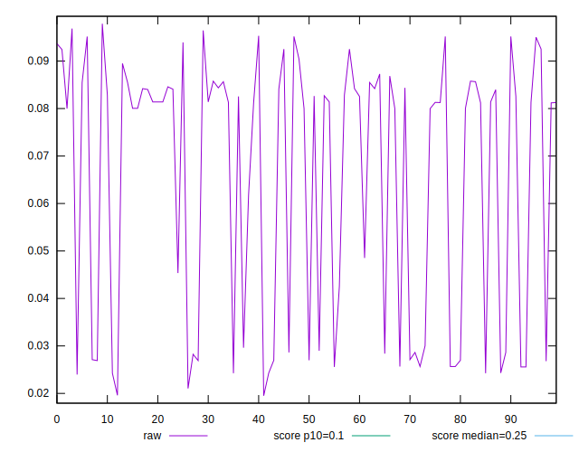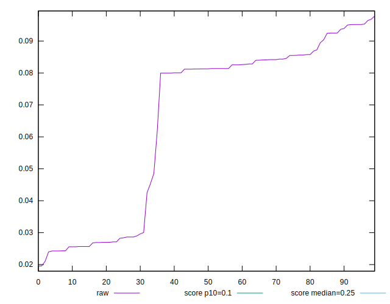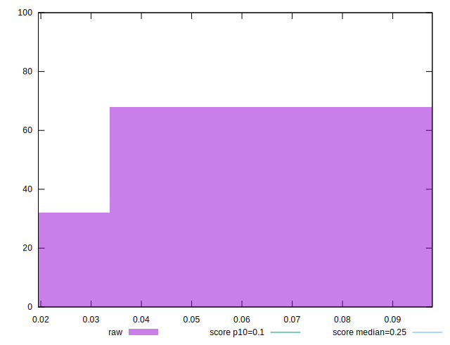
## Score


```yaml
p90min: 0.91
p90max: 1
p90range: 0.08999999999999997
p90mean: 0.9557446808510635
median: 0.94
p90stdev: 0.032534412606062976
mad: 0.019999999999999907
stdevBySn: 0.02385199999999989
lfitCenter: 0.9531129816817151
lfitStdev: 0.031681643978796095
mfitCenter: 0.9531129816817151
mfitStdev: 0.039707052331976564
mfitConfidence: 0.003970705233197656
p90skewness: 0.41562716394225163
p90eccentricity: 1
p90discretization: 13.428571428571429
outlandishness: 0.9999065026307777

```

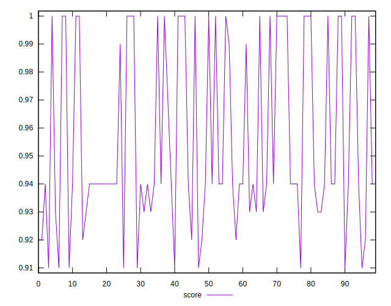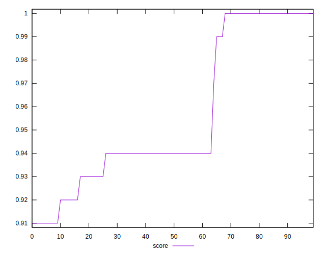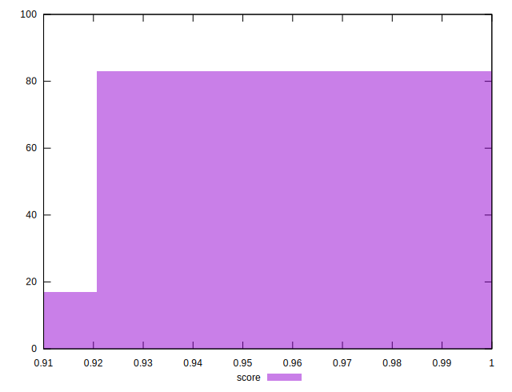
## Raw Estimate

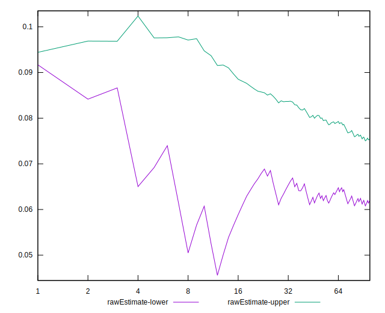
## Score Estimate

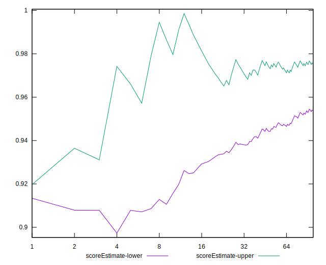
## P Score


```yaml
p90min: 0.9112794892173486
p90max: 0.9994791350758633
p90range: 0.0881996458585147
p90mean: 0.9559945207859079
median: 0.9419097235252687
p90stdev: 0.03194050541760997
mad: 0.024018039996623164
stdevBySn: 0.031765744706224563
lfitCenter: 0.9535467604504124
lfitStdev: 0.031090561532776673
mfitCenter: 0.9535467604504124
mfitStdev: 0.03896624034531596
mfitConfidence: 0.0038966240345315963
p90skewness: 0.39995871160374213
p90eccentricity: 1.0000000000000002
p90discretization: 1.7735849056603774
outlandishness: 0.9996827322450276

```

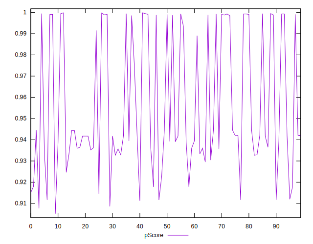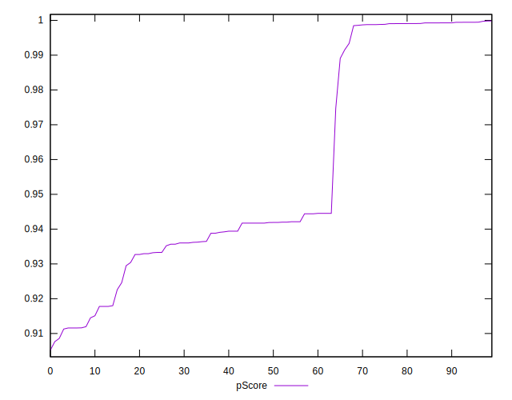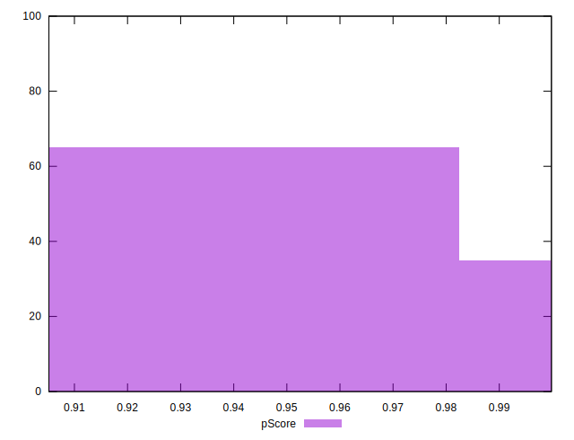
## Score Difference


```yaml
p90min: 0
p90max: 1.1102230246251565e-16
p90range: 1.1102230246251565e-16
p90mean: 4.133809134242604e-17
median: 0
p90stdev: 5.367133577997814e-17
mad: 0
stdevBySn: 0
lfitCenter: 3.455557667402701e-17
lfitStdev: 5.965822729476045e-17
mfitCenter: 3.455557667402701e-17
mfitStdev: 7.477049975094197e-17
mfitConfidence: 7.477049975094197e-18
p90skewness: 0.5281426177627951
p90eccentricity: 0.9999999999999999
p90discretization: 47
outlandishness: 1.0415660408163268

```

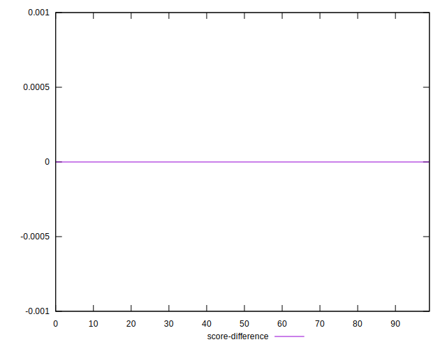
## P Score Difference


```yaml
p90min: -0.004331888147276253
p90max: 0.004527390979781387
p90range: 0.00885927912705764
p90mean: 0.00015897828997722774
median: -0.0005579153520263169
p90stdev: 0.002273541022206376
mad: 0.0021150136264670993
stdevBySn: 0.002929190571537646
lfitCenter: 0.00006030320982330132
lfitStdev: 0.0020067416209935754
mfitCenter: 0.00006030320982330132
mfitStdev: 0.0025150776460614497
mfitConfidence: 0.000251507764606145
p90skewness: 0.12189433605340134
p90eccentricity: 1.000000000000001
p90discretization: 1.7407407407407407
outlandishness: 0.8074564825659803

```

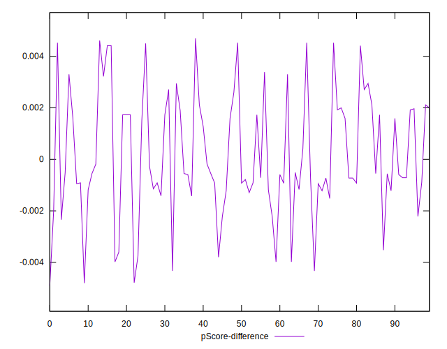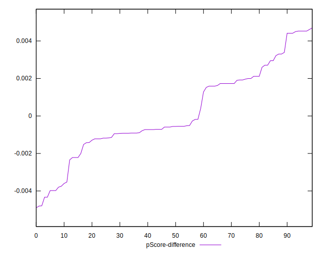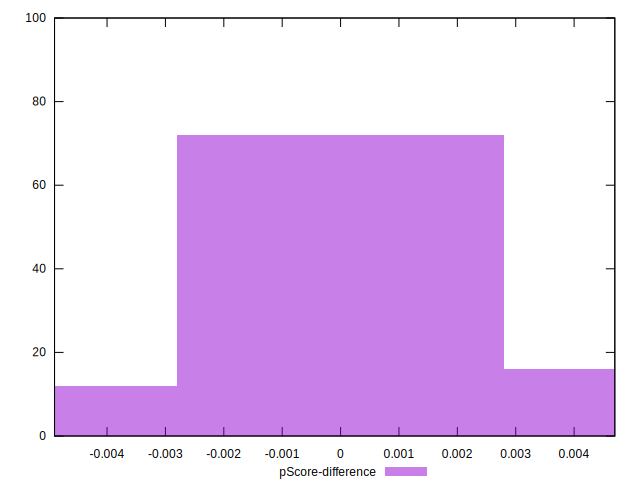