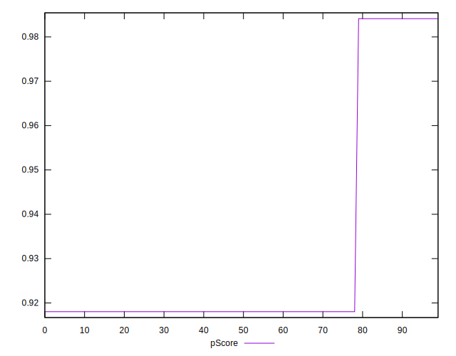

# //dom-size/samples/agenda

[→ Parent](../..)


## Raw


```yaml
p90min: 569
p90max: 781
p90range: 212
p90mean: 740.4042553191489
median: 781
p90stdev: 83.4163256571972
mad: 0
stdevBySn: 0
lfitCenter: 753.370931531205
lfitStdev: 60.22998656539922
mfitCenter: 753.370931531205
mfitStdev: 75.48709372869583
mfitConfidence: 7.548709372869583
p90skewness: -1.5681404042640332
p90eccentricity: 1.0000000000000027
p90discretization: 47
outlandishness: 0.9894277870079834

```


## Score


```yaml
p90min: 0.92
p90max: 0.98
p90range: 0.05999999999999994
p90mean: 0.9314893617021286
median: 0.92
p90stdev: 0.023608394053923697
mad: 0
stdevBySn: 0
lfitCenter: 0.9278195476798475
lfitStdev: 0.017046222612848702
mfitCenter: 0.9278195476798475
mfitStdev: 0.021364271810008082
mfitConfidence: 0.0021364271810008083
p90skewness: 1.5681404042639253
p90eccentricity: 1.0000000000000007
p90discretization: 47
outlandishness: 1.0023860721648863

```


## Raw Estimate


## Score Estimate


## P Score


```yaml
p90min: 0.9180298053112792
p90max: 0.9841121673367461
p90range: 0.06608236202546691
p90mean: 0.9306838746353041
median: 0.9180298053112792
p90stdev: 0.026001640711854467
mad: 0
stdevBySn: 0
lfitCenter: 0.926642041655531
lfitStdev: 0.018774244231149876
mfitCenter: 0.926642041655531
mfitStdev: 0.023530025735991025
mfitConfidence: 0.0023530025735991025
p90skewness: 1.5681404042641183
p90eccentricity: 1.0000000000000024
p90discretization: 47
outlandishness: 1.0026303895384692

```


## Score Difference


```yaml
p90min: 0
p90max: 0
p90range: 0
p90mean: 0
median: 0
p90stdev: 0
mad: 0
stdevBySn: 0
lfitCenter: 0
lfitStdev: 0
mfitCenter: 0
mfitStdev: 0
mfitConfidence: 0
p90skewness: .nan
p90eccentricity: .nan
p90discretization: 94
outlandishness: .nan

```


## P Score Difference


```yaml
p90min: -0.001970194688720839
p90max: 0.004112167336746131
p90range: 0.00608236202546697
p90mean: -0.0008054870668229084
median: -0.001970194688720839
p90stdev: 0.0023932466579307658
mad: 0
stdevBySn: 0
lfitCenter: -0.0011775060243169413
lfitStdev: 0.001728021618300806
mfitCenter: -0.0011775060243169413
mfitStdev: 0.002165753925982483
mfitConfidence: 0.00021657539259824828
p90skewness: 1.5681404042640392
p90eccentricity: 1.0000000000000027
p90discretization: 47
outlandishness: 0.7399839563637278

```

