# //dom-size/samples/card

[→ Parent](../..)


## Raw


```yaml
p90min: 582
p90max: 794
p90range: 212
p90mean: 750.4301075268817
median: 794
p90stdev: 85.36315815945531
mad: 0
stdevBySn: 0
lfitCenter: 763.9894957664187
lfitStdev: 64.1177742069776
mfitCenter: 763.9894957664187
mfitStdev: 80.35971294766952
mfitConfidence: 8.07645503357832
p90skewness: -1.465313928747568
p90eccentricity: 1.0000000000000004
p90discretization: 31
outlandishness: 0.9899414899703387

```

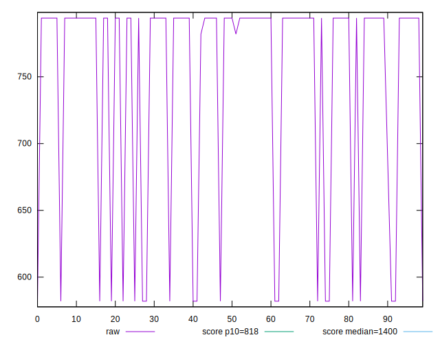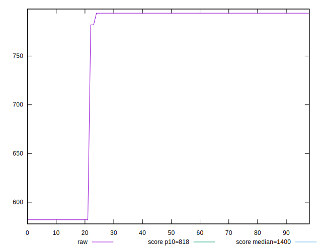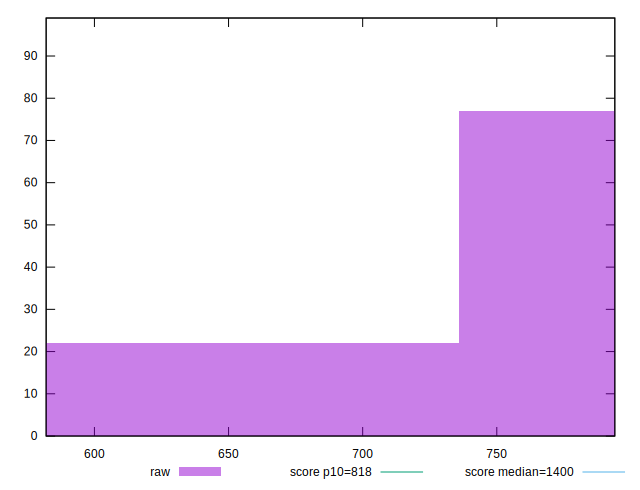
## Score


```yaml
p90min: 0.91
p90max: 0.98
p90range: 0.06999999999999995
p90mean: 0.9245161290322568
median: 0.91
p90stdev: 0.028151515134543743
mad: 0
stdevBySn: 0
lfitCenter: 0.920016362354822
lfitStdev: 0.021133183090869024
mfitCenter: 0.920016362354822
mfitStdev: 0.026486517160914887
mfitConfidence: 0.0026619951341231526
p90skewness: 1.45787078070598
p90eccentricity: 1.0000000000000002
p90discretization: 31
outlandishness: 1.0026874171211948

```

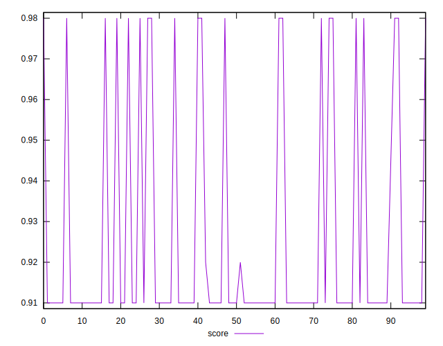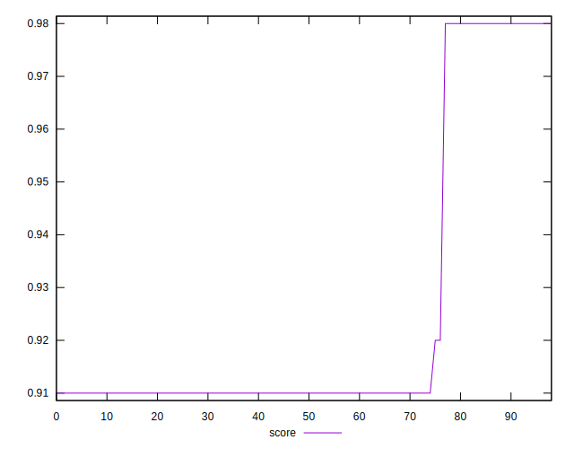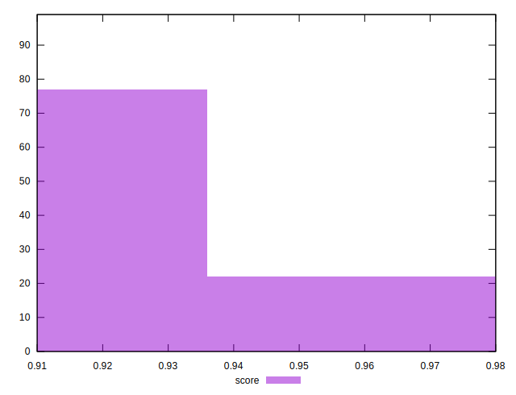
## Raw Estimate

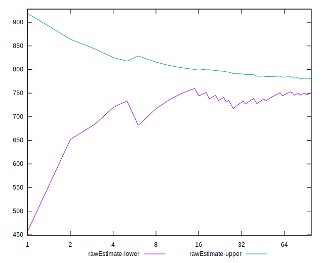
## Score Estimate

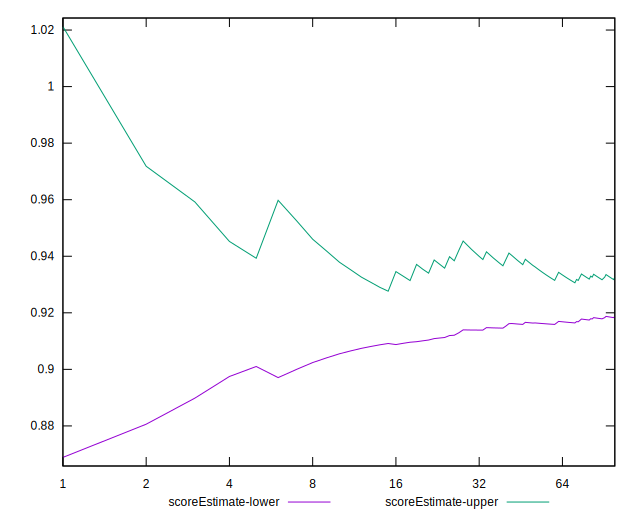
## P Score


```yaml
p90min: 0.9119035147238882
p90max: 0.9818408984193125
p90range: 0.06993738369542435
p90mean: 0.92631358708286
median: 0.9119035147238882
p90stdev: 0.028148261848946088
mad: 0
stdevBySn: 0
lfitCenter: 0.9218340524581455
lfitStdev: 0.02114135974720878
mfitCenter: 0.9218340524581455
mfitStdev: 0.026496765079911784
mfitConfidence: 0.002663025088735112
p90skewness: 1.4638081552849906
p90eccentricity: 0.999999999999998
p90discretization: 31
outlandishness: 1.0026919931497624

```

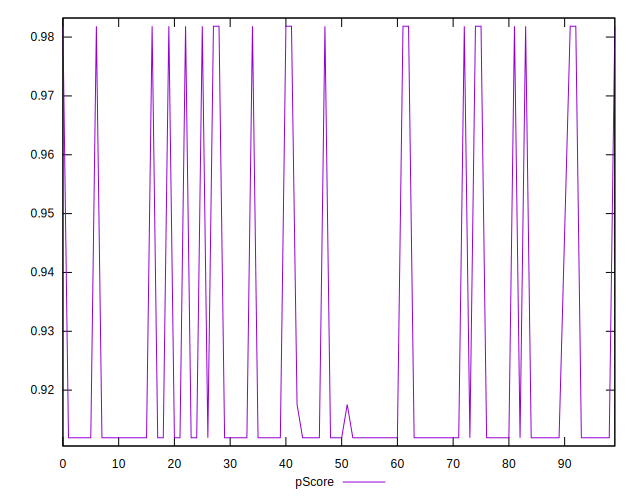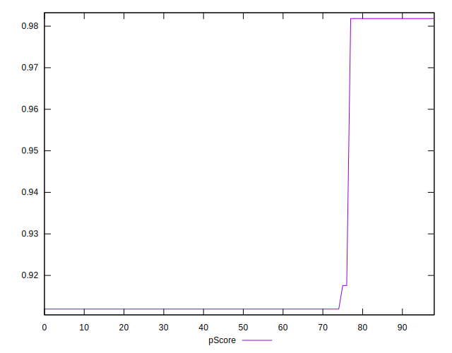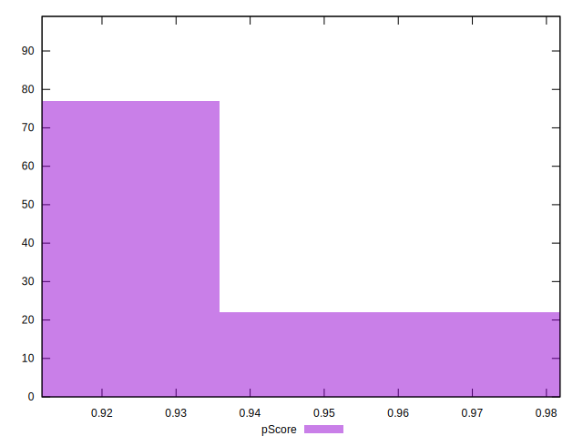
## Score Difference


```yaml
p90min: 0
p90max: 0
p90range: 0
p90mean: 0
median: 0
p90stdev: 0
mad: 0
stdevBySn: 0
lfitCenter: 0
lfitStdev: 0
mfitCenter: 0
mfitStdev: 0
mfitConfidence: 0
p90skewness: .nan
p90eccentricity: .nan
p90discretization: 93
outlandishness: .nan

```


## P Score Difference


```yaml
p90min: 0.0018408984193125644
p90max: 0.0019035147238881667
p90range: 0.0000626163045756023
p90mean: 0.0018893755583388372
median: 0.0019035147238881667
p90stdev: 0.000026180647319161804
mad: 0
stdevBySn: 0
lfitCenter: 0.001852880902096679
lfitStdev: 0.00010682690032692905
mfitCenter: 0.001852880902096679
mfitStdev: 0.00013388766456005747
mfitConfidence: 0.00001345621658795984
p90skewness: -1.3115784746777919
p90eccentricity: 0.9999999999999997
p90discretization: 46.5
outlandishness: 0.9096353524823538

```

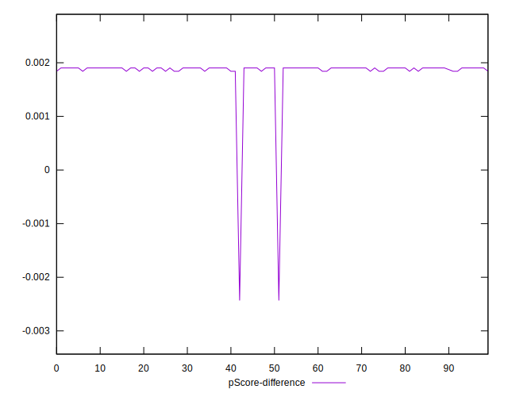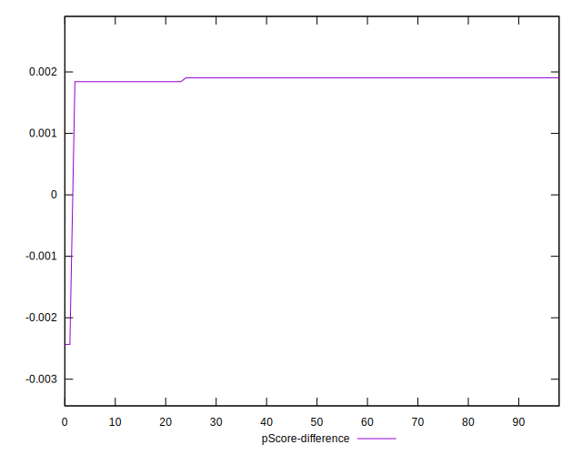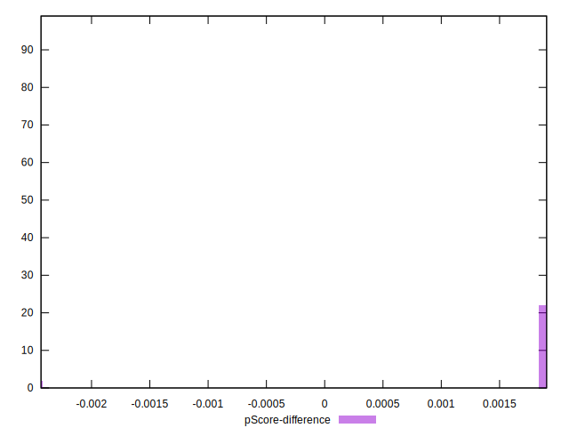