# //estimated-input-latency/samples/agenda

[→ Parent](../..)


## Raw


```yaml
p90min: 12.8
p90max: 185.3333333333333
p90range: 172.53333333333327
p90mean: 25.749159067882466
median: 12.8
p90stdev: 26.476818883851166
mad: 0
stdevBySn: 0
lfitCenter: 31.25585216911151
lfitStdev: 34.572005298488605
mfitCenter: 31.25585216911151
mfitStdev: 43.32958303954222
mfitConfidence: 4.332958303954222
p90skewness: 3.46219383317699
p90eccentricity: 0.9999999999999994
p90discretization: 2.473684210526316
outlandishness: 3.2612472000134307

```

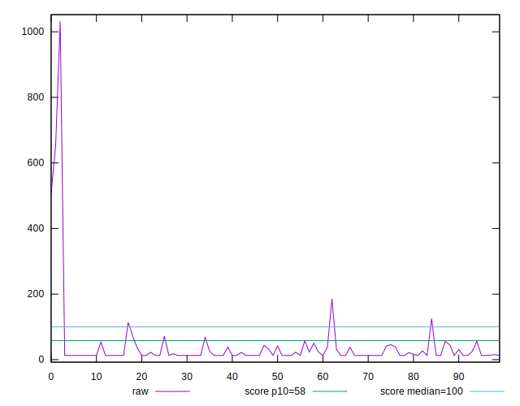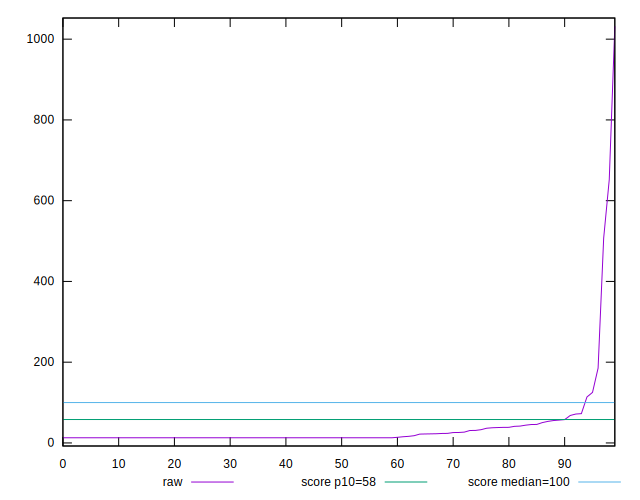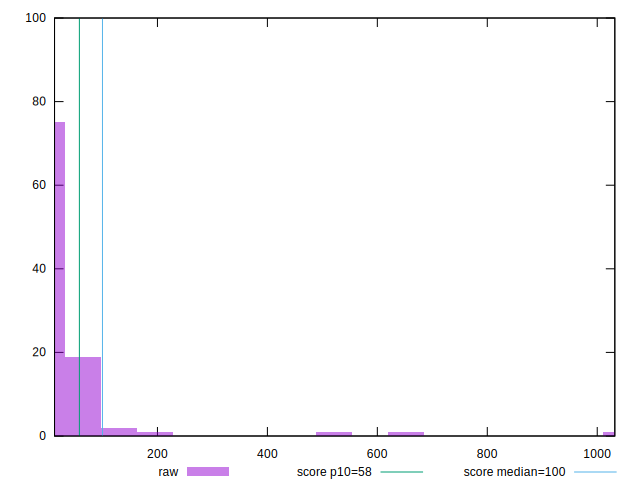
## Score


```yaml
p90min: 0.07
p90max: 1
p90range: 0.9299999999999999
p90mean: 0.963404255319149
median: 1
p90stdev: 0.13755117571049352
mad: 0
stdevBySn: 0
lfitCenter: 0.9668012974088659
lfitStdev: 0.07332386376597924
mfitCenter: 0.9668012974088659
mfitStdev: 0.09189783515296905
mfitConfidence: 0.009189783515296906
p90skewness: -4.969661381671812
p90eccentricity: 1.0000000000000007
p90discretization: 6.714285714285714
outlandishness: 0.9431120760185543

```

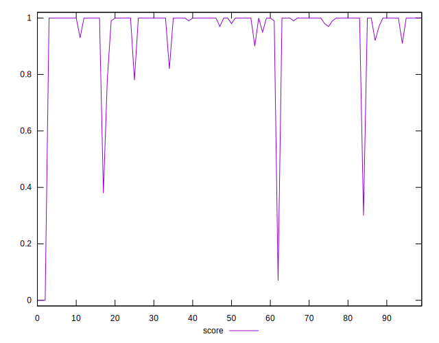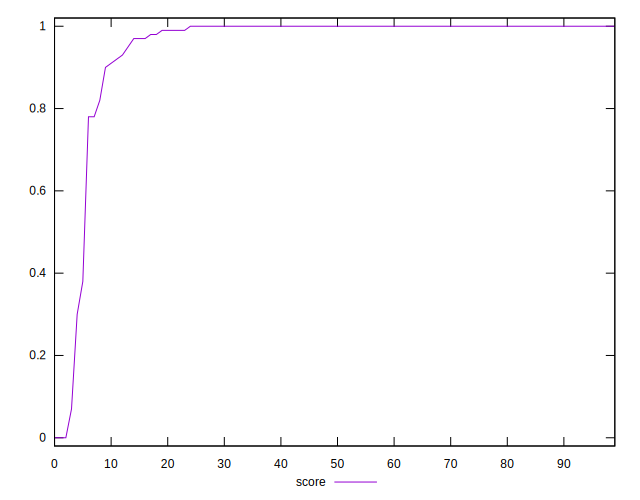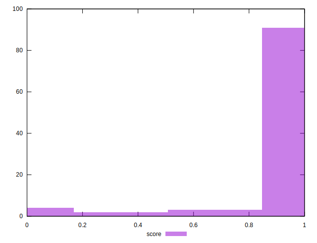
## Raw Estimate

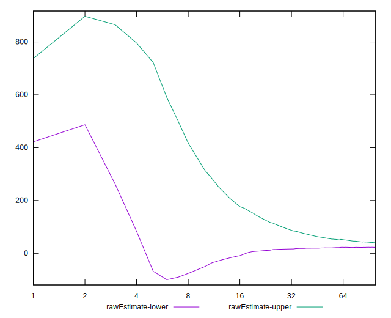
## Score Estimate

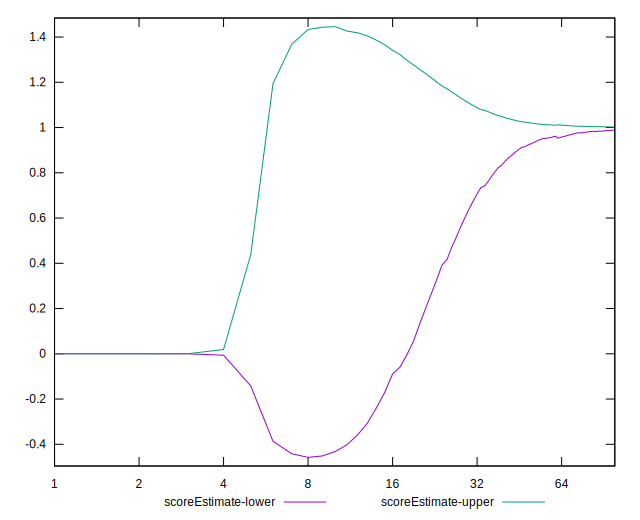
## P Score


```yaml
p90min: 0.07331332271888652
p90max: 0.9999993380488856
p90range: 0.9266860153299992
p90mean: 0.9631229511456324
median: 0.9999993380488856
p90stdev: 0.13737456511184115
mad: 0
stdevBySn: 0
lfitCenter: 0.9665759671021997
lfitStdev: 0.07337589900463987
mfitCenter: 0.9665759671021997
mfitStdev: 0.09196305165328662
mfitConfidence: 0.009196305165328662
p90skewness: -4.957602513366327
p90eccentricity: 1.0000000000000007
p90discretization: 2.473684210526316
outlandishness: 0.9431311512221819

```

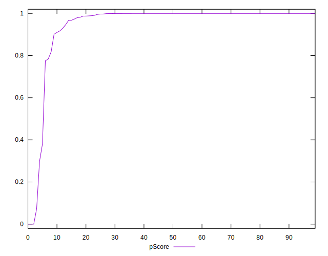
## Score Difference


```yaml
p90min: 0
p90max: 0
p90range: 0
p90mean: 0
median: 0
p90stdev: 0
mad: 0
stdevBySn: 0
lfitCenter: 1.0470608452365924e-18
lfitStdev: 2.5998395675404994e-18
mfitCenter: 1.0470608452365924e-18
mfitStdev: 3.2584156880294808e-18
mfitConfidence: 3.258415688029481e-19
p90skewness: .nan
p90eccentricity: .nan
p90discretization: 94
outlandishness: .inf

```

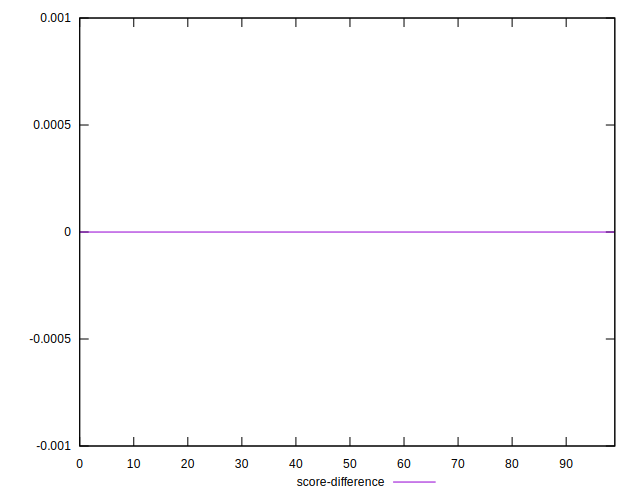
## P Score Difference


```yaml
p90min: -0.003093782573009074
p90max: 0.0017756963920930735
p90range: 0.0048694789651021475
p90mean: -0.00025751557733040466
median: -6.619511143668433e-7
p90stdev: 0.0008375397444449278
mad: 0
stdevBySn: 0
lfitCenter: -0.00015725943068648675
lfitStdev: 0.0005256734071288336
mfitCenter: -0.00015725943068648675
mfitStdev: 0.0006588339134283206
mfitConfidence: 0.00006588339134283206
p90skewness: -1.8497331447591063
p90eccentricity: 1.0000000000000009
p90discretization: 2.6857142857142855
outlandishness: 1.0488212999453546

```

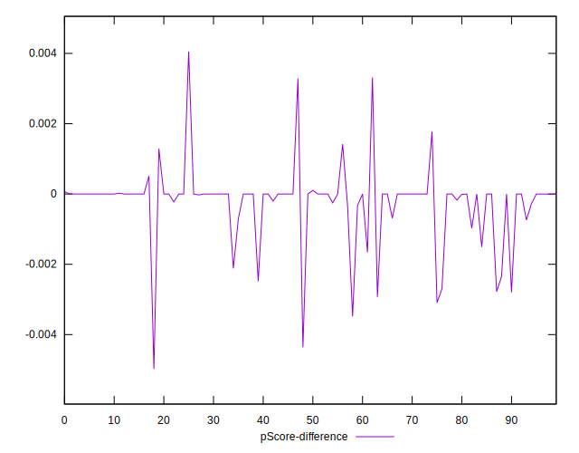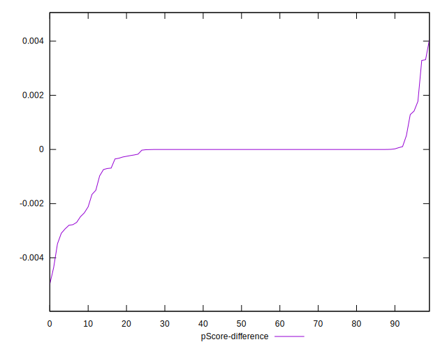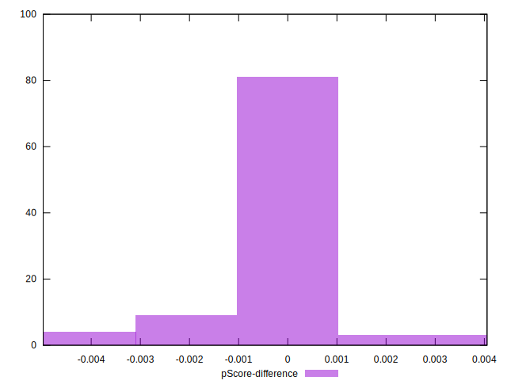