# //estimated-input-latency/samples/astro

[→ Parent](../..)


## Raw


```yaml
p90min: 146.8
p90max: 590.4000000000008
p90range: 443.60000000000076
p90mean: 316.1992907801419
median: 274.5999999999998
p90stdev: 110.85748843363622
mad: 60.60000000000059
stdevBySn: 99.46283999999982
lfitCenter: 306.41469765195615
lfitStdev: 92.54271835570383
mfitCenter: 306.41469765195615
mfitStdev: 115.98509733751939
mfitConfidence: 11.59850973375194
p90skewness: 0.8922620941628131
p90eccentricity: 0.9999999999999996
p90discretization: 1.0217391304347827
outlandishness: 1.0117826390902194

```

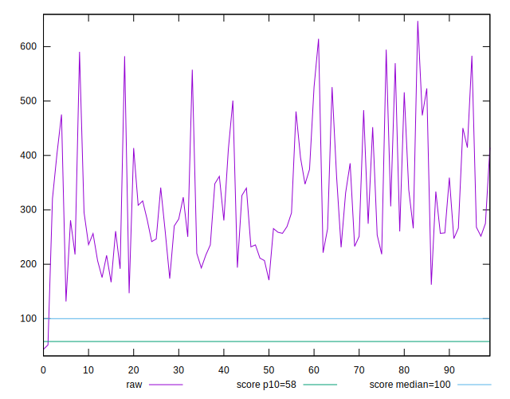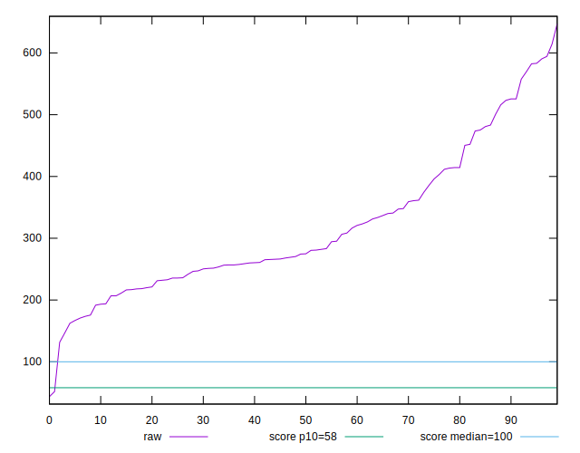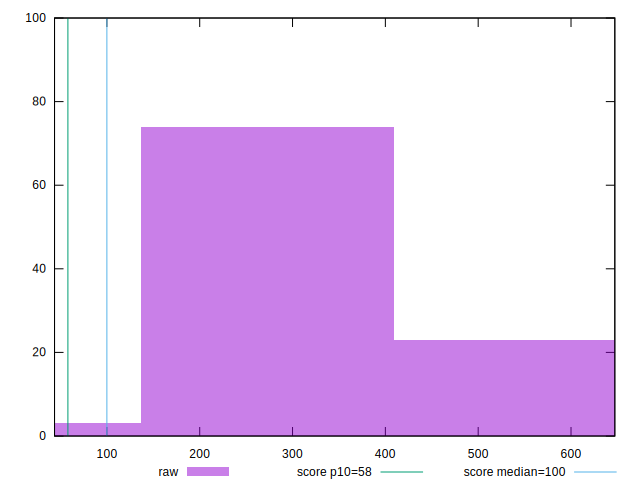
## Score


```yaml
p90min: 0
p90max: 0.18
p90range: 0.18
p90mean: 0.017659574468085113
median: 0.01
p90stdev: 0.0306116905743365
mad: 0.01
stdevBySn: 0.011926
lfitCenter: 0.023263480424856573
lfitStdev: 0.035837321722489025
mfitCenter: 0.023263480424856573
mfitStdev: 0.04491542200351518
mfitConfidence: 0.004491542200351518
p90skewness: 2.9741780826734114
p90eccentricity: 0.9999999999999991
p90discretization: 8.545454545454545
outlandishness: 4.70367253592682

```

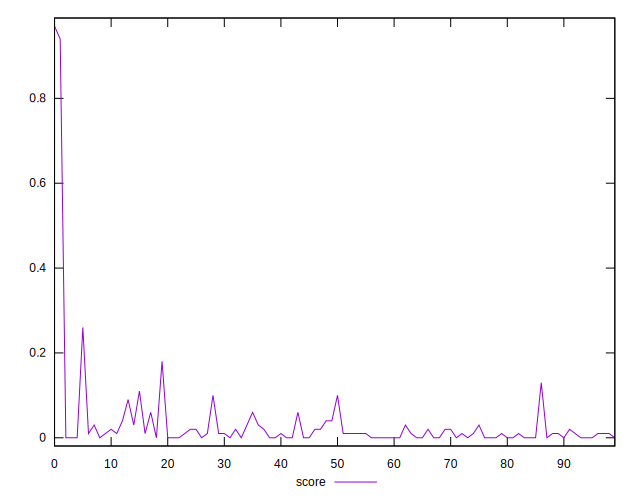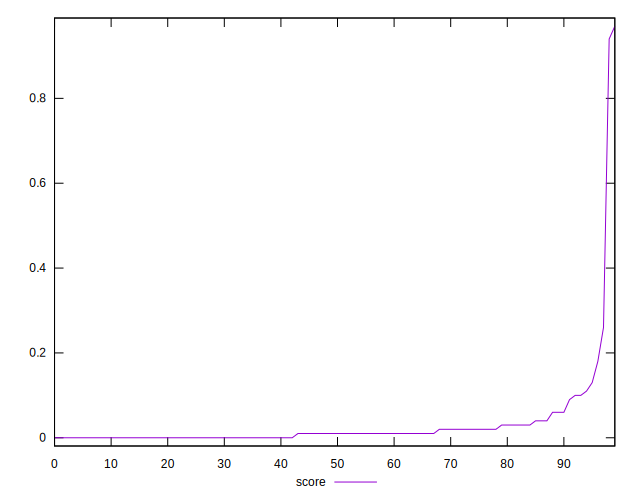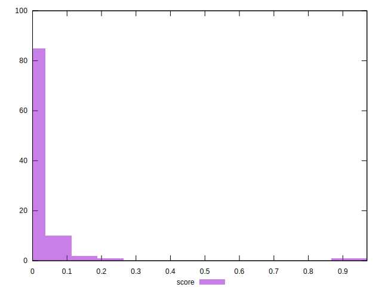
## Raw Estimate

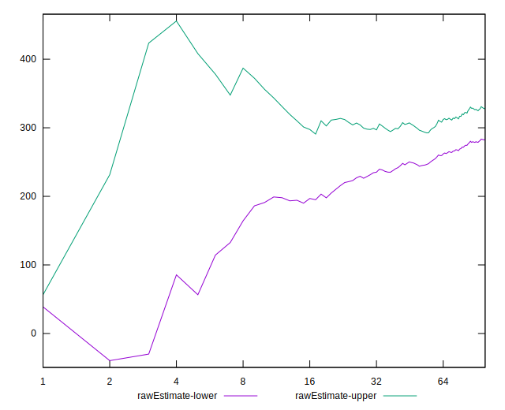
## Score Estimate

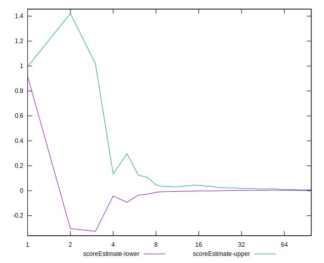
## P Score


```yaml
p90min: 0.000014749780877731933
p90max: 0.1832141112054988
p90range: 0.18319936142462107
p90mean: 0.018643150188596375
median: 0.008738567563407296
p90stdev: 0.030864018432283688
mad: 0.00831104313771
stdevBySn: 0.010412486624769174
lfitCenter: 0.024115571752442118
lfitStdev: 0.03620424891847264
mfitCenter: 0.024115571752442118
mfitStdev: 0.04537529704606972
mfitConfidence: 0.004537529704606972
p90skewness: 2.952408637692907
p90eccentricity: 0.9999999999999997
p90discretization: 1.032967032967033
outlandishness: 4.433997247495443

```

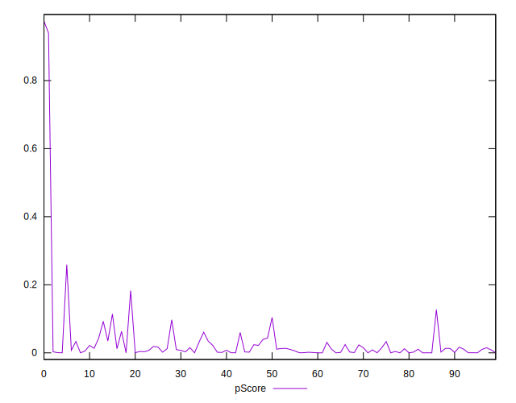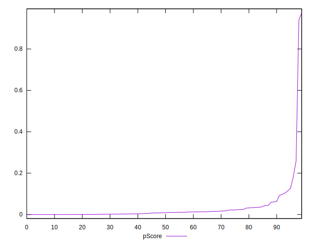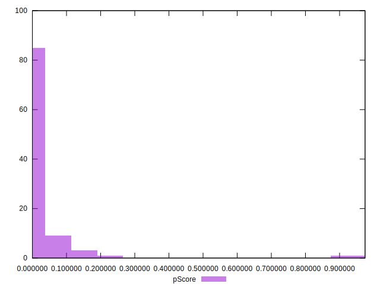
## Score Difference


```yaml
p90min: 0
p90max: 0
p90range: 0
p90mean: 0
median: 0
p90stdev: 0
mad: 0
stdevBySn: 0
lfitCenter: 5.166535369026208e-19
lfitStdev: 1.2890316797319448e-18
mfitCenter: 5.166535369026208e-19
mfitStdev: 1.6155616292812394e-18
mfitConfidence: 1.6155616292812395e-19
p90skewness: .nan
p90eccentricity: .nan
p90discretization: 94
outlandishness: .inf

```


## P Score Difference


```yaml
p90min: -0.004462381307835597
p90max: 0.004342049512313734
p90range: 0.00880443082014933
p90mean: 0.0010159415564619586
median: 0.0007129682193624297
p90stdev: 0.001978417529439569
mad: 0.0013823971050245668
stdevBySn: 0.0022536532227204614
lfitCenter: 0.0009815901306126022
lfitStdev: 0.0016723547572085637
mfitCenter: 0.0009815901306126022
mfitStdev: 0.0020959858619253938
mfitConfidence: 0.00020959858619253938
p90skewness: -0.3591792727021632
p90eccentricity: 0.9999999999999997
p90discretization: 1.032967032967033
outlandishness: 0.8873157908479745

```

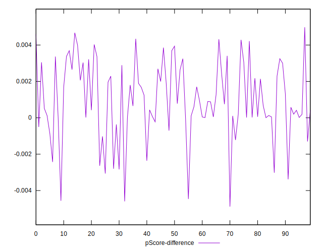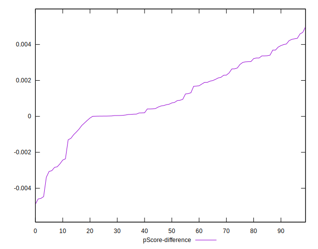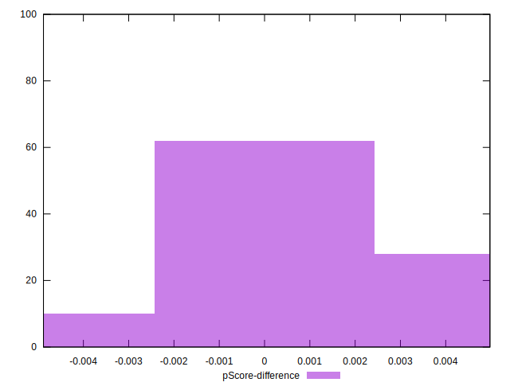