# //estimated-input-latency/samples/card

[→ Parent](../..)


## Raw


```yaml
p90min: 12.8
p90max: 128.8
p90range: 116.00000000000001
p90mean: 26.951691414917228
median: 13.733333333333334
p90stdev: 23.450653188914277
mad: 0.9333333333333336
stdevBySn: 1.1130933333333337
lfitCenter: 32.6731033674069
lfitStdev: 33.98040883473522
mfitCenter: 32.6731033674069
mfitStdev: 42.58812682718816
mfitConfidence: 4.280267794237943
p90skewness: 2.1835021985130982
p90eccentricity: 1.000000000000001
p90discretization: 1.9787234042553192
outlandishness: 3.071330102089229

```

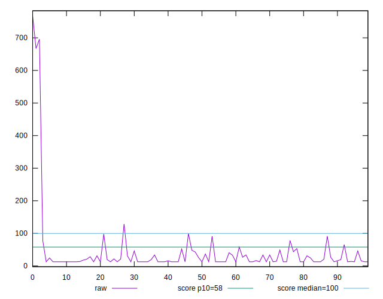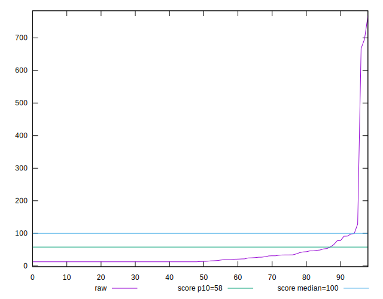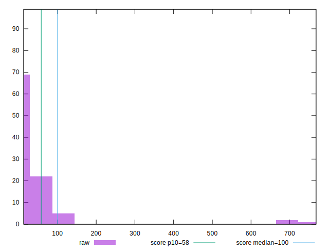
## Score


```yaml
p90min: 0.28
p90max: 1
p90range: 0.72
p90mean: 0.9597849462365592
median: 1
p90stdev: 0.12253573974689876
mad: 0
stdevBySn: 0
lfitCenter: 0.9641662936587138
lfitStdev: 0.0778067690918778
mfitCenter: 0.9641662936587138
mfitStdev: 0.09751632377981821
mfitConfidence: 0.009800759300377845
p90skewness: -3.6521478306159336
p90eccentricity: 0.9999999999999968
p90discretization: 5.470588235294118
outlandishness: 0.9427762717333994

```

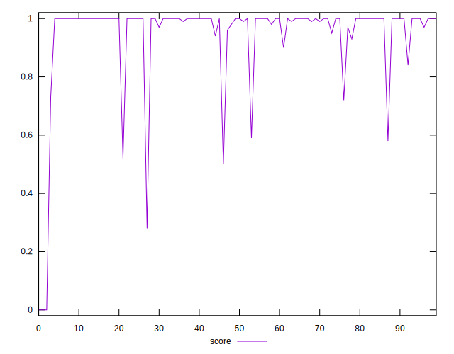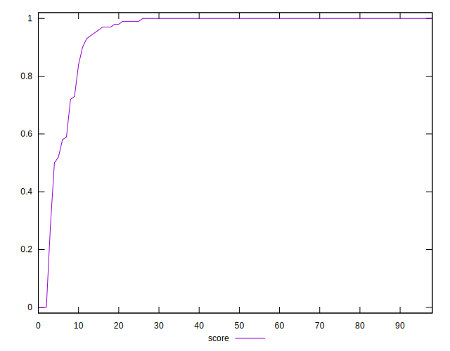
## Raw Estimate

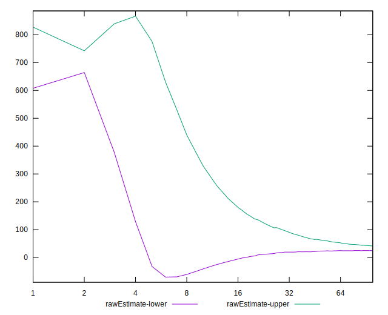
## Score Estimate

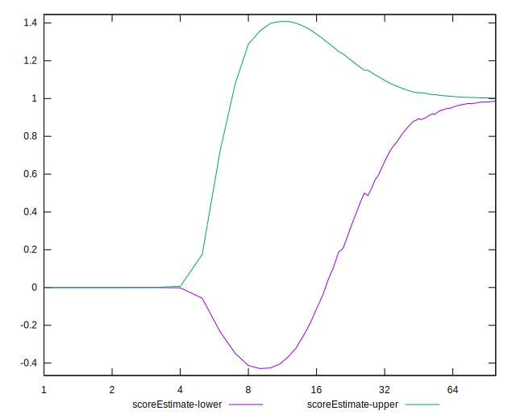
## P Score


```yaml
p90min: 0.2757768954612811
p90max: 0.9999993380488856
p90range: 0.7242224425876045
p90mean: 0.959657341432887
median: 0.9999984982960104
p90stdev: 0.12270950681331626
mad: 8.397528752368544e-7
stdevBySn: 0.0000010014892790074726
lfitCenter: 0.9640540409448155
lfitStdev: 0.07786698159557795
mfitCenter: 0.9640540409448155
mfitStdev: 0.09759178896202472
mfitConfidence: 0.009808343836563142
p90skewness: -3.659798125553496
p90eccentricity: 0.9999999999999991
p90discretization: 1.9787234042553192
outlandishness: 0.9427845333898255

```

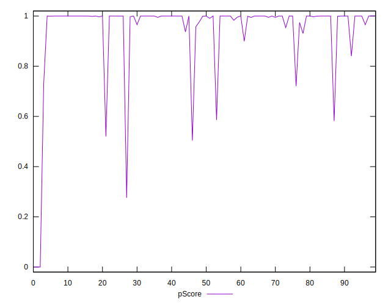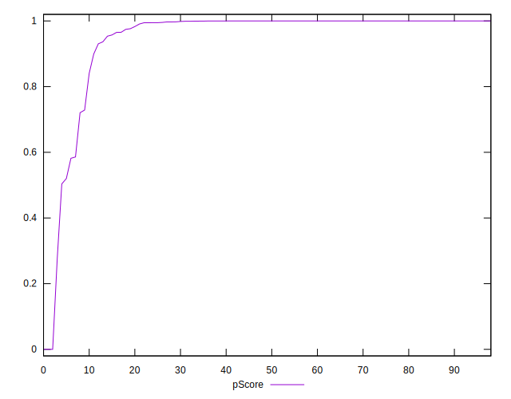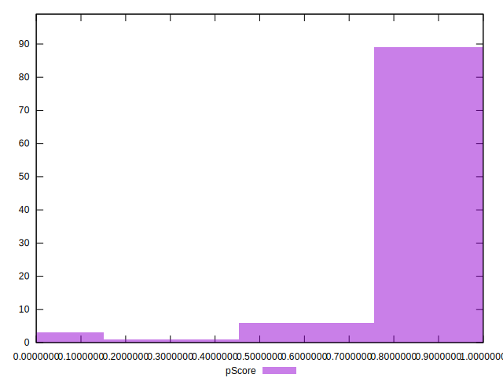
## Score Difference


```yaml
p90min: 0
p90max: 0
p90range: 0
p90mean: 0
median: 0
p90stdev: 0
mad: 0
stdevBySn: 0
lfitCenter: 1.0577304673893754e-18
lfitStdev: 2.626077309312598e-18
mfitCenter: 1.0577304673893754e-18
mfitStdev: 3.2912998207567746e-18
mfitConfidence: 3.307880781216425e-19
p90skewness: .nan
p90eccentricity: .nan
p90discretization: 93
outlandishness: .inf

```

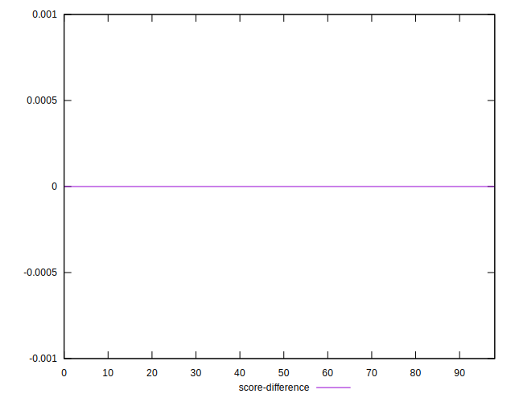
## P Score Difference


```yaml
p90min: -0.004223104538718936
p90max: 0.004426532654649096
p90range: 0.008649637193368032
p90mean: -0.00012817341638263888
median: -6.619511143668433e-7
p90stdev: 0.0013879682637935225
mad: 8.397528752368544e-7
stdevBySn: 0.0000010014892790074726
lfitCenter: -0.00007977234411857231
lfitStdev: 0.0006489398935627187
mfitCenter: -0.00007977234411857231
mfitStdev: 0.000813325543688574
mfitConfidence: 0.00008174229275232752
p90skewness: 0.09656130596031878
p90eccentricity: 0.9999999999999991
p90discretization: 2.1136363636363638
outlandishness: 0.8738626511864256

```

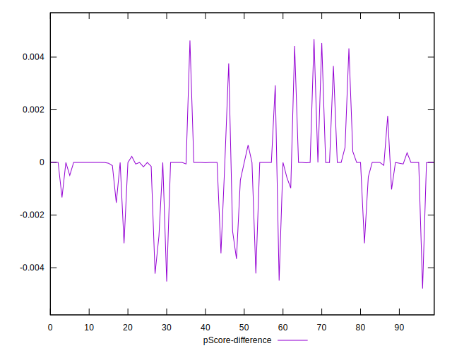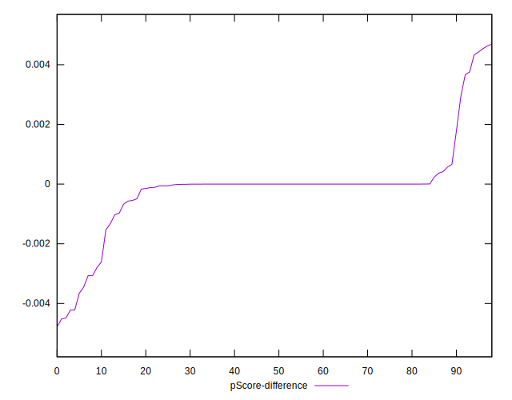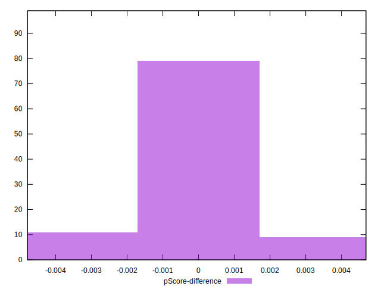