# //estimated-input-latency/samples/music

[→ Parent](../..)


## Raw


```yaml
p90min: 158.00000000000037
p90max: 732
p90range: 573.9999999999997
p90mean: 401.21276595744666
median: 400.7999999999996
p90stdev: 141.91009982652756
mad: 119.19999999999965
stdevBySn: 178.29370000000003
lfitCenter: 402.0342370446525
lfitStdev: 132.81289690667197
mfitCenter: 402.0342370446525
mfitStdev: 166.45628147845343
mfitConfidence: 16.645628147845343
p90skewness: 0.33126117684938594
p90eccentricity: 0.9999999999999997
p90discretization: 1.0444444444444445
outlandishness: 1.045363266476153

```

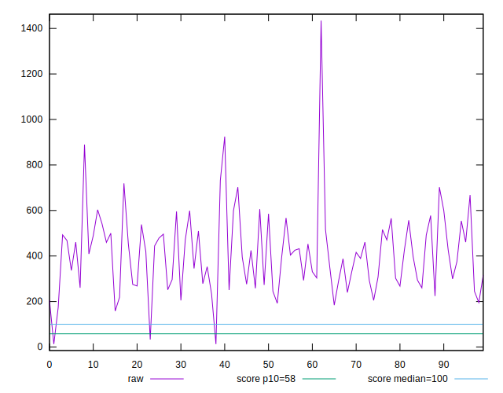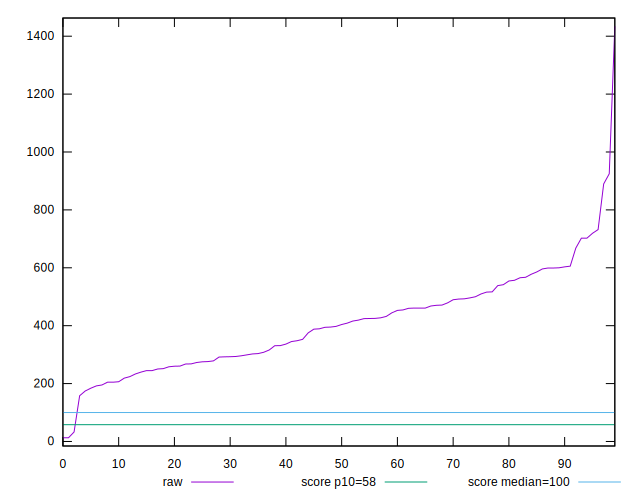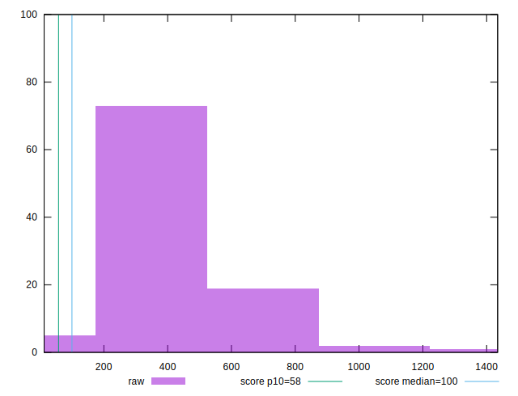
## Score


```yaml
p90min: 0
p90max: 0.14
p90range: 0.14
p90mean: 0.00946808510638298
median: 0
p90stdev: 0.022282853883294363
mad: 0
stdevBySn: 0
lfitCenter: 0.019983984239858497
lfitStdev: 0.041191067122256314
mfitCenter: 0.019983984239858497
mfitStdev: 0.051625346807383156
mfitConfidence: 0.005162534680738315
p90skewness: 3.5629169908219134
p90eccentricity: 0.9999999999999984
p90discretization: 9.4
outlandishness: 16.88009539199593

```

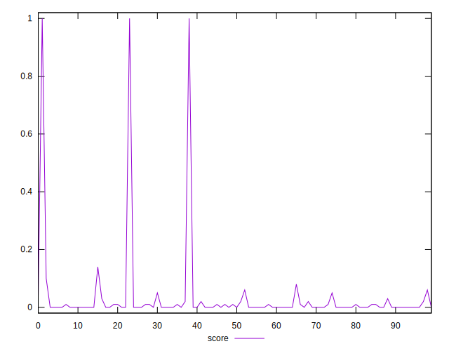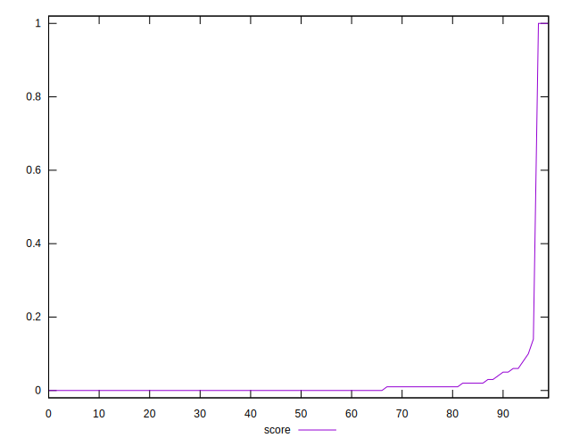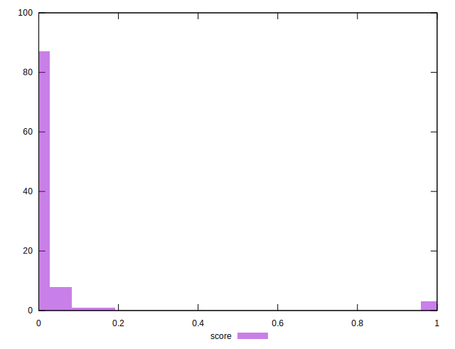
## Raw Estimate

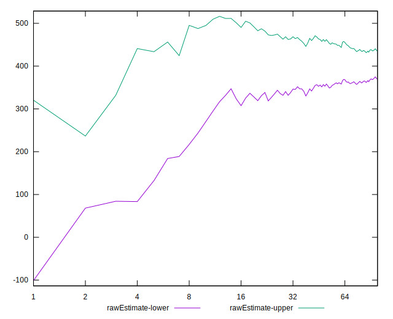
## Score Estimate

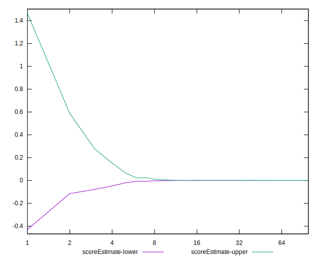
## P Score


```yaml
p90min: 0.000001413716739562254
p90max: 0.14092791787538417
p90range: 0.1409265041586446
p90mean: 0.009600134282184616
median: 0.0005463901578361685
p90stdev: 0.02177763242145815
mad: 0.0005441297895058261
stdevBySn: 0.0006718564156431966
lfitCenter: 0.020267613557890203
lfitStdev: 0.04099612023796352
mfitCenter: 0.020267613557890203
mfitStdev: 0.051381017121027536
mfitConfidence: 0.0051381017121027535
p90skewness: 3.663569256369604
p90eccentricity: 1
p90discretization: 1.0681818181818181
outlandishness: 16.4869311757634

```

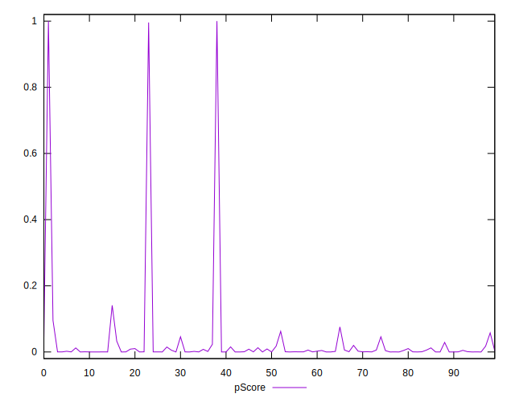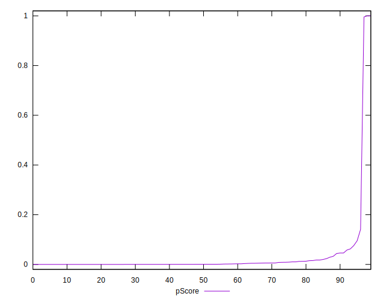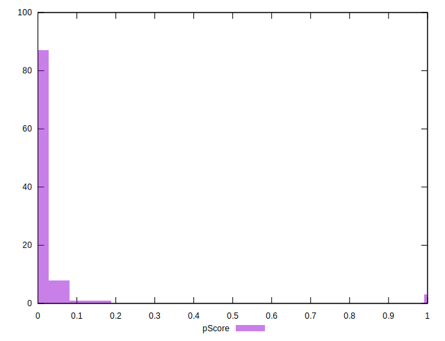
## Score Difference


```yaml
p90min: 0
p90max: 0
p90range: 0
p90mean: 0
median: 0
p90stdev: 0
mad: 0
stdevBySn: 0
lfitCenter: 0
lfitStdev: 0
mfitCenter: 0
mfitStdev: 0
mfitConfidence: 0
p90skewness: .nan
p90eccentricity: .nan
p90discretization: 94
outlandishness: .nan

```


## P Score Difference


```yaml
p90min: -0.004363180678341738
p90max: 0.004491380642152265
p90range: 0.008854561320494003
p90mean: 0.00007867661850596112
median: 0.00008830391058259335
p90stdev: 0.0018070439881385152
mad: 0.0002463748252925224
stdevBySn: 0.00042082695462379924
lfitCenter: 0.00010856162440706436
lfitStdev: 0.000986704219168029
mfitCenter: 0.00010856162440706436
mfitStdev: 0.0012366503484765126
mfitConfidence: 0.00012366503484765126
p90skewness: -0.5414088251074294
p90eccentricity: 1.0000000000000002
p90discretization: 1.0804597701149425
outlandishness: 1.0464561073492649

```

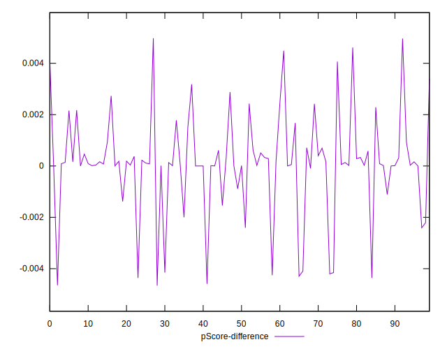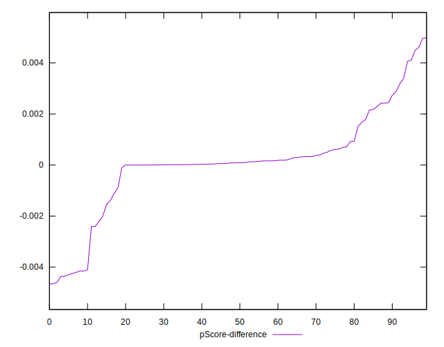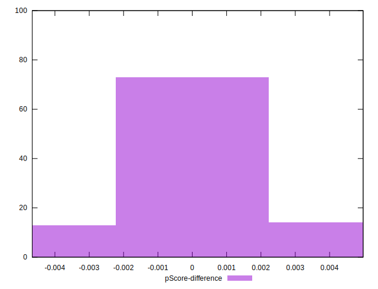