# //first-contentful-paint/samples/astro

[→ Parent](../..)


## Raw


```yaml
p90min: 2422.9610000000002
p90max: 3267.979
p90range: 845.0179999999996
p90mean: 2556.653659574468
median: 2439.6984999999995
p90stdev: 259.01963356905173
mad: 15.679499999999734
stdevBySn: 20.51570149999958
lfitCenter: 2521.031029782445
lfitStdev: 164.61095118061638
mfitCenter: 2521.031029782445
mfitStdev: 206.30923247921527
mfitConfidence: 20.630923247921526
p90skewness: 2.08715920676517
p90eccentricity: 1.0000000000000002
p90discretization: 1
outlandishness: 1.0145627674990036

```

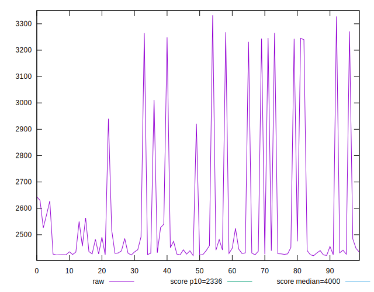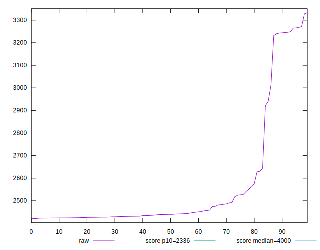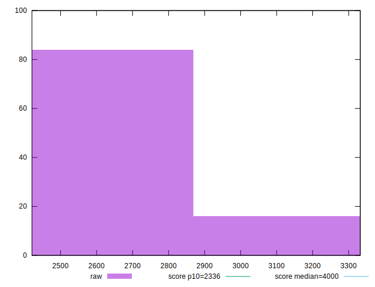
## Score


```yaml
p90min: 0.68
p90max: 0.88
p90range: 0.19999999999999996
p90mean: 0.852127659574468
median: 0.88
p90stdev: 0.06031605305575406
mad: 0
stdevBySn: 0
lfitCenter: 0.8605838974641075
lfitStdev: 0.03771254151787457
mfitCenter: 0.8605838974641075
mfitStdev: 0.04726566148601067
mfitConfidence: 0.004726566148601067
p90skewness: -2.144601050397486
p90eccentricity: 0.9999999999999989
p90discretization: 10.444444444444445
outlandishness: 0.9894015151722017

```

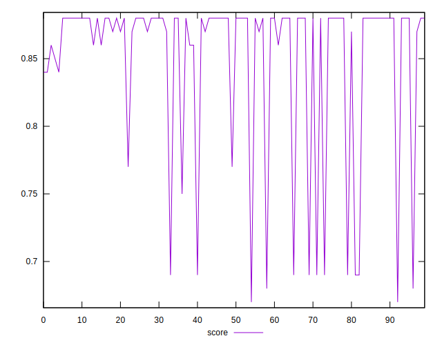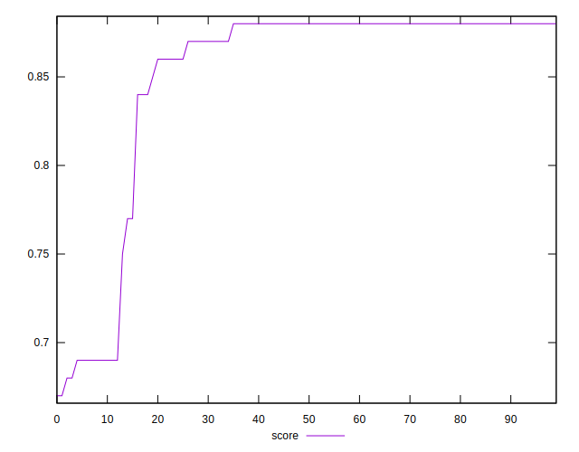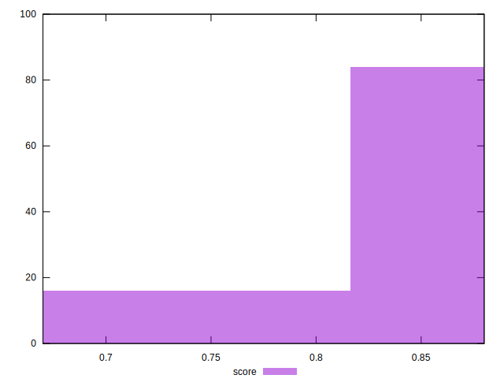
## Raw Estimate

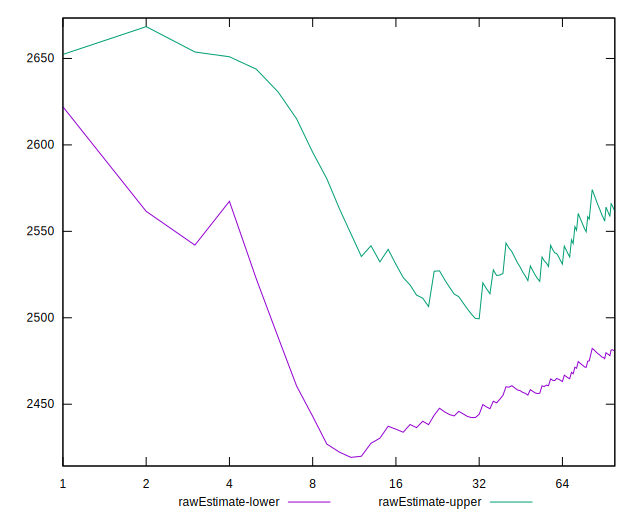
## Score Estimate

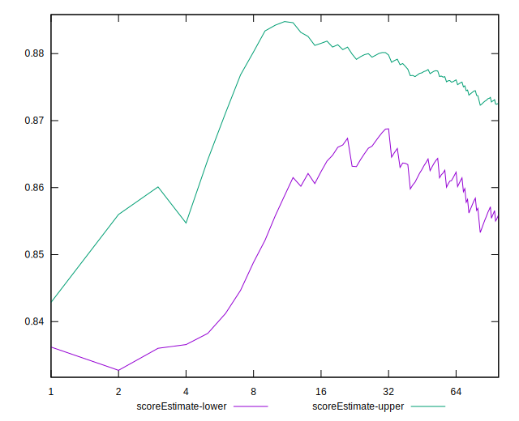
## P Score


```yaml
p90min: 0.6849548744921561
p90max: 0.8838514427765787
p90range: 0.1988965682844226
p90mean: 0.8536440526046506
median: 0.8806135781690732
p90stdev: 0.060717564701894135
mad: 0.0030344030021362545
stdevBySn: 0.003989786831520042
lfitCenter: 0.861904769881383
lfitStdev: 0.03803718274718572
mfitCenter: 0.861904769881383
mfitStdev: 0.04767253892867123
mfitConfidence: 0.004767253892867123
p90skewness: -2.1334926524436377
p90eccentricity: 0.9999999999999997
p90discretization: 1
outlandishness: 0.9895441620784781

```

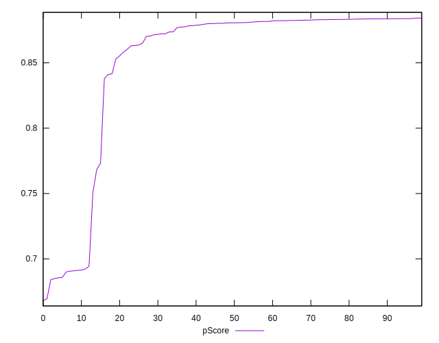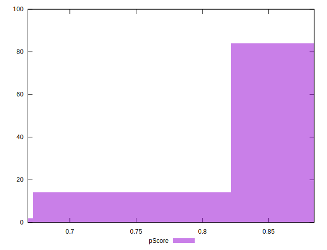
## Score Difference


```yaml
p90min: 0
p90max: 1.1102230246251565e-16
p90range: 1.1102230246251565e-16
p90mean: 7.086529944415892e-18
median: 0
p90stdev: 2.7139343474843187e-17
mad: 0
stdevBySn: 0
lfitCenter: 5.186597246566366e-18
lfitStdev: 1.239351332211875e-17
mfitCenter: 5.186597246566366e-18
mfitStdev: 1.553296547324935e-17
mfitConfidence: 1.553296547324935e-18
p90skewness: 3.5685919470917966
p90eccentricity: 0.999999999999998
p90discretization: 47
outlandishness: 1.9881000000000004

```

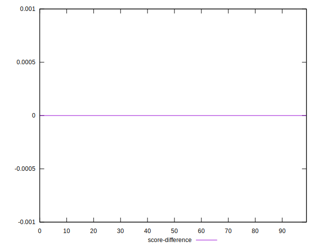
## P Score Difference


```yaml
p90min: -0.004203881669508691
p90max: 0.004239448994233341
p90range: 0.008443330663742032
p90mean: 0.0016744166776099694
median: 0.0022270847612252953
p90stdev: 0.0019235819130008027
mad: 0.001420896409984107
stdevBySn: 0.0018872243492100435
lfitCenter: 0.0017730843972343557
lfitStdev: 0.001688130437290295
mfitCenter: 0.0017730843972343557
mfitStdev: 0.0021157577448174896
mfitConfidence: 0.00021157577448174895
p90skewness: -0.85227675548761
p90eccentricity: 1
p90discretization: 1
outlandishness: 0.8786578101113872

```

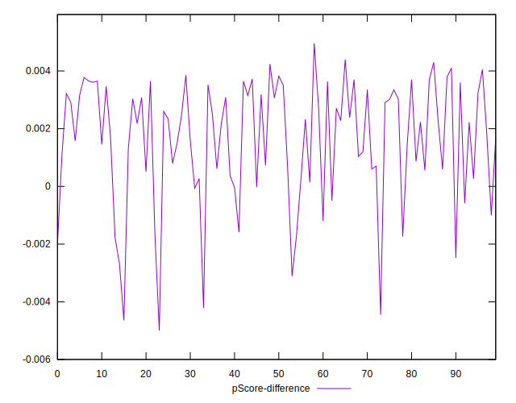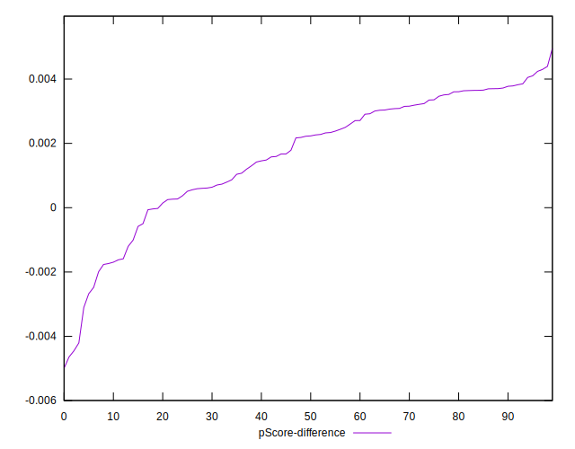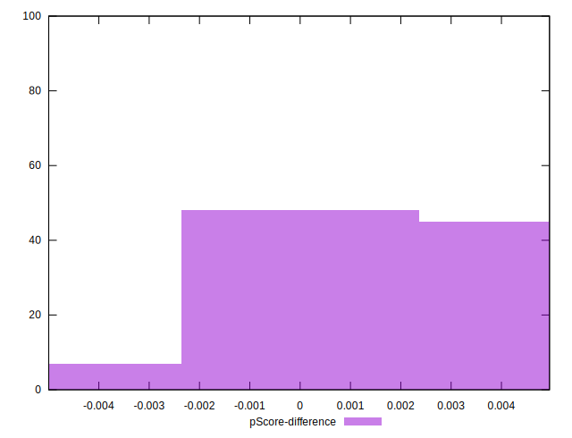