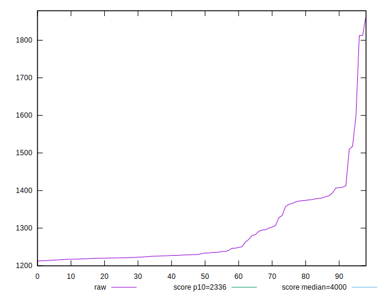

# //first-contentful-paint/samples/card

[→ Parent](../..)


## Raw


```yaml
p90min: 1213.4879999999998
p90max: 1598.7179999999998
p90range: 385.23
p90mean: 1277.0350494623656
median: 1232.313
p90stdev: 80.27879275019215
mad: 15.069000000000187
stdevBySn: 21.727979400000063
lfitCenter: 1271.4015921441837
lfitStdev: 76.23378176859046
mfitCenter: 1271.4015921441837
mfitStdev: 95.54487652774039
mfitConfidence: 9.602621396465137
p90skewness: 1.5668994196060495
p90eccentricity: 1.0000000000000002
p90discretization: 1
outlandishness: 1.023354654276584

```


## Score


```yaml
p90min: 0.99
p90max: 1
p90range: 0.010000000000000009
p90mean: 0.9976344086021504
median: 1
p90stdev: 0.004249693085025706
mad: 0
stdevBySn: 0
lfitCenter: 0.9980343580660805
lfitStdev: 0.0041013725159211286
mfitCenter: 0.9980343580660805
mfitStdev: 0.005140308161773589
mfitConfidence: 0.0005166204084668025
p90skewness: -1.239811228454474
p90eccentricity: 1.0000000000000004
p90discretization: 46.5
outlandishness: 0.9984655142869487

```


## Raw Estimate


## Score Estimate


## P Score


```yaml
p90min: 0.9855617224803659
p90max: 0.9977589765166395
p90range: 0.012197254036273586
p90mean: 0.9964571974906002
median: 0.9974872921714237
p90stdev: 0.0020189255814551397
mad: 0.00022325428197333963
stdevBySn: 0.00031905683021469833
lfitCenter: 0.9963971225880096
lfitStdev: 0.0020664099920009796
mfitCenter: 0.9963971225880096
mfitStdev: 0.0025898608590708655
mfitConfidence: 0.00026029080996259286
p90skewness: -2.66526774732204
p90eccentricity: 0.9999999999999988
p90discretization: 1
outlandishness: 0.9983921347100333

```


## Score Difference


```yaml
p90min: 0
p90max: 0
p90range: 0
p90mean: 0
median: 0
p90stdev: 0
mad: 0
stdevBySn: 0
lfitCenter: 0
lfitStdev: 0
mfitCenter: 0
mfitStdev: 0
mfitConfidence: 0
p90skewness: .nan
p90eccentricity: .nan
p90discretization: 93
outlandishness: .nan

```


## P Score Difference


```yaml
p90min: -0.004299163907376613
p90max: 0.004668283291468844
p90range: 0.008967447198845457
p90mean: -0.0013034669589990682
median: -0.002345584583379745
p90stdev: 0.0026040471605300406
mad: 0.000167123245196521
stdevBySn: 0.00031905683021469833
lfitCenter: -0.0016468346538081639
lfitStdev: 0.0018489674788212966
mfitCenter: -0.0016468346538081639
mfitStdev: 0.002317337082975132
mfitConfidence: 0.0002329011399092482
p90skewness: 1.5286247663245758
p90eccentricity: 1
p90discretization: 1
outlandishness: 0.8658589636786761

```

